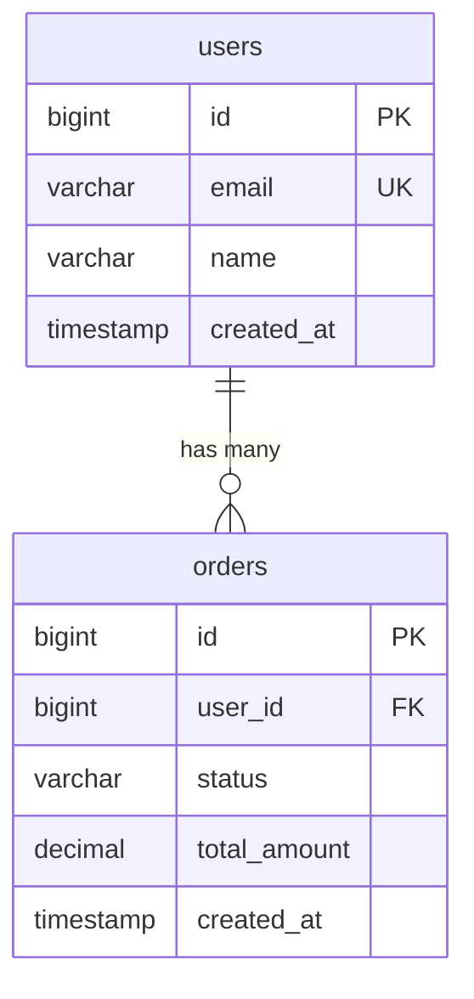

## 功能说明

pg-schema 提供数据库模式的智能查询和理解，帮助生成准确的 SQL 语句。

## 执行流程

### 1. 前置检查

确认 postgres-mcp MCP 工具可用（参考根 SKILL.md 的前置检查）。

### 2. 模式查询

根据用户需求查询不同级别的模式信息。

#### 查询所有表

```sql
SELECT schemaname, tablename 
FROM pg_tables 
WHERE schemaname NOT IN ('pg_catalog', 'information_schema')
ORDER BY schemaname, tablename;
```

#### 查询表结构

```sql
SELECT 
  column_name,
  data_type,
  character_maximum_length,
  is_nullable,
  column_default
FROM information_schema.columns
WHERE table_name = 'orders'
ORDER BY ordinal_position;
```

#### 查询主键和外键

```sql
-- 主键
SELECT a.attname
FROM pg_index i
JOIN pg_attribute a ON a.attrelid = i.indrelid AND a.attnum = ANY(i.indkey)
WHERE i.indrelid = 'orders'::regclass AND i.indisprimary;

-- 外键
SELECT
  tc.constraint_name,
  tc.table_name,
  kcu.column_name,
  ccu.table_name AS foreign_table_name,
  ccu.column_name AS foreign_column_name
FROM information_schema.table_constraints AS tc
JOIN information_schema.key_column_usage AS kcu
  ON tc.constraint_name = kcu.constraint_name
JOIN information_schema.constraint_column_usage AS ccu
  ON ccu.constraint_name = tc.constraint_name
WHERE tc.constraint_type = 'FOREIGN KEY' AND tc.table_name = 'orders';
```

#### 查询索引

```sql
SELECT
  indexname,
  indexdef
FROM pg_indexes
WHERE tablename = 'orders';
```

#### 查询表大小

```sql
SELECT
  pg_size_pretty(pg_total_relation_size('orders')) AS total_size,
  pg_size_pretty(pg_relation_size('orders')) AS table_size,
  pg_size_pretty(pg_total_relation_size('orders') - pg_relation_size('orders')) AS indexes_size;
```

### 3. 构建模式上下文

将查询到的模式信息整理成结构化的上下文：

```
📊 数据库模式
━━━━━━━━━━━━━━━━━━━━━━━━━━━━━━━━━━

表：orders
━━━━━━━━━━━━━━━━━━━━━━━━━━━━━━━━━━
字段：
  • id (bigint, PRIMARY KEY)
  • user_id (bigint, NOT NULL)
  • status (varchar(20), NOT NULL)
  • total_amount (decimal(10,2))
  • created_at (timestamp, DEFAULT now())
  • updated_at (timestamp)

索引：
  • orders_pkey (PRIMARY KEY on id)
  • idx_orders_user_id (on user_id)
  • idx_orders_status (on status)

外键：
  • fk_orders_user_id → users(id)

大小：
  • 表：1.2 GB
  • 索引：450 MB
  • 总计：1.65 GB

表：users
━━━━━━━━━━━━━━━━━━━━━━━━━━━━━━━━━━
字段：
  • id (bigint, PRIMARY KEY)
  • email (varchar(255), UNIQUE, NOT NULL)
  • name (varchar(100))
  • created_at (timestamp, DEFAULT now())

索引：
  • users_pkey (PRIMARY KEY on id)
  • users_email_key (UNIQUE on email)
```

### 4. 智能 SQL 生成

基于模式上下文，生成符合数据库结构的 SQL 查询。

#### 示例 1：简单查询

```
用户：查询用户 123 的所有订单

助手：[查询 orders 表结构]
     [确认有 user_id 字段]
     [生成 SQL]
     
SELECT * FROM orders WHERE user_id = 123;
```

#### 示例 2：关联查询

```
用户：查询每个用户的订单数量

助手：[查询 users 和 orders 表结构]
     [识别外键关系]
     [生成 JOIN 查询]
     
SELECT 
  u.id,
  u.name,
  COUNT(o.id) AS order_count
FROM users u
LEFT JOIN orders o ON u.id = o.user_id
GROUP BY u.id, u.name;
```

#### 示例 3：复杂查询

```
用户：查询最近 30 天内，每天的订单金额总和

助手：[查询 orders 表结构]
     [确认有 created_at 和 total_amount 字段]
     [生成时间序列查询]
     
SELECT 
  DATE(created_at) AS order_date,
  SUM(total_amount) AS daily_total
FROM orders
WHERE created_at >= CURRENT_DATE - INTERVAL '30 days'
GROUP BY DATE(created_at)
ORDER BY order_date;
```

### 5. 验证和优化

生成 SQL 后，进行验证和优化：

#### 字段验证
- 确认所有引用的字段都存在
- 检查字段类型是否匹配
- 验证 NULL 值处理

#### 性能优化
- 检查是否有合适的索引
- 避免 SELECT *，只查询需要的字段
- 考虑是否需要添加 LIMIT

#### 安全检查
- 使用参数化查询防止 SQL 注入
- 检查权限要求
- 避免危险操作（如无条件 DELETE）

### 6. 提供解释

生成 SQL 后，向用户解释：

```
生成的 SQL：
SELECT u.name, COUNT(o.id) AS order_count
FROM users u
LEFT JOIN orders o ON u.id = o.user_id
GROUP BY u.id, u.name;

解释：
• 从 users 表查询用户信息
• LEFT JOIN orders 表获取订单（包括没有订单的用户）
• 通过 user_id 关联两个表
• GROUP BY 按用户分组
• COUNT 统计每个用户的订单数量

性能说明：
• 使用了索引 idx_orders_user_id，性能良好
• 预计扫描 10,000 用户和 50,000 订单
```

## 高级功能

### 模式变更建议

根据查询模式，建议模式改进：

```
用户：经常需要按 email 查询用户

助手：[检查 users 表]
     发现 email 字段没有索引
     建议：CREATE INDEX idx_users_email ON users(email);
```

### 数据类型建议

```
用户：status 字段总是固定的几个值

助手：建议使用 ENUM 类型或 CHECK 约束：
     
     -- 方式 1：ENUM
     CREATE TYPE order_status AS ENUM ('pending', 'paid', 'shipped', 'delivered');
     ALTER TABLE orders ALTER COLUMN status TYPE order_status USING status::order_status;
     
     -- 方式 2：CHECK 约束
     ALTER TABLE orders ADD CONSTRAINT check_status 
     CHECK (status IN ('pending', 'paid', 'shipped', 'delivered'));
```

### 关系图生成

生成表关系的文本描述或 Mermaid 图：



## 使用示例

**查询表结构**：
```
用户：orders 表有哪些字段？

助手：[查询表结构]
     orders 表包含以下字段：
     • id (bigint, 主键)
     • user_id (bigint, 外键 → users.id)
     • status (varchar)
     • total_amount (decimal)
     • created_at (timestamp)
     • updated_at (timestamp)
```

**生成查询**：
```
用户：查询状态为 pending 的订单

助手：[查询模式]
     [生成 SQL]
     SELECT * FROM orders WHERE status = 'pending';
```

**表关系查询**：
```
用户：orders 表和哪些表有关联？

助手：[查询外键]
     orders 表的关联关系：
     • user_id → users.id (多对一)
```

## 注意事项

1. **模式缓存** — 模式信息可以缓存，避免重复查询
2. **权限检查** — 确保用户有权限访问相关表和字段
3. **大型数据库** — 对于有大量表的数据库，按需查询而不是一次性加载所有模式
4. **模式变更** — 注意模式可能会变更，定期刷新缓存
5. **命名规范** — 遵循数据库的命名规范（如 snake_case）

## 相关查询

```sql
-- 查询所有视图
SELECT schemaname, viewname 
FROM pg_views 
WHERE schemaname NOT IN ('pg_catalog', 'information_schema');

-- 查询所有函数
SELECT proname, prosrc 
FROM pg_proc 
WHERE pronamespace = 'public'::regnamespace;

-- 查询所有触发器
SELECT tgname, tgrelid::regclass, tgtype 
FROM pg_trigger 
WHERE tgisinternal = false;

-- 查询表注释
SELECT 
  c.relname AS table_name,
  d.description
FROM pg_class c
LEFT JOIN pg_description d ON c.oid = d.objoid
WHERE c.relkind = 'r' AND c.relnamespace = 'public'::regnamespace;
```
