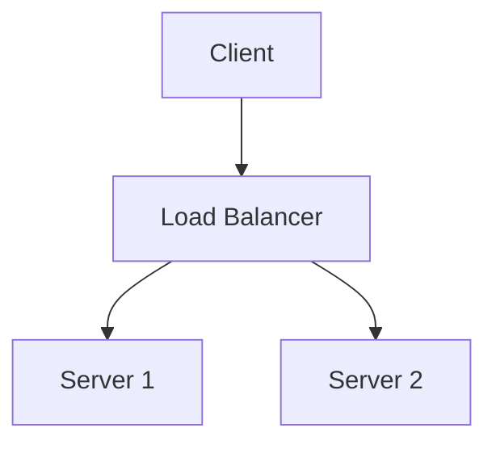

# Output Templates and Multi-Format Rules

## Format-agnostic writing rules

The study notes must render correctly in three contexts: Markdown viewers, PDF conversion, and plain text reading. Follow these rules to ensure compatibility.

### Headings

Use ATX-style headings (`#`, `##`, `###`). Maximum depth: 4 levels.
Always leave a blank line before and after headings.

```markdown
## Lecture 1: Introduction

### 1.1 What is an Operating System?
```

### Formulas

Use LaTeX wrapped in `$...$` (inline) or `$$...$$` (display block).

For PDF conversion compatibility, avoid overly complex LaTeX that requires special packages. Stick to standard math notation.

```markdown
The time complexity is $O(n \log n)$.

$$
P(A|B) = \frac{P(B|A) \cdot P(A)}{P(B)}
$$
```

For plain text fallback: after each formula block, optionally include a plain-language description:
```markdown
$$E = mc^2$$
(Energy equals mass times the speed of light squared)
```

### Code blocks

Always specify the language for syntax highlighting:

````markdown
```python
def binary_search(arr, target):
    lo, hi = 0, len(arr) - 1
    while lo <= hi:
        mid = (lo + hi) // 2
        if arr[mid] == target:
            return mid
        elif arr[mid] < target:
            lo = mid + 1
        else:
            hi = mid - 1
    return -1
```
````

For long code blocks (>30 lines), add a brief comment header explaining what the code does.

### Tables

Use standard Markdown tables. Keep columns reasonably narrow for PDF rendering.

```markdown
| Algorithm | Time (avg) | Time (worst) | Space | Stable? |
|-----------|-----------|-------------|-------|---------|
| Quicksort | O(n log n) | O(n^2) | O(log n) | No |
| Mergesort | O(n log n) | O(n log n) | O(n) | Yes |
```

For tables wider than 5 columns, consider splitting into multiple tables or using a description list format instead.

### Diagrams and figures

Since we're targeting text-based formats, represent diagrams as:

1. **ASCII art** for simple structures (trees, linked lists):
```
    [Root]
   /      \
[Left]  [Right]
```

2. **Mermaid code blocks** for complex flows (supported by many Markdown renderers):


3. **Textual description** as fallback: "Figure: A directed graph with nodes A, B, C where A points to B and C, and B points to C. This represents..."

Always provide the textual description even when including Mermaid/ASCII art — it ensures plain text readability.

### Cross-references

Use relative section references, not Markdown-specific link anchors:

Good: "See Section 3.2 (Lecture 3, Process Scheduling) for details."
Avoid: "See [here](#32-process-scheduling)." (anchor links may break in PDF)

### Emphasis

Use **bold** for key terms on first definition. Use *italic* for emphasis.
Do NOT use bold for entire paragraphs or sentences — it loses its signal value.

### Page breaks (PDF-aware)

When the content logically separates (e.g., between lectures), insert a horizontal rule:
```markdown
---
```
This renders as a visual break in Markdown and can be mapped to a page break in PDF conversion.

## Document structure template

```markdown
# [Course Name] — Study Notes

> Generated from [N] lecture PDFs + external knowledge expansion.
> Last updated: [date]
> Source lectures: [list of PDF filenames]

## Table of Contents
[Auto-generated or manually maintained TOC]

---

## Lecture 1: [Title]

### 1.1 [Topic] (pp. X-Y)
[Content following the concept block template from phase-study.md]

### 1.2 [Topic] (pp. Y-Z)
[...]

> **Bridge:** [Transition note to next lecture]

---

## Lecture 2: [Title]
[...]

---

## Appendix A: Concept Index
[Alphabetical list of all concepts with lecture + page references]

## Appendix B: External Sources
[All URLs, paper citations, and documentation references used in expansion]

## Appendix C: [EXPAND] Resolution Log
[List of all [EXPAND] markers from Phase 1 and how each was resolved]
```

## Format-specific conversion notes

### Markdown (.md)
Primary output format. No special handling needed if the rules above are followed.

### PDF conversion

When converting to PDF, read `rules/pdf-export.md` for font configuration, pandoc commands, and CJK/bilingual document handling. Use the `/pdf` skill to execute the conversion — do not use Python or pandoc directly.

---

### Plain text readability
The document must be readable with all Markdown stripped:
- Headings are recognizable by their `#` prefixes
- Formulas have plain-language descriptions nearby
- Code is in fenced blocks
- No meaning carried solely by formatting — don't use bold as the only signal for key terms; also use "Key term: …" phrasing
