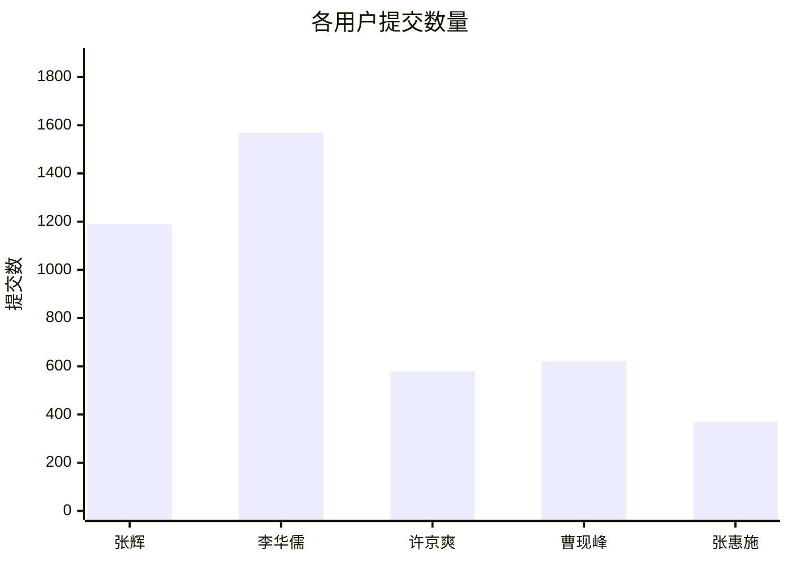
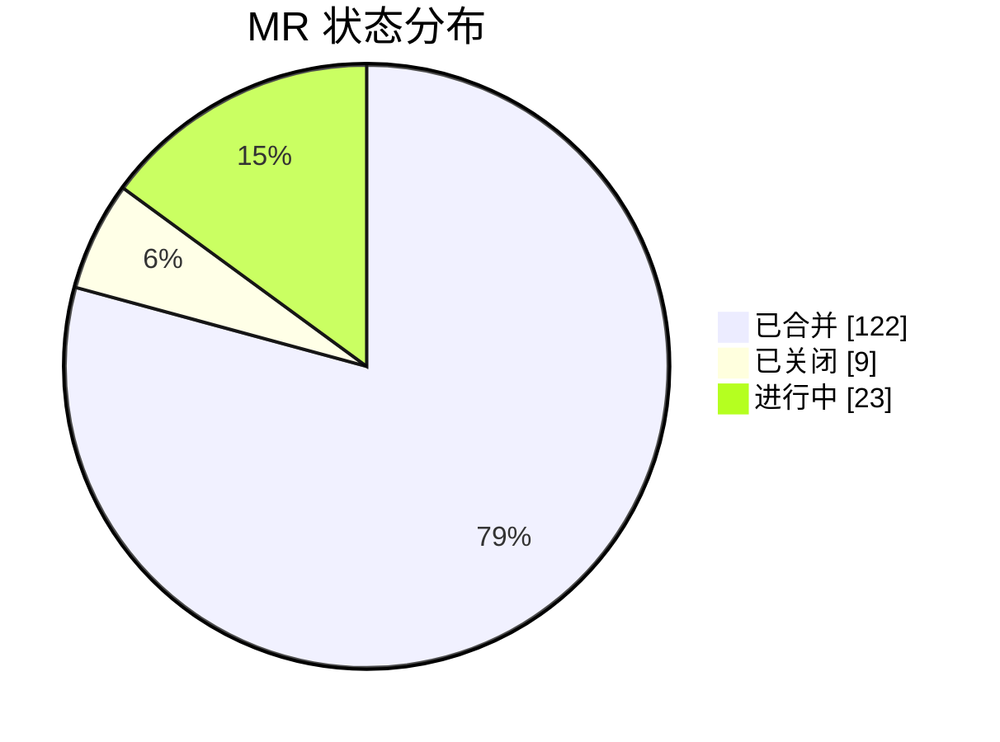
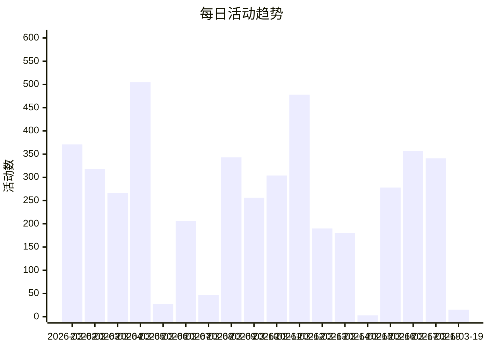
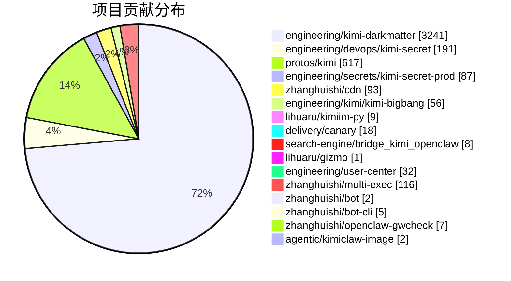

# 图表版周报

## 1. 提交数分布

```mermaid
xychart-beta
    title "各用户提交数量"
    x-axis ["张辉", "李华儒", "许京爽", "曹现峰", "张惠施"]
    y-axis "提交数" 0 --> 1884
    bar [1189, 1570, 580, 621, 371]
```

## 2. MR 状态分布

```mermaid
pie showData
    title MR 状态分布
    "已合并" : 122
    "已关闭" : 9
    "进行中" : 23
```

## 3. 每日活动趋势

```mermaid
xychart-beta
    title "每日活动趋势"
    x-axis ["2026-03-02", "2026-03-03", "2026-03-04", "2026-03-05", "2026-03-06", "2026-03-07", "2026-03-08", "2026-03-09", "2026-03-10", "2026-03-11", "2026-03-12", "2026-03-13", "2026-03-14", "2026-03-15", "2026-03-16", "2026-03-17", "2026-03-18", "2026-03-19"]
    y-axis "活动数" 0 --> 606
    bar [371, 318, 266, 505, 27, 206, 47, 343, 256, 304, 478, 190, 180, 3, 278, 357, 341, 15]
```

## 4. 项目分布

```mermaid
pie showData
    title 项目贡献分布
    "engineering/kimi-darkmatter" : 3241
    "engineering/devops/kimi-secret" : 191
    "protos/kimi" : 617
    "engineering/secrets/kimi-secret-prod" : 87
    "zhanghuishi/cdn" : 93
    "engineering/kimi/kimi-bigbang" : 56
    "lihuaru/kimiim-py" : 9
    "delivery/canary" : 18
    "search-engine/bridge_kimi_openclaw" : 8
    "lihuaru/gizmo" : 1
    "engineering/user-center" : 32
    "zhanghuishi/multi-exec" : 116
    "zhanghuishi/bot" : 2
    "zhanghuishi/bot-cli" : 5
    "zhanghuishi/openclaw-gwcheck" : 7
    "agentic/kimiclaw-image" : 2
```
