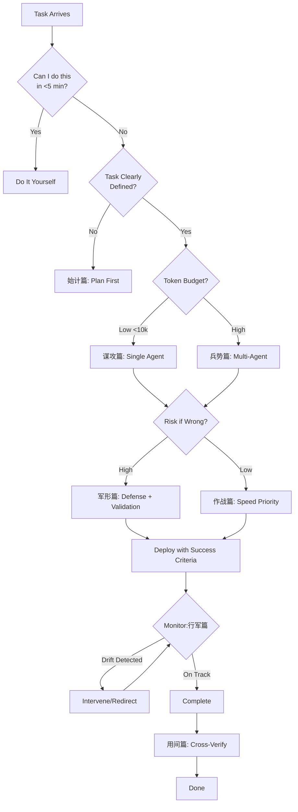

# 📜 Art of War Agents

> 兵者，国之大事，死生之地，存亡之道，不可不察也
>
> "War is vital — the province of life or death. It must be thoroughly studied."

**Sun Tzu's 13 chapters → AI agent orchestration patterns.**

This skill provides a complete framework for strategic agent deployment: when to use agents, which ones, how to organize them, and how to avoid wasting tokens on unwinnable battles.

---

## ⚡ Quick Reference Card

```
┌─────────────────────────────────────────────────────────────┐
│           ART OF WAR AGENT DECISION FLOW                    │
├─────────────────────────────────────────────────────────────┤
│                                                             │
│  1. 始计 → 值得做吗？(五事七计评估)                          │
│     ├─ Score ≥70% → 部署                                    │
│     ├─ Score 50-70% → 先补弱点                              │
│     └─ Score <50% → 不做，重新规划                          │
│                                                             │
│  2. 谋攻 → 能不做吗？(上兵伐谋)                             │
│     ├─ 可自动化/消除 → 不做                                 │
│     ├─ 单 agent 可解 → 单 agent                               │
│     └─ 必须多 agent → 继续                                  │
│                                                             │
│  3. 作战 → 预算多少？(速战速决)                             │
│     ├─ <10k tokens → 单 agent，快速迭代                       │
│     └─ >10k tokens → 多 agent，设检查点                      │
│                                                             │
│  4. 军形 → 有风险吗？(先胜后战)                             │
│     ├─ 高风险 → 防御优先，多重验证                          │
│     └─ 低风险 → 速度优先                                    │
│                                                             │
│  5. 部署 → 监控信号 (行军篇)                                │
│     ├─ 重复提问 → 补充上下文                                │
│     ├─ 输出变长但质量降 → 强制简洁                          │
│     ├─ 过度自信 → 要求来源                                  │
│     └─ 循环论证 → 介入重定向                                │
│                                                             │
│  6. 验证 → 三反原则 (用间篇)                                │
│     └─ 至少 3 个独立来源交叉验证                              │
│                                                             │
└─────────────────────────────────────────────────────────────┘
```

---

## 🎯 Core Principles

### 知彼知己 (Know Enemy, Know Yourself)
- **知彼**: Understand the task deeply — requirements, constraints, success criteria
- **知己**: Know your agents' capabilities, limitations, and costs
- **百战不殆**: With both, every agent deployment is calculated, not hopeful

### 上兵伐谋 (Best Strategy Attacks Plans)
- Planning > Execution. Invest in task analysis before spawning agents
- A well-planned single agent beats three confused agents
- "Win before fighting" — structure the problem so the solution is obvious

### 奇正相生 (Orthodox + Unorthodox)
- **正**: Standard workflows, proven patterns, reliable agents
- **奇**: Creative approaches, novel combinations, experimental agents
- Use 正 for reliability, 奇 for breakthrough. Never rely on 奇 alone.

### 速战速决 (Speed is Essential)
- Prolonged agent runs waste tokens and drift from intent
- Set clear termination conditions upfront
- If an agent isn't making progress in 2-3 iterations, reassess

### 先胜后战 (Victory Before Battle)
- Ensure conditions favor success before deploying agents
- If you can't articulate what "winning" looks like, don't start
- Retreat is better than wasting resources on unwinnable tasks

---

## The Thirteen Chapters → Agent Patterns

### 1. 始计篇 (Laying Plans) — Task Assessment

**Before deploying any agent, run the Five Constants + Seven Metrics:**

**五事 (Five Constants):**
1. **道 (Wisdom)**: Does this task align with overall goals?
2. **天 (Timing)**: Is now the right time? Dependencies ready?
3. **地 (Environment)**: Do we have the right context/data/tools?
4. **将 (Capability)**: Which agent(s) have the right skills?
5. **法 (Process)**: What's the workflow? Success criteria?

**七计 (Seven Metrics):**
- Which side has better task clarity?
- Which side has more capable agents?
- Which side has better context/data?
- Which side has clearer success criteria?
- Which side has better tool access?
- Which side has more disciplined execution?
- Which side will waste fewer resources?

**Decision**: If you can't answer these, don't deploy. Plan first.

### 2. 作战篇 (Waging War) — Cost Awareness

**Agent runs cost tokens. Treat them like war costs:**

- **速战速决**: Set iteration limits. Force conclusions.
- **因粮于敌**: Use existing outputs/data; don't regenerate what exists
- **胜久则钝**: Long-running agents lose focus and waste tokens
- **预算先行**: Estimate token cost before starting; track as you go

**Rule**: If a task can be done in 1 agent iteration, don't use 3.

### 3. 谋攻篇 (Attack by Stratagem) — Planning Over Force

**Hierarchy of agent deployment:**

1. **上策**: Restructure the problem so it solves itself (no agent needed)
2. **中策**: Single focused agent with clear instructions
3. **下策**: Multiple agents in complex orchestration

**Avoid siege warfare**: Don't throw more agents at a poorly-defined problem.

**全胜思维**: The best outcome is winning without fighting — automate or eliminate the task entirely.

### 4. 军形篇 (Tactical Dispositions) — Defense First

**Before offense, ensure defense:**

- What can go wrong? (Hallucination, outdated info, tool failures)
- What's the rollback plan if the agent makes things worse?
- What guardrails prevent catastrophic outputs?

**先为不可胜**: Make yourself undefeatable first — have validation, version control, and undo capability.

**以待敌之可胜**: Then wait for the opportunity — deploy when conditions are favorable.

### 5. 兵势篇 (Energy/Impetus) — Momentum & Combination

**Create unstoppable momentum:**

- **势 (Shi)**: Build configurations where each agent output naturally triggers the next
- **奇正**: Combine standard agents (正) with creative approaches (奇)
- **节 (Timing)**: Release agents in waves, not all at once

**Example pattern**: Research agent → Synthesis agent → Critique agent → Final polish
Each builds on the previous, creating momentum.

### 6. 虚实篇 (Weak Points & Strong) — Strategic Targeting

**Avoid strength, attack weakness:**

- Identify the **critical bottleneck** in the task
- Don't waste agent capacity on parts you can handle yourself
- Deploy agents where they have **comparative advantage**

**避实击虚**: If an agent struggles with nuance, handle the nuance yourself; let it handle the bulk work.

**致人而不致于人**: Control where the agent focuses; don't let it drift.

### 7. 军争篇 (Maneuvering) — Indirect Approaches

**The longest path may be fastest:**

- Sometimes 2-3 focused agents beat 1 generalist agent
- Sometimes doing background research first saves 10 iterations later
- "Appear weak when strong" — let the agent explore naive approaches first, then guide

**以迂为直**: A seeming detour (extra planning, extra validation) often reaches the goal faster.

### 8. 九变篇 (Nine Variations) — Adaptability

**Agents must adapt to changing conditions:**

- Have **contingency plans**: If agent A fails, what's plan B?
- **将在外，君命有所不受**: Give agents autonomy within boundaries
- Recognize when to **change strategy** mid-execution

**Five dangerous agent faults:**
1. Reckless iteration (burns tokens)
2. Excessive caution (never completes)
3. Quick temper (argues with user)
4. Over-optimization (loses the goal)
5. Blind compliance (no pushback on bad instructions)

Watch for these; intervene early.

### 9. 行军篇 (Marching) — Environmental Awareness

**Read the signals:**

- **相敌 (Observing the enemy)**: Watch agent outputs for drift, hallucination, confusion
- **信号 (Signals)**: Repeated questions = unclear instructions; circular reasoning = stuck
- **地形 (Terrain)**: Some tasks are "difficult ground" — high uncertainty, need more oversight

**When to intervene:**
- Agent asks the same question twice
- Output quality degrades over iterations
- Agent is confident but wrong

### 10. 地形篇 (Terrain) — Task Classification

**Six terrain types → Six task types:**

| 地形 | 任务类型 | Agent 策略 |
|------|---------|-----------|
| 通形 (Accessible) | 清晰定义的任务 | 直接部署，标准流程 |
| 挂形 (Entangling) | 容易陷入细节的任务 | 设时间限制，强制输出 |
| 支形 (Stalemate) | 信息不足的任务 | 先收集信息，再决策 |
| 隘形 (Narrow) | 高约束任务 | 精确指令，严格验证 |
| 险形 (Dangerous) | 高风险任务 | 多重验证，保守策略 |
| 远形 (Distant) | 长链条任务 | 分阶段，设检查点 |

### 11. 九地篇 (Nine Grounds) — Commitment Levels

**Match resource commitment to task importance:**

| 地 | 任务重要性 | Agent 投入 |
|---|-----------|-----------|
| 散地 (Home ground) | 日常任务 | 轻量 agent，快速迭代 |
| 轻地 (Light ground) | 低价值任务 | 最小可用方案 |
| 争地 (Contentious) | 竞争/时间敏感 | 优先资源，快速部署 |
| 交地 (Open ground) | 多方协作 | 明确接口，文档先行 |
| 衢地 (Intersecting) | 多目标 | 平衡资源，避免偏废 |
| 重地 (Serious) | 高价值任务 | 多 agent 协作，充分验证 |
| 圮地 (Difficult) | 信息不足 | 先探索，后投入 |
| 围地 (Desperate) | 受约束 | 创造性方案，突破限制 |
| 死地 (Death) | 背水一战 | 全力以赴，不留退路 |

**Most tasks are 散地 or 轻地 — don't over-invest.**

### 12. 火攻篇 (Fire Attack) — Tool Usage

**Fire = powerful tools (code execution, API calls, external data):**

- **五种火 (Five fires)**:
  1. 人火 (Human fire): User-provided data/context
  2. 积火 (Accumulated fire): Cached/prepared resources
  3. 辎火 (Supply fire): Tool/API access
  4. 库火 (Arsenal fire): Code execution
  5. 队火 (Unit fire): Multi-agent collaboration

**用火的时机 (When to use fire):**
- 行必有备 (Always prepared): Have fallback if tool fails
- 发火有时 (Right timing): Don't use tools prematurely
- 发火在早 (Early): Use tools early to validate direction

**Warning**: Fire can burn you. Validate tool outputs; don't trust blindly.

### 13. 用间篇 (Spies) — Information Gathering

**Five types of intelligence sources:**

| 间 | Agent 应用 |
|---|-----------|
| 因间 (Local spies) | 利用现有文档/代码库 |
| 内间 (Inside spies) | 访问内部系统/数据库 |
| 反间 (Double agents) | 交叉验证多个信息源 |
| 死间 (Doomed spies) | 一次性查询（搜索、API） |
| 生间 (Living spies) | 持续监控（RSS、警报） |

**关键原则:**
- **三反**: Cross-verify with 3+ independent sources
- **不可偏信**: Never trust a single source
- **先知**: Gather intelligence before making decisions

---

## Quick Decision Tree

```
Task arrives
    ↓
Can I do this myself in <5 min?
    ├─ Yes → Do it (don't deploy agent)
    └─ No → Continue
    ↓
Is the task clearly defined?
    ├─ No → Plan first (始计篇)
    └─ Yes → Continue
    ↓
What's the token budget?
    ├─ Low (<10k) → Single focused agent (谋攻篇)
    └─ High → Multi-agent OK (兵势篇)
    ↓
What's the risk if wrong?
    ├─ High → Defense first (军形篇), multiple validation
    └─ Low → Speed优先 (作战篇)
    ↓
Deploy with clear success criteria
    ↓
Monitor for drift (行军篇)
    ↓
Validate output (用间篇 - cross-check)
```

---

## 📋 Usage Examples

### Example 1: Task Assessment (始计篇)

**User**: "Should I use an agent for competitor research?"

**Agent applies 五事七计**:

| 五事 | 评估 | 得分 |
|------|------|------|
| 道 (Wisdom) | Aligns with product launch goals | ✓ 1 |
| 天 (Timing) | Launch in 3 weeks, timing good | ✓ 1 |
| 地 (Environment) | Need market data, competitor info | ✓ 1 |
| 将 (Capability) | Research + synthesis agents available | ✓ 1 |
| 法 (Process) | Clear workflow: research→synthesize→present | ✓ 1 |

**七计 Score**: 6/7 (task clarity could be better)

**Overall**: 85% → **DEPLOY**

**Recommendation**: Start with existing reports (因间) before new searches (死间). Budget: ~5k tokens.

---

### Example 2: Agent Stuck (行军篇)

**User**: "The agent keeps asking me the same questions over and over"

**Diagnosis**: 挂形 (entangling ground) — agent is stuck in a loop

**Signal Reading**:
- ⚠️ Repeated questions = unclear instructions OR missing context
- ⚠️ Likely on iteration 4+ = 胜久则钝 (prolonged = degraded)

**Action**:
```
"Stopping current run. Here's what was missing:
[provide missing context]

New instructions:
1. Use the context above
2. Complete in max 2 iterations
3. If blocked, make reasonable assumptions and note them
4. Output format: [specify]

Proceed."
```

---

### Example 3: Multi-Agent Orchestration (兵势篇)

**User**: "I need a complete market analysis report"

**Apply 兵势篇 — Create Momentum**:

```
┌─────────────────────────────────────────────────────────┐
│  势 (SHI) — MOMENTUM CONFIGURATION                      │
├─────────────────────────────────────────────────────────┤
│                                                         │
│  Research Agent     →  Synthesis Agent                  │
│  (collect raw data)    (find patterns, insights)        │
│         ↓                       ↓                       │
│  Critique Agent     →  Writing Agent                    │
│  (find gaps, flaws)    (draft report)                   │
│         ↓                       ↓                       │
│  Validation Agent   →  FINAL OUTPUT                     │
│  (cross-verify facts)                                   │
│                                                         │
│  Each output → next input. No parallel chaos.          │
└─────────────────────────────────────────────────────────┘
```

**奇正 Combination**:
- **正**: Research → Synthesis → Write (standard flow)
- **奇**: Critique agent challenges assumptions mid-flow

---

### Example 4: Risk Management (军形篇)

**User**: "I want an agent to refactor our production codebase"

**Apply 军形篇 — Defense First**:

**先为不可胜 (Make Undefeatable)**:
- [✓] Git branch created, current state saved
- [✓] Automated tests in place
- [✓] Rollback procedure documented
- [✓] Changes will be reviewed before merge
- [✓] Agent cannot push directly

**以待敌之可胜 (Wait for Opportunity)**:
- Start with non-critical module first
- Validate approach before scaling
- Set strict boundaries: "No changes to X, Y, Z"

**Deployment**:
```
"Refactor the authentication module ONLY.

Constraints:
- No changes to public API signatures
- All existing tests must pass
- Max 3 iterations, then we review
- Document all changes

If uncertain about anything, ask before changing."
```

---

### Example 5: Tool Usage (火攻篇)

**User**: "Should I let the agent execute code to analyze this dataset?"

**Apply 火攻篇 — Five Fires Analysis**:

| Fire Type | Available? | Use? |
|-----------|-----------|------|
| 人火 (User data) | ✓ Dataset provided | Use first |
| 积火 (Cached) | ✓ Previous analysis exists | Reuse |
| 辎火 (API/Search) | ✓ Has access | Use if needed |
| 库火 (Code exec) | ✓ Sandbox available | **Use with caution** |
| 队火 (Multi-agent) | ✓ Available | Not needed yet |

**Decision**: Start with 人火 + 积火 (existing data). Only use 库火 (code execution) if initial analysis shows it's necessary.

**Guardrails**:
- Code runs in sandbox
- No network access
- Output reviewed before trusting
- Rollback: re-run original analysis if needed

---

### Example 6: Before/After Comparison

**❌ Before (No Art of War)**:
```
User: "Research our competitors and write a report"
Agent: *starts searching immediately*
       *finds 50 sources*
       *writes 20 page report*
       *user: "this isn't what I needed"*
       *starts over*
Token waste: ~50k
Result: Wrong direction, redo needed
```

**✅ After (Art of War Applied)**:
```
User: "Research our competitors and write a report"

Agent [始计篇]: "Before I start:
1. Which competitors? (top 3? all in category?)
2. What aspects? (pricing? features? marketing?)
3. Who's the audience? (exec team? product team?)
4. What format? (slides? doc? spreadsheet?)
5. Deadline? (hours? days?)"

User: "Top 3 competitors, features + pricing, 
       for product team, spreadsheet, tomorrow"

Agent [谋攻篇]: "Single agent can handle this. 
               Budget: ~8k tokens.
               Will use existing data first (因间), 
               then search for gaps (死间).
               Checkpoint after data collection.
               Proceed?"

User: "Proceed"

Agent [兵势篇]: *Research → Synthesis → Format*
               *Checkpoint: "Found data for 2/3 competitors, 
                            X missing. Use estimates?"*
User: "Use estimates, note as assumptions"

Agent [用间篇]: *Cross-verified pricing with 2 sources*
               *Delivered: 8k tokens, correct direction*

Token waste: ~8k (84% savings)
Result: Right direction, one iteration
```

---

**User**: "I need to research competitors for our new product launch"

**Apply 始计篇**:
- 道: Aligns with business goals ✓
- 天: Launch is in 3 weeks, timing is good ✓
- 地: Need market data, competitor websites, reviews ✓
- 将: Research agent + synthesis agent ✓
- 法: Research → Synthesize → Present findings ✓

**Decision**: Deploy, but start with 因间 (existing reports) before 死间 (new searches).

### Example 2: Agent is stuck in loops

**User**: "The agent keeps asking me the same questions"

**Apply 行军篇**: This is a signal (信号). The agent is on 挂形 (entangling ground).

**Action**: 
1. Intervene early
2. Provide missing context
3. Set iteration limit: "Answer in 2 iterations max"
4. If still stuck, switch strategy (九变篇)

### Example 3: Multi-agent orchestration

**User**: "I need to build a complete market analysis report"

**Apply 兵势篇** (create momentum):
1. Research agent (收集情报)
2. Analysis agent (分析数据)
3. Critique agent (找出漏洞)
4. Writing agent (生成报告)
5. Validation agent (交叉验证)

Each output feeds the next, creating 势 (momentum).

---

## 🐛 Troubleshooting Common Agent Problems

| Problem | Sun Tzu Diagnosis | Solution |
|---------|------------------|----------|
| Agent stuck in loops | 行军篇 — 挂形 (entangling ground) | Intervene early, provide missing context, set iteration limit |
| Output quality degrades | 作战篇 — 胜久则钝 (prolonged = dull) | Force conclusion, start fresh with clearer instructions |
| Hallucinations | 用间篇 — 信息不足 | Require sources, cross-verify with 3+ independent sources |
| Agent argues with user | 九变篇 — 忿速 (quick temper fault) | Calmly restate goal, remind "complete > perfect" |
| Never completes task | 九变篇 — 必生 (cowardly fault) | Set deadline, force output, accept "good enough" |
| Wastes tokens on details | 虚实篇 — 未避实击虚 | Redirect: you handle nuance, agent handles bulk |
| Multi-agent chaos | 兵势篇 — 无势 (no momentum) | Restructure: each agent output → next agent input |
| Wrong direction | 始计篇 — 未先知 (didn't know first) | Stop, reassess with 五事七计，then restart |

---

## 📊 Visual Decision Tree



---

## 🎓 Remember

> 知彼知己，百战不殆
>
> "Know the enemy and know yourself; in a hundred battles you will never be defeated."

**知彼** = Understand the task deeply
**知己** = Know your agents' capabilities and limits

Agent deployment is war by other means. Treat it seriously. Plan thoroughly. Execute decisively. Review honestly.

---

## 📚 Files

| File | Purpose |
|------|---------|
| `SKILL.md` | This file — core principles and quick reference |
| `references/thirteen-chapters.md` | Deep dive: each chapter's full agent mapping |
| `scripts/assess-task.py` | Interactive 五事七计 assessment tool |

---

## 🔗 Related

- [thinking-skills](https://github.com/wanikua/thinking-skills) — 20 thinking framework commands for Claude Code
- [awesome-claude-skills](https://github.com/ComposioHQ/awesome-claude-skills) — Curated skill collection
