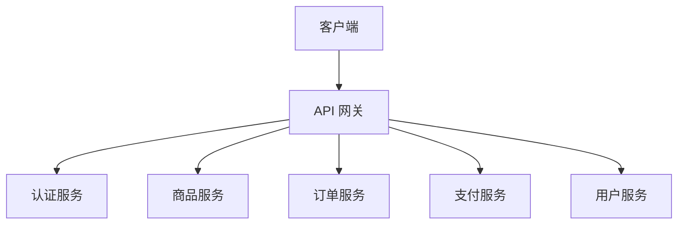

# 使用示例

本文档提供 Trae Multi-Agent Skill 的实际使用示例。

## 📖 目录

- [基础示例](#-基础示例)
- [进阶示例](#-进阶示例)
- [场景示例](#-场景示例)
- [最佳实践](#-最佳实践)

## 🎯 基础示例

### 示例 1: 架构设计

**输入**:
```
设计一个微服务架构的电商系统
```

**预期输出**:
```markdown
# 电商系统微服务架构设计

## 1. 系统架构图



## 2. 模块职责清单

| 模块 | 职责 | 技术栈 |
|------|------|--------|
| API 网关 | 路由、限流、鉴权 | Kong/Nginx |
| 认证服务 | JWT 颁发、验证 | Spring Security |
| 商品服务 | 商品管理、库存 | Spring Boot + MySQL |
| 订单服务 | 订单处理、状态 | Spring Boot + MySQL |
| 支付服务 | 支付对接、对账 | Spring Boot + 第三方支付 |
| 用户服务 | 用户管理、积分 | Spring Boot + MySQL |

## 3. 接口定义

### 3.1 商品服务接口

**输入**:
- 商品 ID
- 用户 ID（可选）

**输出**:
- 商品信息
- 库存状态
- 价格信息

**异常**:
- 商品不存在 (404)
- 库存不足 (400)
- 系统错误 (500)

## 4. 数据模型设计

```sql
-- 商品表
CREATE TABLE product (
    id BIGINT PRIMARY KEY,
    name VARCHAR(200) NOT NULL,
    price DECIMAL(10,2) NOT NULL,
    stock INT NOT NULL,
    created_at TIMESTAMP DEFAULT CURRENT_TIMESTAMP
);

-- 订单表
CREATE TABLE orders (
    id BIGINT PRIMARY KEY,
    user_id BIGINT NOT NULL,
    total_amount DECIMAL(10,2) NOT NULL,
    status VARCHAR(50) NOT NULL,
    created_at TIMESTAMP DEFAULT CURRENT_TIMESTAMP
);
```

## 5. 部署架构说明

```
生产环境部署：
- Kubernetes 集群（3 节点）
- MySQL 主从复制
- Redis 集群（缓存）
- Nginx 负载均衡
- Prometheus + Grafana（监控）
```

## 6. 验收标准

### 功能验收
- [ ] 所有服务可独立部署和扩展
- [ ] API 网关正确路由请求
- [ ] 服务间通信正常
- [ ] 数据库事务一致

### 性能验收
- [ ] API 响应时间 < 200ms (p95)
- [ ] 支持 1000 并发用户
- [ ] 数据库查询 < 50ms
- [ ] 缓存命中率 > 90%

### 质量验收
- [ ] 单元测试覆盖率 > 80%
- [ ] 集成测试通过率 100%
- [ ] 无严重安全漏洞
- [ ] 日志完整可追溯
```

---

### 示例 2: 产品需求定义

**输入**:
```
定义广告拦截功能的产品需求
```

**预期输出**:
```markdown
# 广告拦截功能 PRD

## 1. 产品愿景

为 [浏览器用户] 解决 [恶意广告和钓鱼网站] 问题，带来 [安全、纯净的浏览体验]。

## 2. 用户故事地图

### 核心用户角色
1. **普通用户**: 希望安全浏览，不误点恶意链接
2. **高级用户**: 希望自定义拦截规则
3. **企业用户**: 希望统一管理员工浏览安全

### 用户旅程地图

```
发现威胁 → 拦截广告 → 显示提示 → 记录日志 → 更新规则
   ↓           ↓           ↓           ↓           ↓
  实时监控   CSS 过滤   友好提示   审计日志   自动同步
```

## 3. 功能需求

### 3.1 核心功能 (P0)

**功能**: 实时广告拦截

**用户故事**:
作为 用户，我希望 自动拦截恶意广告，以便 安全浏览网页。

**验收标准**:
- Specific: 拦截率 > 99%
- Measurable: 在 1000 个测试页面中测试
- Achievable: 基于现有规则库实现
- Relevant: 直接提升浏览安全性
- Time-bound: 2 周内完成

**测试用例**:
1. 正常场景：访问含广告页面，广告被拦截
2. 异常场景：规则库为空，使用默认规则
3. 边界场景：页面大量广告，性能影响<10%
4. 性能场景：100 个标签页同时拦截
5. 安全场景：拦截钓鱼网站

### 3.2 增强功能 (P1)

**功能**: 自定义拦截规则

**用户故事**:
作为 高级用户，我希望 添加自定义规则，以便 拦截特定广告。

### 3.3 辅助功能 (P2)

**功能**: 拦截统计报表

**用户故事**:
作为 用户，我希望 查看拦截统计，以便 了解拦截效果。

## 4. 非功能需求

### 4.1 性能指标
- 页面加载延迟增加 < 100ms
- 规则匹配时间 < 10ms
- 内存占用 < 50MB
- CPU 占用 < 5%

### 4.2 质量指标
- 测试覆盖率 > 85%
- 严重缺陷为 0
- 一般缺陷 < 5 个
- 用户满意度 > 4.5/5

### 4.3 安全指标
- 通过 OWASP Top 10 检测
- 无敏感数据泄露
- 规则签名验证
- 安全更新机制

### 4.4 可用性指标
- SLA 99.9%
- MTTR < 1 小时
- 支持离线使用
- 自动恢复机制

## 5. 竞品分析

### 5.1 直接竞品

| 竞品 | 优势 | 劣势 | 学习点 |
|------|------|------|--------|
| AdBlock Plus | 规则库丰富 | 性能较差 | 规则分类 |
| uBlock Origin | 性能优秀 | 功能简单 | 轻量设计 |

### 5.2 间接竞品

| 竞品 | 特点 | 差异化 |
|------|------|--------|
| 浏览器自带 | 集成度高 | 功能有限 |
| 安全软件 | 功能全面 | 体积庞大 |

### 5.3 学习借鉴

**最佳实践**:
- AdBlock Plus 的规则分类方法
- uBlock Origin 的性能优化
- 浏览器原生的用户体验

**避坑指南**:
- 避免规则库过大影响性能
- 避免误伤正常广告
- 避免频繁更新打扰用户

**差异化机会**:
- AI 智能识别恶意广告
- 云端规则同步
- 企业级管理功能

## 6. 数据需求

### 6.1 埋点需求
- 广告拦截次数
- 拦截类型分布
- 性能影响统计
- 用户操作行为

### 6.2 分析需求
- 每日拦截报告
- 热门拦截类型
- 性能趋势分析
- 用户满意度调查

## 7. 运营需求

### 7.1 监控指标
- 拦截成功率
- 规则更新频率
- 用户活跃度
- 错误率

### 7.2 告警阈值
- 拦截率 < 95% → 告警
- 错误率 > 1% → 告警
- 性能下降 > 20% → 告警
```

---

## 🚀 进阶示例

### 示例 3: 多角色共识

**输入**:
```bash
python3 scripts/trae_agent_dispatch.py \
    --task "启动安全浏览器项目：包含广告拦截、隐私保护、性能优化" \
    --consensus true \
    --priority high
```

**预期流程**:

```
🎯 识别为：多角色共识任务
📊 置信度：0.95
🤝 组织共识会议...

📋 参与角色:
   - 产品经理 (主导)
   - 架构师
   - 测试专家
   - 独立开发者

---

📋 阶段 1: 需求定义 (产品经理)

产品愿景:
  为用户提供安全、快速、隐私保护的浏览体验

核心功能:
  1. 广告拦截 (P0)
  2. 隐私保护 (P0)
  3. 性能优化 (P1)
  4. 同步功能 (P2)

验收标准:
  - 广告拦截率 > 99%
  - 页面加载速度提升 30%
  - 隐私数据零泄露

---

📋 阶段 2: 架构设计 (架构师)

技术选型:
  - 前端：React + TypeScript
  - 后端：Rust (高性能)
  - 数据库：SQLite (本地) + PostgreSQL (云端)
  - 缓存：Redis

系统架构:
  [架构图]

部署方案:
  - 开发环境：Docker Compose
  - 生产环境：Kubernetes
  - CDN: Cloudflare

---

📋 阶段 3: 测试策略 (测试专家)

测试金字塔:
  - 单元测试：70% (覆盖率>85%)
  - 集成测试：20% (核心流程)
  - E2E 测试：10% (用户旅程)

测试场景:
  - 正常场景：20 个
  - 异常场景：15 个
  - 边界场景：10 个
  - 性能场景：5 个
  - 安全场景：10 个

真机测试:
  - Windows 10/11
  - macOS 12+
  - Linux Ubuntu 20.04+

---

📋 阶段 4: 开发计划 (独立开发者)

迭代 1 (2 周):
  - 项目初始化
  - 基础框架搭建
  - 广告拦截核心

迭代 2 (2 周):
  - 隐私保护模块
  - 规则同步功能
  - 单元测试

迭代 3 (2 周):
  - 性能优化
  - UI/UX 优化
  - 集成测试

迭代 4 (2 周):
  - Beta 测试
  - Bug 修复
  - 发布准备

---

🤝 共识决议:

✅ 所有角色达成一致

关键决策:
  1. 使用 Rust 实现核心拦截引擎（性能）
  2. 优先支持桌面端，后支持移动端（市场）
  3. 开源核心代码，企业版收费（商业模式）

风险评估:
  ⚠️ Rust 开发人才稀缺 → 提前招聘
  ⚠️ 规则库维护成本高 → 社区共建
  ⚠️ 浏览器兼容性问题 → 充分测试

下一步行动:
  1. 产品经理完善 PRD (2 天)
  2. 架构师输出详细设计 (3 天)
  3. 独立开发者搭建环境 (2 天)
  4. 测试专家准备测试用例 (3 天)
```

---

## 🎬 场景示例

### 场景 1: 紧急 Bug 修复

**输入**:
```bash
python3 scripts/trae_agent_dispatch.py \
    --task "紧急修复：广告拦截失效，用户投诉激增" \
    --priority critical \
    --fast-track
```

**预期响应**:
```
🚨 紧急任务 - 快速通道

🎯 识别为：独立开发者任务 (紧急修复)
📊 置信度：0.98

📋 处理流程:

1. 问题诊断 (5 分钟)
   ✓ 查看错误日志
   ✓ 复现问题
   ✓ 定位根因

2. 修复方案 (10 分钟)
   ✓ 热修复规则引擎
   ✓ 添加回滚机制
   ✓ 准备验证测试

3. 代码修复 (15 分钟)
   ✓ 修复核心逻辑
   ✓ 添加单元测试
   ✓ 代码审查

4. 验证发布 (10 分钟)
   ✓ 运行测试
   ✓ 灰度发布
   ✓ 监控指标

5. 事后复盘 (30 分钟)
   ✓ 根因分析
   ✓ 改进措施
   ✓ 文档更新

⏱️ 总耗时：70 分钟
✅ 问题已解决，监控指标恢复正常
```

### 场景 2: 性能优化

**输入**:
```
页面加载很慢，广告拦截功能延迟超过 2 秒
```

**预期响应**:
```
🎯 识别为：架构师任务 (性能优化)
📊 置信度：0.92

📋 性能分析和优化方案:

1. 性能分析

瓶颈定位:
  ✓ 规则匹配算法：O(n²) 复杂度
  ✓ DOM 操作频繁：每秒 100+ 次
  ✓ 规则库过大：10 万 + 条规则
  ✓ 缺少缓存：重复计算

性能剖析:
  - 规则匹配：1500ms (75%)
  - DOM 操作：400ms (20%)
  - 其他：100ms (5%)

2. 优化方案

短期方案 (1 周):
  ✓ 优化规则匹配算法 (O(n) → O(1))
  ✓ 添加规则缓存
  ✓ 批量 DOM 操作

中期方案 (2 周):
  ✓ 规则库分类和索引
  ✓ Web Worker 异步处理
  ✓ 增量更新机制

长期方案 (1 月):
  ✓ Rust 重写核心引擎
  ✓ SIMD 加速匹配
  ✓ GPU 加速渲染

3. 预期效果

优化后指标:
  - 规则匹配：< 10ms (提升 150 倍)
  - DOM 操作：< 50ms (提升 8 倍)
  - 总延迟：< 100ms (从 2000ms 降低)

4. 验证方法

性能测试:
  ✓ 基准测试
  ✓ 压力测试
  ✓ 对比测试

监控指标:
  ✓ 页面加载时间
  ✓ 规则匹配耗时
  ✓ CPU/内存占用
```

---

### 示例 8: 规范驱动开发

**输入**:
```
启动规范驱动项目：电商系统
- 初始化规范环境
- 制定项目宪法
- 编写需求和技术规范
```

**预期输出**:
```bash
# 步骤 1: 初始化规范环境
python3 scripts/spec_tools.py init

# 输出:
✅ 规范环境初始化完成
📁 创建 docs/spec/ 目录
📄 创建 CONSTITUTION.md (项目宪法)
📄 创建 SPEC.md (项目规范)
📄 创建 SPEC_ANALYSIS.md (规范分析)
📄 创建 PROJECT_STRUCTURE.md (项目结构)

# 步骤 2: 分析规范
python3 scripts/spec_tools.py analyze

# 输出:
📊 规范完整性分析
  ✓ 项目宪法：已创建
  ✓ 项目规范：已创建
  ✓ 规范分析：已创建
  ⚠ 需求规范：待完善
  ⚠ 技术规范：待完善
  ⚠ 测试规范：待完善

# 步骤 3: 多角色共识制定规范
python3 scripts/trae_agent_dispatch.py \
    --task "制定电商系统项目宪法和规范" \
    --consensus true

# 参与角色:
#   1. 产品经理 - 需求规范
#   2. 架构师 - 技术规范
#   3. 测试专家 - 测试规范
#   4. 独立开发者 - 开发规范

# 步骤 4: 更新规范文档
python3 scripts/spec_tools.py update --spec-file SPEC.md

# 输出:
✅ 规范文档更新完成
📝 需求规范：已更新
📝 技术规范：已更新
📝 测试规范：已更新

# 步骤 5: 验证规范
python3 scripts/spec_tools.py validate

# 输出:
✅ 规范验证通过
  ✓ 需求规范完整
  ✓ 技术规范完整
  ✓ 测试规范完整
  ✓ 规范一致性检查通过
```

---

### 示例 9: 代码地图生成

**输入**:
```
生成项目代码地图
- 分析代码结构
- 识别核心组件
- 生成技术栈报告
```

**预期输出**:
```bash
# 生成代码地图
python3 scripts/code_map_generator.py /path/to/project

# 输出:
🗺️ 代码地图生成器
📊 扫描项目：/path/to/project
📁 发现文件：1,234 个
📝 代码文件：856 个
📦 模块数量：45 个

✅ 生成完成:
  📄 code_map.json (JSON 格式)
  📄 PROJECT_STRUCTURE.md (Markdown 格式)

# 查看代码地图内容:
cat PROJECT_STRUCTURE.md

# 输出内容:
# 项目结构概览

## 统计信息
- 总文件数：1,234
- 代码文件：856
- 文档文件：123
- 配置文件：45
- 总代码行数：125,678

## 目录结构
project/
├── src/
│   ├── main/          # 主程序入口
│   ├── core/          # 核心模块
│   ├── api/           # API 接口层
│   ├── service/       # 业务逻辑层
│   └── dao/           # 数据访问层
├── tests/
│   ├── unit/          # 单元测试
│   └── integration/   # 集成测试
└── docs/              # 文档目录

## 核心组件
1. MainApplication - 主程序入口
2. CoreEngine - 核心引擎
3. APIGateway - API 网关
4. ServiceManager - 服务管理器

## 技术栈
- 编程语言：Java 21
- 框架：Spring Boot 3.2
- 数据库：MySQL 8.0
- 缓存：Redis 7.0
```

---

### 示例 10: 项目理解

**输入**:
```
生成项目理解文档
- 快速了解项目
- 为各角色生成理解文档
- 作为工作初始化上下文
```

**预期输出**:
```bash
# 生成项目理解文档
python3 scripts/project_understanding.py /path/to/project

# 输出:
📚 项目理解生成器
📊 扫描项目：/path/to/project
📖 读取文档：README.md, docs/*
📝 分析代码：src/**/*
🔍 识别技术栈：Java, Spring Boot, MySQL

✅ 生成完成:
  📄 project_understanding.json (整体项目信息)
  📄 architect_understanding.md (架构师理解)
  📄 product_manager_understanding.md (产品经理理解)
  📄 test_expert_understanding.md (测试专家理解)
  📄 solo_coder_understanding.md (独立开发者理解)

# 查看架构师理解文档:
cat docs/project-understanding/architect_understanding.md

# 输出内容:
# 架构师项目理解

## 项目概览
- 项目名称：电商系统
- 项目类型：微服务架构
- 开发语言：Java 21
- 核心框架：Spring Boot 3.2

## 技术栈
### 后端
- Spring Boot 3.2 - 应用框架
- Spring Cloud - 微服务框架
- MySQL 8.0 - 关系数据库
- Redis 7.0 - 缓存
- Kafka 3.0 - 消息队列

### 前端
- React 18 - UI 框架
- TypeScript 5.0 - 类型系统
- Ant Design - UI 组件库

## 架构模式
- 微服务架构
- RESTful API
- 事件驱动
- CQRS 模式

## 部署结构
- Kubernetes 集群
- Docker 容器化
- CI/CD 流水线
- 多环境部署（dev/test/prod）

## 架构建议
1. 保持服务边界清晰
2. 使用统一的服务发现
3. 实现熔断和降级
4. 完善监控和日志
```

---

## 💡 最佳实践

### 1. 明确任务描述

✅ **好**: "设计微服务架构：包括模块划分、技术选型、部署方案、监控体系"
❌ **差**: "做个架构"

### 2. 提供充分上下文

✅ **好**: 
```
基于架构设计文档 v2.0，使用 SQLite 存储规则，
需要支持 100 万 + 规则，查询延迟<10ms
```

❌ **差**: "看文档实现"

### 3. 合理使用共识

- **简单任务** → 单角色（快速响应）
- **复杂任务** → 多角色共识（全面考虑）
- **重大决策** → 必须共识（降低风险）

### 4. 遵循角色输出

每个角色都有标准输出格式，确保质量一致：

- **架构师**: 架构图 + 模块清单 + 接口定义 + 数据模型 + 部署方案
- **产品经理**: PRD + 用户故事 + 验收标准 + 竞品分析
- **测试专家**: 测试策略 + 测试用例 + 自动化方案 + 质量报告
- **独立开发者**: 完整代码 + 单元测试 + 技术文档

### 5. 及时反馈调整

如果对角色输出不满意：
1. 明确说明问题
2. 提供具体改进建议
3. 必要时请求多角色共识

---

## 📞 需要帮助？

- 📖 查看 [README.md](README.md) 了解完整功能
- 📚 查看 [CONTRIBUTING.md](CONTRIBUTING.md) 了解如何贡献
- ❓ 查看 [常见问题](README.md#常见问题) 解决问题
- 💬 在 GitHub 发起 Issue 寻求帮助

**Happy Coding! 🎉**
