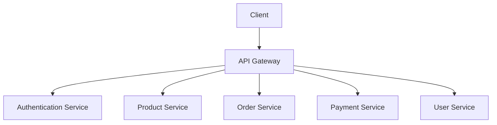

# Usage Examples

This document provides practical usage examples for Trae Multi-Agent Skill.

## 📖 Table of Contents

- [Basic Examples](#-basic-examples)
- [Advanced Examples](#-advanced-examples)
- [Scenario Examples](#-scenario-examples)
- [Best Practices](#-best-practices)

## 🎯 Basic Examples

### Example 1: Architecture Design

**Input**:
```
Design a microservices architecture for an e-commerce system
```

**Expected Output**:
```markdown
# E-commerce System Microservices Architecture Design

## 1. System Architecture Diagram



## 2. Module Responsibility List

| Module | Responsibility | Technology Stack |
|--------|----------------|------------------|
| API Gateway | Routing, Rate Limiting, Authentication | Kong/Nginx |
| Authentication Service | JWT Issuance, Validation | Spring Security |
| Product Service | Product Management, Inventory | Spring Boot + MySQL |
| Order Service | Order Processing, Status | Spring Boot + MySQL |
| Payment Service | Payment Integration, Reconciliation | Spring Boot + Third-party Payment |
| User Service | User Management, Points | Spring Boot + MySQL |

## 3. Interface Definition

### 3.1 Product Service Interface

**Input**:
- Product ID
- User ID (optional)

**Output**:
- Product Information
- Inventory Status
- Price Information

**Exceptions**:
- Product Not Found (404)
- Insufficient Inventory (400)
- System Error (500)

## 4. Data Model Design

```sql
-- Product Table
CREATE TABLE product (
    id BIGINT PRIMARY KEY,
    name VARCHAR(200) NOT NULL,
    price DECIMAL(10,2) NOT NULL,
    stock INT NOT NULL,
    created_at TIMESTAMP DEFAULT CURRENT_TIMESTAMP
);

-- Order Table
CREATE TABLE orders (
    id BIGINT PRIMARY KEY,
    user_id BIGINT NOT NULL,
    total_amount DECIMAL(10,2) NOT NULL,
    status VARCHAR(50) NOT NULL,
    created_at TIMESTAMP DEFAULT CURRENT_TIMESTAMP
);
```

## 5. Deployment Architecture

```
Production Deployment:
- Kubernetes Cluster (3 nodes)
- MySQL Master-Slave Replication
- Redis Cluster (Caching)
- Nginx Load Balancer
- Prometheus + Grafana (Monitoring)
```

## 6. Acceptance Criteria

### Functional Acceptance
- [ ] All services can be deployed and scaled independently
- [ ] API Gateway correctly routes requests
- [ ] Inter-service communication is normal
- [ ] Database transactions are consistent

### Performance Acceptance
- [ ] API response time < 200ms (p95)
- [ ] Support 1000 concurrent users
- [ ] Database queries < 50ms
- [ ] Cache hit rate > 90%

### Quality Acceptance
- [ ] Unit test coverage > 80%
- [ ] Integration test pass rate 100%
- [ ] No critical security vulnerabilities
- [ ] Logs are complete and traceable
```

---

### Example 2: Product Requirements Definition

**Input**:
```
Define product requirements for ad blocking functionality
```

**Expected Output**:
```markdown
# Ad Blocking Function PRD

## 1. Product Vision

Solve [malicious ads and phishing websites] for [browser users], bringing [safe, clean browsing experience].

## 2. User Story Map

### Core User Roles
1. **Regular Users**: Want safe browsing, avoid clicking malicious links
2. **Advanced Users**: Want to customize blocking rules
3. **Enterprise Users**: Want to centrally manage employee browsing security

### User Journey Map

```
Threat Detection → Ad Blocking → Notification Display → Log Recording → Rule Update
   ↓               ↓              ↓                ↓              ↓
  Real-time Monitoring  CSS Filtering  Friendly Prompt  Audit Logs  Automatic Sync
```

## 3. Functional Requirements

### 3.1 Core Features (P0)

**Feature**: Real-time Ad Blocking

**User Story**:
As a user, I want automatic blocking of malicious ads so that I can browse the web safely.

**Acceptance Criteria**:
- Specific: Blocking rate > 99%
- Measurable: Tested on 1000 test pages
- Achievable: Based on existing rule library
- Relevant: Directly improves browsing security
- Time-bound: Complete within 2 weeks

**Test Cases**:
1. Normal scenario: Access page with ads, ads are blocked
2. Abnormal scenario: Rule library is empty, use default rules
3. Boundary scenario: Page with many ads, performance impact < 10%
4. Performance scenario: 100 tabs blocked simultaneously
5. Security scenario: Block phishing websites

### 3.2 Enhanced Features (P1)

**Feature**: Custom Blocking Rules

**User Story**:
As an advanced user, I want to add custom rules so that I can block specific ads.

### 3.3 Auxiliary Features (P2)

**Feature**: Blocking Statistics Report

**User Story**:
As a user, I want to view blocking statistics so that I can understand blocking effectiveness.

## 4. Non-functional Requirements

### 4.1 Performance Metrics
- Page load delay increase < 100ms
- Rule matching time < 10ms
- Memory usage < 50MB
- CPU usage < 5%

### 4.2 Quality Metrics
- Test coverage > 85%
- Critical defects: 0
- General defects < 5
- User satisfaction > 4.5/5

### 4.3 Security Metrics
- Pass OWASP Top 10 detection
- No sensitive data leakage
- Rule signature verification
- Secure update mechanism

### 4.4 Availability Metrics
- SLA 99.9%
- MTTR < 1 hour
- Support offline usage
- Automatic recovery mechanism

## 5. Competitive Analysis

### 5.1 Direct Competitors

| Competitor | Advantages | Disadvantages | Learnings |
|------------|------------|---------------|-----------|
| AdBlock Plus | Rich rule library | Poor performance | Rule classification |
| uBlock Origin | Excellent performance | Simple features | Lightweight design |

### 5.2 Indirect Competitors

| Competitor | Characteristics | Differentiation |
|------------|-----------------|-----------------|
| Browser Built-in | High integration | Limited features |
| Security Software | Comprehensive features | Large size |

### 5.3 Learning and Reference

**Best Practices**:
- Rule classification method from AdBlock Plus
- Performance optimization from uBlock Origin
- User experience from browser native features

**Pitfalls to Avoid**:
- Avoid rule library being too large and affecting performance
- Avoid blocking normal ads
- Avoid frequent updates disturbing users

**Differentiation Opportunities**:
- AI intelligent malicious ad recognition
- Cloud rule synchronization
- Enterprise management features

## 6. Data Requirements

### 6.1 Tracking Requirements
- Ad blocking count
- Blocking type distribution
- Performance impact statistics
- User operation behavior

### 6.2 Analysis Requirements
- Daily blocking report
- Hot blocking types
- Performance trend analysis
- User satisfaction survey

## 7. Operations Requirements

### 7.1 Monitoring Metrics
- Blocking success rate
- Rule update frequency
- User activity
- Error rate

### 7.2 Alert Thresholds
- Blocking rate < 95% → Alert
- Error rate > 1% → Alert
- Performance degradation > 20% → Alert
```

---

## 🚀 Advanced Examples

### Example 3: Multi-role Consensus

**Input**:
```bash
python3 scripts/trae_agent_dispatch.py \
    --task "Launch secure browser project: including ad blocking, privacy protection, performance optimization" \
    --consensus true \
    --priority high
```

**Expected Flow**:

```
🎯 Identified as: Multi-role consensus task
📊 Confidence: 0.95
🤝 Organizing consensus meeting...

📋 Participating Roles:
   - Product Manager (lead)
   - Architect
   - Test Expert
   - Solo Coder

---

📋 Phase 1: Requirements Definition (Product Manager)

Product Vision:
  Provide users with secure, fast, privacy-protected browsing experience

Core Features:
  1. Ad Blocking (P0)
  2. Privacy Protection (P0)
  3. Performance Optimization (P1)
  4. Sync Function (P2)

Acceptance Criteria:
  - Ad blocking rate > 99%
  - Page load speed提升 30%
  - Zero privacy data leakage

---

📋 Phase 2: Architecture Design (Architect)

Technology Selection:
  - Frontend: React + TypeScript
  - Backend: Rust (high performance)
  - Database: SQLite (local) + PostgreSQL (cloud)
  - Cache: Redis

System Architecture:
  [Architecture Diagram]

Deployment Plan:
  - Development: Docker Compose
  - Production: Kubernetes
  - CDN: Cloudflare

---

📋 Phase 3: Testing Strategy (Test Expert)

Test Pyramid:
  - Unit Tests: 70% (coverage > 85%)
  - Integration Tests: 20% (core flows)
  - E2E Tests: 10% (user journeys)

Test Scenarios:
  - Normal scenarios: 20
  - Abnormal scenarios: 15
  - Boundary scenarios: 10
  - Performance scenarios: 5
  - Security scenarios: 10

Real Device Testing:
  - Windows 10/11
  - macOS 12+
  - Linux Ubuntu 20.04+

---

📋 Phase 4: Development Plan (Solo Coder)

Iteration 1 (2 weeks):
  - Project initialization
  - Basic framework setup
  - Ad blocking core

Iteration 2 (2 weeks):
  - Privacy protection module
  - Rule sync function
  - Unit tests

Iteration 3 (2 weeks):
  - Performance optimization
  - UI/UX optimization
  - Integration tests

Iteration 4 (2 weeks):
  - Beta testing
  - Bug fixes
  - Release preparation

---

🤝 Consensus Resolution:

✅ All roles reach consensus

Key Decisions:
  1. Use Rust for core blocking engine (performance)
  2. Prioritize desktop, then mobile (market)
  3. Open source core, enterprise version paid (business model)

Risk Assessment:
  ⚠️ Rust development talent scarcity → Recruit in advance
  ⚠️ Rule library maintenance cost high → Community共建
  ⚠️ Browser compatibility issues → Thorough testing

Next Actions:
  1. Product Manager完善 PRD (2 days)
  2. Architect输出 detailed design (3 days)
  3. Solo Coder搭建 environment (2 days)
  4. Test Expert准备 test cases (3 days)
```

---

## 🎬 Scenario Examples

### Scenario 1: Emergency Bug Fix

**Input**:
```bash
python3 scripts/trae_agent_dispatch.py \
    --task "Emergency fix: Ad blocking失效, user complaints surged" \
    --priority critical \
    --fast-track
```

**Expected Response**:
```
🚨 Emergency Task - Fast Track

🎯 Identified as: Solo Coder task (emergency fix)
📊 Confidence: 0.98

📋 Handling Process:

1. Problem Diagnosis (5 minutes)
   ✓ View error logs
   ✓ Reproduce issue
   ✓ Locate root cause

2. Fix Solution (10 minutes)
   ✓ Hot fix rule engine
   ✓ Add rollback mechanism
   ✓ Prepare verification tests

3. Code Fix (15 minutes)
   ✓ Fix core logic
   ✓ Add unit tests
   ✓ Code review

4. Verification & Release (10 minutes)
   ✓ Run tests
   ✓ Gradual release
   ✓ Monitor metrics

5. Post-mortem (30 minutes)
   ✓ Root cause analysis
   ✓ Improvement measures
   ✓ Documentation update

⏱️ Total Time: 70 minutes
✅ Issue resolved, monitoring metrics normal
```

### Scenario 2: Performance Optimization

**Input**:
```
Page loading is slow, ad blocking function delay exceeds 2 seconds
```

**Expected Response**:
```
🎯 Identified as: Architect task (performance optimization)
📊 Confidence: 0.92

📋 Performance Analysis and Optimization Plan:

1. Performance Analysis

Bottleneck Location:
  ✓ Rule matching algorithm: O(n²) complexity
  ✓ DOM operations frequent: 100+ times per second
  ✓ Rule library too large: 100,000+ rules
  ✓ Missing cache: repeated calculations

Performance Profiling:
  - Rule matching: 1500ms (75%)
  - DOM operations: 400ms (20%)
  - Others: 100ms (5%)

2. Optimization Plan

Short-term (1 week):
  ✓ Optimize rule matching algorithm (O(n) → O(1))
  ✓ Add rule caching
  ✓ Batch DOM operations

Medium-term (2 weeks):
  ✓ Rule library classification and indexing
  ✓ Web Worker asynchronous processing
  ✓ Incremental update mechanism

Long-term (1 month):
  ✓ Rewrite core engine in Rust
  ✓ SIMD acceleration matching
  ✓ GPU acceleration rendering

3. Expected Results

Optimized Metrics:
  - Rule matching: < 10ms (150x improvement)
  - DOM operations: < 50ms (8x improvement)
  - Total latency: < 100ms (from 2000ms)

4. Validation Method

Performance Testing:
  ✓ Benchmark tests
  ✓ Stress tests
  ✓ Comparison tests

Monitoring Metrics:
  ✓ Page load time
  ✓ Rule matching time
  ✓ CPU/memory usage
```

---

### Example 8: Specification-Driven Development

**Input**:
```
Start specification-driven project: E-commerce System
- Initialize specification environment
- Develop project constitution
- Write requirements and technical specifications
```

**Expected Output**:
```bash
# Step 1: Initialize specification environment
python3 scripts/spec_tools.py init

# Output:
✅ Specification environment initialized
📁 Created docs/spec/ directory
📄 Created CONSTITUTION.md (Project Constitution)
📄 Created SPEC.md (Project Specification)
📄 Created SPEC_ANALYSIS.md (Specification Analysis)
📄 Created PROJECT_STRUCTURE.md (Project Structure)

# Step 2: Analyze specification
python3 scripts/spec_tools.py analyze

# Output:
📊 Specification completeness analysis
  ✓ Project Constitution: Created
  ✓ Project Specification: Created
  ✓ Specification Analysis: Created
  ⚠ Requirements Specification: To be improved
  ⚠ Technical Specification: To be improved
  ⚠ Test Specification: To be improved

# Step 3: Multi-agent consensus for specification development
python3 scripts/trae_agent_dispatch.py \
    --task "Develop e-commerce system constitution and specifications" \
    --consensus true

# Participating roles:
#   1. Product Manager - Requirements specification
#   2. Architect - Technical specification
#   3. Test Expert - Test specification
#   4. Solo Coder - Development specification

# Step 4: Update specification documents
python3 scripts/spec_tools.py update --spec-file SPEC.md

# Output:
✅ Specification documents updated
📝 Requirements specification: Updated
📝 Technical specification: Updated
📝 Test specification: Updated

# Step 5: Validate specification
python3 scripts/spec_tools.py validate

# Output:
✅ Specification validation passed
  ✓ Requirements specification complete
  ✓ Technical specification complete
  ✓ Test specification complete
  ✓ Specification consistency check passed
```

---

### Example 9: Code Map Generation

**Input**:
```
Generate project code map
- Analyze code structure
- Identify core components
- Generate technology stack report
```

**Expected Output**:
```bash
# Generate code map
python3 scripts/code_map_generator.py /path/to/project

# Output:
🗺️ Code Map Generator
📊 Scanning project: /path/to/project
📁 Files found: 1,234
📝 Code files: 856
📦 Modules: 45

✅ Generation complete:
  📄 code_map.json (JSON format)
  📄 PROJECT_STRUCTURE.md (Markdown format)

# View code map content:
cat PROJECT_STRUCTURE.md

# Output content:
# Project Structure Overview

## Statistics
- Total files: 1,234
- Code files: 856
- Documentation files: 123
- Configuration files: 45
- Total code lines: 125,678

## Directory Structure
project/
├── src/
│   ├── main/          # Main entry point
│   ├── core/          # Core module
│   ├── api/           # API layer
│   ├── service/       # Business logic layer
│   └── dao/           # Data access layer
├── tests/
│   ├── unit/          # Unit tests
│   └── integration/   # Integration tests
└── docs/              # Documentation directory

## Core Components
1. MainApplication - Main entry point
2. CoreEngine - Core engine
3. APIGateway - API gateway
4. ServiceManager - Service manager

## Technology Stack
- Programming Language: Java 21
- Framework: Spring Boot 3.2
- Database: MySQL 8.0
- Cache: Redis 7.0
```

---

### Example 10: Project Understanding

**Input**:
```
Generate project understanding documents
- Quickly understand project
- Generate role-specific understanding documents
- Use as work initialization context
```

**Expected Output**:
```bash
# Generate project understanding documents
python3 scripts/project_understanding.py /path/to/project

# Output:
📚 Project Understanding Generator
📊 Scanning project: /path/to/project
📖 Reading documents: README.md, docs/*
📝 Analyzing code: src/**/*
🔍 Identifying technology stack: Java, Spring Boot, MySQL

✅ Generation complete:
  📄 project_understanding.json (Overall project info)
  📄 architect_understanding.md (Architect understanding)
  📄 product_manager_understanding.md (Product Manager understanding)
  📄 test_expert_understanding.md (Test Expert understanding)
  📄 solo_coder_understanding.md (Solo Coder understanding)

# View architect understanding document:
cat docs/project-understanding/architect_understanding.md

# Output content:
# Architect Project Understanding

## Project Overview
- Project Name: E-commerce System
- Project Type: Microservices Architecture
- Development Language: Java 21
- Core Framework: Spring Boot 3.2

## Technology Stack
### Backend
- Spring Boot 3.2 - Application Framework
- Spring Cloud - Microservices Framework
- MySQL 8.0 - Relational Database
- Redis 7.0 - Cache
- Kafka 3.0 - Message Queue

### Frontend
- React 18 - UI Framework
- TypeScript 5.0 - Type System
- Ant Design - UI Component Library

## Architecture Patterns
- Microservices Architecture
- RESTful API
- Event-Driven
- CQRS Pattern

## Deployment Structure
- Kubernetes Cluster
- Docker Containerization
- CI/CD Pipeline
- Multi-environment Deployment (dev/test/prod)

## Architecture Recommendations
1. Maintain clear service boundaries
2. Use unified service discovery
3. Implement circuit breaker and fallback
4. Improve monitoring and logging
```

---

## 💡 Best Practices

### 1. Clear Task Description

✅ **Good**: "Design microservices architecture: including module division, technology selection, deployment plan, monitoring system"
❌ **Bad**: "Do an architecture"

### 2. Provide Sufficient Context

✅ **Good**: 
```
Based on architecture design document v2.0, using SQLite for rule storage,
need to support 100,000+ rules, query latency < 10ms
```

❌ **Bad**: "Implement based on document"

### 3. Reasonable Use of Consensus

- **Simple tasks** → Single role (fast response)
- **Complex tasks** → Multi-role consensus (comprehensive consideration)
- **Major decisions** → Consensus required (reduce risk)

### 4. Follow Role Output

Each role has standard output format to ensure consistent quality:

- **Architect**: Architecture diagram + module list + interface definition + data model + deployment plan
- **Product Manager**: PRD + user stories + acceptance criteria + competitive analysis
- **Test Expert**: Test strategy + test cases + automation plan + quality report
- **Solo Coder**: Complete code + unit tests + technical documentation

### 5. Timely Feedback and Adjustment

If unsatisfied with role output:
1. Clearly state the problem
2. Provide specific improvement suggestions
3. Request multi-role consensus if necessary

---

## 📞 Need Help?

- 📖 Read [README.md](README.md) for complete features
- 📚 Read [CONTRIBUTING.md](CONTRIBUTING.md) for contribution guidelines
- ❓ Check [FAQ](README.md#faq) for solutions
- 💬 Create GitHub Issue for assistance

**Happy Coding! 🎉**