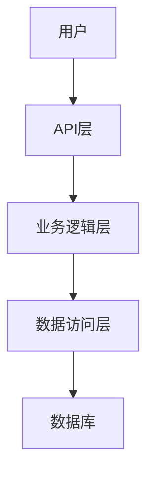
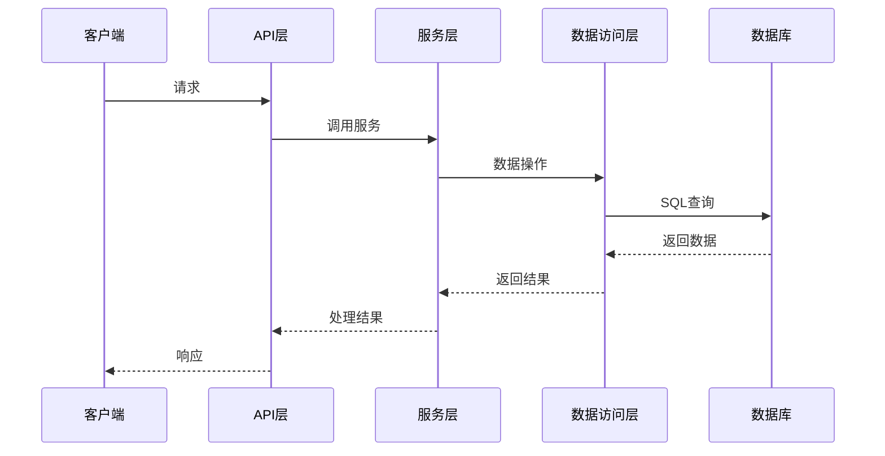
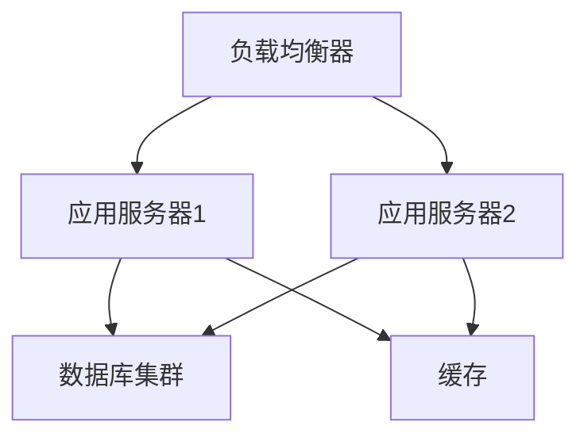

# 架构设计文档模板

## 1. 项目信息

| 项目名称 | 版本 | 负责人 | 最后更新 |
|---------|------|--------|----------|
| 项目名称 | v1.0.0 | 架构师 | 2024-01-01 |

## 2. 架构概述

### 2.1 架构风格
- **架构风格**: [如：微服务架构、单体应用、分层架构等]
- **技术栈**: [如：Spring Boot、MySQL、Redis等]
- **设计原则**: [如：高内聚低耦合、可扩展性、可维护性等]

### 2.2 核心流程图



## 3. 系统架构

### 3.1 模块划分

| 模块名称 | 主要职责 | 技术栈 | 依赖关系 |
|---------|---------|--------|----------|
| 模块1 | 职责描述 | 技术栈 | 依赖模块 |
| 模块2 | 职责描述 | 技术栈 | 依赖模块 |

### 3.2 目录结构

```
project/
├── src/
│   ├── main/
│   │   ├── java/
│   │   │   └── com/
│   │   │       └── example/
│   │   │           ├── controller/  # 控制器层
│   │   │           ├── service/     # 服务层
│   │   │           ├── repository/  # 数据访问层
│   │   │           ├── model/       # 数据模型
│   │   │           └── config/      # 配置类
│   │   └── resources/
│   │       └── application.yml      # 应用配置
│   └── test/
│       └── java/                    # 测试代码
└── pom.xml                          # Maven配置
```

### 3.3 核心组件

| 组件名称 | 功能描述 | 技术实现 | 配置说明 |
|---------|---------|----------|----------|
| 组件1 | 功能描述 | 技术实现 | 配置说明 |
| 组件2 | 功能描述 | 技术实现 | 配置说明 |

## 4. 关键设计

### 4.1 数据库设计

#### 4.1.1 数据模型

| 表名 | 描述 | 关键字段 | 关联关系 |
|------|------|----------|----------|
| 表1 | 描述 | 关键字段 | 关联关系 |
| 表2 | 描述 | 关键字段 | 关联关系 |

#### 4.1.2 数据传输对象 (DTOs)

| 类名 | 描述 | 主要字段 | 用途 |
|------|------|----------|------|
| 类1 | 描述 | 主要字段 | 用途 |
| 类2 | 描述 | 主要字段 | 用途 |

### 4.2 API 设计

| API路径 | 方法 | 模块 | 功能描述 | 请求体 | 响应体 |
|---------|------|------|----------|--------|--------|
| /api/resource | GET | 模块 | 功能描述 | N/A | `{"id": 1, "name": "资源"}` |
| /api/resource | POST | 模块 | 功能描述 | `{"name": "资源"}` | `{"id": 1, "name": "资源"}` |

### 4.3 业务逻辑设计

#### 4.3.1 核心业务流程



#### 4.3.2 关键算法

| 算法名称 | 描述 | 实现方式 | 时间复杂度 |
|---------|------|----------|------------|
| 算法1 | 描述 | 实现方式 | 时间复杂度 |
| 算法2 | 描述 | 实现方式 | 时间复杂度 |

## 5. 非功能性需求

### 5.1 性能要求
- **响应时间**: [如：95%的请求在100ms内完成]
- **并发处理**: [如：支持1000QPS]
- **资源使用**: [如：内存使用不超过2GB]

### 5.2 可靠性要求
- **可用性**: [如：99.9%]
- **容错能力**: [如：支持单点故障自动恢复]
- **数据一致性**: [如：最终一致性]

### 5.3 安全性要求
- **认证方式**: [如：JWT认证]
- **授权机制**: [如：基于角色的访问控制]
- **数据加密**: [如：传输加密、存储加密]

### 5.4 可扩展性要求
- **水平扩展**: [如：支持集群部署]
- **模块化设计**: [如：插件化架构]
- **配置管理**: [如：外部化配置]

## 6. 部署与集成

### 6.1 部署架构



### 6.2 集成方案
- **外部系统集成**: [如：第三方API集成]
- **消息队列**: [如：Kafka]
- **监控系统**: [如：Prometheus + Grafana]

### 6.3 环境配置

| 环境 | 配置文件 | 数据库 | 缓存 |
|------|----------|--------|------|
| 开发 | application-dev.yml | 本地MySQL | 本地Redis |
| 测试 | application-test.yml | 测试MySQL | 测试Redis |
| 生产 | application-prod.yml | 生产MySQL集群 | 生产Redis集群 |

## 7. 风险与应对

| 风险点 | 影响程度 | 可能性 | 应对措施 |
|-------|---------|--------|----------|
| 风险1 | 影响程度 | 可能性 | 应对措施 |
| 风险2 | 影响程度 | 可能性 | 应对措施 |

## 8. 附录

### 8.1 术语定义

| 术语 | 解释 |
|------|------|
| 术语1 | 解释 |
| 术语2 | 解释 |

### 8.2 参考文档

- [参考文档1]
- [参考文档2]
