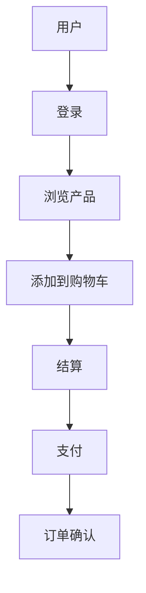
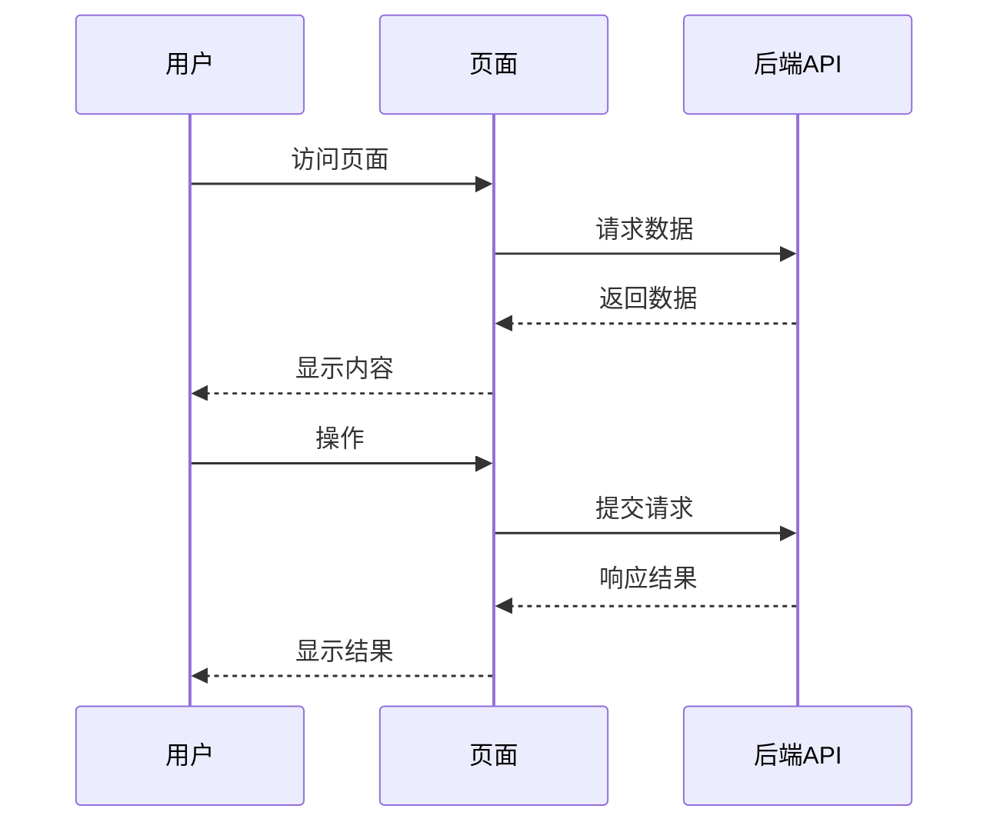

# 产品需求文档模板

## 1. 产品信息

| 产品名称 | 版本 | 负责人 | 最后更新 |
|---------|------|--------|----------|
| 产品名称 | v1.0.0 | 产品经理 | 2024-01-01 |

## 2. 产品概述

### 2.1 产品背景
- **背景描述**: [描述产品开发的背景和动机]
- **目标市场**: [目标用户群体和市场定位]
- **价值主张**: [产品的核心价值和竞争优势]

### 2.2 产品目标
- **业务目标**: [如：提升用户体验、增加市场份额、提高转化率等]
- **技术目标**: [如：构建可扩展的架构、提高系统稳定性等]
- **用户目标**: [如：简化操作流程、提高工作效率等]

### 2.3 术语定义

| 术语 | 解释 |
|------|------|
| 术语1 | 解释 |
| 术语2 | 解释 |

## 3. 核心功能

### 3.1 用户角色

| 角色 | 注册方式 | 核心权限 |
|------|----------|----------|
| 角色1 | 注册方式 | 核心权限 |
| 角色2 | 注册方式 | 核心权限 |

### 3.2 功能模块

| 模块名称 | 功能描述 | 优先级 | 备注 |
|---------|---------|--------|------|
| 模块1 | 功能描述 | P0/P1/P2 | 备注 |
| 模块2 | 功能描述 | P0/P1/P2 | 备注 |

### 3.3 页面详情

| 页面名称 | 模块 | 功能描述 | UI元素 | 交互流程 |
|---------|------|----------|--------|----------|
| 页面1 | 模块 | 功能描述 | UI元素 | 交互流程 |
| 页面2 | 模块 | 功能描述 | UI元素 | 交互流程 |

## 4. 核心流程

### 4.1 用户旅程

| 阶段 | 用户目标 | 用户行为 | 系统响应 | 情感 |
|------|----------|----------|----------|------|
| 阶段1 | 用户目标 | 用户行为 | 系统响应 | 情感 |
| 阶段2 | 用户目标 | 用户行为 | 系统响应 | 情感 |

### 4.2 业务流程图

### 4.3 页面流程图

## 5. 非功能性需求

### 5.1 性能要求
- **响应时间**: [如：页面加载时间不超过3秒]
- **并发处理**: [如：支持1000用户同时在线]
- **吞吐量**: [如：每秒处理100个请求]

### 5.2 可靠性要求
- **可用性**: [如：系统可用性达到99.9%]
- **容错能力**: [如：系统故障后5分钟内恢复]
- **数据备份**: [如：每日自动备份数据]

### 5.3 安全性要求
- **认证方式**: [如：用户名密码认证 + 短信验证码]
- **授权机制**: [如：基于角色的访问控制]
- **数据加密**: [如：敏感数据加密存储]
- **防攻击**: [如：防止SQL注入、XSS攻击等]

### 5.4 兼容性要求
- **浏览器兼容**: [如：支持Chrome、Firefox、Safari、Edge最新版本]
- **设备兼容**: [如：支持PC端、移动端]
- **系统兼容**: [如：支持Windows、macOS、Linux]

## 6. 数据需求

### 6.1 数据结构

| 数据实体 | 字段名称 | 数据类型 | 约束 | 描述 |
|---------|---------|----------|------|------|
| 实体1 | 字段1 | 数据类型 | 约束 | 描述 |
| 实体1 | 字段2 | 数据类型 | 约束 | 描述 |
| 实体2 | 字段1 | 数据类型 | 约束 | 描述 |

### 6.2 数据存储
- **存储方式**: [如：关系型数据库、NoSQL数据库]
- **数据备份**: [如：定期备份策略]
- **数据迁移**: [如：历史数据迁移方案]

### 6.3 数据安全
- **数据加密**: [如：传输加密、存储加密]
- **访问控制**: [如：数据访问权限管理]
- **数据审计**: [如：操作日志记录]

## 7. 范围限定

### 7.1 包含功能
- [功能1]
- [功能2]

### 7.2 排除功能
- [功能1]
- [功能2]

### 7.3 边界条件
- [边界条件1]
- [边界条件2]

## 8. 项目计划

### 8.1 开发周期
- **总周期**: [如：3个月]
- **里程碑**: [如：需求确认、设计完成、开发完成、测试完成、上线]

### 8.2 资源需求
- **人力资源**: [如：产品经理1人、前端开发2人、后端开发2人、测试1人]
- **技术资源**: [如：服务器、数据库、开发工具]
- **其他资源**: [如：设计资源、测试环境]

### 8.3 风险评估

| 风险点 | 影响程度 | 可能性 | 应对措施 |
|-------|---------|--------|----------|
| 风险1 | 影响程度 | 可能性 | 应对措施 |
| 风险2 | 影响程度 | 可能性 | 应对措施 |

## 9. 验收标准

### 9.1 功能验收
- [功能1验收标准]
- [功能2验收标准]

### 9.2 性能验收
- [性能验收标准]

### 9.3 安全验收
- [安全验收标准]

## 10. 附录

### 10.1 参考文档
- [参考文档1]
- [参考文档2]

### 10.2 设计资源
- [设计资源1]
- [设计资源2]

### 10.3 其他说明
- [其他说明1]
- [其他说明2]
