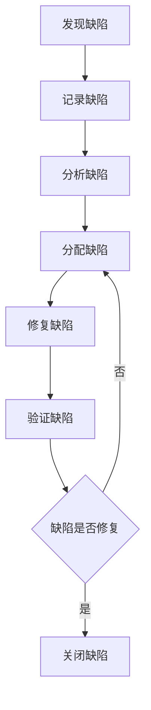

# 测试计划模板

## 1. 测试信息

| 项目名称 | 版本 | 负责人 | 最后更新 |
|---------|------|--------|----------|
| 项目名称 | v1.0.0 | 测试专家 | 2024-01-01 |

## 2. 测试概述

### 2.1 测试背景
- **项目背景**: [描述项目的背景和目标]
- **测试目的**: [描述测试的主要目的和目标]
- **测试范围**: [描述测试的范围和边界]

### 2.2 测试策略
- **测试方法**: [如：黑盒测试、白盒测试、灰盒测试]
- **测试级别**: [如：单元测试、集成测试、系统测试、验收测试]
- **测试环境**: [如：开发环境、测试环境、预生产环境]

### 2.3 术语定义

| 术语 | 解释 |
|------|------|
| 术语1 | 解释 |
| 术语2 | 解释 |

## 3. 测试计划

### 3.1 测试资源
- **人力资源**: [如：测试工程师、开发工程师、产品经理]
- **设备资源**: [如：测试服务器、测试设备、网络环境]
- **工具资源**: [如：测试管理工具、自动化测试工具、缺陷管理工具]

### 3.2 测试进度

| 阶段 | 开始日期 | 结束日期 | 主要任务 |
|------|----------|----------|----------|
| 测试计划 | YYYY-MM-DD | YYYY-MM-DD | 制定测试计划 |
| 测试设计 | YYYY-MM-DD | YYYY-MM-DD | 编写测试用例 |
| 测试执行 | YYYY-MM-DD | YYYY-MM-DD | 执行测试用例 |
| 缺陷管理 | YYYY-MM-DD | YYYY-MM-DD | 跟踪和修复缺陷 |
| 测试报告 | YYYY-MM-DD | YYYY-MM-DD | 生成测试报告 |

### 3.3 测试环境

| 环境 | 操作系统 | 浏览器 | 数据库 | 网络 |
|------|----------|--------|--------|------|
| 开发环境 | Windows 10 | Chrome 最新版 | MySQL 8.0 | 局域网 |
| 测试环境 | Linux CentOS 7 | Chrome/Firefox | MySQL 8.0 | 局域网 |
| 预生产环境 | Linux CentOS 7 | Chrome/Firefox | MySQL 8.0 | 公网 |

## 4. 测试用例设计

### 4.1 功能测试

| 测试用例ID | 测试模块 | 测试标题 | 测试步骤 | 预期结果 | 优先级 |
|-----------|----------|----------|----------|----------|--------|
| TC-001 | 模块1 | 测试标题1 | 测试步骤 | 预期结果 | P0/P1/P2 |
| TC-002 | 模块1 | 测试标题2 | 测试步骤 | 预期结果 | P0/P1/P2 |
| TC-003 | 模块2 | 测试标题3 | 测试步骤 | 预期结果 | P0/P1/P2 |

### 4.2 非功能测试

| 测试用例ID | 测试类型 | 测试标题 | 测试步骤 | 预期结果 | 优先级 |
|-----------|----------|----------|----------|----------|--------|
| NTC-001 | 性能测试 | 响应时间测试 | 测试步骤 | 预期结果 | P0/P1/P2 |
| NTC-002 | 安全测试 | 认证测试 | 测试步骤 | 预期结果 | P0/P1/P2 |
| NTC-003 | 兼容性测试 | 浏览器兼容测试 | 测试步骤 | 预期结果 | P0/P1/P2 |

### 4.3 边界测试

| 测试用例ID | 测试模块 | 测试标题 | 测试步骤 | 预期结果 | 优先级 |
|-----------|----------|----------|----------|----------|--------|
| BTC-001 | 模块1 | 边界值测试 | 测试步骤 | 预期结果 | P0/P1/P2 |
| BTC-002 | 模块2 | 异常输入测试 | 测试步骤 | 预期结果 | P0/P1/P2 |

### 4.4 回归测试

| 测试用例ID | 测试模块 | 测试标题 | 测试步骤 | 预期结果 | 优先级 |
|-----------|----------|----------|----------|----------|--------|
| RTC-001 | 模块1 | 回归测试1 | 测试步骤 | 预期结果 | P0/P1/P2 |
| RTC-002 | 模块2 | 回归测试2 | 测试步骤 | 预期结果 | P0/P1/P2 |

## 5. 缺陷管理

### 5.1 缺陷分类

| 缺陷类型 | 描述 | 示例 |
|---------|------|------|
| 功能缺陷 | 功能未实现或实现错误 | 登录功能无法正常工作 |
| 性能缺陷 | 系统性能不满足要求 | 页面加载时间超过5秒 |
| 安全缺陷 | 系统存在安全漏洞 | SQL注入漏洞 |
| 兼容性缺陷 | 系统在不同环境下表现不一致 | 在Firefox浏览器中显示异常 |
| 界面缺陷 | UI界面设计或布局问题 | 按钮位置不正确 |

### 5.2 缺陷严重程度

| 严重程度 | 描述 | 示例 |
|---------|------|------|
| 致命 | 系统无法正常运行，核心功能不可用 | 系统崩溃 |
| 严重 | 核心功能部分不可用，影响用户体验 | 登录功能失败 |
| 一般 | 非核心功能缺陷，不影响系统运行 | 界面显示错误 |
| 轻微 | 小问题，不影响系统功能 | 拼写错误 |

### 5.3 缺陷处理流程

## 6. 测试执行

### 6.1 测试执行流程

1. **测试准备**
   - 搭建测试环境
   - 准备测试数据
   - 配置测试工具

2. **测试执行**
   - 执行测试用例
   - 记录测试结果
   - 提交缺陷报告

3. **测试验证**
   - 验证缺陷修复
   - 执行回归测试
   - 确认测试完成

### 6.2 测试执行记录

| 测试用例ID | 执行日期 | 执行人员 | 测试结果 | 缺陷ID | 备注 |
|-----------|----------|----------|----------|--------|------|
| TC-001 | YYYY-MM-DD | 测试人员 | 通过/失败 | DEF-001 | 备注 |
| TC-002 | YYYY-MM-DD | 测试人员 | 通过/失败 | - | 备注 |

## 7. 测试报告

### 7.1 测试摘要
- **测试覆盖**: [如：功能覆盖90%，非功能覆盖80%]
- **测试结果**: [如：通过测试用例数/总测试用例数]
- **缺陷统计**: [如：致命缺陷0个，严重缺陷2个，一般缺陷5个]

### 7.2 详细测试结果

| 测试模块 | 测试用例数 | 通过数 | 失败数 | 通过率 | 缺陷数 |
|---------|-----------|--------|--------|--------|--------|
| 模块1 | 10 | 8 | 2 | 80% | 2 |
| 模块2 | 8 | 8 | 0 | 100% | 0 |

### 7.3 风险评估

| 风险点 | 影响程度 | 可能性 | 应对措施 |
|-------|---------|--------|----------|
| 风险1 | 影响程度 | 可能性 | 应对措施 |
| 风险2 | 影响程度 | 可能性 | 应对措施 |

### 7.4 建议与总结
- **改进建议**: [如：加强代码审查、完善测试用例]
- **测试总结**: [如：测试完成情况、发现的主要问题]

## 8. 附录

### 8.1 参考文档
- [参考文档1]
- [参考文档2]

### 8.2 测试工具
- [测试工具1]
- [测试工具2]

### 8.3 其他说明
- [其他说明1]
- [其他说明2]
