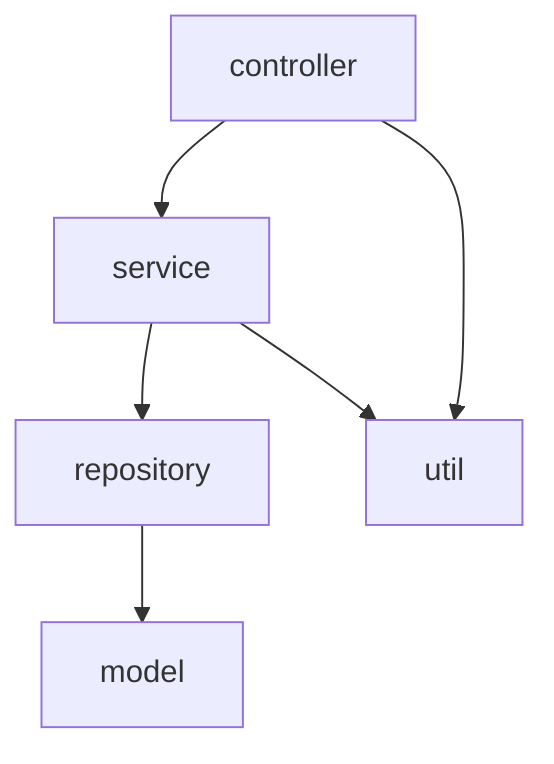

# 项目结构文档模板

> **文档类型**: 项目结构文档 (Project Structure Document)  
> **负责角色**: 架构师  
> **文档位置**: `docs/spec/PROJECT_STRUCTURE.md`

---

## 文档信息

| 项目 | 内容 |
|------|------|
| 文档名称 | 项目结构文档 |
| 项目名称 | |
| 版本号 | v1.0.0 |
| 创建日期 | YYYY-MM-DD |
| 最后更新 | YYYY-MM-DD |
| 起草人 | |
| 审核人 | |
| 状态 | 草稿/评审中/已批准/已归档 |

---

## 更新履历

| 版本 | 日期 | 更新人 | 更新内容 | 审核状态 |
|------|------|--------|----------|----------|
| v1.0.0 | YYYY-MM-DD | 起草人 | 初始版本创建 | 待审核 |
| v1.1.0 | YYYY-MM-DD | 更新人 | 更新内容描述 | 已审核 |

---

## 1. 项目概览

### 1.1 基本信息
- **项目名称**: 
- **项目路径**: 
- **项目类型**: 后端服务 / 前端应用 / 全栈应用
- **技术栈**: 

### 1.2 项目统计
- **文件数量**: 
- **目录数量**: 
- **核心模块数**: 
- **代码行数**: 

---

## 2. 目录结构

### 2.1 整体结构

```
项目根目录/
├── src/                 # 源代码目录
│   ├── main/            # 主代码
│   │   ├── java/        # Java 代码
│   │   ├── resources/   # 资源文件
│   │   └── webapp/      # Web 资源
│   └── test/            # 测试代码
│       ├── java/        # 测试代码
│       └── resources/   # 测试资源
├── docs/                # 文档目录
│   ├── spec/            # 规范文档
│   ├── architect/       # 架构师文档
│   ├── product-manager/ # 产品经理文档
│   └── test-expert/     # 测试专家文档
├── scripts/             # 脚本目录
├── config/              # 配置文件
├── target/              # 构建输出
├── pom.xml              # Maven 配置
├── build.gradle         # Gradle 配置
└── README.md            # 项目说明
```

### 2.2 模块结构

| 模块名称 | 目录路径 | 主要职责 | 依赖模块 |
|----------|----------|----------|----------|
| 模块A | src/main/java/com/example/moduleA | 描述模块职责 | 模块B, 模块C |
| 模块B | src/main/java/com/example/moduleB | 描述模块职责 | 模块C |
| 模块C | src/main/java/com/example/moduleC | 描述模块职责 | 无 |

---

## 3. 代码map

### 3.1 核心文件映射

| 文件路径 | 文件类型 | 主要功能 | 负责人 |
|----------|----------|----------|----------|
| src/main/java/com/example/Application.java | 主应用类 | 应用入口 | |
| src/main/java/com/example/config/ | 配置类 | 系统配置 | |
| src/main/java/com/example/controller/ | 控制器 | API 接口 | |
| src/main/java/com/example/service/ | 服务层 | 业务逻辑 | |
| src/main/java/com/example/repository/ | 数据访问 | 数据持久化 | |
| src/main/java/com/example/model/ | 数据模型 | 数据结构 | |
| src/main/java/com/example/util/ | 工具类 | 通用功能 | |

### 3.2 关键类映射

| 类名 | 文件路径 | 功能描述 | 依赖关系 |
|------|----------|----------|----------|
| UserController | src/main/java/com/example/controller/UserController.java | 用户相关接口 | UserService |
| UserService | src/main/java/com/example/service/UserService.java | 用户业务逻辑 | UserRepository |
| UserRepository | src/main/java/com/example/repository/UserRepository.java | 用户数据访问 | User |
| User | src/main/java/com/example/model/User.java | 用户数据模型 | 无 |

---

## 4. 架构层次

### 4.1 分层架构

| 层级 | 职责 | 技术实现 | 代表模块 |
|------|------|----------|----------|
| 表现层 | 处理 HTTP 请求 | Spring MVC | controller 包 |
| 业务层 | 实现业务逻辑 | Spring Service | service 包 |
| 数据层 | 数据持久化 | Spring Data JPA | repository 包 |
| 模型层 | 数据结构定义 | Java POJO | model 包 |
| 工具层 | 通用功能 | 自定义工具类 | util 包 |

### 4.2 模块依赖关系



---

## 5. 核心组件

### 5.1 入口组件
| 组件名称 | 文件路径 | 功能描述 | 启动方式 |
|----------|----------|----------|----------|
| Application | src/main/java/com/example/Application.java | 应用入口 | main 方法 |
| ServletInitializer | src/main/java/com/example/ServletInitializer.java | Web 应用初始化 | Tomcat 启动 |

### 5.2 配置组件
| 配置名称 | 文件路径 | 功能描述 | 生效方式 |
|----------|----------|----------|----------|
| ApplicationConfig | src/main/java/com/example/config/ApplicationConfig.java | 应用配置 | Spring 自动加载 |
| DatabaseConfig | src/main/java/com/example/config/DatabaseConfig.java | 数据库配置 | Spring 自动加载 |
| SecurityConfig | src/main/java/com/example/config/SecurityConfig.java | 安全配置 | Spring 自动加载 |

### 5.3 业务组件
| 组件名称 | 文件路径 | 功能描述 | 调用方式 |
|----------|----------|----------|----------|
| UserService | src/main/java/com/example/service/UserService.java | 用户管理 | 依赖注入 |
| OrderService | src/main/java/com/example/service/OrderService.java | 订单管理 | 依赖注入 |
| ProductService | src/main/java/com/example/service/ProductService.java | 产品管理 | 依赖注入 |

---

## 6. 技术栈

### 6.1 核心技术
| 技术 | 版本 | 用途 | 配置文件 |
|------|------|------|----------|
| Java | 21 | 开发语言 | pom.xml |
| Spring Boot | 3.2+ | 应用框架 | pom.xml |
| Spring MVC | 6.0+ | Web 框架 | 自动配置 |
| Spring Data JPA | 3.2+ | ORM 框架 | pom.xml |
| MySQL | 8.0+ | 数据库 | application.yml |
| Redis | 7.0+ | 缓存 | application.yml |

### 6.2 工具库
| 工具 | 版本 | 用途 | 配置文件 |
|------|------|------|----------|
| Lombok | 1.18+ | 代码简化 | pom.xml |
| MapStruct | 1.5+ | 对象映射 | pom.xml |
| Springdoc | 2.0+ | API 文档 | pom.xml |
| JUnit 5 | 5.10+ | 单元测试 | pom.xml |
| Testcontainers | 1.19+ | 集成测试 | pom.xml |

---

## 7. 配置管理

### 7.1 配置文件
| 配置文件 | 路径 | 用途 | 环境 |
|----------|------|------|------|
| application.yml | src/main/resources/ | 主配置文件 | 通用 |
| application-dev.yml | src/main/resources/ | 开发环境配置 | 开发 |
| application-test.yml | src/main/resources/ | 测试环境配置 | 测试 |
| application-prod.yml | src/main/resources/ | 生产环境配置 | 生产 |

### 7.2 环境变量
| 环境变量 | 用途 | 默认值 | 说明 |
|----------|------|--------|------|
| DB_URL | 数据库连接地址 | jdbc:mysql://localhost:3306/db | 生产环境需配置 |
| DB_USERNAME | 数据库用户名 | root | 生产环境需配置 |
| DB_PASSWORD | 数据库密码 | password | 生产环境需配置 |
| REDIS_URL | Redis 连接地址 | redis://localhost:6379 | 生产环境需配置 |

---

## 8. 构建与部署

### 8.1 构建流程
1. **代码编译**: `mvn compile`
2. **单元测试**: `mvn test`
3. **打包**: `mvn package`
4. **部署**: `java -jar target/app.jar`

### 8.2 部署架构
| 环境 | 配置 | 部署方式 | 访问地址 |
|------|------|----------|----------|
| 开发 | 2C4G | 本地运行 | http://localhost:8080 |
| 测试 | 4C8G | Docker 容器 | http://test.example.com |
| 预发 | 8C16G | Kubernetes | http://staging.example.com |
| 生产 | 16C32G | Kubernetes | http://api.example.com |

---

## 9. 开发指南

### 9.1 开发环境
- **JDK**: Java 21
- **IDE**: IntelliJ IDEA / Eclipse
- **构建工具**: Maven / Gradle
- **版本控制**: Git

### 9.2 编码规范
- **代码风格**: 遵循 Google Java Style Guide
- **命名规范**: 类名 UpperCamelCase，方法名 lowerCamelCase
- **注释规范**: Javadoc 注释
- **提交规范**: 遵循 Conventional Commits

### 9.3 常用命令
| 命令 | 用途 | 说明 |
|------|------|------|
| `mvn clean` | 清理构建产物 | 删除 target 目录 |
| `mvn compile` | 编译代码 | 生成 class 文件 |
| `mvn test` | 运行单元测试 | 执行测试用例 |
| `mvn package` | 打包应用 | 生成 jar 文件 |
| `mvn spring-boot:run` | 运行应用 | 启动开发服务器 |

---

## 10. 附录

### 10.1 目录说明
| 目录 | 用途 | 权限 |
|------|------|------|
| src/ | 源代码 | 开发人员可修改 |
| docs/ | 文档 | 所有人员可访问 |
| scripts/ | 脚本 | 开发人员可修改 |
| config/ | 配置 | 运维人员可修改 |

### 10.2 注意事项
- **代码组织**: 按功能模块分包，避免包依赖循环
- **配置管理**: 敏感配置使用环境变量，避免硬编码
- **依赖管理**: 统一管理依赖版本，避免版本冲突
- **文档更新**: 代码变更后及时更新相关文档

---

**文档结束**

> 本文档由架构师创建和维护，任何修改必须更新版本号和更新履历。