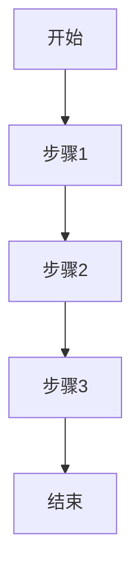
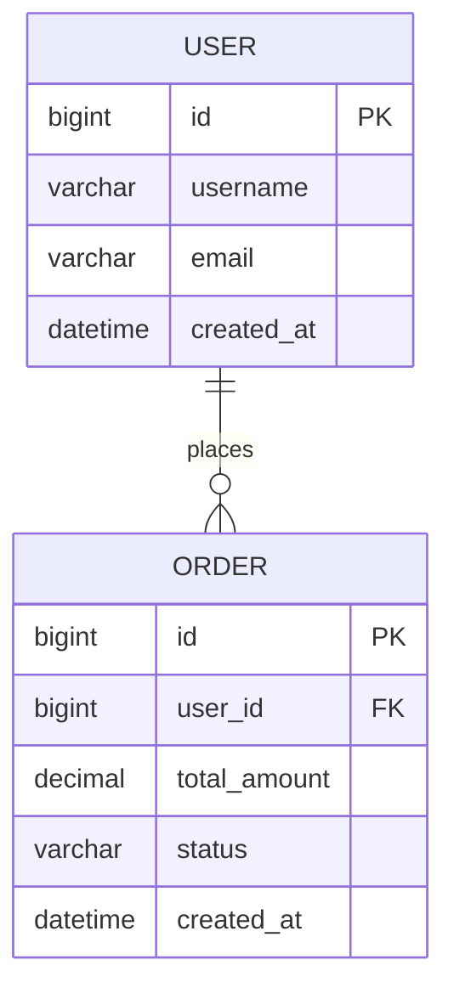

# 项目规范模板

> **文档类型**: 项目规范 (Project Specification)  
> **负责角色**: 多角色共识  
> **文档位置**: `docs/spec/SPEC.md`

---

## 文档信息

| 项目 | 内容 |
|------|------|
| 文档名称 | 项目规范 |
| 项目名称 | |
| 版本号 | v1.0.0 |
| 创建日期 | YYYY-MM-DD |
| 最后更新 | YYYY-MM-DD |
| 起草人 | |
| 审核人 | |
| 状态 | 草稿/评审中/已批准/已归档 |

---

## 更新履历

| 版本 | 日期 | 更新人 | 更新内容 | 审核状态 |
|------|------|--------|----------|----------|
| v1.0.0 | YYYY-MM-DD | 起草人 | 初始版本创建 | 待审核 |
| v1.1.0 | YYYY-MM-DD | 更新人 | 更新内容描述 | 已审核 |

---

## 1. 项目概述

### 1.1 项目背景
- **业务背景**: 描述项目的业务背景和业务价值
- **技术背景**: 描述技术选型的背景和约束条件
- **项目目标**: 明确项目的核心目标和成功标准

### 1.2 范围定义
- **包含范围**: 明确包含在规范中的功能和模块
- **排除范围**: 明确不包含在规范中的功能和模块
- **边界定义**: 系统与外部系统的边界

---

## 2. 功能需求

### 2.1 功能列表

| 功能ID | 功能名称 | 功能描述 | 优先级 | 所属模块 | 状态 |
|--------|----------|----------|--------|----------|------|
| F-001 | 功能名称 | 详细描述功能的具体内容 | P0 | 模块名称 | 待实现 |
| F-002 | 功能名称 | 详细描述功能的具体内容 | P1 | 模块名称 | 待实现 |
| F-003 | 功能名称 | 详细描述功能的具体内容 | P1 | 模块名称 | 待实现 |

### 2.2 功能详情

#### F-001: 功能名称

**功能概述**
- **功能目标**: 功能要实现的目标
- **用户价值**: 为用户带来的价值
- **业务价值**: 为业务带来的价值

**业务流程**

**输入/输出**
- **输入**: 功能需要的输入参数
- **输出**: 功能产生的输出结果
- **异常处理**: 异常情况下的处理逻辑

**验收标准**
- **功能验收**: 功能是否符合要求
- **性能验收**: 性能是否达到要求
- **安全验收**: 安全是否符合要求

---

## 3. 非功能需求

### 3.1 性能需求
| 需求项 | 需求描述 | 指标要求 | 测试方法 |
|--------|----------|----------|----------|
| 响应时间 | 接口响应时间 | P99 < 200ms | 压力测试 |
| 吞吐量 | 系统处理能力 | QPS > 1000 | 负载测试 |
| 并发数 | 支持并发用户数 | 1000 用户 | 并发测试 |

### 3.2 安全需求
| 需求项 | 需求描述 | 实现方式 | 验收标准 |
|--------|----------|----------|----------|
| 认证授权 | 用户认证和授权 | OAuth2 | 安全测试 |
| 数据加密 | 敏感数据加密 | AES-256 | 安全审计 |
| 输入验证 | 输入参数验证 | 服务器端验证 | 渗透测试 |

### 3.3 可靠性需求
| 需求项 | 需求描述 | 指标要求 | 测试方法 |
|--------|----------|----------|----------|
| 可用性 | 系统可用时间 | 99.99% | 可靠性测试 |
| 容错性 | 系统容错能力 | 自动恢复 | 故障注入测试 |
| 数据一致性 | 数据一致性保证 | 最终一致 | 一致性测试 |

---

## 4. 技术规范

### 4.1 技术栈
| 技术领域 | 选型 | 版本 | 选型理由 |
|----------|------|------|----------|
| 语言 | Java | 21 (LTS) | 虚拟线程、Record 等新特性 |
| 框架 | Spring Boot | 3.2+ | 云原生支持、可观测性增强 |
| 数据库 | MySQL | 8.0+ | 稳定可靠、生态完善 |
| 缓存 | Redis | 7.x | 高性能、功能丰富 |
| 消息队列 | Kafka | 3.x | 高吞吐、可靠性高 |

### 4.2 架构设计
**架构风格**: 微服务架构 / 单体架构 / 集成式架构

**模块划分**:
| 模块名称 | 模块职责 | 技术实现 | 依赖关系 |
|----------|----------|----------|----------|
| 模块A | 描述模块职责 | 技术选型 | 依赖模块 |
| 模块B | 描述模块职责 | 技术选型 | 依赖模块 |

**接口设计**:
| 接口名称 | URL | 方法 | 请求参数 | 响应参数 | 状态码 |
|----------|------|------|----------|----------|--------|
| 接口名称 | /api/endpoint | GET | 参数列表 | 返回结构 | 200/400/500 |

---

## 5. 数据规范

### 5.1 数据模型

### 5.2 数据存储
| 数据类型 | 存储方式 | 存储位置 | 备份策略 |
|----------|----------|----------|----------|
| 用户数据 | 关系型数据库 | MySQL | 每日备份 |
| 缓存数据 | 内存数据库 | Redis | 持久化 |
| 日志数据 | 日志系统 | ELK | 7天保留 |

### 5.3 数据安全
| 数据类型 | 安全措施 | 实现方式 | 验证方法 |
|----------|----------|----------|----------|
| 敏感数据 | 加密存储 | AES-256 | 安全审计 |
| 个人信息 | 脱敏处理 | 掩码处理 | 合规检查 |
| 访问控制 | 权限管理 | RBAC | 权限测试 |

---

## 6. 测试规范

### 6.1 测试策略
- **测试金字塔**: 单元测试 70%，集成测试 20%，端到端测试 10%
- **测试环境**: 开发、测试、预发、生产
- **测试工具**: JUnit 5, Testcontainers, Pact, Playwright

### 6.2 测试用例
| 用例ID | 用例名称 | 测试场景 | 预期结果 | 优先级 |
|--------|----------|----------|----------|--------|
| TC-001 | 功能测试 | 正常场景 | 功能正常 | P0 |
| TC-002 | 异常测试 | 异常场景 | 处理正确 | P1 |
| TC-003 | 边界测试 | 边界场景 | 处理正确 | P1 |

---

## 7. 部署与运维

### 7.1 部署架构
**部署环境**:
| 环境 | 配置 | 用途 |
|------|------|------|
| 开发 | 2C4G | 开发测试 |
| 测试 | 4C8G | 功能测试 |
| 预发 | 8C16G | 上线前验证 |
| 生产 | 16C32G | 正式服务 |

**部署流程**:
1. 代码提交 → 2. CI 构建 → 3. 测试 → 4. 部署到预发 → 5. 验证 → 6. 部署到生产

### 7.2 监控与告警
| 监控项 | 监控指标 | 告警阈值 | 处理方式 |
|--------|----------|----------|----------|
| 系统负载 | CPU/内存使用率 | > 80% | 告警通知 |
| 响应时间 | API 响应时间 | > 500ms | 告警通知 |
| 错误率 | 错误请求比例 | > 1% | 告警通知 |

---

## 8. 项目计划

### 8.1 里程碑
| 里程碑 | 时间 | 交付物 | 状态 |
|--------|------|--------|------|
| 需求分析 | YYYY-MM-DD | PRD 文档 | 待完成 |
| 架构设计 | YYYY-MM-DD | 架构设计文档 | 待完成 |
| 开发完成 | YYYY-MM-DD | 功能代码 | 待完成 |
| 测试完成 | YYYY-MM-DD | 测试报告 | 待完成 |
| 上线发布 | YYYY-MM-DD | 生产环境 | 待完成 |

### 8.2 资源需求
| 资源类型 | 数量 | 技能要求 | 职责 |
|----------|------|----------|------|
| 架构师 | 1 | 10+ 年经验 | 技术架构设计 |
| 产品经理 | 1 | 5+ 年经验 | 需求管理 |
| 测试专家 | 1 | 5+ 年经验 | 质量保障 |
| 开发者 | 3 | 3+ 年经验 | 代码实现 |

---

## 9. 附录

### 9.1 参考资料
- [PRD 文档](链接)
- [架构设计文档](链接)
- [测试计划](链接)

### 9.2 术语表
| 术语 | 定义 |
|------|------|
| 微服务 | 独立部署的服务单元 |
| 容器化 | 使用 Docker 容器部署 |
| 持续集成 | 代码提交后自动构建测试 |

---

**文档结束**

> 本文档由多角色共同制定，任何修改必须经过多角色共识。