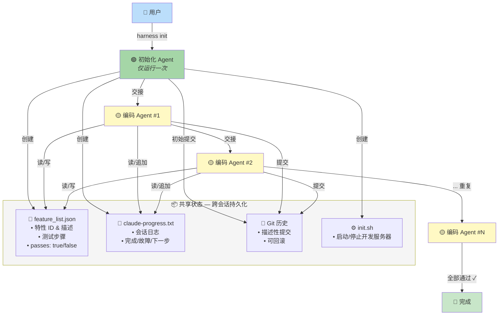
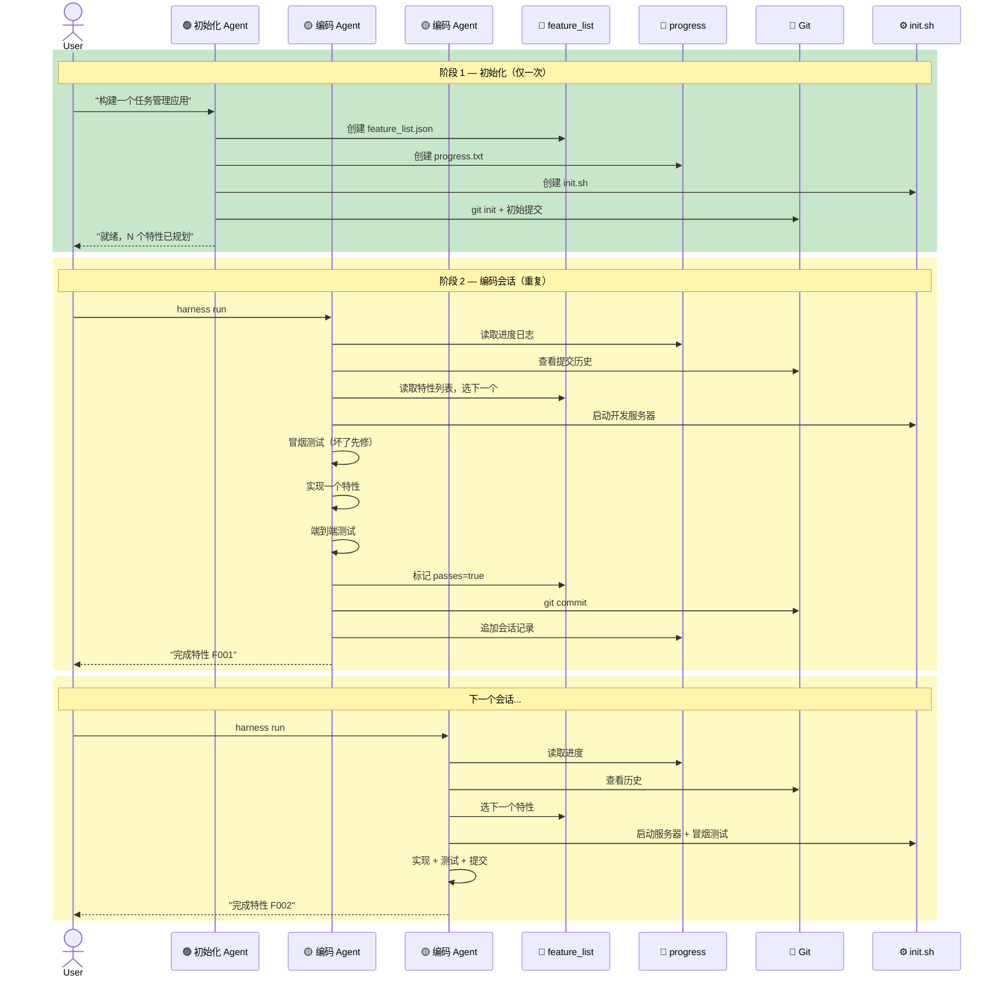
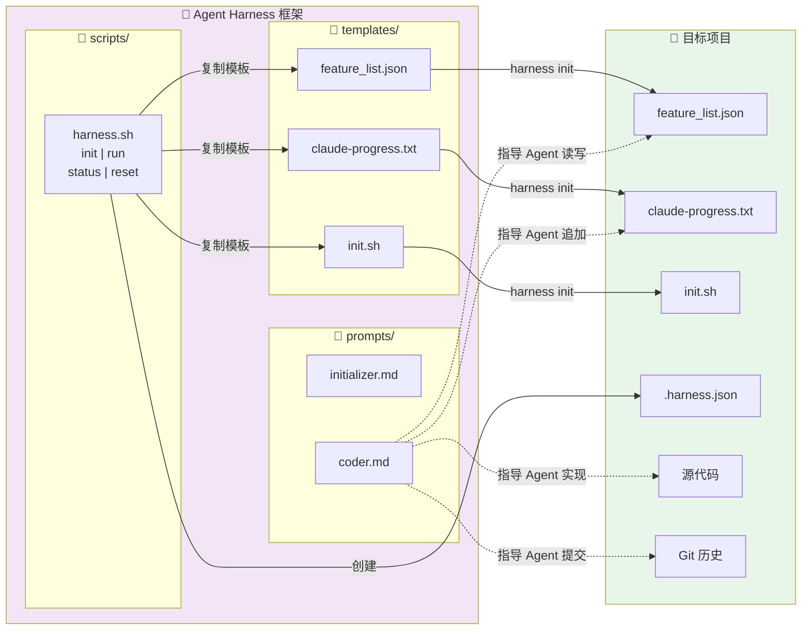

# Agent Harness Framework

基于 [Anthropic 工程博客 — Effective Harnesses for Long-Running Agents](https://www.anthropic.com/engineering/effective-harnesses-for-long-running-agents) 的长周期 Agent 自动化编码框架。

解决的核心问题：**AI Agent 如何在多个上下文窗口（context window）之间持续、稳定地推进复杂项目？**

---

## 原理

### 问题

让 AI Agent 构建一个完整应用时，常见的失败模式：

| 问题 | 表现 |
|------|------|
| 一次做太多 | Agent 试图一次性写完整个应用，context 耗尽后留下半成品 |
| 过早宣告完成 | 看到"差不多"就宣布完工，实际大量功能缺失 |
| 不测试就标记完成 | 代码写了就标 done，端到端根本跑不通 |
| 会话间无记忆 | 新 session 从零开始，不知道上一个 session 做了什么 |
| 环境残留 bug | 上次留下的 bug 没修，新功能叠加上去更糟 |

### 解决方案：两阶段 Agent + 共享状态

核心思想：**像交接班的工程师团队一样工作**——每个 Agent 上班先读交接日志，做完一个任务后写清楚交接再下班。

```
┌─────────────┐     ┌──────────────┐     ┌──────────────┐
│  Initializer │────▶│ Coding Agent │────▶│ Coding Agent │ ──▶ ...
│  (运行一次)   │     │  Session #1  │     │  Session #2  │
└─────────────┘     └──────────────┘     └──────────────┘
      │                    │                     │
      ▼                    ▼                     ▼
┌─────────────────────────────────────────────────────────┐
│                    共享状态 (跨会话持久化)                  │
│  feature_list.json  │  claude-progress.txt  │  Git 历史  │
└─────────────────────────────────────────────────────────┘
```

**三个关键机制：**

1. **Feature List（特性列表）** — 把项目拆成一个个可独立验证的小特性，全标为 `passes: false`，做完一个标记一个，避免"差不多就完事"
2. **Progress File（进度文件）** — 每个 session 结束时记录做了什么、什么能用、什么坏了、下一步是什么，下一个 Agent 上来先读这个
3. **Git History（提交历史）** — 每次改动都 commit，坏了可以 revert，新 Agent 通过 `git log` 快速了解历史

---

## 架构总览



---

## 会话流程

每个编码 session 的标准操作流程：



---

## 文件关系

框架组件与目标项目之间的映射：



---

## 项目结构

```
agent-harness/
├── README.md                          # 本文件
├── SKILL.md                           # Claude Code Skill 文档
├── skill.json                         # Skill 配置
├── templates/                         # 模板文件
│   ├── feature_list.json              #   特性跟踪模板
│   ├── claude-progress.txt            #   进度日志模板
│   └── init.sh                        #   开发服务器脚本模板
├── prompts/                           # Agent 提示词
│   ├── initializer.md                 #   初始化 Agent 提示词
│   └── coder.md                       #   编码 Agent 提示词
├── scripts/                           # 自动化脚本
│   └── harness.sh                     #   主控脚本
└── docs/                              # 文档 & 图表
    ├── architecture.md                #   架构总览图
    ├── sequence.md                    #   会话时序图
    ├── file-flow.md                   #   文件关系图
    ├── architecture.puml              #   PlantUML 源文件
    ├── sequence.puml
    └── file-flow.puml
```

---

## 快速开始

### 1. 初始化项目

```bash
# 在你的项目目录下运行
cd /path/to/your/project
/path/to/agent-harness/scripts/harness.sh init "构建一个任务管理应用，支持创建、编辑、删除任务"
```

这会在你的项目中创建：
- `feature_list.json` — 特性列表
- `claude-progress.txt` — 进度日志
- `init.sh` — 开发服务器脚本
- `.harness.json` — 框架配置

### 2. 用初始化 Agent 生成完整特性列表

将 `prompts/initializer.md` 的内容复制给 Claude，附上你的项目描述。Agent 会：
- 把项目拆解成 15-50+ 个可独立验证的特性
- 创建项目骨架和依赖
- 做第一次 git commit

### 3. 编码 Agent 增量推进

每个 session 用 `prompts/coder.md` 启动 Claude：

```bash
# 查看当前进度
./scripts/harness.sh status
```

每个 session 的标准流程：
1. 读进度文件 + git 历史
2. 选下一个未完成的特性
3. 启动开发服务器 + 冒烟测试
4. 实现一个特性 + 端到端测试
5. 提交代码 + 更新进度文件

### 4. 持续推进直到完成

重复步骤 3，直到所有特性都标记为 `passes: true`。

---

## 作为 Claude Code Skill 使用

本项目也可作为 Claude Code 的 Skill 集成，提供以下命令：

| 命令 | 说明 |
|------|------|
| `harness init <desc>` | 初始化新项目 |
| `harness run` | 开始编码会话 |
| `harness status` | 查看进度 |
| `harness feature <desc>` | 添加新特性 |
| `harness commit` | 提交并更新进度 |
| `harness reset` | 重置框架 |

---

## 核心原则

1. **增量推进** — 每次 session 只做一个特性，不贪多
2. **端到端验证** — 像人类用户一样测试，不只看单元测试
3. **干净交接** — 每次离开时代码状态等同于可合并到 main
4. **持久状态** — feature_list + progress + git 三重状态桥接上下文窗口
5. **先修后建** — 如果已有功能坏了，先修再开发新功能

---

## 参考

- [Anthropic — Effective Harnesses for Long-Running Agents](https://www.anthropic.com/engineering/effective-harnesses-for-long-running-agents)
- [Claude Agent SDK](https://github.com/anthropics/claude-agent-sdk)
- [Claude 4 Prompting Guide](https://docs.anthropic.com/en/docs/about-claude/models)
