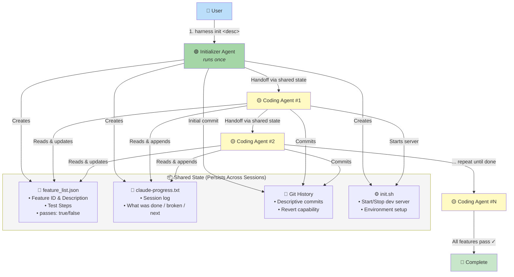

# Agent Harness — Architecture Overview
> Based on Anthropic's "Effective Harnesses for Long-Running Agents"

## Failure Modes & Solutions

| Problem | Initializer Agent | Coding Agent |
|---------|------------------|--------------|
| Declares victory too early | Set up comprehensive feature_list.json | Read feature list, pick ONE feature per session |
| Leaves broken state | Create progress file + git repo | Read progress + git log, smoke test first, fix before build |
| Marks features done without testing | Define concrete test steps | Self-verify end-to-end before marking passes=true |
| Doesn't know how to run app | Write init.sh | Read init.sh at session start |
