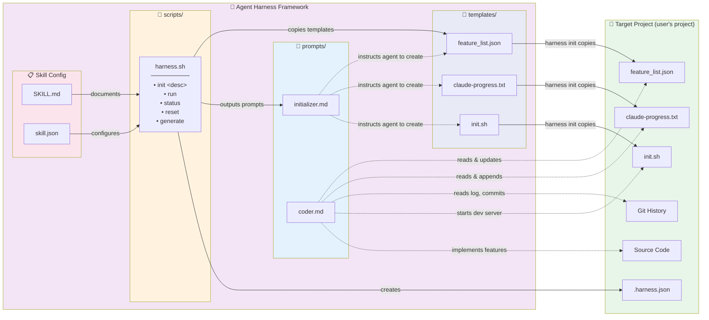

# Agent Harness — File & Component Relationships

```mermaid
graph LR
    subgraph HARNESS["🔧 Agent Harness Framework"]
        subgraph TEMPLATES["📁 templates/"]
            tmpl_fl["feature_list.json"]
            tmpl_cp["claude-progress.txt"]
            tmpl_init["init.sh"]
        end

        subgraph PROMPTS["📁 prompts/"]
            prompt_init["initializer.md"]
            prompt_coder["coder.md"]
        end

        subgraph SCRIPTS["📁 scripts/"]
            harness["harness.sh<br/>─────────<br/>• init &lt;desc&gt;<br/>• run<br/>• status<br/>• reset<br/>• generate"]
        end

        subgraph SKILL["📋 Skill Config"]
            skill_md["SKILL.md"]
            skill_json["skill.json"]
        end
    end

    subgraph TARGET["🎯 Target Project (user's project)"]
        live_fl["feature_list.json"]
        live_cp["claude-progress.txt"]
        live_init["init.sh"]
        live_config[".harness.json"]
        code["Source Code"]
        git_history["Git History"]
    end

    harness -->|copies templates| tmpl_fl
    harness -->|outputs prompts| prompt_init

    prompt_init -.->|instructs agent to create| tmpl_fl
    prompt_init -.->|instructs agent to create| tmpl_cp
    prompt_init -.->|instructs agent to create| tmpl_init

    prompt_coder -.->|reads & updates| live_fl
    prompt_coder -.->|reads & appends| live_cp
    prompt_coder -.->|reads log, commits| git_history
    prompt_coder -.->|starts dev server| live_init
    prompt_coder -.->|implements features| code

    tmpl_fl -->|harness init copies| live_fl
    tmpl_cp -->|harness init copies| live_cp
    tmpl_init -->|harness init copies| live_init

    harness -->|creates| live_config
    skill_md -->|documents| harness
    skill_json -->|configures| harness

    style HARNESS fill:#f3e5f5
    style TARGET fill:#e8f5e9
    style TEMPLATES fill:#e8eaf6
    style PROMPTS fill:#e3f2fd
    style SCRIPTS fill:#fff3e0
    style SKILL fill:#fce4ec
```
