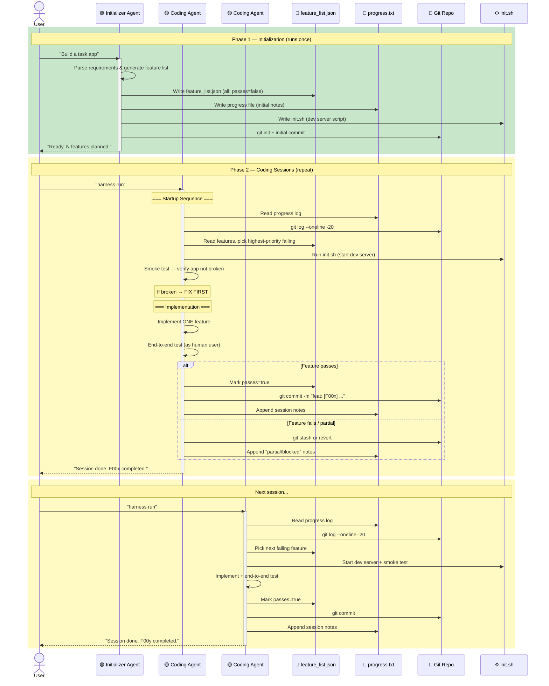

# Agent Harness — Session Sequence Diagram

```mermaid
sequenceDiagram
    actor User
    participant Init as 🟢 Initializer Agent
    participant C1 as 🟡 Coding Agent #1
    participant C2 as 🟡 Coding Agent #2
    participant FL as 📄 feature_list.json
    participant CP as 📝 progress.txt
    participant Git as 🔀 Git Repo
    participant Srv as ⚙️ init.sh

    rect rgb(200, 230, 201)
        Note over User, Srv: Phase 1 — Initialization (runs once)
        User->>Init: "Build a task app"
        activate Init
        Init->>Init: Parse requirements & generate feature list
        Init->>FL: Write feature_list.json (all: passes=false)
        Init->>CP: Write progress file (initial notes)
        Init->>Srv: Write init.sh (dev server script)
        Init->>Git: git init + initial commit
        Init-->>User: "Ready. N features planned."
        deactivate Init
    end

    rect rgb(255, 249, 196)
        Note over User, Srv: Phase 2 — Coding Sessions (repeat)
        User->>C1: "harness run"
        activate C1

        Note over C1: === Startup Sequence ===
        C1->>CP: Read progress log
        C1->>Git: git log --oneline -20
        C1->>FL: Read features, pick highest-priority failing
        C1->>Srv: Run init.sh (start dev server)
        C1->>C1: Smoke test — verify app not broken

        Note over C1: If broken → FIX FIRST

        Note over C1: === Implementation ===
        C1->>C1: Implement ONE feature
        C1->>C1: End-to-end test (as human user)

        alt Feature passes
            C1->>FL: Mark passes=true
            C1->>Git: git commit -m "feat: [F00x] ..."
            C1->>CP: Append session notes
        else Feature fails / partial
            C1->>Git: git stash or revert
            C1->>CP: Append "partial/blocked" notes
        end

        C1-->>User: "Session done. F00x completed."
        deactivate C1
    end

    rect rgb(255, 249, 196)
        Note over User, Srv: Next session...
        User->>C2: "harness run"
        activate C2
        C2->>CP: Read progress log
        C2->>Git: git log --oneline -20
        C2->>FL: Pick next failing feature
        C2->>Srv: Start dev server + smoke test
        C2->>C2: Implement + end-to-end test
        C2->>FL: Mark passes=true
        C2->>Git: git commit
        C2->>CP: Append session notes
        C2-->>User: "Session done. F00y completed."
        deactivate C2
    end
```
