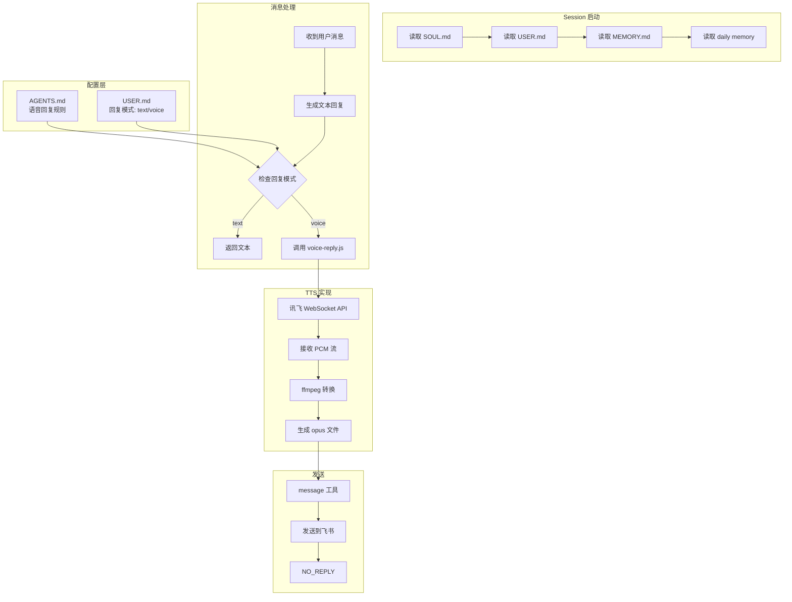

# 语音回复流程图

## 整体架构

```
┌─────────────────────────────────────────────────────────────────────┐
│                          配置层 (Workspace)                          │
├─────────────────────────────────────────────────────────────────────┤
│                                                                     │
│   AGENTS.md                    USER.md                              │
│   ┌─────────────────┐         ┌─────────────────┐                  │
│   │ Voice Reply     │         │ 回复模式: text  │                  │
│   │ - 检查模式      │◄────────│ 或 voice        │                  │
│   │ - 调用脚本      │  读取   └─────────────────┘                  │
│   │ - 发送音频      │                                                  │
│   └─────────────────┘                                              │
│                                                                     │
└─────────────────────────────────────────────────────────────────────┘
                                 │
                                 ▼
┌─────────────────────────────────────────────────────────────────────┐
│                        Session 启动流程                              │
├─────────────────────────────────────────────────────────────────────┤
│                                                                     │
│   1. 读取 SOUL.md    → 知道自己是谁                                 │
│   2. 读取 USER.md    → 知道用户偏好（回复模式）                      │
│   3. 读取 MEMORY.md  → 长期记忆                                    │
│   4. 读取 memory/YYYY-MM-DD.md → 最近记忆                          │
│                                                                     │
└─────────────────────────────────────────────────────────────────────┘
                                 │
                                 ▼
┌─────────────────────────────────────────────────────────────────────┐
│                        消息处理流程                                  │
├─────────────────────────────────────────────────────────────────────┤
│                                                                     │
│   用户消息 ──► 生成文本回复 ──► 检查回复模式                         │
│                                      │                              │
│                         ┌────────────┴────────────┐                 │
│                         ▼                         ▼                 │
│                    回复模式: text            回复模式: voice         │
│                         │                         │                 │
│                         ▼                         ▼                 │
│                   直接返回文本              调用 voice-reply.js      │
│                                                    │                 │
│                                                    ▼                 │
│                                            ┌──────────────┐          │
│                                            │ message 工具  │          │
│                                            │ 发送 opus     │          │
│                                            └──────────────┘          │
│                                                    │                 │
│                                                    ▼                 │
│                                             返回 NO_REPLY            │
│                                                                     │
└─────────────────────────────────────────────────────────────────────┘
                                 │
                                 ▼
┌─────────────────────────────────────────────────────────────────────┐
│                     voice-reply.js 内部流程                          │
├─────────────────────────────────────────────────────────────────────┤
│                                                                     │
│   输入: 文本内容                                                    │
│         │                                                           │
│         ▼                                                           │
│   ┌─────────────────┐                                               │
│   │ 讯飞 TTS API    │  WebSocket 连接                               │
│   │ - aue: raw      │  流式接收 PCM 数据                            │
│   │ - vcn: x4_xiaoyan│  (默认音色)                                  │
│   └─────────────────┘                                               │
│         │                                                           │
│         ▼                                                           │
│   ┌─────────────────┐                                               │
│   │ ffmpeg 转换     │  PCM → Opus                                   │
│   │ - libopus       │  24kbps, 24kHz                                │
│   └─────────────────┘                                               │
│         │                                                           │
│         ▼                                                           │
│   输出: voice_reply.opus                                            │
│         │                                                           │
│         ▼                                                           │
│   打印: VOICE_READY:/path/to/voice_reply.opus                       │
│                                                                     │
└─────────────────────────────────────────────────────────────────────┘
                                 │
                                 ▼
┌─────────────────────────────────────────────────────────────────────┐
│                        模式切换流程                                  │
├─────────────────────────────────────────────────────────────────────┤
│                                                                     │
│   用户说 "用语音"                                                   │
│        │                                                            │
│        ▼                                                            │
│   编辑 USER.md                                                      │
│   回复模式: text → voice                                            │
│        │                                                            │
│        ▼                                                            │
│   后续消息使用语音回复                                              │
│                                                                     │
│   ──────────────────────────────────────────                       │
│                                                                     │
│   用户说 "用文字"                                                   │
│        │                                                            │
│        ▼                                                            │
│   编辑 USER.md                                                      │
│   回复模式: voice → text                                            │
│        │                                                            │
│        ▼                                                            │
│   后续消息使用文字回复                                              │
│                                                                     │
└─────────────────────────────────────────────────────────────────────┘
```

## Mermaid 流程图



## 关键设计点

### 1. 配置驱动
- 行为规则写在 AGENTS.md，不是硬编码
- 用户偏好写在 USER.md，运行时可改
- 分离关注点：框架规则 vs 个人偏好

### 2. 模块化
```
AGENTS.md      → "做什么"（策略）
voice-reply.js → "怎么做"（实现）
message 工具   → "发送渠道"（传输）
```

### 3. 状态持久化
- 模式切换直接修改 USER.md
- 下次 session 自动读取最新状态
- 无需额外存储机制

### 4. 错误处理
- TTS 超时 → 降级到文字回复
- 文件生成失败 → 提示用户
- 发送失败 → 重试或降级
