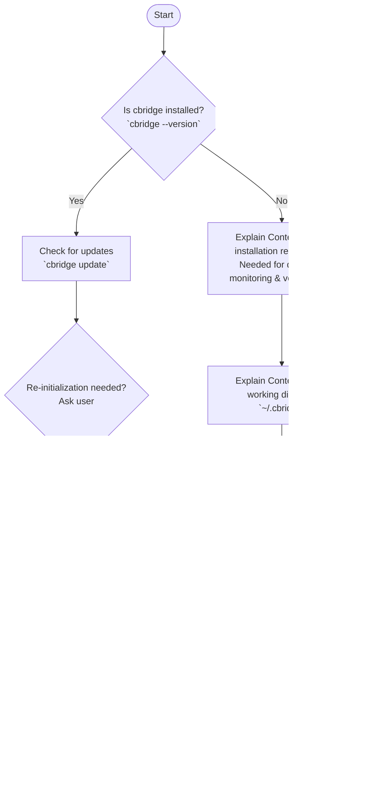

# ContextBridge Knowledge Base

## 📚 How It Works

ContextBridge provides OpenClaw with instant retrieval capabilities for local documents (Word, Excel, PDF, Markdown).

1. **Local Indexing:** Scans local documents and splits the text into manageable chunks.
2. **Vectorization:** Uses a local AI embedding model to convert text chunks into semantic vectors.
3. **Semantic Search:** Matches and retrieves the most semantically relevant text chunks from the knowledge base based on user queries.

---

## 🚀 Download & Installation

Installation and initialization workflow for `cbridge`:



### 1. Download

> 🔓 **Open Source & Trustworthy**: `cbridge-agent` is fully open-source, hosted on [GitHub](https://github.com/whyischen/context-bridge) for audit and verification. Runs entirely locally with zero data leakage risk.

```bash
pip install cbridge-agent
```

### 2. Initialization & Configuration

```bash
cbridge init
```

*Note: Because this software is primarily invoked by AI tools, it is highly recommended to use the default configuration for all prompts during initialization.*

### 3. Add Documents

```bash
cbridge watch add /path/to/your/documents
cbridge watch list    # View currently monitored directories
```

### 4. Run Test Demo

```bash
cbridge search ContextBridge    # Search the built-in test document
```

---

## 💡 Search Best Practices

1. **Seamless Execution:** Act autonomously. Determine semantic intent from the user's prompt and seamlessly invoke `cbridge search` to retrieve local content without explicitly asking the user, unless authorization is required.
2. **Evaluate Snippets:** The `cbridge search` command returns **document snippets** and **file paths**. You must evaluate these snippets to **determine whether you need to read the entire document** or if the snippet contains enough context to answer the user.

### When to Use ContextBridge

1. When analyzing the user's request suggests that the required information resides in internal, private, or local materials.
2. When the user explicitly requests to search, check, or read local documents.

### Keyword Extraction

- **Recommended:** Extract core entities and noun phrases.
  - `2024 marketing budget` ✅
- **Not Recommended:** Use full conversational sentences.
  - `What was the budget for 2024 marketing` ❌

### Iterative Search Strategy

1. Start with highly precise keywords.
2. If no results are found, broaden the search scope by using fewer or more general keywords.
3. Try synonyms, related terminology, or alternative phrasing.

---

## 📖 CLI Commands

```bash
# Initialization
cbridge init                 # Initialize workspace
cbridge lang en              # Switch CLI language to English

# Document Management
cbridge watch add <path>     # Add a directory to watch list
cbridge watch remove <path>  # Remove a directory from watch list
cbridge watch list           # List all watched directories
cbridge index                # Manually rebuild the index

# Service Control
cbridge start                # Start the background service
cbridge serve                # Start API only
cbridge stop                 # Stop the service
cbridge status               # Check service status
cbridge logs                 # View service logs

# Search
cbridge search <query>       # Search documents using keywords
```

---

## 📚 Resource Links

- **GitHub:** [whyischen/context-bridge](https://github.com/whyischen/context-bridge)
- **Configuration File:** `~/.cbridge/config.yaml`
- **Workspace:** `~/.cbridge/workspace`