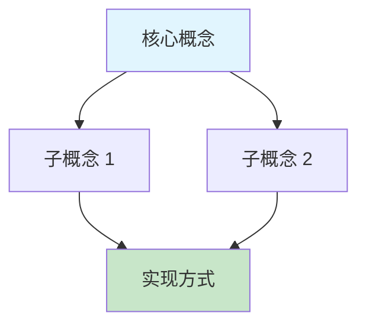
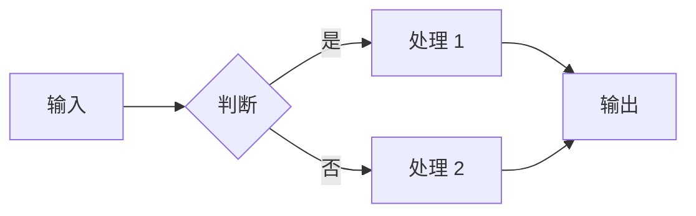
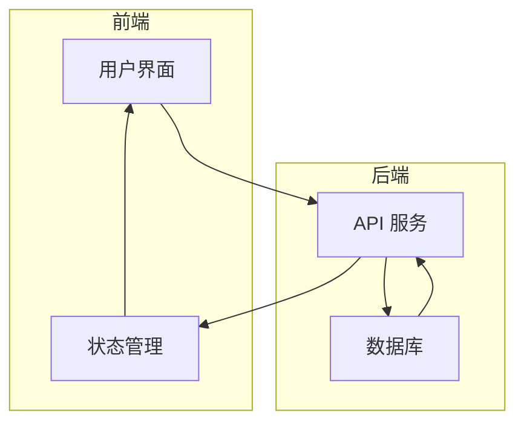
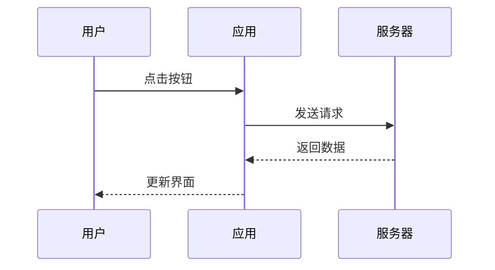
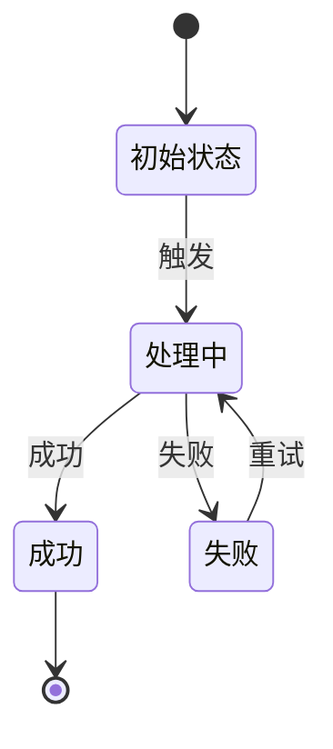

# 图解设计指南

## Mermaid 图类型选择

| 场景 | 图类型 | 示例 |
|---|---|---|
| 概念层级/包含关系 | 流程图 graph TD | 组件 → 模块 → 系统 |
| 数据流向 | 流程图 graph LR | 请求 → 处理 → 响应 |
| 时间顺序 | 时序图 sequenceDiagram | 客户端 → 服务端 → 数据库 |
| 状态变化 | 状态图 stateDiagram-v2 | 初始化 → 运行 → 停止 |
| 对比/分类 | 思维导图 mindmap | 技术栈 → 前端/后端/运维 |
| 时间规划 | 甘特图 gantt | 学习里程碑 |

## 常用 Mermaid 模板

### 概念关系图


### 流程图


### 系统架构图


### 时序图


### 状态图


## ASCII 图模板

### 层级结构
```
┌─────────────────────────────────┐
│           应用层                  │
│  ┌─────────┐  ┌─────────┐       │
│  │  模块 A   │  │  模块 B   │       │
│  └─────────┘  └─────────┘       │
└──────────────┬──────────────────┘
               │
┌──────────────▼──────────────────┐
│           服务层                  │
│  ┌─────────────────────────┐   │
│  │        核心服务            │   │
│  └─────────────────────────┘   │
└──────────────┬──────────────────┘
               │
┌──────────────▼──────────────────┐
│           数据层                  │
│  ┌─────────┐  ┌─────────┐       │
│  │  缓存    │  │  数据库   │       │
│  └─────────┘  └─────────┘       │
└─────────────────────────────────┘
```

### 数据流
```
  用户请求
     │
     ▼
  ┌──────┐    ┌──────┐    ┌──────┐
  │ 网关  │───▶│ 服务  │───▶│ 数据库│
  └──────┘    └──────┘    └──────┘
     │             │             │
     ▼             ▼             ▼
   鉴权认证     业务逻辑     数据持久化
```

## 图解设计原则

1. **一图一义**：每张图只表达一个核心概念
2. **3-7 个节点**：超过 7 个考虑拆分
3. **颜色辅助**：用 Mermaid 的 style 标注重点节点
4. **标题必带**：图下方加一行说明「↑ 这张图展示了 XXX」
5. **文字优先**：Mermaid 节点文字要简短（<8 字），详情在文字段落中解释
