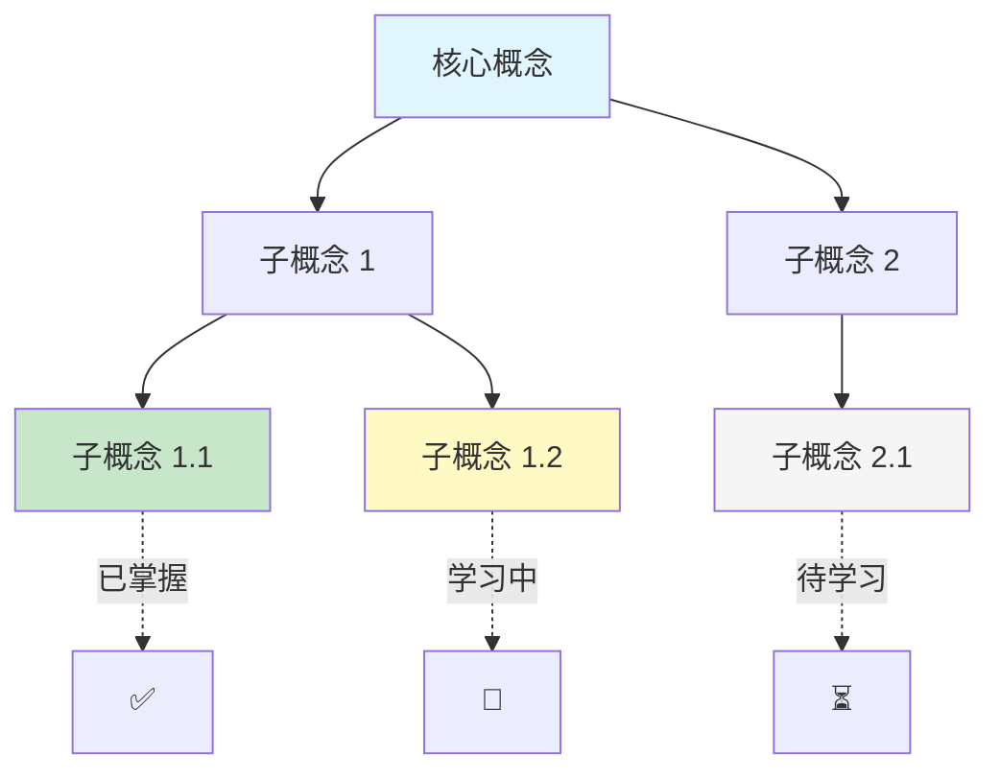

# 知识图谱 / 概念地图

## 生成时机

学习进行到第 3 天、第 5 天、第 7 天等节点，生成全局 Mermaid 概念地图。

## 示例



## 推送格式

```
🗺 知识地图 | {topic} · 已学 {n} 天

┌─────────────────────────────────────┐
│           [Mermaid 概念地图]          │
└─────────────────────────────────────┘

✅ 已掌握（{x} 个概念）: ...
📖 学习中（{y} 个概念）: ...
⏳ 待学习（{z} 个概念）: ...

💡 整体理解：你的知识框架已经建立了 {百分比}%。
{给出 1-2 句鼓励 + 下一步方向}
```

## 概念状态维护

在 path.json 中维护 `concept_map`：

```json
{
  "concept_map": {
    "组件化": { "status": "mastered", "day_learned": 1 },
    "JSX": { "status": "mastered", "day_learned": 2 },
    "Props": { "status": "learning", "day_learned": 3 },
    "State": { "status": "pending", "day_learned": null }
  }
}
```

| 状态 | 说明 | 颜色 |
|---|---|---|
| `mastered` | 费曼简化通过 + 自测正确 | 绿色 |
| `learning` | 已学但未完全掌握 | 黄色 |
| `pending` | 还未学到 | 灰色 |

## 用途

- 全局视角：帮助用户看到知识全貌和概念间的关系
- 进度可视化：一眼看出哪些已掌握、哪些还薄弱
- 查漏补缺：自测前生成最终版概念地图，标出薄弱概念重点复习
