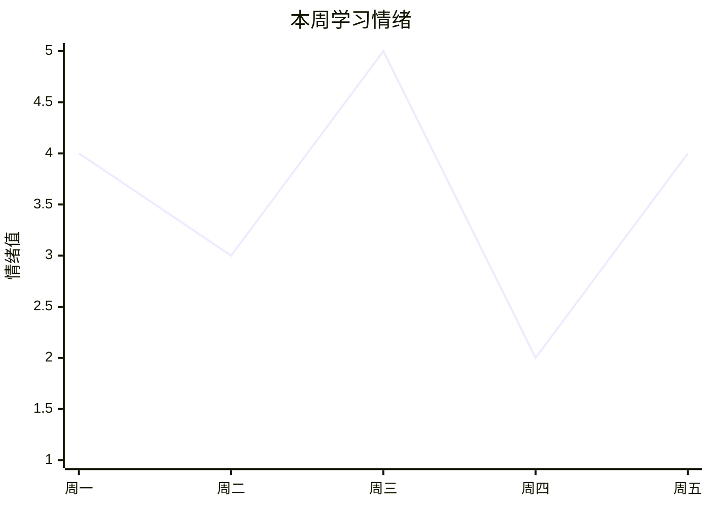

# 学习数据可视化周报

## 推送时机

- **自动**：创建 weekly cron，每周日 20:00 推送
- **手动**：用户说「给我周报」

## 周报格式

```
📊 学习周报 | {topic} · 第 {n} 周 ({start} - {end})

## 学习时长
本周共学习 {x} 天，累计 {y} 分钟
日均 {z} 分钟

## 完成率
本周完成 {a}/{b} 天（{百分比}%）
累计完成 {c}/{total} 天

## 掌握情况
✅ 已掌握概念：{x} 个
📖 学习中概念：{y} 个
🔴 薄弱概念：{z} 个（{列出}）

## 学习情绪趋势


## 费曼质量趋势
{1-5 星走势图}

## 本周总结
{2-3 句话总结本周学习状态，给出下周建议}
```

## 实现方式

从 `daily-log.json` 和 `path.json` 提取数据，用 Mermaid 图表可视化。

## 周 cron 配置

```json
{
  "name": "quick-learn-weekly: {slug}",
  "schedule": {
    "kind": "cron",
    "expr": "0 20 * * 0",
    "tz": "Asia/Shanghai"
  },
  "payload": {
    "kind": "agentTurn",
    "message": "读取 learning-data/{slug}/daily-log.json 和 path.json，生成学习周报推送给用户。如果本周无学习记录，不推送。"
  },
  "sessionTarget": "isolated"
}
```
