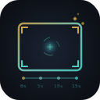

[English](README.md) | [中文](README.zh-CN.md) | [日本語](README.ja.md) | 한국어 | [Español](README.es.md) | [Português](README.pt.md) | [Français](README.fr.md)

<p align="center">
  
</p>

<h1 align="center">Seedance2.0 Shot Design</h1>

<p align="center">
  <strong>시네마틱 샷 언어 디자이너</strong>
</p>

<p align="center">
  <a href=""></a>
  <a href="LICENSE"></a>
  <a href=""></a>
</p>

<p align="center">
  막연한 영상 아이디어를 즉멍 Seedance 2.0에서 바로 사용할 수 있는 <strong>영화급 비디오 프롬프트</strong>로 원클릭 변환.
</p>

[Agent Skills](https://agentskills.io) 규격에 기반하여 구축된 Claude Skill입니다. 할리우드 최고 수준의 촬영 미학과 중국 영상 산업의 실무 노하우를 융합하여, 크리에이터가 "예쁜데 랜덤"한 AI 영상의 한계를 극복하고 **정밀하고 제어 가능한 비주얼 스토리텔링**을 구현할 수 있도록 설계되었습니다.

---

## ✨ 핵심 기능

| 기능 | 설명 |
|------|------|
| 🎭 **AI 만화 드라마 & 숏드라마 제작** | AI 만화 드라마(漫剧)와 AI 숏드라마의 풀 파이프라인 지원 — 캐릭터 대사 / 나레이션 / 배우 블로킹 / 과장 표정 클로즈업 / 내러티브 동기 카메라워크 / 숏드라마 스타일 퀵셀렉터 / 4종 프롬프트 템플릿(CN/EN×대사/나레이션), 전용 시나리오 템플릿 및 완전한 예시 포함 |
| 🎨 **28+ 감독 & 스타일 프리셋** | 놀란 / 빌뇌브 / 핀처 / 디킨스 / 구로사와 / 신카이 마코토 / 왕가위 / 장예모 / 선협 / 셀셰이딩CG / 애니메이션 / 샤오홍슈… |
| 🎬 **프로 카메라워크 사전** | 3단계 카메라 체계 + 14개 초점거리 + 6가지 포커스 컨트롤 + 7가지 물리적 마운트, 중영 대조 참조 |
| 💡 **3계층 라이팅 구조** | 광원층→광행동층→색조층 — "조명 하나 추가"는 이제 그만 |
| 📐 **타임스탬프 스토리보드** | `0-3초 / 3-8초 / …` 정밀한 타임라인 제어로 샷 간 번짐 방지 |
| 🎯 **6요소 정밀 조립** | 피사체 / 동작 / 장면 / 라이팅 / 카메라 / 사운드 — 구조화된 고전환율 공식 |
| 🎬 **스마트 다중 세그먼트 스토리보드** | 15초 초과 영상 자동 분할, 스타일·라이팅·사운드 통일, 심리스 트랜지션 프레임 |
| 📦 **20개 시나리오 템플릿** | 이커머스 / 선협 / 숏드라마 / 먹방 / MV / 원테이크 / 자동차 / 매크로 / 자연 / 게임PV / 공포 / 여행 / 반려동물 / 변신 / 루프 / 영상 편집 / 영상 연장 / 스토리 보완 / 멀티프레임 스토리 |
| 🎵 **사운드 & ASMR 어휘집** | 물리 기반 의성어 라이브러리: 환경음 / 액션 / 보컬 / 악기 |
| 🌐 **이중 언어 프롬프트 출력** | 중국어 사용자→중국어 / 그 외→영어 프롬프트, 자동 감지 |
| 🛡️ **저작권 안전 IP 회피** | 3단계 점진적 IP 회피 전략으로 플랫폼 콘텐츠 차단 방지 |
| 🔍 **Python 하드 검증** | 글자 수 / 카메라워크 / 시계열 로직 / 군더더기 감지 / 광학 물리 충돌 / 스타일 충돌 매트릭스 — "제안"보다 확실 |

---

## 🚀 빠른 시작

### 1. Skill 설치

<details>
<summary><b>Claude Code</b></summary>

`seedance-shot-design/` 폴더를 프로젝트 루트의 `.claude/skills/` 아래에 배치합니다:

```bash
# 프로젝트의 Skill 디렉토리에 클론
git clone https://github.com/woodfantasy/Seedance2.0-ShotDesign-Skills.git .claude/skills/seedance-shot-design
```

Claude Code가 자동으로 Skill을 감지하고 로드합니다.
</details>

<details>
<summary><b>OpenClaw</b></summary>

연동된 IM 앱(위챗, 페이슈 등)에서 OpenClaw Agent에게 메시지를 보냅니다:

```
이 스킬을 학습해 주세요: https://github.com/woodfantasy/Seedance2.0-ShotDesign-Skills
```

Agent가 자동으로 Seedance Shot Design 스킬을 가져와 학습합니다. 바로 요청을 시작할 수 있습니다.
</details>

<details>
<summary><b>Codex</b></summary>

Skill 폴더를 Codex의 agents 지시 디렉토리에 배치합니다:

```bash
git clone https://github.com/woodfantasy/Seedance2.0-ShotDesign-Skills.git agents/skills/seedance-shot-design
```

Codex 대화에서 호출할 수 있습니다.
</details>

<details>
<summary><b>Cursor</b></summary>

Skill 폴더를 프로젝트 루트의 `.cursor/skills/` 아래에 배치합니다:

```bash
git clone https://github.com/woodfantasy/Seedance2.0-ShotDesign-Skills.git .cursor/skills/seedance-shot-design
```

Cursor Agent 모드에서 자동으로 Skill 지시를 읽어들입니다.
</details>

### 2. 사용법

Claude에게 이렇게 말하기만 하면 됩니다:

```
15초짜리 사이버펑크 폭우 추격전 비디오 프롬프트를 작성해 주세요
```

Skill이 자동 활성화되어 5단계 워크플로로 프롬프트를 생성합니다:
1. **요구 분석** — 길이 / 화면 비율 / 소재 / 스타일 확인
2. **비주얼 진단** — 카메라 언어 & 감독 스타일 선정
3. **6요소 조립** — 구조화된 공식에 따라 정밀 작성
4. **필수 검증** — Python 스크립트로 품질 리뷰 실행
5. **프로 납품** — 감독 스테이트먼트 + 완성 프롬프트

### 3. 예시

#### 전체 인터랙션 데모

**사용자 입력:**
```
10초짜리 동방 선협 단편 영상 비디오 프롬프트를 작성해 주세요
```

**Skill 출력:**

> **Seedance 비디오 프롬프트**
>
> **테마**: 새벽 안개 자욱한 고사에서 백의 소년이 단풍잎을 받아들고 깨달음을 얻는 장면
>
> **감독 스테이트먼트** (창작 의도 이해용 — 복사 불필요):
> 항공촬영→돌리→슬로우 푸시의 3단계 카메라워크로, 장대한 풍경에서 친밀한 감정으로 전환.
> 35mm 필름 그레인이 수공예적 질감을 더하고, 금청 색조가 동양의 '자연과의 조화' 철학을 구현.
>
> **완성 프롬프트** (즉멍 입력창에 직접 복사):

```
10초 중국풍 판타지, 사실적인 동양 영화 감성, 금청 컬러 팔레트, 공명하는 앰비언트 사운드.
0-3초: 구름 바다 속 고사를 고각도 항공 촬영, 슬로우 항공 푸시, 새벽 안개가 계곡을 흐르고, 멀리서 종소리가 희미하게 울리며, 틴들 광선이 구름층을 관통.
3-7초: 돌리로 사문을 통과해 안뜰로, 백의 소년이 손을 들어 떨어지는 단풍잎을 받아들고, 35mm 필름 그레인 질감, 얕은 피사계 심도로 손 디테일에 포커스.
7-10초: 소년이 눈을 드는 클로즈업, 슬로우 푸시인, 바람이 일어나 소매와 머리카락이 프레임 오른쪽으로 나부끼고, 안뜰에서 영광이 나선형으로 상승.
사운드: 환경음이 수렴하여 맑고 청아한 검명 한 줄기로.
금지: 모든 텍스트, 자막, 로고, 워터마크
```

#### 더 많은 활용 사례

```
# AI 만화 드라마
10초짜리 AI 만화 스타일 재벌 CEO 숏폼, 세로 9:16, 대사와 과장된 클로즈업 포함

# 이커머스 광고
8초짜리 고급 시계 제품 광고 비디오 프롬프트, 9:16 세로

# 숏드라마 대사
12초짜리 반전 숏드라마 장면, 대사 포함

# 원테이크
15초짜리 원테이크 박물관 산책 비디오 프롬프트

# 참고 소재 포함
캐릭터 디자인 이미지 3장과 참고 영상 1편 업로드 완료 — 15초짜리 선협 액션 장면 생성해 줘
```

---

## 📁 프로젝트 구조

```
seedance-shot-design/
├── SKILL.md                     # 핵심 지시 (Skill의 두뇌)
├── README.md                    # 본 파일
├── scripts/
│   ├── validate_prompt.py       # 산업 수준 프롬프트 검증 스크립트
│   └── test_validate.py         # 검증 스크립트 테스트 케이스
└── references/
    ├── cinematography.md        # 카메라 & 초점거리 사전 (물리적 마운트 & 초점거리 심리학 포함)
    ├── director-styles.md       # 감독 스타일 파라미터화 매핑 (28+ 스타일, 셀셰이딩CG 포함)
    ├── seedance-specs.md        # Seedance 2.0 공식 플랫폼 사양
    ├── quality-anchors.md       # 품질 앵커 & 라이팅 라이브러리 (NPR 소재/라이팅/충돌 매트릭스 포함)
    ├── scenarios.md             # 수직 시나리오 템플릿 (17개 시나리오 + 애니메이션 변형 + 영상 편집 + 물리 댐핑 툴킷)
    └── audio-tags.md            # 오디오 & 음향 효과 태그 사양 (공간 음향 & 소재 기반 의성어 포함)
```

---

## 🔬 검증 스크립트

커맨드 라인에서 단독 사용 가능한 Python 검증 도구:

```bash
# 텍스트 직접 검증
python scripts/validate_prompt.py --text "프롬프트"

# 파일에서 검증
python scripts/validate_prompt.py --file prompt.txt

# 언어 지정 (auto=자동 감지, cn=중국어, en=영어)
python scripts/validate_prompt.py --text "your prompt" --lang en

# JSON 형식 출력 (프로그램 처리용)
python scripts/validate_prompt.py --text "프롬프트" --json
```

**검증 항목:**
- ❌ 글자 수 초과 (중국어 >500자 / 영어 >1000단어)
- ❌ 전문 카메라 용어 누락
- ❌ 군더더기 표현 하드 블록 (masterpiece / 걸작 / 초선명 등 → error)
- ❌ 광학 물리 충돌 (초광각+보케, 핸드헬드+완벽한 대칭)
- ❌ 스타일 충돌 매트릭스 (IMAX vs VHS, 필름 vs 디지털, 수묵 vs UE5, 셀셰이딩 vs 리얼PBR, 슬로우모션 vs 스피드램프)
- ❌ 에셋 참조 초과 (이미지 >9 / 영상 >3 / 오디오 >3 / 합계 >12)
- ❌ 장편 영상 (>5초) 타임슬라이스 없이 하드 블록
- ⚠️ 타임슬라이스 갭 또는 중복
- ⚠️ 선언 길이와 슬라이스 시간 끝점 불일치
- ⚠️ 세그먼트 내 모션 로직 충돌
- ⚠️ Seedance 심사 위험: 베어 영어 카메라 용어 감지 (Dolly / Aerial / Crane / Pan / Arc / Dutch / Steadicam)
- 🌐 자동 언어 감지 (중국어 / 영어), 언어별 길이 기준 & 감지 전략 적용
- 🎬 다중 세그먼트 간 일관성 검사 (스타일 총칙 / 라이팅 구조 / 금지 항목)

**테스트 실행:**
```bash
python -m unittest scripts.test_validate -v
# 54개 테스트 전체 통과 (11개 테스트 클래스 커버)
```

---

## 🏗️ 설계 철학

### 점진적 지식 로딩 (Progressive Disclosure)

Agent Skills 모범 사례 준수:

- **SKILL.md** (~4000 토큰): 핵심 워크플로 + 구조 템플릿 + 품질 체크리스트
- **references/** (온디맨드 로딩): 스타일 / 카메라 / 품질 관련 니즈가 언급될 때만 읽기
- **scripts/** (온디맨드 실행): 프롬프트 생성 후에만 검증 실행

### 경쟁 우위

| 비교 축 | 일반적 접근 | 본 Skill |
|---------|------------|----------|
| 컴플라이언스 검증 | 일반 텍스트 제안 | **Python 하드 검증 (광학/스타일 충돌 매트릭스 + 심사 안전 감지 포함)** |
| 감독 스타일 | 해외 유명 감독만 | **국제 + 중국 + 숏드라마 + AI 만화 + SNS + 애니메이션 + 셀셰이딩CG + 샤오홍슈** |
| 장면 커버리지 | 대작 영화 편중 | **17개 수직 시나리오 + 애니메이션 변형 + 영상 편집 + 물리 댐핑 툴킷** |
| 사운드 디자인 | 간단한 언급 | **공간 음향 + 소재 기반 의성어 라이브러리** |
| 라이팅 | "조명 추가" | **광원→행동→색조 3계층 + 라이팅 레시피 + 소재 라이브러리** |
| 다국어 | 중국어만 | **중국어/영어 이중 출력, 자동 언어 감지** |
| 심사 안전성 | 미고려 | **카메라 용어 중의성 해소 규칙 + 베어워드 자동 감지** |

---

## 📋 변경 이력

### v1.9.0 (2026-04-18)
- 🎬 **내러티브 가이드 카메라워크 속차 (신규 챕터)**: `cinematography.md` 제IX절 신설 — 8종 리딩/팔로잉/리빌 샷(리딩샷·팔로잉샷·사이드트래킹·로앵글팔로우·장초점압박팔로우·에픽드론리빌·장애물리빌·이동오빗), 이중언어 트리거워드 및 예시 포함
- 🚁 **에픽 드론 리빌 (Epic Drone Reveal)**: 독립 Level 1 카메라 무브로 격상 — 피사체 뒤/저위에서 천천히 상승하며 장대한 경관 공개; 일반 항공촬영과 근본적으로 다른 서사 구조
- 🌿 **장애물 리빌/스루샷 (Reveal / Through Shot)**: 신규 Level 1 — 장애물(대나무숲/문/군중/커튼)을 통과해 장면 공개, 서스펜스와 레이어 깊이감 연출
- 🚶 **리딩샷 (Leading Shot)**: 신규 Level 1 — 카메라가 피사체 앞에서 후퇴하며 가이드, 여정감과 주인공 능동성 강화
- ⚡ **스냅줌/크래시줌 (Snap Zoom / Crash Zoom)**: Level 3 콤보 추가 — 초점거리 급변으로 폭발적 충격감, 코미디·놀람 강조·MV 비트싱크에 활용
- 🌀 **이동 오빗 (Orbit Follow)**: Level 3 콤보 추가 — 피사체 이동에 맞춰 오빗 중심점이 함께 이동하는 orbit+tracking 복합기

### v1.8.5 (2026-04-08)
- 🌐 **Runway 플랫폼 호환**: Runway 사용자를 위한 에셋 제한(이미지 최대 5장, 비디오 최대 3개)을 명시하고, 사실적인 사람 얼굴에 대한 중재를 우회하기 위한 명확한 전략(블러 처리 또는 NPR 스타일 적용)을 제공합니다.
- 🎞️ **시작 및 끝 프레임 보간**: 정밀한 전환을 지원하기 위해 7번째 멀티모달 참조 패턴(`@Image1 as start frame, @Image2 as end frame`)을 추가했습니다.
- 🎬 **두 가지 새로운 효과 시나리오**:
  - `Freeze Time(타임 프리즈)`: 완전히 멈춘 장면 요소 사이를 카메라가 극적으로 통과합니다.
  - `Multishot Video(멀티샷 비디오)`: "원테이크" 제한을 우회하여 한 번의 생성으로 날카로운 몽타주 컷을 자동 생성합니다.

- 🚀 **극한 1인칭 시점 (Extreme POV)**: 새로운 21번째 시나리오 템플릿 추가. "인간의 시선 이동 논리", "초고속 비행 물체 FPV (검/화살)", "생물 비행" 커버.
- 🎧 **몰입감 오디오 배제 원칙**: POV 템플릿에 엄격한 환경음 배제 지시어 도입 (환경음만 생성, BGM 및 대사 절대 금지). AI가 부적절한 음악을 추가하여 몰입을 방해하는 것을 방지.
- 🧹 **배경 정화 규칙**: 이미지-투-비디오 생성 중 참조 이미지가 비디오 환경을 오염시키지 않도록 하려면 반드시 "순백색/빈 배경"의 에셋 이미지를 사용해야 함을 명시.

### v1.8.4 (2026-04-08)
- 🔗 **CLI 연동 가이드**: `seedance-specs.md`에 즉몽 CLI 명령 매핑 추가(`text2video` / `image2video` / `multiframe2video` / `multimodal2video`), 비동기 작업 관리 및 VIP 채널 설명 포함
- 🎞️ **멀티프레임 스토리 템플릿**: 제20 시나리오 템플릿 「멀티프레임 스토리(multiframe2video)」추가 — 2-9장의 키프레임 이미지를 업로드하면 엔진이 자동으로 일관된 스토리 비디오 구성
- 📚 **지식 베이스 라우팅 확장**: Step 2 의미 추론 테이블에 멀티프레임 및 CLI 라우팅 항목 추가

### v1.8.3 (2026-04-08)
- 🎭 **기술적 > 서술적 규칙**：새 핵심 규칙(#12) — 카메라가 "보이는 것"만 작성(시각어), 캐릭터가 "느끼는 것" 작성 금지(감정어). 모든 감정은 시각화된 신체 표현으로 변환
- ✍️ **영어 현재진행형**：영어 프롬프트 동작에 -ing 형식 의무화(`running` not `runs`) — 진행형은 지속적 움직임을 암시
- 🎯 **모션 톤 전치**：스타일 프리앨블에서 운동 에너지 선언(`dynamic motion` / `serene atmosphere`), 생성 초기에 운동 기조 락

### v1.8.2 (2026-04-07)
- 🎥 **원샷원무브 규칙**: 새 핵심 규칙(#10) — 타임 세그먼트당 카메라 동작 1개 제한. 복합 운동(예: 푸시인+패닝) 조합시 화면 떨림 발생. 피사체 운동과 카메라 운동은 반드시 분리 기술
- 🖼️ **I2V 골든 룰**: 새 핵심 규칙(#11) 및 I2V 전용 가이드 — 이미지→비디오 생성 시 동작/변화만 기술, 첫 프레임의 정적 콘텐츠 재기술 금지. `preserve composition and colors` 앵커 문구 도입
- 📏 **프롬프트 최적 길이**: 60-100 단어 최적 구간 가이드 추가 — 짧으면 모호, 100단어 초과 시 개념 드리프트 및 지시 충돌
- 💪 **운동 강도 수식어 속차**: 카메라 사전에 6단계 강도 대조표(맹렬→부드러움→점진) + Do/Don't 예시 추가, "뭉개짐" 해소
- 🎤 **리듬 워드 우선**: 조립 규칙에서 의미 리듬어(gentle/gradual/smooth)를 기술 파라미터(24fps/f2.8)보다 명시적 우선
- 🎬 **참조 영상 최적화**: 참조 클립 실전 제약 — 이상적 3-8초, 연속 촬영(점프컷 없음), 단일 의도(피사체 OR 카메라)

### v1.8.1 (2026-04-07)
- 🛡️ **보안 준수**: ClawHub OpenClaw "의심 패턴" 플래그 해결 — Python 검증을 LLM 네이티브 7항 구조화 체크리스트로 변환. Python 스크립트는 독립 개발 도구로 유지
- 🎯 **트리거 문구 최적화**: 활성화 트리거를 40+에서 15개 고신호 전문 용어로 축소, 오활성화 억제

### v1.8.0 (2026-04-05)
- 🎤 **음성·언어 제어 시스템**: 영상 참조 음색 클론, 방언/억양 제어, 다국어 대화 믹싱, 특수 음성 스타일(다큐/코미디/오페라/ASMR)
- 📹 **멀티모달 참조 가이드**: 4요점→6종 코어 참조 패턴 업그레이드(첫프레임/카메라복제/동작복제/카메라+동작분리/음색참조/이펙트복제)
- 📏 **영상 연장 시나리오**: 순방향/역방향 연장 템플릿, 시맨틱 연결 기법, 생성 시간 인지 교정
- 📋 **스토리 보완 시나리오**: 스토리보드→영상, 만화 프레임 애니메이션, 이미지→감정 영상 3가지 창작 모드
- 🎬 **크리에이티브 이펙트 속차**: VFX 트리거 키워드 — 히치콕 줌, 피쉬아이, 파티클, 스피드 램프, 프리즈 전환, 수묵화, 모핑
- 🎭 **감정 연기 가이드**: 감정 구체화 표, 감정 전환 트리거 워드, 감정 참조 영상 활용

### v1.7.2 (2026-04-02)
- 🎯 **트리거 워드 확장**: 일상적 표현("영상 만들어줘", "클립 생성", "카메라워크" 등)으로 자동 활성화되는 20+ 중국어·10+ 영어 트리거 추가

### v1.7.1 (2026-03-29)
- 🔒 **보안 준수 최적화**: ClawHub 보안 플래그 문제 해결, 전체 기능 유지

### v1.7.0 (2026-03-28)
- 🚨 **Step 3 필수 조립 규칙**: 3계층 라이팅 독립행/음효행 표준화/금지항목 통일/비템플릿 단락 금지
- ⛔ **Step 4 검증 차단**: 검증 불합격 프롬프트의 사용자 표시 금지
- 📋 **Step 5 포맷 강제**: 테마+감독노트+코드블록 래핑 출력 템플릿
- 🎯 **Step 2 파라미터 추출 지시**: 지식 베이스 "로딩"이 아닌 구체 파라미터 추출·삽입 의무화

### v1.6.0 (2026-03-28)
- 🧠 **스마트 시맨틱 라우팅**: Step 2를 "명시 트리거"→3계층 라우팅 업그레이드 — 상시 로딩/의미 추론/명시 지정
- 🎯 **Step 1 스마트 추론 원칙**: 한 문장에서 파라미터 능동 추론, 질문 1-2개로 제한

### v1.5.0 (2026-03-27)
- 🎭 **배우 블로킹 시스템**: 3요소 포지셔닝(배치+얼굴 방향+시선 초점) + 감정 수식어 어휘집으로 다중 캐릭터 장면에 각본가 수준의 캐릭터 조율 제공
- 🎙️ **나레이션/대사 분리**: 현장 대사와 나레이션/내면 독백 분리 템플릿, 나레이션 장면에 립싱크 방지 지시 포함
- 📐 **촬영 각도 구체화**: 모호→구체 각도 매핑(예: "클로즈업"→"오버숄더 중근경, 청자에 초점"), 5쌍 비교표 포함
- 🎬 **내러티브 동기 부여 카메라워크**: 카메라 동작과 서사 목적 연결(예: "슬로우 푸시인 — 내면 갈등 드러내기"), 5쌍 비교표 포함
- 🔀 **세그먼트 전환 전략**: 6가지 전환 유형(시선 연속/감정 고조/대비 컷/공간 도약/시간 생략/감각 브리지)으로 다중 샷 일관성 강화
- 🎨 **숏드라마 스타일 퀵셀렉터**: 4차원 콤보(영상 유형×렌더링 스타일×색조×장르)
- 📝 숏드라마 프롬프트 템플릿 1종→4종 확장(CN 대사/CN 나레이션/EN 대사/EN 나레이션)
- 📝 다중 세그먼트 감독 노트에 전환 전략 선언 추가
- 📝 5개 완전한 숏드라마 예시: 반전 대사/나레이션 독백/충돌 액션/2D 일본 애니/전환 전략
- ✅ 54개 테스트 통과

### v1.4.0 (2026-03-21)
- 🎬 **스마트 다중 세그먼트 스토리보드**: 15초 초과 영상 자동 분할 (각 ≤15초, 최소 ≥8초)
- 📝 다중 세그먼트 일관성: 스타일 총칙 / 3계층 라이팅 / 사운드 디자인 / 트랜지션 프레임 / 금지 항목 통일
- 📝 Step 5에 다중 세그먼트 출력 포맷 템플릿 추가 (중/영)
- 📝 60초 사막 Kali/Escrima 4세그먼트 전체 예시 신규 추가
- 🔧 검증 스크립트에 `validate_multi_segment()` 세그먼트 간 일관성 검사 추가
- ✅ 54개 테스트 통과 (신규 다중 세그먼트 검증 테스트 4개 포함)

### v1.3.0 (2026-03-21)
- 🌐 **이중 언어 프롬프트 출력**: 중국어 사용자→중국어, 비중국어→영어, 자동 언어 감지
- 📝 모든 구조 템플릿·납품 포맷·멀티모달 팁에 영어 버전 추가
- 🛡️ **카메라 용어 중의성 해소 (Rule 9)**: 중국어는 중국어 카메라 용어, 영어는 전체 구문 사용 — Seedance 심사 오탐 방지
- 🔧 검증에 `check_ambiguous_terms()` 베어워드 감지 + `--lang` 플래그 + 영어 단어 수 길이 체크 추가
- 🔧 슬로우모션 vs 스피드램프 충돌 감지 신규 추가
- 🔧 `detect_language()` CJK Extension A + 전각 구두점 지원 확장
- 📚 `cinematography.md`에 "Seedance 안전 표기" 열 추가
- ✅ 50개 테스트 통과 (이중 언어 + 심사 안전 테스트 포함)

### v1.2.0 (2026-03-21)
- 🎨 **셀셰이딩 CG 스타일**: 완전한 4축 파라미터화 항목 신규 추가 (애니메이션의 폭발적 에너지와 구별 — 정적 내러티브 포지셔닝)
- 🧱 **애니메이션/NPR 소재 라이브러리**: 애니메이션 피부 / 머리카락 / 카툰 메탈 / 카툰 패브릭 — 4종 비사실적 소재
- 📦 **애니메이션 게임PV 변형**: 시나리오 템플릿에 셀셰이딩 서브 템플릿 + 얼음 속성 캐릭터 예시 추가
- ⚠️ 충돌 매트릭스 추가: 셀셰이딩 vs 리얼 PBR 소재
- 🔧 검증에 셀셰이딩 vs PBR 스타일 충돌 감지 추가

### v1.1.0 (2026-03-20)
- 🎬 **카메라 업그레이드**: 초점거리 내러티브 심리학, 다이나믹 포커스 패러다임, 물리적 마운트 장 (7종 특수 리그) 신규 추가
- 🎨 **감독 스타일**: 핀처 / 디킨스 / 구로사와 / 신카이 마코토 + 애니메이션 폭발 / 샤오홍슈 감성 (탈명화 안전 프롬프트 + 금지 항목 포함) 신규 추가
- 💡 **품질 업그레이드**: 안티 플라스틱 선언, 필름 스톡 라이브러리 (5종), 소재 텍스처 라이브러리 (8종), 라이팅 콤보 퀵 레퍼런스 (4세트), 유기적 불완전성 라이브러리, 품질 충돌 매트릭스
- 🎬 **장면 확장**: 게임PV / 공포·스릴러 / 여행·도시 / 반려동물·귀여움 / 비포어-애프터 / Meme-Loop 신규 추가, 총 16개 시나리오 + 물리 댐핑 부록
- 🎙️ **사운드 업그레이드**: 공간 음향 수식어 (7종), 소재 기반 의성어 정교화 (7쌍)
- 🔧 **검증 강화**: 군더더기 표현 warning→error 하드 블록, 광학 물리 충돌 감지, 스타일 충돌 매트릭스, 길이 인식 타임슬라이싱, 35개 테스트 통과

### v1.0.0 (2026-03-19)
- 🎉 최초 릴리스
- SKILL.md 핵심 워크플로
- 6개 전문 지식 베이스 파일
- Python 검증 스크립트 + 테스트 케이스
- 20+ 감독 스타일 매핑
- 10개 수직 시나리오 템플릿

---

## 📄 라이선스

MIT-0 (MIT No Attribution) License
