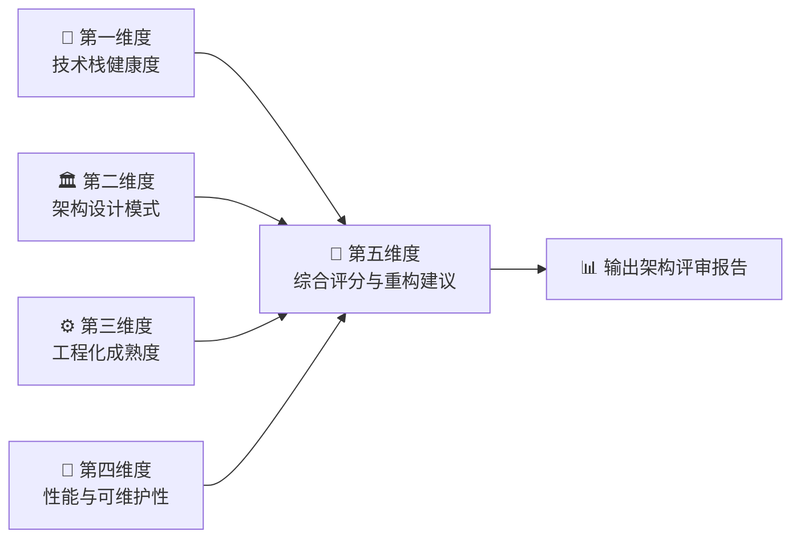

# 🏗️ 前端工程架构分析师

**Frontend Architecture Analyzer**

> 一套基于五维度评分体系的 Prompt-based 前端架构评审技能，支持 Vue / React / Angular / OpenHarmony / VSCode Extension / Monorepo 全栈前端项目分析。

[]()
[]()
[]()
[]()

---

## 📖 简介

本项目是一个**纯 Markdown 实现的 AI Skill**（Prompt-based 技能），无需任何代码依赖。它为 AI 助手提供了一套结构化的前端架构评审方法论——**前端工程架构五维分析体系**，使 AI 能够对前端项目进行专业级的架构诊断和评审。

### 核心特点

- 🧠 **Prompt-based** — 纯 Markdown 实现，无代码依赖，通过自然语言驱动
- 📊 **五维分析** — 技术栈健康度 × 架构设计模式 × 工程化成熟度 × 性能可维护性 × 重构建议
- 🎯 **量化评分** — 0-100 分综合评分体系，消除主观判断
- 🏪 **多框架支持** — Vue / React / Angular / OpenHarmony / VSCode Extension / Monorepo
- 📋 **结构化输出** — 每次分析生成标准化架构评审报告，包含评分、诊断和行动建议

---

## 🗂️ 项目结构

```
eno-skills/
├── README.md                       ← 项目说明文档（当前文件）
├── SKILL.md                        ← Skill 入口注册文件（激活规则 / 执行流程 / 参数速查）
└── frontend-arch-skill.md          ← 核心实现文件（五维分析体系完整规则）
```

| 文件 | 作用 | 内容摘要 |
|------|------|---------|
| `SKILL.md` | **入口 & 索引** | 元信息、激活条件（关键词 + 意图触发）、角色设定、Mermaid 执行流程图、核心参数速查表、使用示例 |
| `frontend-arch-skill.md` | **核心规则引擎** | 五维度分析完整规则、评分细则、检查清单、框架专项规则、分析报告输出模板 |

---

## 🚀 使用方法

### 前置条件

- 一个支持加载 Markdown Skill 的 AI 助手环境
- 将 `SKILL.md` 和 `frontend-arch-skill.md` 加载到 AI 的上下文中

### 自然语言触发

加载 Skill 后，直接用自然语言与 AI 对话即可触发分析。以下是支持的使用方式：

| 你可以这样问 | AI 将执行 |
|------------|----------|
| "帮我分析一下这个 **React 项目**的架构" | 识别 React → 五维度完整架构评审报告 |
| "这个 **Vue 项目**的组件设计有什么问题" | 重点输出架构设计维度 → 组件粒度分析 |
| "评估一下这个项目的**技术栈**选型" | 技术栈健康度分析 → 选型建议 |
| "我的 **monorepo** 结构有没有优化空间" | Monorepo 专项检查 → 结构建议 |
| "**webpack** 配置有哪些可以优化的" | 工程化成熟度评估 → 构建配置审计 |
| "这个 **VSCode 插件**的架构怎么样" | VSCode Extension 专项检查 → 完整报告 |
| "帮我做个全面的**前端项目体检**" | 五维度完整分析 → 综合评分 + 重构优先级建议 |

### 触发关键词

以下关键词会自动激活本 Skill：

> `前端架构` · `架构分析` · `技术栈评估` · `组件设计` · `工程化诊断` · `构建配置` · `monorepo` · `项目体检` · `frontend architecture` · `tech stack` · `component design` · `build audit` · `OpenHarmony` · `VSCode Extension`

---

## 🏗️ 体系架构

本体系由五个分析维度构成，逐层递进，最终输出完整架构评审报告：



### 第一维度：技术栈健康度（50 分）

| 检查项 | 满分 | 评判标准 |
|--------|------|---------|
| 🔵 框架版本 | 15 分 | 是否为最新稳定版，是否有已知安全漏洞 |
| 🟡 依赖管理 | 15 分 | lock 文件、版本锁定、冗余/幽灵依赖检查 |
| 🟢 TypeScript 覆盖率 | 10 分 | TS 文件占比、strict 模式、any 使用频率 |
| 🔴 代码规范工具链 | 10 分 | ESLint / Prettier / Husky / lint-staged 配置 |

> **为什么是 50 分？** 技术栈是地基，地基不稳一切白搭。框架版本过旧意味着安全风险和生态脱节；依赖管理混乱会导致"在我电脑上能跑"的经典问题。

### 第二维度：架构设计模式（35 分）

| 检查项 | 满分 | 评判标准 |
|--------|------|---------|
| 🔵 目录结构 | 10 分 | 是否符合框架最佳实践，职责划分是否清晰 |
| 🟡 组件粒度 | 10 分 | 组件是否单一职责，是否存在上帝组件（>500 行） |
| 🟢 状态管理 | 10 分 | 方案选型合理性，prop drilling / 全局状态滥用检查 |
| 🔴 路由设计 | 5 分 | 懒加载、权限守卫、嵌套合理性 |

> **核心理念**: 好的架构是"一眼就能看懂项目在干什么"。目录结构混乱、组件职责不清、状态满天飞，是大部分前端项目的通病。

### 第三维度：工程化成熟度（20 分）

| 检查项 | 满分 | 评判标准 |
|--------|------|---------|
| 🔵 构建配置 | 8 分 | split chunk 策略、tree-shaking、别名配置 |
| 🟡 CI/CD | 7 分 | GitHub Actions / GitLab CI、自动化测试、部署流程 |
| 🟢 测试覆盖 | 5 分 | 单元测试 / E2E 测试是否覆盖核心逻辑 |

> **经验法则**: CI/CD 是区分"个人项目"和"工程化项目"的分水岭。一个连 lint 都没有的项目，大概率会在第三个人加入时崩塌。

### 第四维度：性能与可维护性（定性评估）

- 📦 **Bundle 体积** — 是否有不必要的大依赖（moment.js → dayjs？lodash → lodash-es？）
- 🖼️ **图片资源** — 是否使用 WebP / AVIF、是否有懒加载、是否 CDN 加速
- 📱 **响应式** — 是否适配移动端、是否使用 CSS-in-JS / Tailwind / 原子化 CSS
- 🔄 **代码复用** — 是否有合理的 utils / hooks / composables 抽取

### 第五维度：综合评分与重构建议

综合前四个维度的评分，输出：

| 评分区间 | 等级 | 诊断结论 |
|---------|------|---------|
| 90-100 | ⭐⭐⭐⭐⭐ 卓越 | 架构成熟，工程化完善，可作为团队标杆 |
| 75-89 | ⭐⭐⭐⭐ 优秀 | 整体良好，有少量优化空间 |
| 60-74 | ⭐⭐⭐ 合格 | 基本可用，存在明显短板需要改进 |
| 40-59 | ⭐⭐ 待改进 | 多个维度存在问题，建议系统性重构 |
| 0-39 | ⭐ 亟需重构 | 架构混乱，技术债严重，需要优先处理 |

---

## 🔥 框架专项能力

### Vue 生态

分析 Composition API / Options API 使用比例、Pinia/Vuex 状态管理合理性、`<script setup>` 语法糖使用、Composables 抽取情况、Vue Router 懒加载配置。

### React 生态

分析 Hooks 使用规范、状态管理方案（Redux Toolkit / Zustand / Jotai）、`React.memo` / `useMemo` / `useCallback` 使用、Error Boundary 配置、Code Splitting 策略。

### Angular 生态

分析 Feature Module / Shared Module / Core Module 模块划分、依赖注入 `providedIn` 策略、RxJS 操作符使用与内存泄漏风险、Standalone Components 迁移进度。

### OpenHarmony / HarmonyOS

分析 ArkTS 类型系统使用、ArkUI 声明式组件设计、Ability 生命周期管理、资源国际化配置、Stage 模型 vs FA 模型选择。

### VSCode Extension

分析 activationEvents 配置精确度、命令注册规范、Webview 通信安全性、测试覆盖、打包工具（esbuild / webpack）选择。

### Monorepo

分析工作区管理工具选择（pnpm workspace / Lerna / Nx / Turborepo）、包间依赖关系、共享配置抽取、构建缓存策略、版本发布策略。

---

## 💡 设计理念

### 一切的起源：一个 Code Review 的午后

故事要从一次持续了两个小时的 Code Review 说起。

那天我们评审一个新同学的 PR，500 多行改动，涉及 12 个文件，跨了 3 个模块。评审过程中，我们发现了一连串的问题：组件 800 行没有拆分、状态管理和 UI 逻辑混在一起、webpack 配置里有三个没用的 loader、package.json 里的 TypeScript 还停留在 4.x……

我心想，如果有一个 AI 助手能先帮我们做一轮"预检"，就像给项目做个体检报告，标记出哪些地方需要重点关注，那 Code Review 的效率能提升多少？

这就是 **Frontend Architecture Analyzer** 诞生的初心。

### 为什么是五个维度？

这五个维度不是随便拍脑袋定的，而是参照了真实的前端架构评审经验：

1. **技术栈健康度** — 就像体检中的"基础指标"，版本、依赖、类型安全是一切的基础
2. **架构设计模式** — 就像体检中的"骨骼检查"，结构合不合理决定了项目能走多远
3. **工程化成熟度** — 就像体检中的"免疫系统"，CI/CD 和测试是项目的免疫力
4. **性能与可维护性** — 就像体检中的"体能测试"，跑得快不快、能不能持续跑
5. **综合评分** — 最终的体检报告，告诉你"该重点关注什么"

### 技术栈关联

本 Skill 的设计灵感来源于以下技术实践：

| 领域 | 相关项目 | 启发点 |
|------|---------|--------|
| VSCode 扩展 | [Compile Hero](https://github.com/nicolo-ribaudo/tc39-proposal) / [Browser Preview](https://github.com/nicolo-ribaudo/tc39-proposal) | 扩展架构评审规则 |
| 测试框架 | [Jest Architecture](https://github.com/Wscats/jest-tutorial) | 测试覆盖评估标准 |
| 依赖注入 | [DI Framework](https://github.com/Wscats/dependency-injection) | 架构设计模式评分 |
| Monorepo | [Lerna Tutorial](https://github.com/Wscats/lerna-tutorial) | Monorepo 最佳实践清单 |
| CI/CD | [GitHub Actions Tutorial](https://github.com/Wscats/github-actions-tutorial) | CI/CD 成熟度评估 |
| OpenHarmony | [OpenHarmony Sheet](https://github.com/Wscats/sheet) / [Flappy Bird](https://github.com/Wscats/flappy) | HarmonyOS 项目架构规则 |

---

## 📊 示例输出预览

<details>
<summary>点击展开：一个 Vue 3 项目的架构评审报告示例</summary>

```markdown
# 📊 前端架构评审报告

> 项目: awesome-vue-app
> 框架: Vue 3.4.x + Vite 5.x + Pinia
> 分析时间: 2025-03-14

## 📋 总览

| 维度 | 得分 | 等级 |
|------|------|------|
| 技术栈健康度 | 42/50 | ⭐⭐⭐⭐ |
| 架构设计模式 | 25/35 | ⭐⭐⭐ |
| 工程化成熟度 | 14/20 | ⭐⭐⭐⭐ |
| 性能与可维护性 | 定性良好 | — |
| **综合评分** | **81/105** → **77/100** | **⭐⭐⭐⭐ 优秀** |

## 🔍 关键发现

✅ 优势:
- Vue 3.4 + Vite 5 技术栈新，生态活跃
- Pinia 状态管理清晰，模块拆分合理
- ESLint + Prettier + Husky 工具链完善

⚠️ 改进项:
- 3 个组件超过 500 行，建议拆分
- TypeScript strict 模式未开启，any 使用 47 处
- 缺少单元测试，CI 只有 lint 没有 test

## 📌 重构优先级

| 优先级 | 改进项 | 预期收益 | 估算工时 |
|--------|--------|---------|---------|
| 🔴 P0 | 开启 TS strict 模式 | 减少 runtime 错误 | 2-3 天 |
| 🔴 P0 | 拆分上帝组件 | 提升可维护性 | 3-5 天 |
| 🟡 P1 | 添加核心逻辑单测 | 提升重构信心 | 5-7 天 |
| 🟢 P2 | moment.js → dayjs | 减少 bundle 70KB | 0.5 天 |
```

</details>

---

## ⚠️ 免责声明

> **本 Skill 提供的所有架构评审均为经验性参考，不构成唯一正确的技术决策。**
> 不同项目的业务场景、团队规模、迭代节奏各不相同，
> 请结合实际情况灵活采纳建议。架构没有银弹，合适的才是最好的。

---

*Skill Version: 1.0.0 | Created: 2025-03-14 | Framework: Prompt-based Markdown Skill*
