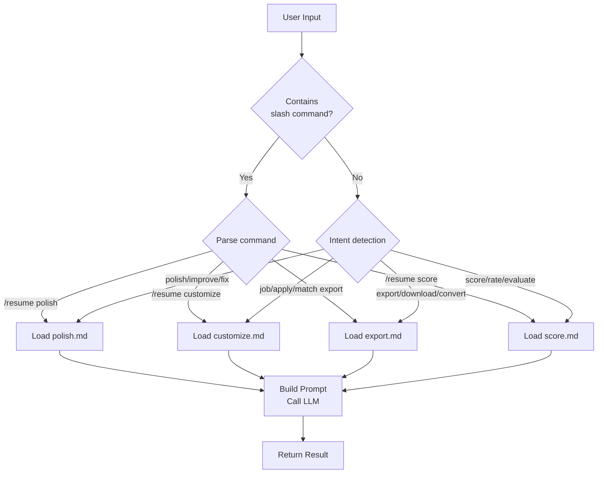

# 📝 Resume / CV Assistant

> AI-powered clawbot skill for resume & CV polishing, job customization, multi-format export, and professional scoring.
**Version:** 1.0.0 · **License:** MIT · **Repository:** [github.com/Wscats/resume-assistant](https://github.com/Wscats/resume-assistant)

---

## Overview

Resume / CV Assistant is a clawbot skill that helps job seekers create, refine, and optimize their resumes and CVs, while adding comprehensive checklist review, scoring, and multi-format export that neither project offers alone.

---

## Usage in AI Agent

### Quick Start

Resume / CV Assistant is a standard clawbot skill that can be loaded and invoked by any compatible AI Agent. Here are different integration approaches.

### 💬 Natural Language (Recommended)

You don't need to memorize any commands — simply describe what you need:

```
💬 "Create a resume for a software engineer position"
💬 "Polish my resume and fix any issues"
💬 "Optimize my resume for ATS"
💬 "Tailor my resume for this job description: [paste JD]"
💬 "Convert my resume to PDF"
💬 "Score my resume and tell me how to improve"
💬 "What's wrong with my resume?"
💬 "Here's my resume, can you help?"
```

The assistant understands your intent and automatically routes to the right workflow:

| You say | Assistant does |
|---------|---------------|
| "Create a resume for [role]" | Asks for your background → builds a tailored resume |
| "Polish / Fix / Improve my resume" | Runs 40+ checklist review → returns polished version |
| "Optimize for ATS" | Checks ATS compatibility → optimizes keywords & format |
| "Tailor for this JD: ..." | Analyzes JD → gap analysis → customized resume |
| "Convert to PDF / Word / ..." | Exports to chosen format with professional template |
| "Score / Rate / Evaluate my resume" | 100-point scoring → strengths & improvement plan |
| "Here's my resume, help?" | Scores first → suggests next steps |

#### Example Conversations

**Creating a new resume:**
```
You:   Create a resume for a frontend engineer position at a startup

Bot:   I'd be happy to help! To get started, could you share:
       1. Your work experience (companies, roles, dates, key achievements)
       2. Education background
       3. Technical skills
       4. Any specific job posting you're targeting? (optional)

You:   I have 3 years at Shopify working on React...

Bot:   Here's your tailored resume:
       [generates complete resume]
       
       Would you like me to score, polish, or export it?
```

**Quick improvement:**
```
You:   Here's my resume, what do you think?
       [pastes resume]

Bot:   📊 Resume Score: 68/100 (Grade: C)
       Top 3 Issues:
       1. ❌ No quantified achievements
       2. ⚠️ Weak action verbs
       3. ⚠️ Missing keywords for target role
       
       Would you like me to polish it now?

You:   Yes, polish it

Bot:   [runs full polish with 40+ checklist items]
```

**Job-specific tailoring:**
```
You:   Tailor my resume for this job description:
       Senior Backend Engineer at Stripe
       Requirements: Go, distributed systems, payment APIs...

Bot:   🎯 Job Analysis Complete
       📊 Current Match: 62% → After Optimization: 89%
       [generates tailored version]
```

### Option 1: Slash Commands via clawbot

For more precise control, use slash commands directly in a clawbot conversation:

```
/resume polish
Please polish my resume:

John Doe
Senior Frontend Engineer | 5 years experience
Skills: JavaScript, React, Vue, Node.js
...
```

### Option 2: Integration in AI Agent Frameworks

#### 1. Register the Skill

Register this project as a skill in your AI Agent:

```json
{
  "skills": [
    {
      "name": "resume-assistant",
      "path": "./skills/resume-assistant",
      "manifest": "skill.json"
    }
  ]
}
```

#### 2. Load Prompts

When handling resume-related requests, prompt files are loaded in this order:

```
1. prompts/system.md      ← Persona & quality standards (loaded first)
2. prompts/<command>.md    ← Load per command: specific instructions
3. templates/<style>.md    ← Load on demand (export command only)
```

#### 3. Build the Complete Prompt

Example for `/resume polish` — here's how an AI Agent should construct the prompt:

```python
# Python pseudocode
ROLE_SYS = "system"    # LLM message role constant
ROLE_USR = "user"      # LLM message role constant

def build_prompt(command, args):
    # Step 1: Load the skill persona prompt
    persona_prompt = load_file("prompts/system.md")

    # Step 2: Load command-specific prompt
    command_prompt = load_file(f"prompts/{command}.md")

    # Step 3: Combine prompts into LLM messages
    combined = persona_prompt + "\n\n" + command_prompt
    messages = [
        {"role": ROLE_SYS, "content": combined},
        {"role": ROLE_USR, "content": args["resume_content"]}
    ]

    # Step 4: Add optional parameters to user message
    if args.get("language"):
        messages[1]["content"] += f"\n\nLanguage: {args['language']}"

    return messages
```

```javascript
// JavaScript pseudocode
const ROLE_SYS = 'system';  // LLM message role constant
const ROLE_USR = 'user';    // LLM message role constant

async function buildPrompt(command, args) {
  // Step 1: Load the skill persona prompt
  const personaPrompt = await loadFile('prompts/system.md');

  // Step 2: Load command-specific prompt
  const commandPrompt = await loadFile(`prompts/${command}.md`);

  // Step 3: Combine prompts into LLM messages
  const combined = `${personaPrompt}\n\n${commandPrompt}`;
  const messages = [
    { role: ROLE_SYS, content: combined },
    { role: ROLE_USR, content: args.resume_content }
  ];

  // Step 4: Add optional parameters
  if (args.language) {
    messages[1].content += `\n\nLanguage: ${args.language}`;
  }

  return messages;
}
```

### Option 3: REST API

If your AI Agent exposes an HTTP API, invoke via RESTful endpoints:

```bash
# Polish a resume
curl -X POST https://your-agent-api.com/skills/resume-assistant/polish \
  -H "Content-Type: application/json" \
  -d '{
    "resume_content": "Your resume content...",
    "language": "en"
  }'

# Score a resume
curl -X POST https://your-agent-api.com/skills/resume-assistant/score \
  -H "Content-Type: application/json" \
  -d '{
    "resume_content": "Your resume content...",
    "target_role": "Senior Frontend Engineer",
    "language": "en"
  }'

# Customize for a job
curl -X POST https://your-agent-api.com/skills/resume-assistant/customize \
  -H "Content-Type: application/json" \
  -d '{
    "resume_content": "Your resume content...",
    "job_description": "Job description...",
    "language": "en"
  }'

# Export to a format
curl -X POST https://your-agent-api.com/skills/resume-assistant/export \
  -H "Content-Type: application/json" \
  -d '{
    "resume_content": "Your resume content...",
    "format": "html",
    "template": "modern"
  }'
```

### Option 4: LangChain / LlamaIndex Integration

```python
from langchain.tools import Tool

# Define tools based on skill.json commands
resume_tools = [
    Tool(
        name="resume_polish",
        description="Polish and improve resume with 40+ checklist items",
        func=lambda input: agent.run_skill(
            "resume-assistant", "polish",
            {"resume_content": input, "language": "en"}
        )
    ),
    Tool(
        name="resume_score",
        description="Score a resume on 100-point scale with improvement suggestions",
        func=lambda input: agent.run_skill(
            "resume-assistant", "score",
            {"resume_content": input, "language": "en"}
        )
    ),
    Tool(
        name="resume_customize",
        description="Customize resume for a specific job position",
        func=lambda input: agent.run_skill(
            "resume-assistant", "customize",
            {"resume_content": input.split("---JD---")[0],
             "job_description": input.split("---JD---")[1],
             "language": "en"}
        )
    ),
    Tool(
        name="resume_export",
        description="Export resume to Word/Markdown/HTML/LaTeX/PDF",
        func=lambda input: agent.run_skill(
            "resume-assistant", "export",
            {"resume_content": input, "format": "html", "template": "modern"}
        )
    ),
]
```

### Command Routing

The AI Agent should route user requests to the correct command:



### Argument Validation

The AI Agent should validate arguments before invocation, referencing `skill.json`:

```python
def validate_args(command, args):
    """Validate arguments against skill.json schema."""
    schema = load_skill_json()
    cmd_schema = next(c for c in schema["commands"] if c["name"] == command)

    for arg in cmd_schema["arguments"]:
        # Check required fields
        if arg["required"] and arg["name"] not in args:
            raise ValueError(f"Missing required argument: {arg['name']}")

        # Check enum constraints
        if "enum" in arg and arg["name"] in args:
            if args[arg["name"]] not in arg["enum"]:
                raise ValueError(
                    f"Invalid value for {arg['name']}: {args[arg['name']]}. "
                    f"Must be one of: {arg['enum']}"
                )

        # Apply defaults
        if arg["name"] not in args and "default" in arg:
            args[arg["name"]] = arg["default"]

    # Check max resume length
    max_len = schema["config"]["max_resume_length"]
    if len(args.get("resume_content", "")) > max_len:
        raise ValueError(f"Resume exceeds {max_len} character limit")

    return args
```

---

## Commands

### `/resume polish`

Run a **40+ item checklist** across 8 categories and get a fully improved resume.

**Arguments:**

| Name | Type | Required | Default | Description |
|------|------|----------|---------|-------------|
| `resume_content` | string | ✅ | — | Resume text (plain text or Markdown) |
| `language` | string | — | `en` | `en` for English, `zh` for Chinese |

**What you get:**
- ✅/❌/⚠️ checklist results for every item (contact, summary, experience, education, skills, grammar, formatting, ATS)
- Fully polished resume with strong action verbs and quantified results
- Change summary categorized by priority: 🔴 Critical → 🟡 Major → 🟢 Minor → 💡 Suggestion
- Action verb reference table and quantification guide

---

### `/resume customize`

Tailor your resume for a **specific job posting** with gap analysis and keyword optimization.

**Arguments:**

| Name | Type | Required | Default | Description |
|------|------|----------|---------|-------------|
| `resume_content` | string | ✅ | — | Resume text |
| `job_description` | string | ✅ | — | Target job description or job title |
| `language` | string | — | `en` | `en` for English, `zh` for Chinese |

**What you get:**
- Job description breakdown (required skills, preferred skills, responsibilities, keywords)
- Gap analysis matrix mapping every requirement to your resume
- Customized resume with keywords naturally integrated
- Keyword coverage report: before vs. after
- Bonus: cover letter talking points + interview prep notes

---

### `/resume export`

Convert your resume to **Word, Markdown, HTML, LaTeX, or PDF** with professional templates.

**Arguments:**

| Name | Type | Required | Default | Description |
|------|------|----------|---------|-------------|
| `resume_content` | string | ✅ | — | Resume text (Markdown preferred) |
| `format` | string | ✅ | — | `word` \| `markdown` \| `html` \| `latex` \| `pdf` |
| `template` | string | — | `professional` | `professional` \| `modern` \| `minimal` \| `academic` |

**Templates:**

| Template | Style | Best For |
|----------|-------|----------|
| `professional` | Navy, serif headings, classic borders | Finance, consulting, law, healthcare |
| `modern` | Teal accents, creative layout, emoji icons | Tech, startups, product, marketing |
| `minimal` | Monochrome, ultra-clean, content-dense | Senior professionals, engineering |
| `academic` | Formal serif, multi-page, publications | Faculty, research, PhD applications |

**Export details:**
- **HTML**: Self-contained file with embedded CSS, 4 color themes, `@media print` optimized
- **LaTeX**: Complete compilable `.tex` with XeLaTeX + CJK support
- **Word**: Pandoc-optimized Markdown with YAML front matter + conversion command
- **PDF**: Print-optimized HTML with A4 page dimensions + multiple conversion methods
- **Markdown**: Clean, structured, version-control friendly

---

### `/resume score`

Get a **100-point professional evaluation** with specific improvement suggestions.

**Arguments:**

| Name | Type | Required | Default | Description |
|------|------|----------|---------|-------------|
| `resume_content` | string | ✅ | — | Resume text |
| `target_role` | string | — | — | Target role for fit assessment |
| `language` | string | — | `en` | `en` for English, `zh` for Chinese |

**Scoring dimensions (100 points):**

| Dimension | Points | Evaluates |
|-----------|--------|-----------|
| Content Quality | 30 | Achievements, action verbs, relevance, completeness |
| Structure & Formatting | 25 | Layout, consistency, length, section order |
| Language & Grammar | 20 | Grammar, spelling, tone, clarity |
| ATS Optimization | 15 | Keywords, standard headings, format compatibility |
| Impact & Impression | 10 | 6-second test, career story, professionalism |

**Grade scale:** A+ (95-100) → A (90-94) → B+ (85-89) → B (80-84) → C+ (75-79) → C (70-74) → D (60-69) → F (<60)

**What you get:**
- Score breakdown with per-dimension justification
- Top 3 strengths with specific examples from your resume
- Priority-ranked improvements with **Before → After** rewrites
- Role fit assessment (if target_role provided): fit score, competitive percentile, strengths, gaps
- 5-step action plan with effort estimates

---

## Recommended Workflow

```
┌──────────────────────────────────────────────────────┐
│                  Recommended Workflow                 │
├──────────────────────────────────────────────────────┤
│                                                      │
│  1. /resume score     ← Know where you stand         │
│     💬 "Score my resume"                             │
│          │                                           │
│          ▼                                           │
│  2. /resume polish    ← Fix all issues               │
│     💬 "Polish my resume"                            │
│          │                                           │
│          ▼                                           │
│  3. /resume customize ← Tailor per application       │
│     💬 "Tailor for this JD: ..."                     │
│          │                                           │
│          ▼                                           │
│  4. /resume export    ← Generate final files         │
│     💬 "Convert to PDF"                              │
│          │                                           │
│          ▼                                           │
│  5. /resume score     ← Verify improvement           │
│     💬 "Score my resume again"                       │
│                                                      │
└──────────────────────────────────────────────────────┘
```

**Tips:**
1. Start with **score** if you have an existing resume — understand your baseline
2. **Polish** to fix all fundamentals before customizing for a job
3. **Customize** separately for each application — one-size-fits-all doesn't work
4. **Export** last — get content perfect, then format
5. Use **Markdown** as your working format — it converts cleanly to all others
6. **Score again** after polish + customize to measure improvement

---

## Project Structure

```
resume-assistant/
├── skill.json                    # Skill manifest (JSON)
├── skill.yaml                    # Skill manifest (YAML)
├── SKILL.md                      # This documentation
├── prompts/
│   ├── system.md                 # Persona definition & quality standards
│   ├── polish.md                 # Polish prompt: 40+ item checklist
│   ├── customize.md              # Customize prompt: gap analysis & keywords
│   ├── export.md                 # Export prompt: 5 formats × 4 templates
│   └── score.md                  # Score prompt: 100-point rubric
├── templates/
│   ├── professional.md           # Classic corporate template
│   ├── modern.md                 # Contemporary tech/startup template
│   ├── minimal.md                # Ultra-clean senior template
│   ├── academic.md               # Formal academic CV template
│   └── export/
│       ├── resume.html           # HTML template (4 CSS themes)
│       └── resume.tex            # LaTeX template (XeLaTeX + CJK)
└── examples/
    ├── sample-resume-en.md       # English sample (high quality)
    ├── sample-resume-zh.md       # Chinese sample (high quality)
    ├── sample-resume-weak.md     # Weak sample (for scoring demo)
    └── usage.md                  # Usage examples & workflow guide
```

---

## Language Support

| Language | Code | Features |
|----------|------|----------|
| English | `en` | Full support, US/UK conventions |
| Chinese | `zh` | Full support, 中英文混排规范, CJK export |

---

## Configuration

| Key | Value | Description |
|-----|-------|-------------|
| `max_resume_length` | 10,000 chars | Maximum input length |
| `supported_languages` | `en`, `zh` | Available languages |
| `supported_export_formats` | word, markdown, html, latex, pdf | Available export formats |
scats