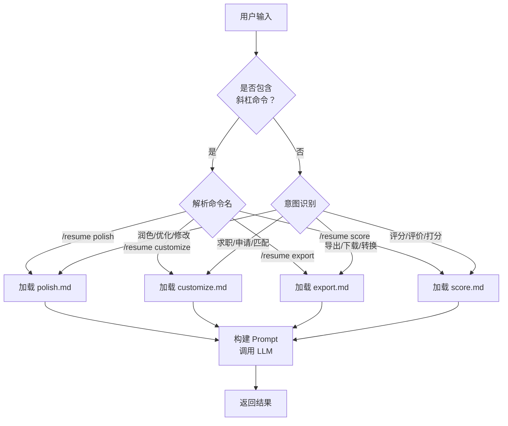
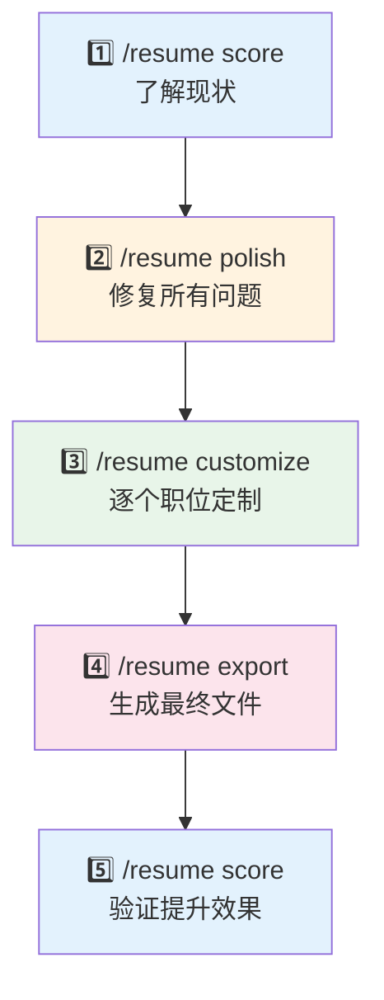

# 📝 简历助手 (Resume / CV Assistant)

> AI 驱动的 clawbot 技能，提供简历（Resume / CV）润色、职位定制、多格式导出和专业评分一站式服务。
**版本：** 1.0.0 · **许可证：** MIT · **仓库地址：** [github.com/Wscats/resume-assistant](https://github.com/Wscats/resume-assistant)

---

## 概述

简历助手（Resume / CV Assistant）是一个 clawbot 技能，帮助求职者创建、优化和完善简历（Resume / CV）。它整合了全面的检查清单审查、专业评分、职位匹配分析和多格式导出功能，提供从简历撰写到投递的完整工作流。


---

## 如何在 AI Agent 中使用

### 快速接入

Resume / CV Assistant 是一个标准的 clawbot skill，可以被任何兼容的 AI Agent 加载和调用。以下是在不同场景下的接入方式。

### 💬 自然语言对话（推荐）

不需要记忆任何命令 —— 直接描述你的需求即可：

```
💬 "帮我写一份软件工程师的简历"
💬 "润色我的简历，修复所有问题"
💬 "优化我的简历，让它通过 ATS 筛选"
💬 "根据这个职位描述定制我的简历：[粘贴 JD]"
💬 "把我的简历转成 PDF"
💬 "给我的简历打个分，告诉我怎么改进"
💬 "我的简历有什么问题？"
💬 "这是我的简历，帮我看看"
```

English also works:
```
💬 "Create a resume for a software engineer position"
💬 "Optimize my resume for ATS"
💬 "Tailor my resume for this job description: [paste JD]"
💬 "Score my resume and tell me how to improve"
```

助手会理解你的意图，自动路由到正确的工作流：

| 你说 | 助手做什么 |
|------|-----------|
| "帮我写一份 [职位] 的简历" | 询问你的背景信息 → 生成定制简历 |
| "润色 / 修改 / 优化我的简历" | 执行 40+ 项检查 → 返回润色后的版本 |
| "优化 ATS" | 检查 ATS 兼容性 → 优化关键词和格式 |
| "根据这个 JD 定制：..." | 分析 JD → 差距分析 → 定制简历 |
| "转成 PDF / Word / ..." | 用专业模板导出为指定格式 |
| "给简历打分 / 评估 / 怎么样" | 100 分制评分 → 优势与改进方案 |
| "这是我的简历，帮我看看" | 先评分 → 再建议后续步骤 |

#### 对话示例

**从零创建简历：**
```
你：  帮我写一份前端工程师的简历，目标是创业公司

助手：好的！为了生成一份量身定制的简历，请提供以下信息：
      1. 工作经历（公司、职位、时间、主要成果）
      2. 教育背景
      3. 技术栈
      4. 有具体的目标职位 JD 吗？（可选但推荐提供）

你：  我在 Shopify 做了 3 年 React 开发...

助手：这是你的定制简历：
      [生成完整简历]
      
      需要我帮你打分、润色或导出吗？
```

**快速改进：**
```
你：  这是我的简历，帮我看看有什么问题
      [粘贴简历]

助手：📊 简历评分：68/100（等级：C）
      前 3 大问题：
      1. ❌ 没有量化成果
      2. ⚠️ 动词太弱（"负责"→"主导"）
      3. ⚠️ 缺少目标职位的关键词
      
      需要我帮你润色吗？

你：  好的，帮我润色

助手：[执行 40+ 项检查清单全面优化]
```

**职位定制：**
```
你：  根据这个 JD 定制我的简历：
      Stripe 高级后端工程师
      要求：Go、分布式系统、支付 API...

助手：🎯 职位分析完成
      📊 当前匹配度：62% → 优化后：89%
      [生成定制版本]
```

### 方式一：通过 clawbot 平台使用斜杠命令

如果需要更精细的控制，可以在 clawbot 对话中直接使用斜杠命令：

```
/resume polish
请帮我润色以下简历：

张三
高级前端工程师 | 5年经验
技能：JavaScript, React, Vue, Node.js
...
```

### 方式二：在 AI Agent 框架中集成

#### 1. 注册技能

将本项目作为 skill 注册到你的 AI Agent 中：

```json
{
  "skills": [
    {
      "name": "resume-assistant",
      "path": "./skills/resume-assistant",
      "manifest": "skill.json"
    }
  ]
}
```

#### 2. 加载提示词

AI Agent 在处理简历相关请求时，按以下顺序加载提示词文件：

```
1. prompts/system.md      ← 角色定义与质量标准（首先加载）
2. prompts/<command>.md    ← 根据命令加载对应的提示词
3. templates/<style>.md    ← 按需加载模板（仅 export 命令使用）
```

#### 3. 构建完整的 Prompt

以 `/resume polish` 为例，AI Agent 应按如下方式构建 prompt：

```python
# Python 伪代码
ROLE_SYS = "system"    # LLM message role constant
ROLE_USR = "user"      # LLM message role constant

def build_prompt(command, args):
    # Step 1: Load the skill persona prompt
    persona_prompt = load_file("prompts/system.md")

    # Step 2: Load command-specific prompt
    command_prompt = load_file(f"prompts/{command}.md")

    # Step 3: Combine prompts into LLM messages
    combined = persona_prompt + "\n\n" + command_prompt
    messages = [
        {"role": ROLE_SYS, "content": combined},
        {"role": ROLE_USR, "content": args["resume_content"]}
    ]

    # Step 4: Add optional parameters to user message
    if args.get("language"):
        messages[1]["content"] += f"\n\nLanguage: {args['language']}"

    return messages
```

```javascript
// JavaScript 伪代码
const ROLE_SYS = 'system';  // LLM message role constant
const ROLE_USR = 'user';    // LLM message role constant

async function buildPrompt(command, args) {
  // Step 1: Load the skill persona prompt
  const personaPrompt = await loadFile('prompts/system.md');

  // Step 2: Load command-specific prompt
  const commandPrompt = await loadFile(`prompts/${command}.md`);

  // Step 3: Combine prompts into LLM messages
  const combined = `${personaPrompt}\n\n${commandPrompt}`;
  const messages = [
    { role: ROLE_SYS, content: combined },
    { role: ROLE_USR, content: args.resume_content }
  ];

  // Step 4: Add optional parameters
  if (args.language) {
    messages[1].content += `\n\nLanguage: ${args.language}`;
  }

  return messages;
}
```

### 方式三：通过 API 调用

如果你的 AI Agent 提供了 HTTP API，可以通过 RESTful 接口调用：

```bash
# 简历润色
curl -X POST https://your-agent-api.com/skills/resume-assistant/polish \
  -H "Content-Type: application/json" \
  -d '{
    "resume_content": "你的简历内容...",
    "language": "zh"
  }'

# 简历评分
curl -X POST https://your-agent-api.com/skills/resume-assistant/score \
  -H "Content-Type: application/json" \
  -d '{
    "resume_content": "你的简历内容...",
    "target_role": "高级前端工程师",
    "language": "zh"
  }'

# 职位定制
curl -X POST https://your-agent-api.com/skills/resume-assistant/customize \
  -H "Content-Type: application/json" \
  -d '{
    "resume_content": "你的简历内容...",
    "job_description": "职位描述...",
    "language": "zh"
  }'

# 格式导出
curl -X POST https://your-agent-api.com/skills/resume-assistant/export \
  -H "Content-Type: application/json" \
  -d '{
    "resume_content": "你的简历内容...",
    "format": "html",
    "template": "modern"
  }'
```

### 方式四：在 LangChain / LlamaIndex 等框架中使用

```python
from langchain.tools import Tool

# Define tools based on skill.json commands
resume_tools = [
    Tool(
        name="resume_polish",
        description="Polish and improve resume with 40+ checklist items",
        func=lambda input: agent.run_skill(
            "resume-assistant", "polish",
            {"resume_content": input, "language": "zh"}
        )
    ),
    Tool(
        name="resume_score",
        description="Score a resume on 100-point scale with improvement suggestions",
        func=lambda input: agent.run_skill(
            "resume-assistant", "score",
            {"resume_content": input, "language": "zh"}
        )
    ),
    Tool(
        name="resume_customize",
        description="Customize resume for a specific job position",
        func=lambda input: agent.run_skill(
            "resume-assistant", "customize",
            {"resume_content": input.split("---JD---")[0],
             "job_description": input.split("---JD---")[1],
             "language": "zh"}
        )
    ),
    Tool(
        name="resume_export",
        description="Export resume to Word/Markdown/HTML/LaTeX/PDF",
        func=lambda input: agent.run_skill(
            "resume-assistant", "export",
            {"resume_content": input, "format": "html", "template": "modern"}
        )
    ),
]
```

### 命令路由逻辑

AI Agent 在收到用户请求后，应按以下流程路由到对应命令：



### 参数校验

AI Agent 应在调用前校验参数，参考 `skill.json` 中的定义：

```python
def validate_args(command, args):
    """Validate arguments against skill.json schema."""
    schema = load_skill_json()
    cmd_schema = next(c for c in schema["commands"] if c["name"] == command)

    for arg in cmd_schema["arguments"]:
        # Check required fields
        if arg["required"] and arg["name"] not in args:
            raise ValueError(f"Missing required argument: {arg['name']}")

        # Check enum constraints
        if "enum" in arg and arg["name"] in args:
            if args[arg["name"]] not in arg["enum"]:
                raise ValueError(
                    f"Invalid value for {arg['name']}: {args[arg['name']]}. "
                    f"Must be one of: {arg['enum']}"
                )

        # Apply defaults
        if arg["name"] not in args and "default" in arg:
            args[arg["name"]] = arg["default"]

    # Check max resume length
    max_len = schema["config"]["max_resume_length"]
    if len(args.get("resume_content", "")) > max_len:
        raise ValueError(f"Resume exceeds {max_len} character limit")

    return args
```

---

## 命令一览

| 命令 | 功能 | 说明 |
|------|------|------|
| `/resume polish` | 简历润色 | 40+ 项检查清单 + 全面优化 |
| `/resume customize` | 职位定制 | 差距分析 + 关键词匹配 |
| `/resume export` | 格式导出 | 5 种格式 × 4 种模板 |
| `/resume score` | 简历评分 | 100 分制专业评估 |

---

## 命令详解

### `/resume polish` — 简历润色

对简历进行 **40+ 项检查清单** 审查，涵盖 8 大类别，输出完整优化后的简历。

**参数：**

| 参数名 | 类型 | 必填 | 默认值 | 说明 |
|--------|------|------|--------|------|
| `resume_content` | string | ✅ | — | 简历内容（纯文本或 Markdown 格式） |
| `language` | string | — | `en` | `en` 英文，`zh` 中文 |

**检查清单类别（8 大类）：**

| 类别 | 检查项数 | 示例检查内容 |
|------|---------|-------------|
| 📇 联系信息 | 5 项 | 邮箱格式、电话号码、LinkedIn 链接 |
| 📋 职业摘要 | 5 项 | 是否有摘要、量化成果、与目标匹配度 |
| 💼 工作经历 | 8 项 | 强动词开头、量化成果、STAR 法则 |
| 🎓 教育背景 | 4 项 | 学位信息完整、GPA 策略、相关课程 |
| 🛠 技能清单 | 5 项 | 分类呈现、避免过时技能、匹配度 |
| 📝 语法与表达 | 5 项 | 拼写检查、时态一致、避免第一人称 |
| 📐 格式与排版 | 5 项 | 一致的间距、适当页数、清晰层次 |
| 🤖 ATS 兼容性 | 5 项 | 标准格式、关键词密度、避免表格/图片 |

**输出内容：**
- ✅/❌/⚠️ 每项检查结果及改进建议
- 完整润色后的简历（强动词 + 量化成果）
- 变更摘要按优先级分类：🔴 关键 → 🟡 重要 → 🟢 轻微 → 💡 建议
- 附赠：强动词参考表 + 成果量化指南

---

### `/resume customize` — 职位定制

根据 **目标职位描述** 定制简历，提供差距分析和关键词优化。

**参数：**

| 参数名 | 类型 | 必填 | 默认值 | 说明 |
|--------|------|------|--------|------|
| `resume_content` | string | ✅ | — | 简历内容 |
| `job_description` | string | ✅ | — | 目标职位描述或职位名称 |
| `language` | string | — | `en` | `en` 英文，`zh` 中文 |

**输出内容：**
- **职位解析**：必需技能、优先技能、核心职责、关键词提取
- **差距分析矩阵**：逐项对比每个职位要求与简历的匹配情况
- **定制后的简历**：自然融入关键词，突出相关经验
- **关键词覆盖报告**：优化前后对比
- **附赠**：求职信要点 + 面试准备笔记

**差距分析矩阵示例：**

```
| 职位要求       | 匹配状态 | 简历证据           | 建议操作     |
|---------------|---------|-------------------|-------------|
| Python 3 年+   | ✅ 强匹配 | 5 年 Python 经验   | 突出项目成果  |
| Kubernetes     | ⚠️ 弱匹配 | 提及 Docker 使用   | 补充 K8s 经验 |
| 团队管理经验    | ❌ 缺失   | 无相关描述         | 添加协作案例  |
```

---

### `/resume export` — 格式导出

将简历转换为 **Word、Markdown、HTML、LaTeX 或 PDF** 格式，搭配专业模板。

**参数：**

| 参数名 | 类型 | 必填 | 默认值 | 说明 |
|--------|------|------|--------|------|
| `resume_content` | string | ✅ | — | 简历内容（推荐 Markdown 格式） |
| `format` | string | ✅ | — | `word` \| `markdown` \| `html` \| `latex` \| `pdf` |
| `template` | string | — | `professional` | `professional` \| `modern` \| `minimal` \| `academic` |

**模板风格：**

| 模板 | 风格 | 适用场景 |
|------|------|---------|
| `professional` | 藏蓝色主调、衬线标题、经典边框 | 金融、咨询、法律、医疗行业 |
| `modern` | 青绿色点缀、创意布局、图标装饰 | 科技、创业公司、产品、市场营销 |
| `minimal` | 黑白简约、极致干净、内容密集 | 资深专业人士、工程师 |
| `academic` | 正式衬线字体、多页支持、出版物列表 | 高校教职、科研、博士申请 |

**各格式导出详情：**

| 格式 | 输出说明 |
|------|---------|
| **HTML** | 自包含文件，内嵌 CSS，4 种配色主题，`@media print` 打印优化 |
| **LaTeX** | 完整可编译 `.tex` 文件，XeLaTeX 引擎 + CJK 中文支持 |
| **Word** | Pandoc 优化的 Markdown + YAML 前置信息 + 转换命令 |
| **PDF** | 打印优化 HTML，A4 页面尺寸 + 多种转换方式 |
| **Markdown** | 结构清晰、版本控制友好、可转换为其他所有格式 |

---

### `/resume score` — 简历评分

获取 **100 分制专业评估**，附带具体的改进建议和优先级排序。

**参数：**

| 参数名 | 类型 | 必填 | 默认值 | 说明 |
|--------|------|------|--------|------|
| `resume_content` | string | ✅ | — | 简历内容 |
| `target_role` | string | — | — | 目标职位（用于匹配度评估） |
| `language` | string | — | `en` | `en` 英文，`zh` 中文 |

**评分维度（满分 100 分）：**

| 维度 | 分值 | 评估内容 |
|------|------|---------|
| 📊 内容质量 | 30 分 | 成就描述、强动词使用、相关性、完整性 |
| 📐 结构与排版 | 25 分 | 布局合理性、一致性、篇幅、段落顺序 |
| 📝 语言与语法 | 20 分 | 语法正确性、拼写、语气、表达清晰度 |
| 🤖 ATS 优化 | 15 分 | 关键词密度、标准标题、格式兼容性 |
| ✨ 影响力与印象 | 10 分 | 6 秒测试、职业故事、专业感 |

**评级标准：**

| 等级 | 分数范围 | 含义 |
|------|---------|------|
| A+ | 95–100 | 卓越 — 顶级简历，几乎无需修改 |
| A | 90–94 | 优秀 — 非常强的简历，仅需微调 |
| B+ | 85–89 | 良好 — 基础扎实，有提升空间 |
| B | 80–84 | 中上 — 合格简历，建议优化 |
| C+ | 75–79 | 中等 — 需要明显改进 |
| C | 70–74 | 及格 — 多处需要修改 |
| D | 60–69 | 不及格 — 需要大幅修改 |
| F | <60 | 差 — 建议重新撰写 |

**输出内容：**
- 各维度得分明细 + 扣分原因说明
- 前 3 大优势 + 简历中的具体佐证
- 按优先级排列的改进建议 + **修改前 → 修改后** 对比示例
- 职位匹配评估（如提供 `target_role`）：匹配分数、竞争力百分位、优势、差距
- 5 步行动计划 + 预估耗时

---

## 推荐工作流程



```
┌──────────────────────────────────────────────────────┐
│                    推荐工作流程                        │
├──────────────────────────────────────────────────────┤
│                                                      │
│  1. /resume score     ← 了解现状，获得基线分数         │
│     💬 "给我的简历打个分"                              │
│          │                                           │
│          ▼                                           │
│  2. /resume polish    ← 修复所有问题                  │
│     💬 "润色我的简历"                                 │
│          │                                           │
│          ▼                                           │
│  3. /resume customize ← 针对每个目标职位定制           │
│     💬 "根据这个 JD 定制..."                          │
│          │                                           │
│          ▼                                           │
│  4. /resume export    ← 生成最终文件                  │
│     💬 "转成 PDF"                                    │
│          │                                           │
│          ▼                                           │
│  5. /resume score     ← 再次评分，验证提升效果         │
│     💬 "再帮我打一次分"                               │
│                                                      │
└──────────────────────────────────────────────────────┘
```

**使用建议：**
1. 如果已有简历，**先评分**了解自己的基线水平
2. **先润色**修复基础问题，再针对具体职位定制
3. 每个申请职位**单独定制**——万能简历不存在
4. **最后导出**——先把内容打磨好，再考虑格式
5. 使用 **Markdown** 作为工作格式——可无损转换为其他任何格式
6. 优化后**再次评分**，量化你的进步

---

## 项目结构

```
resume-assistant/
├── skill.json                    # 技能清单（JSON 格式）
├── skill.yaml                    # 技能清单（YAML 格式）
├── SKILL.md                      # 英文文档
├── SKILL_ZH.md                   # 中文文档（本文件）
├── LICENSE                       # MIT 开源许可证
├── prompts/
│   ├── system.md                 # 角色定义与质量标准
│   ├── polish.md                 # 润色提示词：40+ 项检查清单
│   ├── customize.md              # 定制提示词：差距分析与关键词优化
│   ├── export.md                 # 导出提示词：5 种格式 × 4 种模板
│   └── score.md                  # 评分提示词：100 分制评分标准
├── templates/
│   ├── professional.md           # 经典商务模板
│   ├── modern.md                 # 现代科技模板
│   ├── minimal.md                # 极简高级模板
│   ├── academic.md               # 学术论文模板
│   └── export/
│       ├── resume.html           # HTML 导出模板（4 种 CSS 主题）
│       └── resume.tex            # LaTeX 导出模板（XeLaTeX + CJK）
└── examples/
    ├── sample-resume-en.md       # 英文示例简历（高质量）
    ├── sample-resume-zh.md       # 中文示例简历（高质量）
    ├── sample-resume-weak.md     # 低质量示例简历（用于评分演示）
    └── usage.md                  # 使用示例与工作流指南
```

---

## 语言支持

| 语言 | 代码 | 支持情况 |
|------|------|---------|
| 英文 | `en` | 完整支持，US/UK 规范 |
| 中文 | `zh` | 完整支持，中英文混排规范，CJK 导出优化 |

**中文特别优化：**
- 中英文之间自动添加空格
- 中文标点符号规范化
- CJK 字体兼容（LaTeX 使用 XeLaTeX 引擎）
- 符合中国大陆求职习惯的排版建议

---

## 配置参数

| 参数 | 值 | 说明 |
|------|-----|------|
| `max_resume_length` | 10,000 字符 | 最大输入长度 |
| `supported_languages` | `en`, `zh` | 支持的语言 |
| `supported_export_formats` | word, markdown, html, latex, pdf | 支持的导出格式 |

---

## 常见问题

**Q: 简历内容会被存储吗？**
A: 不会。所有内容仅在当前会话中处理，不会持久化存储。

**Q: 支持哪些语言的简历？**
A: 目前完整支持英文（en）和中文（zh），包括中英文混排的简历。

**Q: 导出的 PDF 如何生成？**
A: 导出命令会生成打印优化的 HTML 文件，你可以通过浏览器打印为 PDF，或使用 `wkhtmltopdf`、`weasyprint` 等工具转换。

**Q: 可以同时润色和定制吗？**
A: 建议先执行 `/resume polish` 修复基础问题，再用 `/resume customize` 针对具体职位定制，效果最佳。

**Q: 评分低怎么办？**
A: 评分报告会附带具体的改进建议和修改示例，按照优先级逐项优化即可。一般经过润色后，分数会提升 15-25 分。
