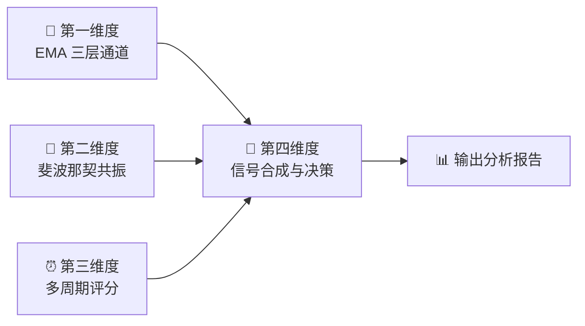

# 🎰 维加斯通道多维时空共振体系

**Vegas Tunnel Multi-Dimensional Resonance System**

> 一套基于 EMA 多层通道 + 斐波那契回撤 + 多周期共振评分的 Prompt-based 交易分析技能，支持 A 股与加密货币市场。

[]()
[]()
[]()

---

## 📖 简介

本项目是一个**纯 Markdown 实现的 AI Skill**（Prompt-based 技能），无需任何代码依赖。它为 AI 助手提供了一套结构化的技术分析方法论——**维加斯通道多维时空共振体系**，使 AI 能够基于维加斯通道理论对股票和加密货币进行专业级的技术分析。

### 核心特点

- 🧠 **Prompt-based** — 纯 Markdown 实现，无代码依赖，通过自然语言驱动
- 📊 **四维分析** — EMA 通道 × 斐波那契 × 多周期共振 × 信号合成
- 🎯 **量化评分** — 0-100 分综合评分体系，消除主观判断
- 🏪 **双市场** — 同时支持 A 股（含 T+1 限制适配）和加密货币（7×24 适配）
- 📋 **结构化输出** — 每次分析生成标准化报告，包含具体价位和操作建议

---

## 🗂️ 项目结构

```
t-trading/
├── README.md                           ← 项目说明文档（当前文件）
├── SKILL.md                            ← Skill 入口注册文件（激活规则 / 执行流程 / 参数速查）
└── vegas-tunnel-resonance-skill.md     ← 核心实现文件（四维分析体系完整规则）
```

| 文件 | 作用 | 内容摘要 |
|------|------|---------|
| `SKILL.md` | **入口 & 索引** | 元信息、激活条件（关键词 + 意图触发）、角色设定、Mermaid 执行流程图、核心参数速查表、使用示例 |
| `vegas-tunnel-resonance-skill.md` | **核心规则引擎** | 四维度分析完整规则、评分细则、计算方法、交易信号模板、仓位管理矩阵、分析报告输出模板 |

---

## 🚀 使用方法

### 前置条件

- 一个支持加载 Markdown Skill 的 AI 助手环境
- 将 `SKILL.md` 和 `vegas-tunnel-resonance-skill.md` 加载到 AI 的上下文中

### 自然语言触发

加载 Skill 后，直接用自然语言与 AI 对话即可触发分析。以下是支持的使用方式：

| 你可以这样问 | AI 将执行 |
|------------|----------|
| "帮我分析一下 **600519** 能不能做 T" | A 股做 T 模式 → 四维度完整分析报告 |
| "**BTC** 现在什么位置，能做日内吗" | 加密货币日内模式 → 四维度完整分析报告 |
| "**ETH** 的支撑位在哪" | 重点输出斐波那契 + EMA 共振支撑位 |
| "维加斯通道怎么看" | 介绍体系 → 询问标的 → 执行分析 |
| "**比亚迪**现在适合入场吗" | 完整四维度分析 → 评分 + 方向结论 |
| "帮我看看**宁德时代**的均线" | EMA 通道分析 → 激活本 Skill |

### 触发关键词

以下关键词会自动激活本 Skill：

> `做T` · `日内交易` · `高抛低吸` · `短线操作` · `维加斯通道` · `Vegas Tunnel` · `EMA分析` · `EMA通道` · `斐波那契` · `Fibonacci` · `支撑位` · `压力位` · `黄金分割`

---

## 🏗️ 体系架构

本体系由四个分析维度构成，逐层递进，最终合成交易信号：



### 第一维度：EMA 三层通道体系

| 通道层级 | 快线 | 慢线 | 作用 |
|---------|------|------|------|
| 🔵 内层（短期隧道） | EMA12 | EMA13 | 日内做 T 核心参考 |
| 🟡 中层（维加斯隧道） | EMA144 | EMA169 | 中期趋势方向判定 |
| 🔴 外层（长期隧道） | EMA576 | EMA676 | 牛熊分界 / 战略方向 |

> **参数来源**: 12、13 是斐波那契相邻数；144 = 12²、169 = 13²；576 = 144×4、676 = 169×4

### 第二维度：斐波那契回撤与扩展

在明确的波段高低点之间计算五个关键回撤位（0.236 / 0.382 / 0.500 / 0.618 / 0.786），并寻找与 EMA 通道的**共振点**：

| 共振等级 | 条件 | 加分 |
|---------|------|------|
| 🥇 黄金共振 | Fib 0.618 与 EMA144/169 重合 | +20 分 |
| 🥈 白银共振 | Fib 0.382/0.500 与任一 EMA 重合 | +15 分 |
| 🥉 铜级共振 | Fib 0.236/0.786 与任一 EMA 重合 | +10 分 |

### 第三维度：多周期共振评分

跨 5 个时间周期（5min / 15min / 1H / 4H / 日线）独立评分，按市场和交易类型加权汇总：

| 市场 × 模式 | 5min | 15min | 1H | 4H | 日线 |
|------------|------|-------|----|----|------|
| A 股做 T | 30% | 25% | 20% | 15% | 10% |
| A 股波段 | 10% | 15% | 25% | 25% | 25% |
| 加密货币日内 | 30% | 25% | 25% | 15% | 5% |
| 加密货币波段 | 5% | 10% | 20% | 30% | 35% |

### 第四维度：信号合成与交易决策

综合前三个维度的评分，输出：

- ✅ **方向判定**（做多 / 做空 / 观望）
- 📍 **入场 / 止损 / 止盈价位**
- 📊 **仓位建议**（基于评分与共振等级）
- ⚠️ **风险提示**

### 综合评分标准

| 评分 | 信号等级 | 操作建议 |
|-----|---------|---------|
| 80-100 | ⭐⭐⭐⭐⭐ 极强 | 高确信度操作 |
| 60-79 | ⭐⭐⭐⭐ 强 | 标准仓位操作 |
| 40-59 | ⭐⭐⭐ 中等 | 轻仓试探 |
| 20-39 | ⭐⭐ 弱 | 观望为主 |
| 0-19 | ⭐ 无效 | 不宜操作 |
| <0 | ⚠️ 反向 | 考虑反向操作 |

---

## 🏪 市场适配

### A 股

- ⏰ 交易时间：09:30-11:30 / 13:00-15:00
- 🔒 T+1 限制：做 T 必须有底仓，建议底仓:活动仓 = 5:5 或 6:4
- 📏 涨跌停：主板 ±10%、科创板/创业板 ±20%、北交所 ±30%

### 加密货币

- ⏰ 7×24 全天候交易
- 📈 高波动适配：BTC/ETH 止损放大至通道宽度 1.5 倍，山寨币 2.0 倍
- 💰 资金费率：正费率 >0.1% 谨慎做多，负费率 <-0.1% 谨慎做空

---

## 📄 输出示例

每次分析将按标准模板生成结构化报告，包含：

```
┌─────────────────────────────────────┐
│  📌 标的信息                         │
│  📊 第一维度：EMA 通道状态            │
│  📐 第二维度：斐波那契分析            │
│  ⏰ 第三维度：多周期共振评分           │
│  🎯 第四维度：交易决策                │
│     ├── 入场 / 止损 / 止盈价位       │
│     ├── 仓位建议                     │
│     └── 操作计划与风险提示            │
│  ⚠️ 免责声明                         │
└─────────────────────────────────────┘
```

详细的报告模板定义请参见 [vegas-tunnel-resonance-skill.md](./vegas-tunnel-resonance-skill.md) 中的「分析输出模板」章节。

---

## ⚠️ 免责声明

> **本项目提供的所有分析均为技术面参考，不构成任何投资建议。**
>
> - 任何技术指标都存在滞后性和失败概率
> - 请始终遵守止损纪律，控制单笔风险在总资金 2% 以内
> - A 股受 T+1 限制，做 T 必须基于已有底仓
> - 加密货币市场波动极大，杠杆交易需格外谨慎
> - **市场有风险，投资需谨慎**

---

## 📜 版本历史

| 版本 | 日期 | 变更内容 |
|------|------|---------|
| 1.0.0 | 2026-03-14 | 初始版本，完整四维度分析体系 |

---

*Built with ❤️ for traders — Prompt-based, Zero Dependencies, Pure Markdown*
