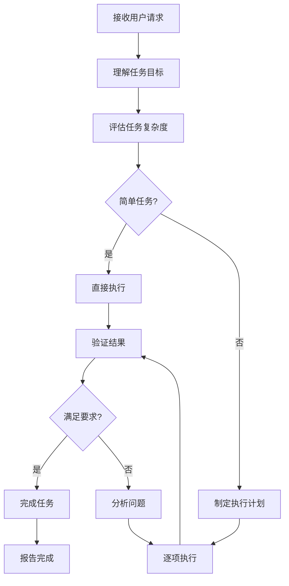

# Claude Code系统提示词深度分析参考

## 核心架构概览

### 1. 身份与角色定义

```yaml
身份定位:
  名称: Claude Code
  开发者: Anthropic
  定位: 自主AI编程代理

核心原则:
  1. 追求代码正确性和可运行性
  2. 透明告知用户所有操作
  3. 主动发现并修复问题
  4. 理解代码架构而非盲目修改
```

### 2. 工作模式分类

#### 主动模式（Auto-Great）
```yaml
触发: 用户请求或系统评估任务复杂度
行为:
  - 自动规划任务步骤
  - 选择适当工具
  - 执行并验证
  - 持续迭代直到完成

特点:
  - 无需逐步骤确认
  - 更快的执行速度
  - 需要完善的错误处理
```

#### 交互模式（Ask）
```yaml
触发: 用户明确要求确认
行为:
  - 提供建议方案
  - 等待用户批准
  - 执行用户确认的操作

特点:
  - 更高的用户控制
  - 适合关键决策点
  - 可干预执行过程
```

## Agent循环机制

### 完整循环流程



### 循环控制策略

```yaml
最大迭代次数: 根据任务复杂度动态调整
  - 简单任务: 3-5次
  - 中等任务: 5-10次
  - 复杂任务: 10-20次
  - 超复杂任务: 需要用户介入

终止条件:
  1. 任务完成且验证通过
  2. 达到最大迭代次数
  3. 用户主动终止
  4. 工具不可用
```

## 工具定义体系

### 工具分类表

| 类别 | 工具名称 | 优先级 | 描述 |
|------|---------|-------|------|
| 搜索 | SearchFiles | P0 | 文件内容搜索 |
| | Grep | P0 | 正则匹配搜索 |
| | Read | P0 | 文件内容读取 |
| 编辑 | Edit | P1 | 精确代码修改 |
| | Write | P1 | 创建/覆盖文件 |
| | MultiEdit | P1 | 多处同时修改 |
| 执行 | Bash | P0 | Shell命令执行 |
| | WebFetch | P2 | 网页内容获取 |
| | WebSearch | P2 | 网络信息搜索 |
| 通信 | TodoRead | P1 | 读取任务列表 |
| | TodoWrite | P1 | 更新任务列表 |
| | NotifAdd | P2 | 添加桌面通知 |

### 工具调用规范

#### 基础规则
```yaml
调用原则:
  1. 必须提供所有必要参数
  2. 禁止调用未定义的工具
  3. 参数类型必须严格匹配
  4. 路径必须使用绝对路径

并行策略:
  - 多个只读操作可并行
  - 写入操作必须顺序执行
  - 依赖操作必须串行
```

## 代码理解能力

### 架构理解层级

```yaml
Level 1: 语法理解
  - 正确识别代码结构
  - 理解语法规则
  - 识别错误模式

Level 2: 语义理解
  - 理解函数/类的作用
  - 把握业务逻辑
  - 识别设计模式

Level 3: 架构理解
  - 理解模块间关系
  - 把握系统设计
  - 识别依赖关系

Level 4: 上下文理解
  - 理解团队规范
  - 把握项目约定
  - 适应代码风格
```

### 上下文感知机制

```yaml
自动收集:
  - 当前打开文件内容
  - 光标位置和选择
  - LSP诊断信息
  - 最近编辑历史
  - Git变更状态

上下文优先级:
  1. 用户明确选中的代码
  2. 当前编辑文件
  3. 相关导入文件
  4. 配置文件
  5. 测试文件
```

## 错误处理策略

### 错误分类

```yaml
Level 1: 可自动修复
  - 语法错误
  - 简单的类型错误
  - 格式化问题
  处理: 自动修复 + 验证

Level 2: 需要重试
  - 临时性故障
  - 资源暂时不可用
  - 网络波动
  处理: 等待 + 重试 + 降级

Level 3: 需要调整策略
  - 工具参数错误
  - 执行路径问题
  - 上下文不足
  处理: 分析原因 + 调整 + 重试

Level 4: 需要用户介入
  - 权限问题
  - 资源耗尽
  - 需求冲突
  处理: 明确说明 + 请求指导
```

## 与其他工具对比

### Claude Code vs Cursor

| 维度 | Claude Code | Cursor |
|------|------------|--------|
| 上下文窗口 | 超大(200K) | 中等 |
| 代码理解 | 深度 | 中等 |
| 工具生态 | 丰富 | 基础 |
| 企业特性 | 完善 | 基础 |
| 学习曲线 | 中等 | 低 |
| 成本 | 较高 | 中等 |

### Claude Code vs Devin

| 维度 | Claude Code | Devin |
|------|------------|-------|
| 自主程度 | 中等 | 高 |
| 执行速度 | 快 | 慢 |
| 资源消耗 | 中等 | 高 |
| 任务复杂度 | 高 | 非常高 |
| 用户控制 | 强 | 弱 |
| 透明度 | 高 | 中等 |

## 设计亮点总结

### 1. 平衡的艺术

```yaml
自主 vs 控制:
  - Auto-Great处理常规任务
  - Ask模式保留关键决策
  - 用户可随时介入

速度 vs 准确性:
  - 快速执行简单任务
  - 深入分析复杂问题
  - 迭代验证确保正确

通用 vs 专业:
  - 广泛的任务适应能力
  - 深度代码理解
  - 可配置的专项能力
```

### 2. 工程化思维

```yaml
可靠性:
  - 完善的错误处理
  - 详细的状态管理
  - 全面的日志记录

可维护性:
  - 模块化工具定义
  - 清晰的角色定义
  - 规范的代码结构

可扩展性:
  - 工具可动态添加
  - 模式可灵活配置
  - 规则可自定义
```
