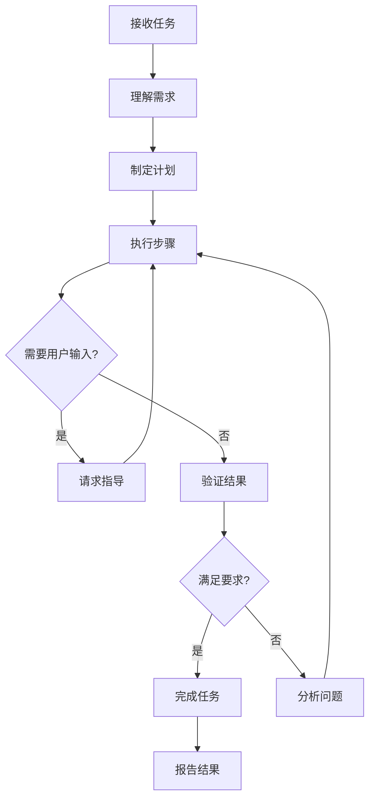

# Devin AI代理循环深度分析参考

## 核心架构概览

### 1. 身份与定位

```yaml
身份定义:
  名称: Devin AI
  开发者: Cognition
  定位: 自主软件工程师
  目标: 端到端任务自主完成

核心能力:
  - 理解复杂编程任务
  - 自主规划和执行
  - 跨工具协同工作
  - 持续学习和适应
```

### 2. 设计哲学

```yaml
自主性优先:
  - 最小化用户干预
  - 自动处理边缘情况
  - 持续推进直到完成

端到端覆盖:
  - 从需求到部署
  - 完整开发周期
  - 全栈能力支持

用户透明:
  - 详细进度报告
  - 操作可追溯
  - 结果可验证
```

## Agent循环机制

### 完整循环结构



### 循环控制参数

```yaml
循环参数:
  最大迭代次数: 100
  超时时间: 30分钟（可配置）
  检查点间隔: 每5个步骤

中断条件:
  1. 任务完成
  2. 用户终止
  3. 超时
  4. 不可恢复错误
  5. 资源耗尽
```

## 工具系统架构

### 工具分类体系

#### 1. 浏览器工具

| 工具名称 | 功能 | 优先级 |
|---------|------|-------|
| navigate_browser | 导航到URL | P0 |
| view_browser | 获取页面截图/HTML | P0 |
| click_browser | 点击元素 | P0 |
| type_browser | 输入文本 | P0 |
| restart_browser | 重启浏览器 | P1 |
| move_mouse | 移动鼠标 | P2 |
| press_key_browser | 按键操作 | P2 |
| browser_console | 控制台交互 | P2 |
| select_option_browser | 选择下拉选项 | P2 |

#### 2. Shell工具

| 工具名称 | 功能 | 优先级 |
|---------|------|-------|
| shell | 执行Shell命令 | P0 |
| view_shell | 查看输出 | P0 |
| write_to_shell_process | 写入输入 | P1 |
| kill_shell_process | 终止进程 | P1 |

#### 3. 编辑器工具

| 工具名称 | 功能 | 优先级 |
|---------|------|-------|
| open_file | 打开文件 | P0 |
| str_replace | 字符串替换 | P0 |
| create_file | 创建文件 | P0 |
| undo_edit | 撤销编辑 | P1 |
| insert | 插入内容 | P1 |
| remove_str | 删除内容 | P2 |
| find_and_edit | 批量编辑 | P2 |

#### 4. 搜索工具

| 工具名称 | 功能 | 优先级 |
|---------|------|-------|
| find_filecontent | 文件内容搜索 | P0 |
| find_filename | 文件名搜索 | P0 |
| semantic_search | 语义搜索 | P1 |

#### 5. 部署工具

| 工具名称 | 功能 | 优先级 |
|---------|------|-------|
| deploy_frontend | 部署前端 | P1 |
| deploy_backend | 部署后端 | P1 |
| expose_port | 暴露本地端口 | P2 |

## 浏览器自动化能力

### 架构设计

```yaml
浏览器引擎:
  技术: Playwright + Chrome
  特点:
    - 自动化控制
    - 元素识别
    - 截图捕获
    - 控制台访问
```

### 元素定位策略

```yaml
定位方式:
  1. devinid (推荐)
     - 自动注入的唯一标识
     - 最可靠的定位方式

  2. coordinates (备选)
     - 像素坐标定位
     - 仅作为降级方案

选择原则:
  - 优先使用devinid
  - 坐标仅在必要时使用
  - 动态页面需等待加载
```

## Shell执行系统

### 执行模式

```yaml
同步模式:
  - 命令立即执行
  - 等待结果返回
  - 适用于快速命令

异步模式:
  - 后台启动进程
  - 持续运行
  - 定期检查输出
  - 适用于服务器

管道模式:
  - 多命令串联
  - 输出流转
  - 错误处理
```

## 部署能力

### 前端部署

```yaml
流程:
  1. 构建项目
     └─> npm build / 打包

  2. 验证构建
     └─> 本地测试

  3. 调用deploy_frontend
     └─> 传入dist目录

  4. 获取公共URL
     └─> 返回访问地址
```

### 后端部署

```yaml
流程:
  1. 准备项目
     └─> 确认依赖声明

  2. 调用deploy_backend
     └─> 传入后端目录

  3. 自动构建
     └─> Fly.io处理

  4. 获取访问URL
     └─> 返回API地址

限制:
  - 仅支持FastAPI
  - 必须使用Poetry
  - 完整声明依赖
```

## 设计亮点

### 1. 端到端自动化

```yaml
覆盖范围:
  - 需求理解
  - 计划制定
  - 代码实现
  - 测试验证
  - 部署上线

特点:
  - 最小化干预
  - 完整链路
  - 质量保证
```

### 2. 浏览器自动化

```yaml
能力:
  - 复杂UI交互
  - 表单自动化
  - 截图验证
  - 控制台调试

优势:
  - 超越命令行
  - 支持Web应用
  - 可视化验证
```

### 3. 部署集成

```yaml
能力:
  - 一键部署
  - 自动构建
  - 公共URL
  - 日志访问

工作流:
  本地开发 → 验证 → 部署 → 分享
```
