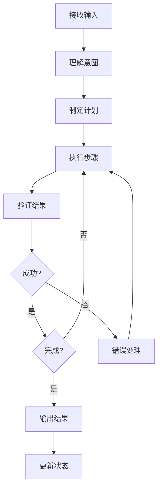

# AI Agent设计最佳实践参考

## Agent核心架构

### 1. 基础架构组件

```yaml
核心组件:
  1. 意图理解层
     - 自然语言解析
     - 任务类型识别
     - 参数提取

  2. 规划决策层
     - 任务分解
     - 步骤规划
     - 依赖分析

  3. 工具执行层
     - 工具选择
     - 参数构建
     - 结果处理

  4. 验证反馈层
     - 结果验证
     - 错误处理
     - 迭代优化

  5. 通信交互层
     - 用户消息
     - 状态更新
     - 结果呈现
```

### 2. 模式分类体系

#### 响应式Agent
```yaml
特点:
  - 即时响应
  - 单一交互
  - 快速反馈

适用场景:
  - 简单查询
  - 代码补全
  - 快速修改

设计要点:
  - 快速意图识别
  - 最小上下文
  - 高效执行
```

#### 任务型Agent
```yaml
特点:
  - 多步骤执行
  - 中长期任务
  - 状态管理

适用场景:
  - 功能开发
  - 代码重构
  - 问题修复

设计要点:
  - 任务分解能力
  - 状态持久化
  - 进度追踪
```

#### 自主型Agent
```yaml
特点:
  - 高度自主
  - 长时间运行
  - 端到端执行

适用场景:
  - 完整项目开发
  - 自动化测试
  - 持续集成

设计要点:
  - 风险管理机制
  - 检查点恢复
  - 用户介入点
```

## 工具定义规范

### 1. 工具分类框架

```yaml
分类原则:
  1. 功能维度
     - 搜索类
     - 读取类
     - 写入类
     - 执行类
     - 通信类

  2. 安全性维度
     - 只读操作
     - 有限写入
     - 完全写入
     - 危险操作

  3. 资源维度
     - 轻量操作
     - 中量操作
     - 重量操作
```

### 2. 工具schema设计

```yaml
标准结构:
  name: 工具名称
  description: 功能描述
  parameters:
    - name: 参数名
      type: 参数类型
      required: 是否必需
      description: 参数说明
    - name: 参数名
      type: 参数类型
      required: false
      description: 参数说明
      default: 默认值
  returns:
    type: 返回类型
    description: 返回说明
  errors:
    - 错误类型
    - 处理方式
```

### 3. 并行与顺序

```yaml
并行执行:
  条件:
    - 只读操作
    - 无依赖关系
    - 可同时执行

  示例:
    - 批量读取文件
    - 多个搜索查询
    - 并行HTTP请求

顺序执行:
  条件:
    - 写入操作
    - 有依赖关系
    - 共享资源

  示例:
    - 文件编辑
    - Shell命令
    - 部署操作
```

## 提示词结构设计

### 1. 模块化组织

```yaml
推荐结构:
  1. 身份定义模块
     - Agent名称
     - 核心能力
     - 行为准则

  2. 工具定义模块
     - 工具列表
     - 参数说明
     - 使用规范

  3. 上下文模块
     - 系统信息
     - 用户信息
     - 会话状态

  4. 任务处理模块
     - 任务类型
     - 处理流程
     - 验证方式

  5. 错误处理模块
     - 错误分类
     - 处理策略
     - 恢复机制
```

### 2. 指令优先级

```yaml
优先级体系:
  P0 - 必须遵守
    - 安全规则
    - 核心功能
    - 禁止行为

  P1 - 强烈建议
    - 最佳实践
    - 效率优化
    - 质量保证

  P2 - 推荐采用
    - 改进建议
    - 性能优化
    - 增强功能

  P3 - 可选采用
    - 便利功能
    - 辅助特性
```

## Agent循环设计

### 1. 标准循环结构



### 2. 循环控制参数

```yaml
控制参数:
  max_iterations: 最大迭代次数
    - 简单任务: 5次
    - 中等任务: 10次
    - 复杂任务: 20次

  timeout: 超时时间
    - 快速任务: 30秒
    - 标准任务: 5分钟
    - 长任务: 30分钟

  checkpoint_interval: 检查点间隔
    - 建议: 每5步
    - 用于恢复
```

## 错误处理策略

### 1. 错误分类

```yaml
Level 1: 可自动修复
  示例:
    - 语法错误
    - 简单格式问题
    - 类型不匹配
  处理:
    - 自动识别
    - 自动修复
    - 验证结果

Level 2: 需要重试
  示例:
    - 网络超时
    - 临时不可用
    - 资源竞争
  处理:
    - 等待后重试
    - 指数退避
    - 降级方案

Level 3: 需要调整
  示例:
    - 参数错误
    - 路径问题
    - 权限不足
  处理:
    - 分析原因
    - 调整参数
    - 重新执行

Level 4: 需要人工
  示例:
    - 需求冲突
    - 权限问题
    - 资源耗尽
  处理:
    - 明确说明
    - 请求指导
    - 等待决策
```

## 安全设计

### 1. 权限控制

```yaml
权限级别:
  1. ReadOnly
     - 文件读取
     - 信息查询
     - 搜索操作

  2. WriteRestricted
     - 文件编辑
     - 创建文件
     - 删除确认

  3. WriteFull
     - 无限制编辑
     - 系统命令
     - 危险操作

  4. Admin
     - 配置修改
     - 权限变更
     - 系统级操作
```

## 性能优化

### 1. 上下文优化

```yaml
优化策略:
  1. 上下文压缩
     - 摘要生成
     - 关键提取
     - 过期清理

  2. 增量更新
     - 只更新变化
     - 避免重复
     - 懒加载

  3. 智能缓存
     - 常用上下文
     - 查询结果
     - 解析结果
```

### 2. 执行优化

```yaml
优化策略:
  1. 并行执行
     - 独立任务
     - 只读操作
     - 无依赖

  2. 批量处理
     - 合并操作
     - 减少交互
     - 提高效率

  3. 预取优化
     - 预测需求
     - 提前加载
     - 减少等待
```

## 设计检查清单

```yaml
架构设计:
  ☐ Agent类型定义
  ☐ 工具分类完成
  ☐ 调用规范制定
  ☐ 状态管理设计
  ☐ 错误处理机制

提示词设计:
  ☐ 身份定义清晰
  ☐ 工具说明完整
  ☐ 规则表达准确
  ☐ 示例提供充分
  ☐ 优先级明确

实现检查:
  ☐ 工具schema验证
  ☐ 参数类型检查
  ☐ 错误处理覆盖
  ☐ 性能基准测试
  ☐ 安全审计通过

用户体验:
  ☐ 透明度充分
  ☐ 可控性良好
  ☐ 反馈及时
  ☐ 文档完整
```
