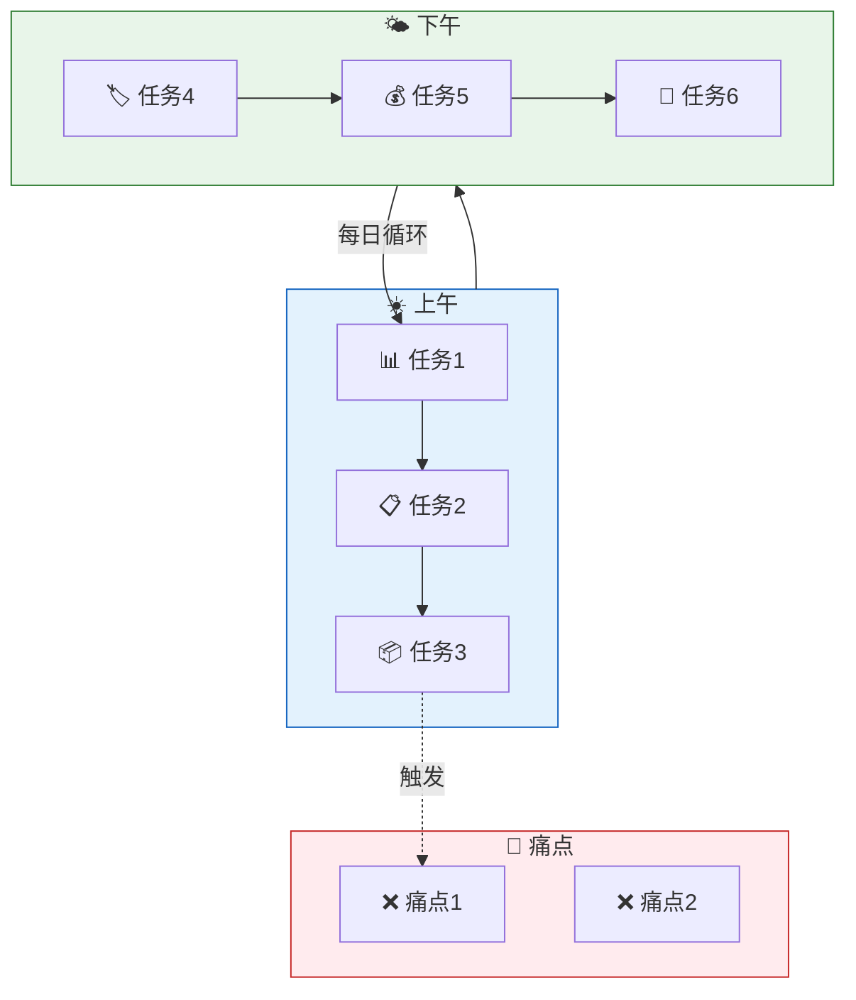
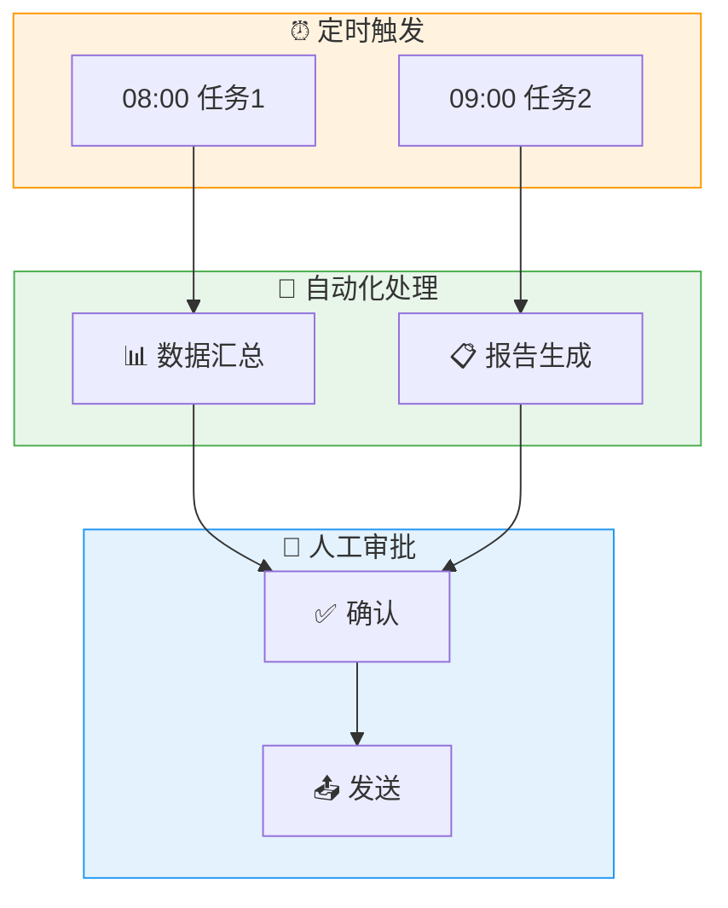

# Mermaid 图表模板（中文化）

> ⚠️ **此模板仅供生成 HTML 总结报告时参考**，聊天框内可视化已改用 ASCII 线框图。
> 仅在需要渲染 HTML 报告中的流程图时才加载本文件。

---

## 目录

1. [Mermaid 代码生成规范](#mermaid-代码生成规范)
2. [AS-IS 当前流程](#as-is-当前流程)
3. [TO-BE 优化流程](to-be-优化流程)

---

## Mermaid 代码生成规范

```
1. 只使用 flowchart TD 或 flowchart TB
2. 节点文字用 [] 包裹：node["文字"]
3. 子图用 subgraph name["标题"] ... end
4. 连接线用 --> 或 -.-> 或 --->
5. 中文引号内文字：|"中文"|  注意逗号是英文
6. style 放在 end 后面
7. 每个代码块必须完整闭合
```

---

## AS-IS 当前流程



---

## TO-BE 优化流程


