```mermaid
flowchart TD
    Start([用户提出需求]) --> Step1[步骤1: 大管家初步分析<br/>📋 确认项目归属<br/>📋 判断需求类型<br/>📋 召集相关角色]

    Step1 --> Step2[步骤2: 多角色并行讨论会<br/>👥 大管家+产品经理+研发+测试+CTO<br/>⚡ 同时参与,实时讨论]

    Step2 --> Parallel1[步骤3: 各角色并行整理]

    Parallel1 --> P1A[产品经理:<br/>整理需求草案]
    Parallel1 --> P1B[研发:<br/>思考技术可行性]
    Parallel1 --> P1C[测试:<br/>思考测试要点]
    Parallel1 --> P1D[CTO:<br/>思考技术风险]

    P1A --> Step3[步骤4: 大管家汇总各角色意见]
    P1B --> Step3
    P1C --> Step3
    P1D --> Step3

    Step3 --> QC1{质量关卡1:<br/>需求是否明确?}

    QC1 -->|否| Step2
    QC1 -->|是| Step4[步骤5: 用户确认需求]

    Step4 --> Parallel2[步骤6: 方案并行设计]

    Parallel2 --> P2A[产品经理:<br/>输出PRD]
    Parallel2 --> P2B[研发:<br/>设计技术方案]
    Parallel2 --> P2C[测试:<br/>设计测试方案]
    Parallel2 --> P2D[CTO:<br/>设计架构方案]

    P2A --> Step5[步骤7: 方案评审会<br/>⚡ 所有角色同时评审]
    P2B --> Step5
    P2C --> Step5
    P2D --> Step5

    Step5 --> QC2{质量关卡2:<br/>方案通过审核?}

    QC2 -->|否| Parallel2
    QC2 -->|是| Step6[步骤8: 用户批准方案]

    Step6 --> Parallel3[步骤9: 开发阶段-并行工作 ⭐⭐]

    Parallel3 --> P3A[研发:<br/>编写代码<br/>每次commit]
    Parallel3 --> P3B[CTO:<br/>实时review代码<br/>及时反馈]
    Parallel3 --> P3C[测试:<br/>准备测试用例<br/>准备测试环境]
    Parallel3 --> P3D[产品经理:<br/>准备验收标准<br/>跟踪进度]

    P3A -->|持续交互| P3B
    P3B -->|实时反馈| P3A

    P3A --> DevDone{开发完成?}
    P3B --> DevDone
    P3C --> DevDone
    P3D --> DevDone

    DevDone -->|否,继续| Parallel3
    DevDone -->|是| QC3{质量关卡3:<br/>CTO代码审查通过?}

    QC3 -->|否| Parallel3
    QC3 -->|是| Parallel4[步骤10: 验收阶段-并行验收 ⭐]

    Parallel4 --> P4A[测试:<br/>功能测试<br/>回归测试]
    Parallel4 --> P4B[产品经理:<br/>业务验收<br/>体验验收]

    P4A --> Step7[步骤11: 大管家汇总验收结果]
    P4B --> Step7

    Step7 --> QC4{质量关卡4:<br/>验收通过?}

    QC4 -->|否| Parallel3
    QC4 -->|是| Step8[步骤12: 大管家终审<br/>⚠️ 亲自运行验证<br/>✅ 汇总所有反馈]

    Step8 --> Step9[步骤13: 绩效评估<br/>📊 评估所有参与角色]

    Step9 --> QC5{质量关卡5:<br/>终审通过?}

    QC5 -->|否| Parallel3
    QC5 -->|是| Step10[步骤14: 大管家交付]

    Step10 --> Step11[步骤15: 用户验收]

    Step11 --> Final{用户验收结果}

    Final -->|通过| Parallel5[步骤16: 归档-并行归档]
    Final -->|需修改| Parallel3

    Parallel5 --> P5A[研发:更新代码文档]
    Parallel5 --> P5B[测试:归档测试报告]
    Parallel5 --> P5C[产品:更新项目文档]
    Parallel5 --> P5D[大管家:更新知识库]

    P5A --> End([项目完成])
    P5B --> End
    P5C --> End
    P5D --> End

    style Parallel3 fill:#ff6b6b,stroke:#c92a2a,color:#fff
    style Parallel4 fill:#ffe066,stroke:#f59f00
    style P3B fill:#74c0fc,stroke:#1c7ed6
    style Start fill:#51cf66,stroke:#2f9e44
    style End fill:#51cf66,stroke:#2f9e44
```

# 需求到交付流程图(并行工作版)

## 🔥 核心改变:从串行到并行

### ❌ 旧版问题(串行模式)
```
研发写代码 → CTO审查 → 测试 → 产品验收 → 大管家终审
(每个环节都在等待,效率极低)
```

### ✅ 新版设计(并行模式)
```
研发+CTO+测试+产品 → 同时工作,实时协作
```

---

## ⚡ 5个并行工作阶段

### 并行1: 需求讨论阶段
**谁参与**: 大管家+产品经理+研发+测试+CTO
**工作方式**:
- 所有人**同时参与**讨论会
- 实时交流,不是依次发言
- 各角色**并行整理**各自的理解

---

### 并行2: 方案设计阶段
**并行工作**:
- 产品经理 → 写PRD
- 研发 → 设计技术方案
- 测试 → 设计测试方案
- CTO → 设计架构方案

**汇总**: 方案评审会(所有人同时评审)

---

### 并行3: 开发阶段 ⭐⭐ 最关键

**并行工作模式**:

```
研发写代码 ──────────┐
  ↓ 每次commit      │
CTO实时review ───────├─→ 持续交互
  ↓ 及时反馈        │
研发及时修正 ─────────┤
                    │
测试准备测试用例 ────┤
                    │
产品准备验收标准 ────┘
```

**关键点**:
- 研发不是写完全部代码才提交
- CTO不是等研发写完才review
- **实时review,小批次反馈**
- 测试和产品**同步准备**,不是被动等待

---

### 并行4: 验收阶段 ⭐

**并行验收**:
```
测试验收 ─────┐
              ├─→ 同时进行
产品验收 ─────┘
    ↓
大管家汇总结果
```

**不是**:
```
❌ 测试通过 → 产品验收 → 大管家终审
```

---

### 并行5: 归档阶段

**并行归档**:
- 研发更新代码文档
- 测试归档测试报告
- 产品更新项目文档
- 大管家更新知识库

**同时进行,不用等待**

---

## 🎯 质量关卡说明

### 关卡1: 需求明确性
- 大管家汇总所有角色的意见后检查

### 关卡2: 方案评审
- 所有角色的方案都通过评审

### 关卡3: 代码审查 ⭐
- CTO在整个开发过程中**实时review**
- 开发完成时的最终检查

### 关卡4: 并行验收
- 测试+产品同时验收,大管家汇总

### 关卡5: 大管家终审
- 最后把关

---

## 💡 并行工作原则

### 原则1: 能并行的绝不串行
- 讨论 → 并行讨论
- 设计 → 并行设计
- 验收 → 并行验收

### 原则2: 实时协作,不是批量交接
- 研发每次commit,CTO就review
- 不是写完全部代码才交给CTO

### 原则3: 主动监控,不是被动等待
- CTO主动监控代码提交
- 测试主动跟踪开发进度
- 产品主动关注功能实现

---

## 🚀 效率提升

### 串行模式耗时(假设)
```
需求讨论(1天) → PRD(1天) → 评审(1天) →
开发(3天) → 代码审查(1天) → 测试(2天) →
产品验收(1天) → 终审(1天)
= 12天
```

### 并行模式耗时
```
需求讨论(1天,所有人同时)
方案设计(1天,并行设计)
开发+实时review(3天,同时进行)
并行验收(1天,同时验收)
终审(0.5天)
= 6.5天
```

**效率提升**: 约50%

---

## ⚠️ 注意事项

### 1. 实时review不是打断工作
- CTO可以批量review多个commit
- 不是每个commit都立即review
- 但要及时,不要拖到最后

### 2. 并行不是混乱
- 大管家负责协调
- 定期同步进度
- 关键节点汇总

### 3. 质量不降低
- 该有的检查点一个都不能少
- 并行是提高效率,不是降低标准

---

**设计版本**: v2.0 (并行工作版)
**设计日期**: 2026-03-09
**核心改进**: 从串行改为并行,效率提升约50%
