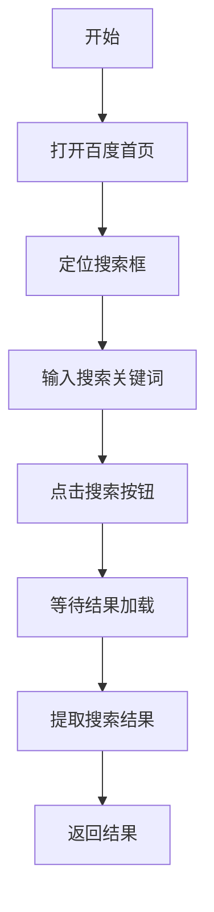

# 百度搜索自动化

This skill provides automated Baidu search functionality using browser automation.

## 功能概述

通过浏览器自动化工具在百度上执行搜索，获取搜索结果页面内容。

### 核心功能

1. **自动化搜索**: 在百度搜索页面输入关键词并执行搜索
2. **结果提取**: 获取搜索结果页面的标题和链接
3. **浏览器操作**: 使用 browser_agent 进行页面交互

## 使用方式

### 执行搜索

使用 `browser_agent` 工具执行百度搜索：

```
打开百度首页 https://www.baidu.com
在搜索框中输入关键词
点击"百度一下"按钮
等待搜索结果加载完成
返回搜索结果页面内容
```

### 参数

- **搜索关键词**: 用户提供的搜索词

## 工作流程



## 使用示例

### 示例 1：搜索技术文档

**用户**: 帮我在百度上搜索 "Python requests 文档"

**执行**:
1. 打开 https://www.baidu.com
2. 在搜索框输入 "Python requests 文档"
3. 点击搜索按钮
4. 返回搜索结果

### 示例 2：获取搜索结果列表

**用户**: 百度搜索 "快手生服 API"

**执行**:
1. 访问百度首页
2. 输入关键词 "快手生服 API"
3. 获取前10条搜索结果
4. 整理结果列表返回给用户

## 注意事项

1. **网络依赖**: 需要稳定的网络连接
2. **页面结构**: 如果百度页面结构变化，可能需要更新选择器
3. **反爬虫**: 频繁搜索可能触发验证码
4. **结果格式**: 返回的是页面内容，可能需要进一步解析

## 技术实现

使用 `browser_agent` 工具进行浏览器自动化：

- **打开页面**: `browser_agent` 访问 https://www.baidu.com
- **输入操作**: 在搜索框元素中输入关键词
- **点击操作**: 触发搜索按钮
- **结果等待**: 等待结果页面加载完成

## 限制说明

- 不支持登录状态下的搜索
- 不支持高级搜索选项（时间筛选、文件类型等）
- 搜索结果受百度算法和地域影响
