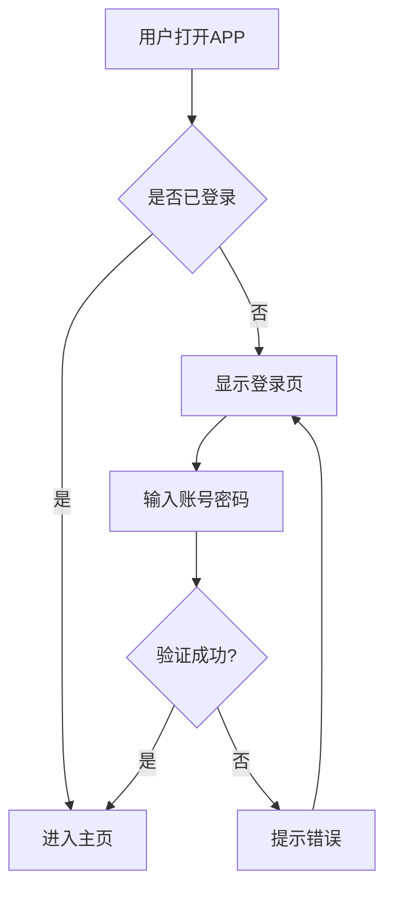
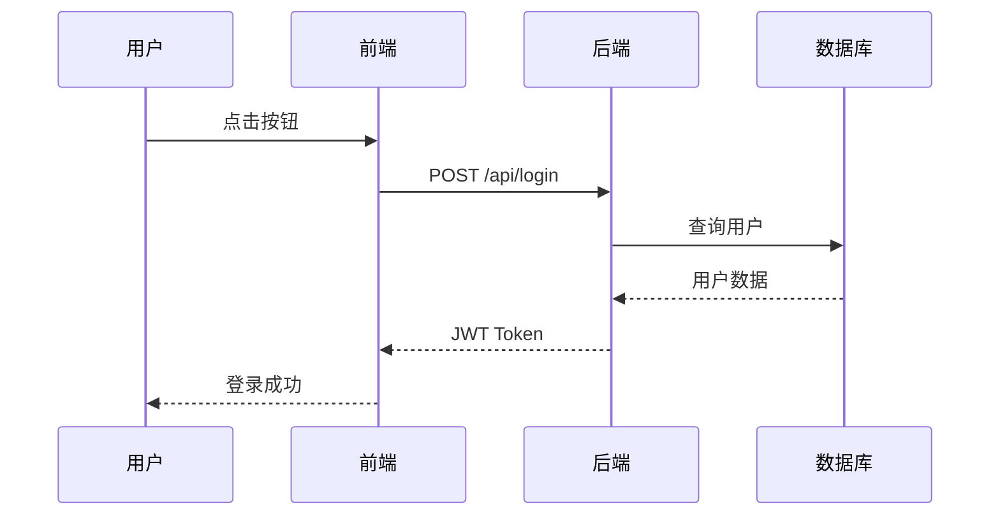
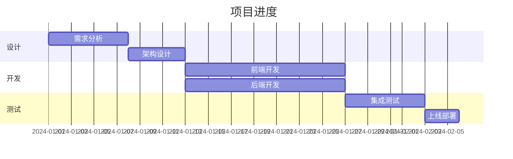
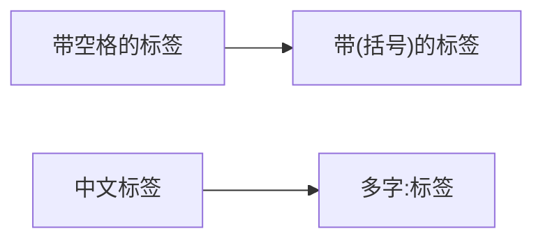

# SKILL.md — mermaid-canvas

> **Mermaid Canvas**：将 Mermaid 代码渲染为图片，用浏览器当画布。
>
> 版本：v1.0.0
> 技能名称：mermaid-canvas
> 触发词：`/mermaid`、`mermaid图表`、`画图`、`生成图表`

---

## 一、什么时候用这个技能

当用户请求以下内容时，使用此技能：

- "画一个流程图"
- "生成时序图"
- "帮我画个架构图"
- "/mermaid"
- "mermaid图表"
- "用 Mermaid 画"
- 以及任何涉及创建图表（流程图、时序图、甘特图等）的请求

---

## 二、核心能力

| 能力 | 说明 |
|------|------|
| **图表渲染** | 将 Mermaid 代码渲染为 PNG 图片 |
| **飞书集成** | 直接上传图片到飞书文档 |
| **零依赖** | 不需要任何 API Key |
| **27 种图表** | 支持 Mermaid 11 全部图表类型 |

---

## 三、技术方案

### 渲染流程

```
1. 接收 Mermaid 代码
2. 生成临时 HTML（含 Mermaid CDN）
3. Browser navigate 到本地 HTML
4. 等待 Mermaid 渲染完成
5. snapshot 截图
6. 保存为 PNG
7. 可选：feishu_doc_media 上传到飞书
```

### HTML 模板

```html
<!DOCTYPE html>
<html>
<head>
  <meta charset="utf-8">
  <script src="https://cdn.jsdelivr.net/npm/mermaid@11/dist/mermaid.min.js"></script>
  <style>
    body { margin: 20px; background: white; }
    pre.mermaid { display: flex; justify-content: center; align-items: center; min-height: 300px; }
  </style>
</head>
<body>
  <pre class="mermaid">
    %% Mermaid 代码在这里
    flowchart LR
    A --> B
  </pre>
  <script>
    mermaid.initialize({ startOnLoad: true, theme: 'default', securityLevel: 'loose' });
  </script>
</body>
</html>
```

---

## 四、支持的图表类型（Mermaid 11 全部 27 种）

| 类型 | 关键字 | 触发关键词 |
|------|--------|-----------|
| **流程图** | `flowchart` | 流程图、flowchart、流程 |
| **时序图** | `sequenceDiagram` | 时序图、sequence、API图 |
| **类图** | `classDiagram` | 类图、classDiagram、类 |
| **状态图** | `stateDiagram` | 状态图、stateDiagram、状态机 |
| **实体关系图** | `erDiagram` | ER图、erDiagram、实体关系 |
| **甘特图** | `gantt` | 甘特图、gantt、项目进度 |
| **饼图** | `pie` | 饼图、pie、比例 |
| **思维导图** | `mindmap` | 思维导图、mindmap、脑图 |
| **时间线** | `timeline` | 时间线、timeline |
| **用户旅程** | `journey` | 用户旅程、journey |
| **架构图** | `architecture` | 架构图、architecture、系统架构 |
| **Git 图** | `gitGraph` | gitGraph、Git图 |
| **象限图** | `quadrantChart` | 象限图、quadrantChart |
| **XY 图表** | `xyChart` | xyChart、XY图 |
| **需求图** | `requirementDiagram` | 需求图、requirementDiagram |
| **C4 图** | `c4Diagram` | C4图、C4Diagram |
| **雷达图** | `radar` | 雷达图、radar |
| **桑基图** | `sankey` | 桑基图、sankey、流量图 |
| **块图** | `block` | 块图、block |
| **石川图** | `ishikawa` | 石川图、鱼骨图 |
| **维恩图** | `venn` | 维恩图、venn |
| **树状图** | `treemap` | 树状图、treemap |
| **Wardley 图** | `wardley` | wardley图、Wardley |
| **事件建模图** | `eventmodeling` | 事件建模、eventmodeling |
| **看板图** | `kanban` | 看板、kanban |
| **数据包图** | `packet` | 数据包、packet |
| **树视图** | `treeView` | 树视图、treeView |

---

## 五、图表类型自动判断规则

当用户描述不明确时，按以下规则判断：

| 用户描述 | 判断类型 | 默认关键字 |
|---------|---------|-----------|
| "画个流程" | 流程图 | `flowchart TD` |
| "API调用" | 时序图 | `sequenceDiagram` |
| "项目进度" | 甘特图 | `gantt` |
| "占比分布" | 饼图 | `pie` |
| "思路整理" | 思维导图 | `mindmap` |
| "决策流程" | 流程图 | `flowchart TD` |
| "系统结构" | 架构图 | `architecture` |
| "数据库设计" | 实体关系图 | `erDiagram` |

---

## 六、使用示例

### 示例 1：流程图

**用户请求**：
```
画一个用户登录的流程图
```

**生成的 Mermaid 代码**：
````markdown

````

**渲染结果**：PNG 图片

---

### 示例 2：时序图

**用户请求**：
```
生成一个API调用的时序图
```

**生成的 Mermaid 代码**：
````markdown

````

---

### 示例 3：甘特图

**用户请求**：
```
画一个项目甘特图
```

**生成的 Mermaid 代码**：
````markdown

````

---

## 七、安全语法规范

### 7.1 节点 ID 安全规则

**禁用词汇**（作为节点 ID）：
- `end`、`subgraph`、`graph`、`flowchart`
- `sequenceDiagram`、`classDiagram`、`stateDiagram`

**正确做法**：
```mermaid
%% 错误 ❌
flowchart
    end --> start

%% 正确 ✅
flowchart
    EndState --> StartState
```

### 7.2 标签引号规则

**何时使用引号**：
- 含空格的标签
- 含特殊字符：`(`, `)`, `[`, `]`, `{`, `}`, `:`, `;`
- 含中文的标签

**语法**：


---

## 八、执行脚本

### 8.1 渲染函数

```python
# scripts/mermaid_render.py

def render_mermaid_to_png(
    mermaid_code: str,
    output_path: str = "/tmp/mermaid_output.png",
    theme: str = "default"
) -> str:
    """
    将 Mermaid 代码渲染为 PNG
    
    Args:
        mermaid_code: Mermaid 图表代码
        output_path: 输出图片路径
        theme: Mermaid 主题 (default/dark/base/wind)
    
    Returns:
        渲染后的图片路径
    """
    pass
```

### 8.2 渲染+飞书上传

```python
def render_and_upload_feishu(
    mermaid_code: str,
    doc_id: str
) -> str:
    """
    渲染 Mermaid 并上传到飞书
    
    Args:
        mermaid_code: Mermaid 图表代码
        doc_id: 飞书文档 ID
    
    Returns:
        飞书图片 token
    """
    pass
```

---

## 九、常见问题

### Q1: 图表不渲染怎么办？

**可能原因**：
1. Mermaid 代码语法错误
2. 浏览器未启动
3. CDN 访问超时

**解决方案**：
1. 在 https://mermaid.live 验证代码语法
2. 检查 OpenClaw browser 状态
3. 等待更长时间让 Mermaid 渲染完成

### Q2: 中文显示乱码？

**原因**：HTML 编码问题

**解决**：确保 HTML 使用 `meta charset="utf-8"`

### Q3: 图片显示不完整？

**原因**：图表节点太多太复杂

**解决**：简化图表，或使用 subgraph 分组

### Q4: 支持哪些 Mermaid 版本？

**答案**：Mermaid 11（最新稳定版）

---

## 十、文件结构

```
mermaid-canvas/
├── SKILL.md                          # 本文件
├── scripts/
│   └── mermaid_render.py              # 核心渲染脚本
└── references/
    ├── diagram-patterns.md            # 常用图表模板
    └── syntax-guide.md               # 安全语法规范
```

---

## 十一、参考文件

| 文件 | 说明 |
|------|------|
| `references/diagram-patterns.md` | 常用图表类型的代码模板 |
| `references/syntax-guide.md` | 安全语法规范和最佳实践 |

---

## 十二、相关链接

- [Mermaid 官方文档](https://mermaid.nodejs.cn/)
- [Mermaid Live Editor](https://mermaid.live/)
- [Mermaid CDN](https://cdn.jsdelivr.net/npm/mermaid@11/dist/mermaid.min.js)
