# diagram-patterns.md — 常用图表模板

> Mermaid Canvas 参考文件：常用图表类型的代码模板
>
> 版本：v1.0.0

---

## 一、流程图 (flowchart)

### 1.1 基础流程图

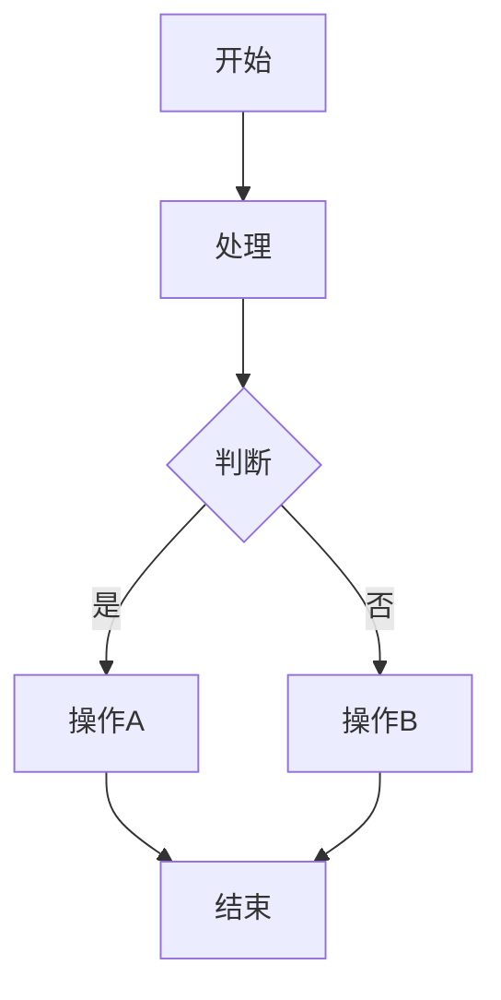

### 1.2 用户登录流程

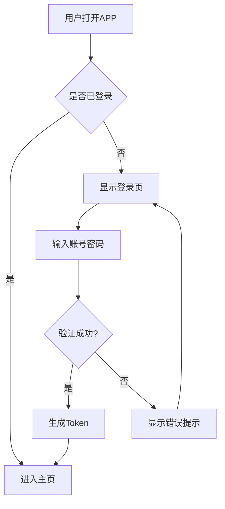

### 1.3 订单处理流程

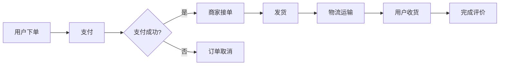

### 1.4 决策树

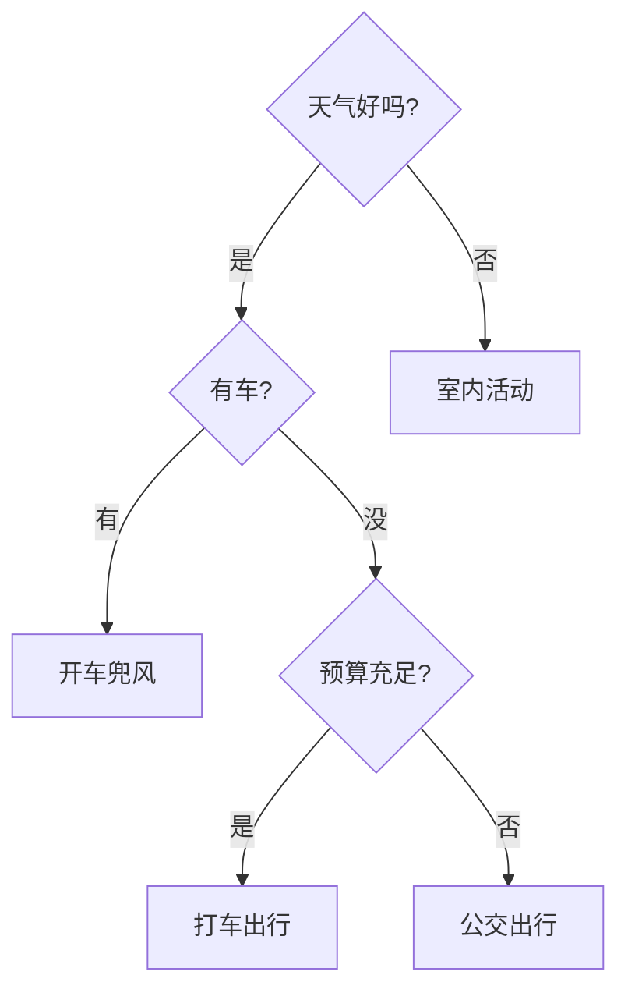

### 1.5 子图分组

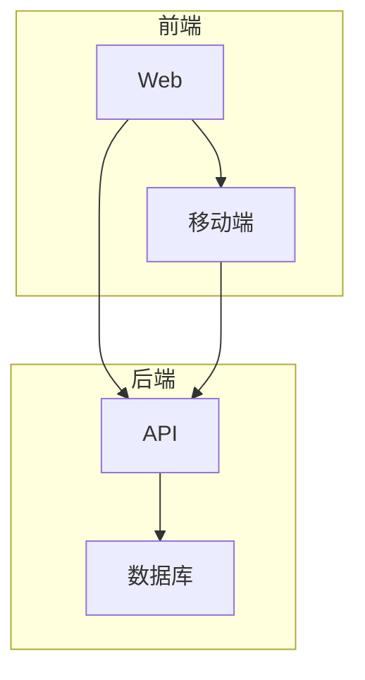

---

## 二、时序图 (sequenceDiagram)

### 2.1 API 调用时序

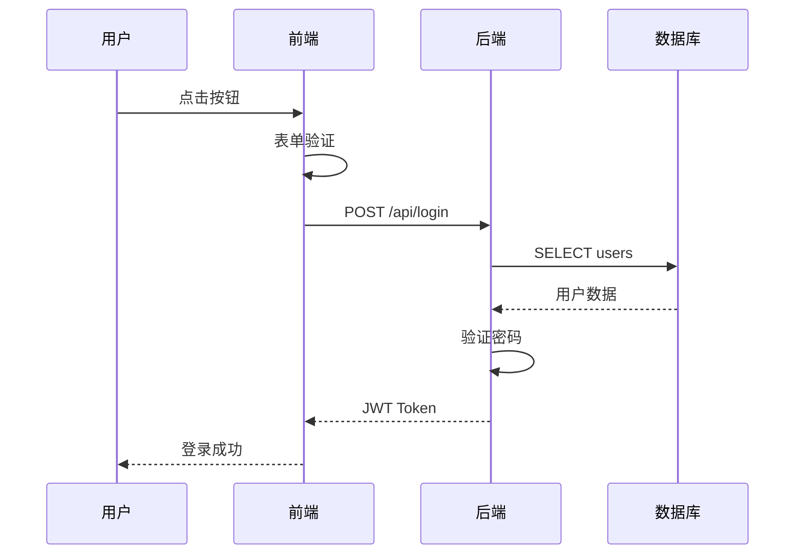

### 2.2 用户注册时序

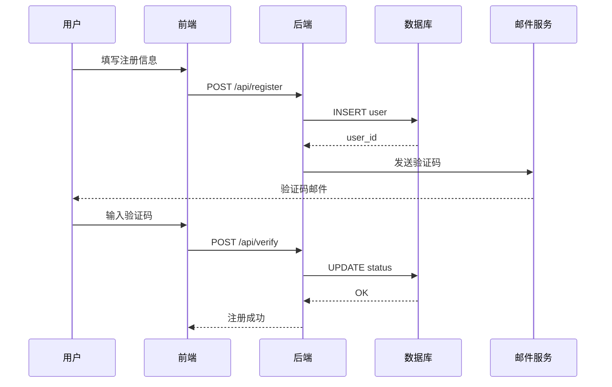

### 2.3 微服务调用

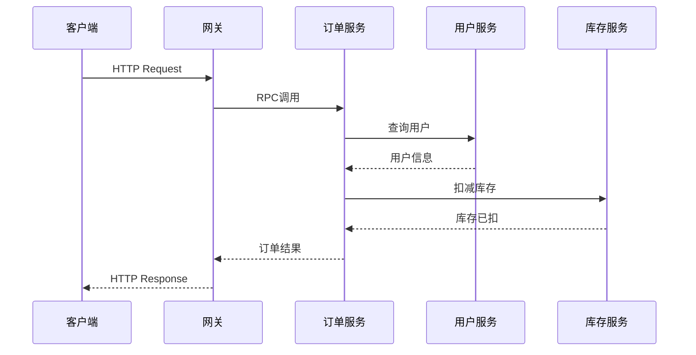

---

## 三、类图 (classDiagram)

### 3.1 基础类结构

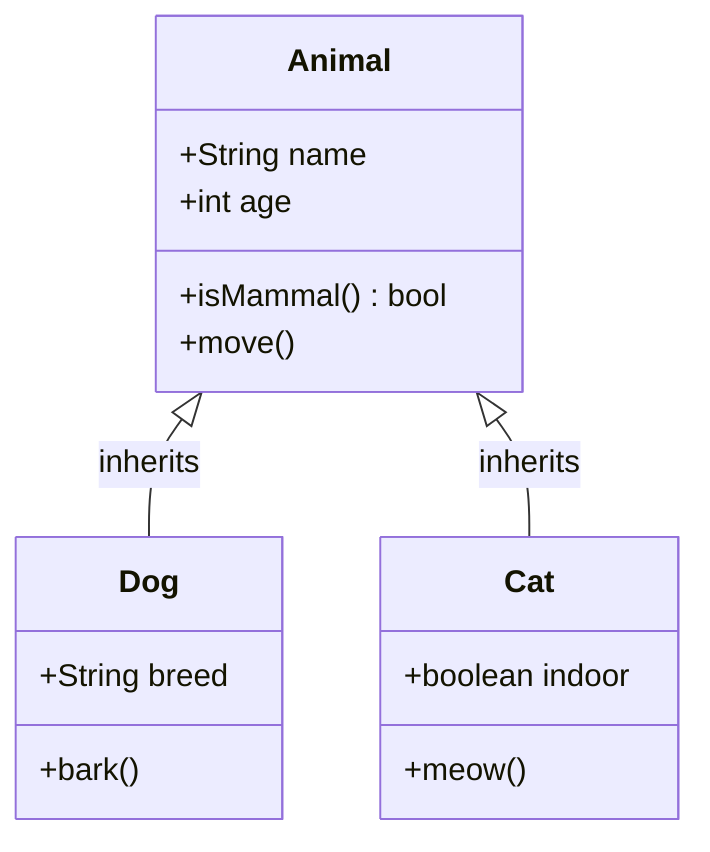

### 3.2 订单系统类图

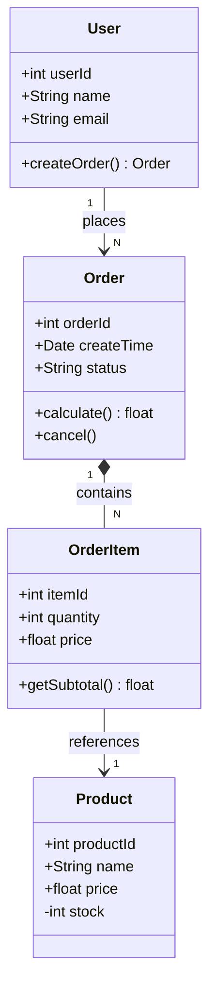

---

## 四、状态图 (stateDiagram)

### 4.1 订单状态机

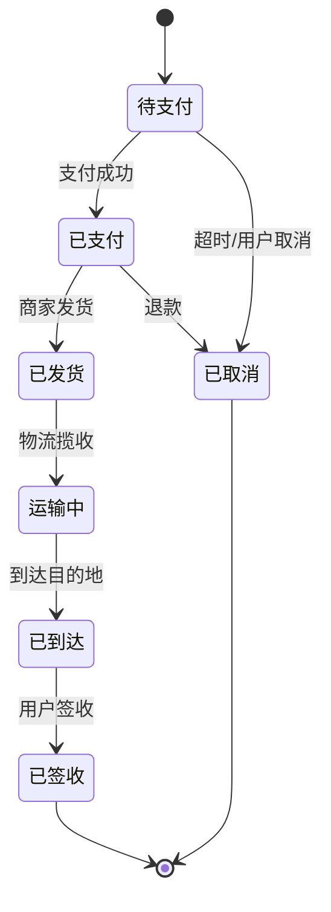

### 4.2 用户状态

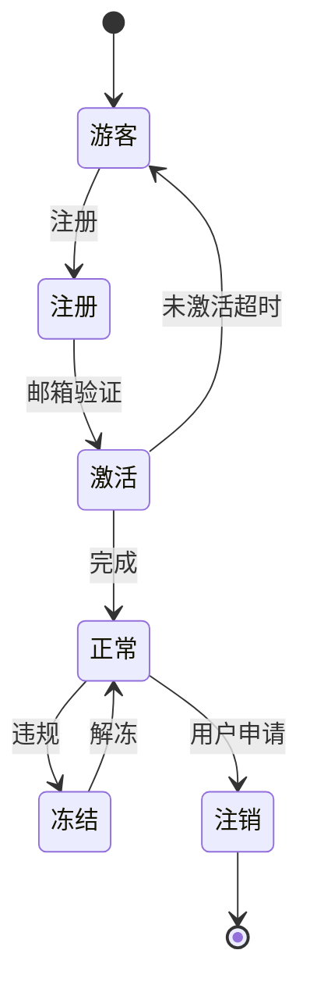

---

## 五、甘特图 (gantt)

### 5.1 项目进度

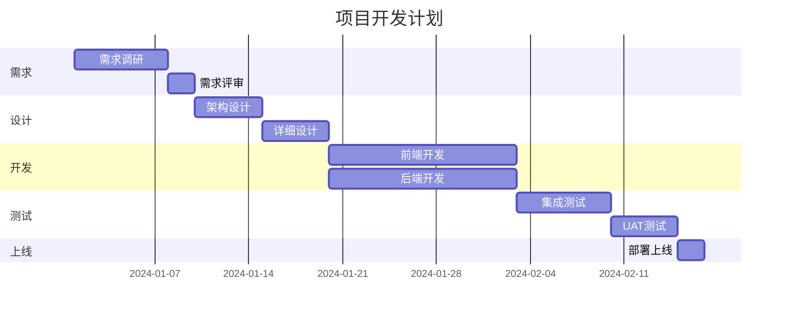

### 5.2 Sprint 计划

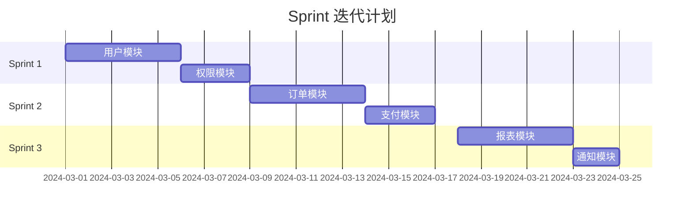

---

## 六、饼图 (pie)

### 6.1 项目预算分布

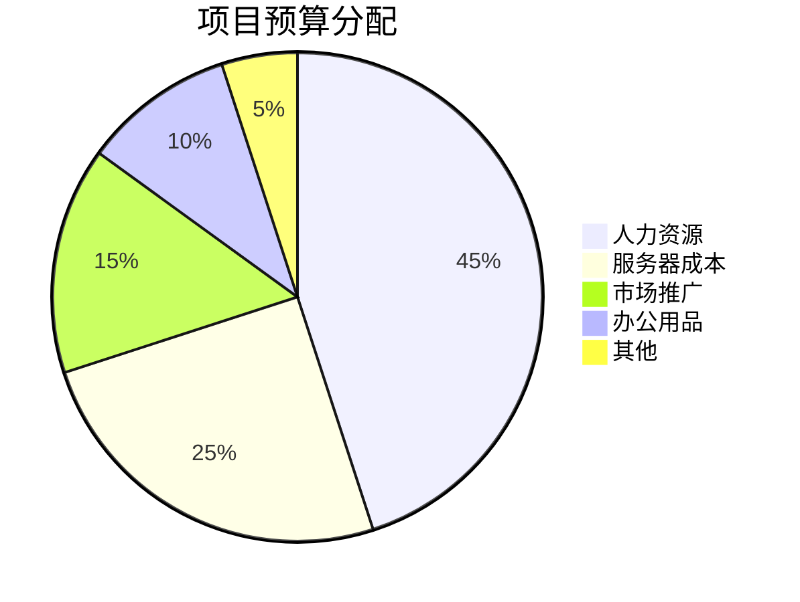

### 6.2 用户来源统计

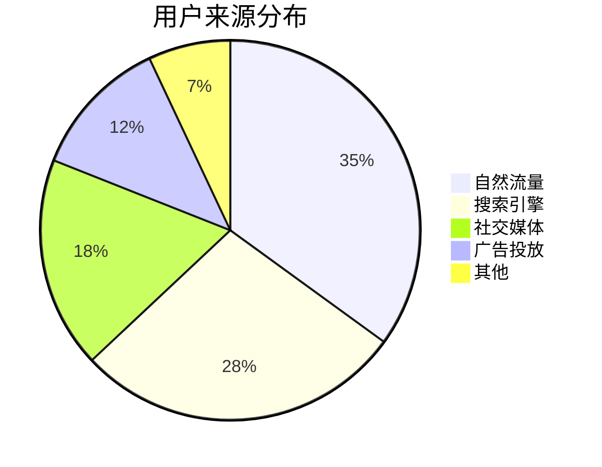

---

## 七、思维导图 (mindmap)

### 7.1 产品功能规划

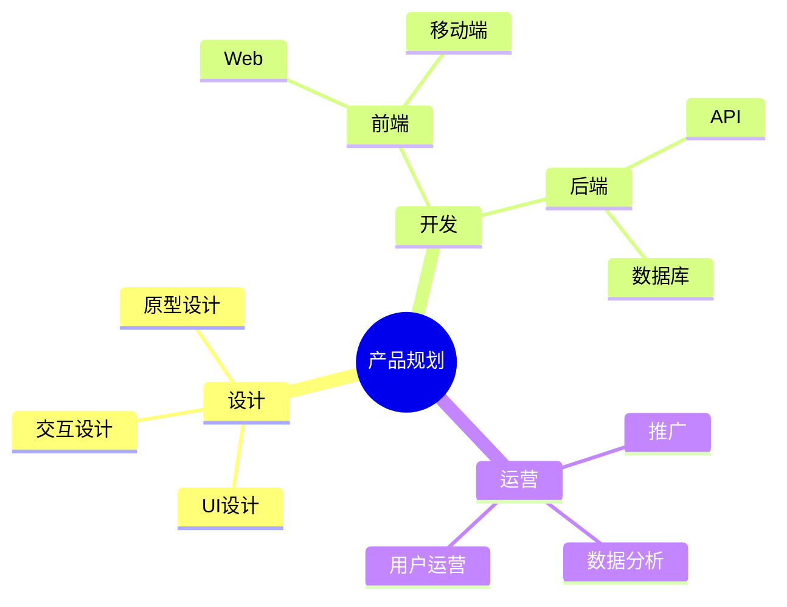

### 7.2 会议纪要

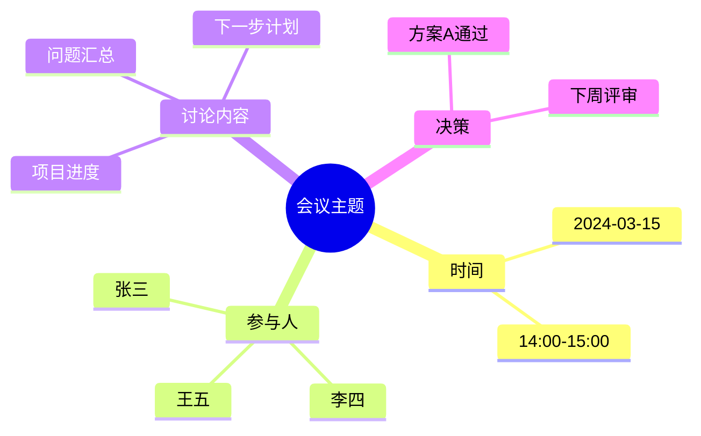

---

## 八、架构图 (architecture)

### 8.1 系统架构


---

## 九、ER 图 (erDiagram)

### 9.1 电商 ER 图

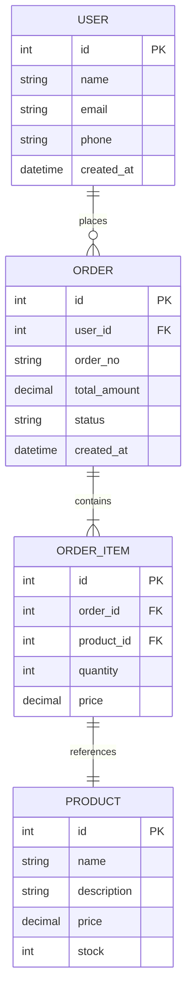

---

## 十、时间线 (timeline)

### 10.1 项目里程碑

```mermaid
timeline
    title 项目里程碑
    
    2024-Q1
        需求分析
        架构设计
    2024-Q2
        开发完成
        测试通过
    2024-Q3
        上线发布
        用户反馈
    2024-Q4
        版本迭代
        年度总结
```

---

## 十一、用户旅程 (journey)

### 11.1 用户购物流程

```mermaid
journey
    title 用户购物流程
    section 浏览
        打开APP : 5 : 用户
        浏览商品 : 4 : 用户
        查看详情 : 4 : 用户
    section 购买
        加入购物车 : 5 : 用户
        结算订单 : 3 : 用户
        选择支付 : 4 : 用户
    section 售后
        查看物流 : 3 : 用户
        确认收货 : 5 : 用户
        评价商品 : 4 : 用户
```
