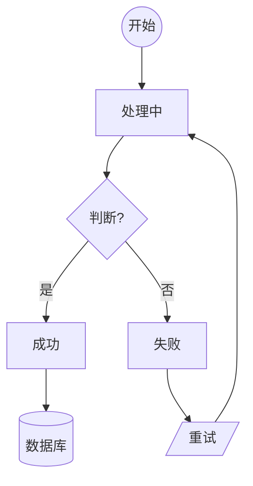
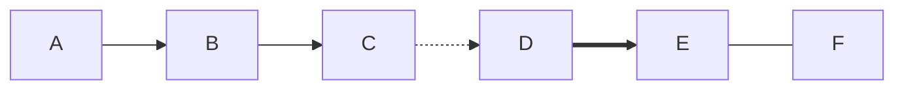
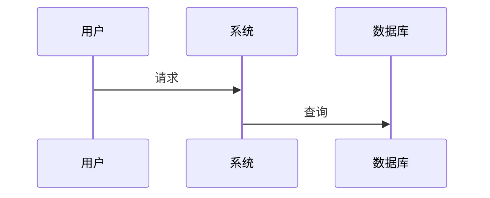
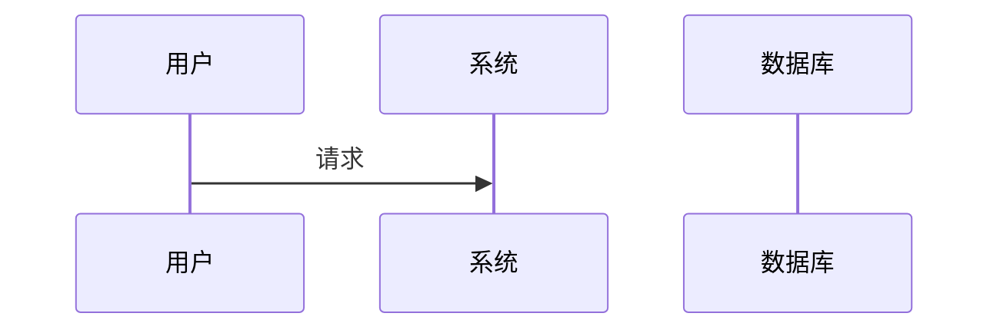
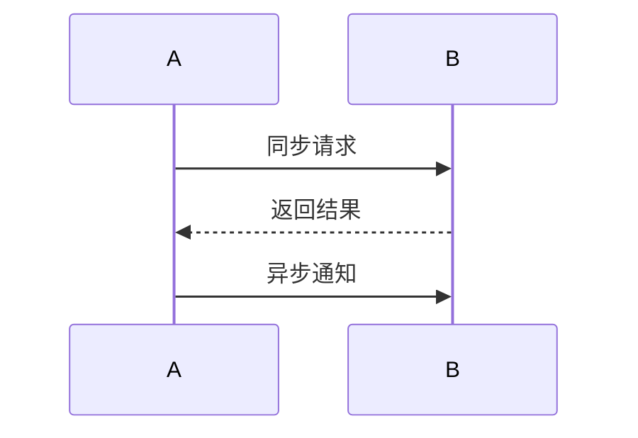
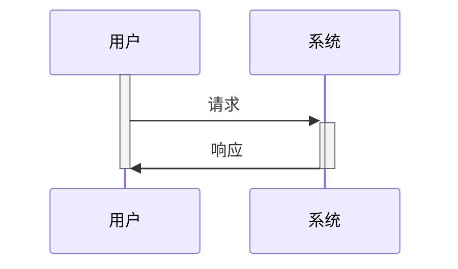
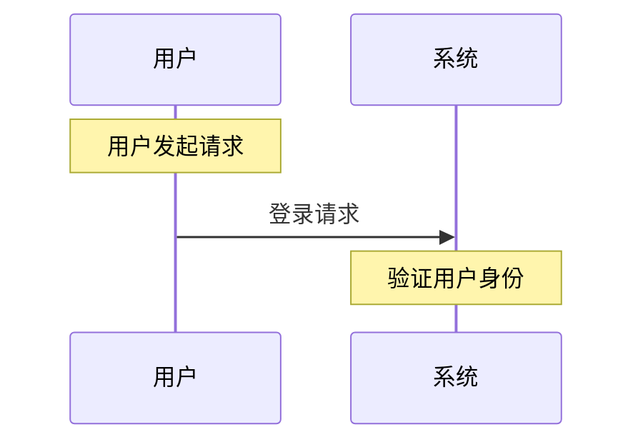
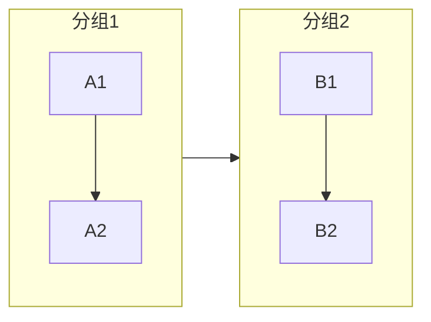
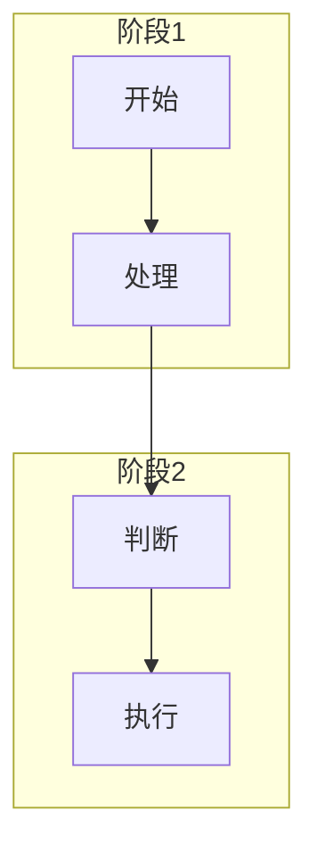
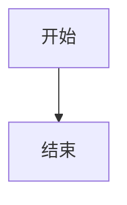

# syntax-guide.md — Mermaid 安全语法规范

> Mermaid Canvas 参考文件：安全语法规范和最佳实践
>
> 版本：v1.0.0

---

## 一、安全语法规则

### 1.1 禁用词汇（节点 ID）

以下词汇**不能**作为节点 ID 使用：

| 禁用词汇 | 原因 |
|---------|------|
| `end` | Mermaid 关键字 |
| `start` | 常用关键字，可能冲突 |
| `subgraph` | Mermaid 关键字 |
| `graph` | Mermaid 关键字 |
| `flowchart` | Mermaid 关键字 |
| `sequenceDiagram` | Mermaid 关键字 |
| `classDiagram` | Mermaid 关键字 |
| `stateDiagram` | Mermaid 关键字 |
| `true` / `false` | JavaScript 关键字 |
| `null` / `undefined` | JavaScript 关键字 |

**正确做法**：使用驼峰命名或下划线分隔

```mermaid
%% 错误 ❌
flowchart
    end --> start
    true --> false

%% 正确 ✅
flowchart
    EndState --> StartState
    IsValid --> IsInvalid
```

### 1.2 标签引号规则

**必须使用引号**的情况：

| 情况 | 示例 | 说明 |
|------|------|------|
| 含空格的标签 | `"用户 名称"` | 否则被解析为两个节点 |
| 含特殊字符 | `"价格:$100"` | `:` 可能导致解析错误 |
| 含中文 | `"用户名"` | 中文引号保证兼容 |
| 含括号 | `"条件(是)"` | `()` 是节点形状语法 |
| 含方括号 | `"数组[0]"` | `[]` 可能冲突 |
| 以数字开头 | `"1号"` | 可能被解析为数字 |

**语法示例**：


---

## 二、流程图语法

### 2.1 方向声明

| 声明 | 含义 | 适用场景 |
|------|------|---------|
| `TD` / `TB` | 从上到下 | 树形结构、垂直流程 |
| `BT` | 从下到上 | 需要底部根节点 |
| `LR` | 从左到右 | 横向流程、时序 |
| `RL` | 从右到左 | 反向流程 |

```mermaid
flowchart TD
    A --> B
    
flowchart LR
    A --> B
```

### 2.2 节点形状

| 形状 | 语法 | 用途 |
|------|------|------|
| 圆角矩形 | `A[文字]` | 开始/结束 |
| 矩形 | `B[文字]` | 处理步骤 |
| 菱形 | `C{判断}` | 条件判断 |
| 圆形 | `D((连接点))` | 连接点 |
| 圆柱形 | `E[(数据库)]` | 数据存储 |
| 六边形 | `F{{准备}}` | 准备步骤 |
| 平行四边形 | `G[/输入/]` | 输入 |
| 梯形 | `H[\输出\]` | 输出 |



### 2.3 箭头样式

| 语法 | 样式 | 用途 |
|------|------|------|
| `-->` | 实线箭头 | 标准流程 |
| `---` | 实线无箭头 | 连接线 |
| `-.->` | 虚线箭头 | 虚线流程 |
| `==>` | 粗箭头 | 重要流程 |
| `-.->|` | 带标签虚线 | 标注 |



---

## 三、时序图语法

### 3.1 参与者声明

**方式一**：自动按出现顺序


**方式二**：显式声明顺序


### 3.2 消息箭头

| 语法 | 含义 |
|------|------|
| `->>` | 同步消息（实线箭头） |
| `-->>` | 返回消息（虚线箭头） |
| `-)` | 异步消息（实线鱼骨箭头） |
| `--)` | 异步返回 |



### 3.3 激活框



### 3.4 注释



---

## 四、常见错误与排查

### 4.1 图表不渲染

**可能原因**：
1. 语法错误
2. 关键字拼写错误
3. 特殊字符未转义

**排查步骤**：
1. 在 https://mermaid.live 验证代码
2. 检查关键字拼写
3. 确保特殊字符用引号包裹

### 4.2 节点重叠

**原因**：节点太多或标签太长

**解决方案**：


### 4.3 中文乱码

**原因**：HTML 编码问题

**解决方案**：
```html
<!-- 确保 HTML 使用 UTF-8 -->
<meta charset="utf-8">
```

### 4.4 渲染超时

**原因**：图表太复杂

**解决方案**：
- 简化图表，拆分复杂图
- 减少节点数量
- 使用 `subgraph` 分组

---

## 五、最佳实践

### 5.1 代码组织



### 5.2 标签命名

```mermaid
%% 推荐：清晰、简短、有意义
flowchart LR
    开始 --> 处理["处理用户(输入)"]
    处理 --> 结束

%% 不推荐：过长或含糊
flowchart LR
    this_is_a_very_long_node_name_that_is_hard_to_read --> this_is_another_very_long_name
```

### 5.3 颜色和样式

Mermaid 本身不直接支持颜色，但可以通过类名引用：



---

## 六、图表类型选择指南

| 需求 | 推荐类型 | 理由 |
|------|---------|------|
| 业务流程 | `flowchart` | 最灵活，支持多种形状 |
| 系统交互 | `sequenceDiagram` | 专为时序设计 |
| 数据结构 | `classDiagram` | 适合 OOP 设计 |
| 状态变化 | `stateDiagram` | 状态机专用 |
| 项目进度 | `gantt` | 时间线清晰 |
| 占比分析 | `pie` | 直观展示比例 |
| 头脑风暴 | `mindmap` | 发散思维 |
| 架构设计 | `architecture` | 专为架构设计 |
| 数据库设计 | `erDiagram` | 实体关系专用 |

---

## 七、Mermaid 版本兼容性

| Mermaid 版本 | 支持的图表类型 |
|-------------|---------------|
| Mermaid 10 | 基础图表类型 |
| Mermaid 11 | 全部 27 种图表类型 |

**注意**：部分实验性图表（如 `c4Diagram`）在不同版本间可能有细微差异。

---

## 八、验证工具

- **Mermaid Live Editor**：https://mermaid.live/
- **Mermaid 官方文档**：https://mermaid.nodejs.cn/
- **语法参考**：https://mermaid.nodejs.cn/syntax/
