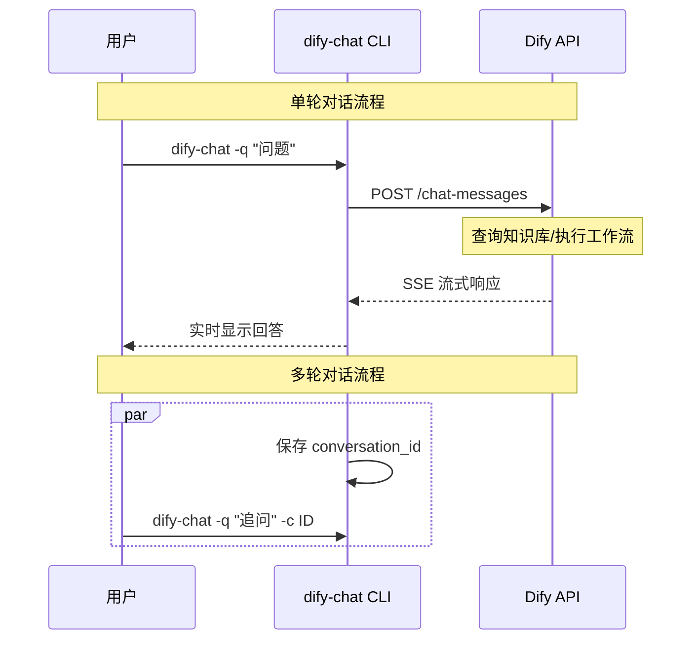

# Dify Chat Skill - 本地知识库对话机器人

## 🤖 技能简介

本skill允许你在OpenClaw中通过命令行调用本地部署的Dify API，进行知识库问答和对话交互。适合用于自动化查询、智能客服场景。

---

## ⚙️ 前置配置

### 1. 环境变量配置

确保 `~/.openclaw/config/dify.env` 存在并配置：

```bash
# Dify API 配置
DIFY_API_KEY=your_KEY
DIFY_API_BASE=your_DIFY_API_BASE
DIFY_USER=openclaw-user
```

**环境变量说明**:

| 变量 | 类型 | 必填 | 说明 |
|------|------|------|------|
| `DIFY_API_KEY` | string | ✅ | Dify API Key（应用密钥） |
| `DIFY_API_BASE` | string | ✅ | Dify API 基础 URL |
| `DIFY_USER` | string | ⚪ | 用户标识（可选，默认 openclaw-user） |

---

## 🛠️ 工具使用

### `dify-chat` - Dify 对话机器人

**调用方式**: 在 OpenClaw CLI 中直接输入 `dify-chat` 命令

**必需参数**:
- `-q, --query <问题>` - 要查询的问题或消息（必填）

**可选参数**:
- `-c, --conv-id <会话 ID>` - 保持多轮对话的会话标识
- `--show-config` - 显示当前配置信息
- `-h, --help` - 显示帮助信息

---

## 📝 使用示例

### 基础问答

```bash
dify-chat -q "什么是公司报销政策？"
```

**输出**:
```text
🤖 Dify Chat Bot:
📝 Your query: 什么是公司报销政策？
--------------------------------------------------
🔄 Calling Dify API...

公司报销政策规定：
1. 出差补贴每日上限 500 元，需提供发票
2. 所有报销需在月末前提交审批单
3. 超过 5000 元的支出需要部门主管批准

💬 Conversation ID: conv_abc123xyz
```

### 多轮对话

第一次查询（获取会话 ID）：
```bash
dify-chat -q "公司的年假怎么算？"
# 输出中会显示 conversation_id
```

继续追问（使用上一次的会话 ID）：
```bash
dify-chat -q -c conv_abc123xyz "那带薪病假呢？"
```

### 查看配置状态

```bash
dify-chat --show-config
```

**输出**:
```text
📋 Current Configuration:
   API Base: your_DIFY_API_BASE
   User: openclaw-user
✅ Status: Connected
```

---

## 🎯 最佳实践

### ✅ 推荐用法

1. **知识库问答场景**: 无需额外参数，自动调用 Dify 工作流
2. **连续对话**: 保存 `conversation_id` 用于多轮交流，保持上下文
3. **错误处理**: CLI 会显示详细错误信息和可能的原因

### ⚠️ 注意事项

- 避免频繁调用 API（注意速率限制）
- 不要传递敏感信息到 API logs
- 会话 ID 在单次对话中重复使用以获得最佳效果

---

## 🔄 工作流程



---

## 🐛 常见问题与故障排查

### Q1: `Error: Missing required environment variables`

**原因**: 环境变量未正确配置或文件不存在  
**解决**:
```bash
# 检查配置文件
cat ~/.openclaw/config/dify.env

# 如果缺少 DIFY_API_KEY 或 DIFY_WORKFLOW_ID，请添加
nano ~/.openclaw/config/dify.env
```

### Q2: `Cannot connect to API`

**原因**: 
- API Base URL 无法访问
- 网络防火墙限制
- Dify 服务未启动

**解决**:
1. 确认 Base URL 正确：`curl -I http://your_DIFY_API_BASE
2. 检查网络连通性
3. 验证 Dify 服务状态

### Q3: `400 Client Error: BAD REQUEST`

**原因**: 
- API Key 无效
- 请求参数格式错误
- 工作流 ID 未配置（如果需要）

**解决**:
```bash
# 验证 API Key
source ~/.openclaw/config/dify.env
curl -X POST "$DIFY_API_BASE/chat-messages" \
  -H "Authorization: Bearer $DIFY_API_KEY" \
  -H "Content-Type: application/json" \
  -d '{"inputs": {}, "response_mode": "blocking", "conversation_id": "",  "user": "openclaw-user"}'
```

### Q4: `Conversation ID not working`

**原因**: 会话 ID 格式错误或已过期  
**解决**: 
- 使用最近一次返回的 conversation_id
- 确保格式为 `conv_xxx`
- 尝试新的查询获取新会话 ID

---

## 🔗 参考文档

- [Dify API 官方文档](https://docs.dify.ai/)
- [Workflow Run API - Dify](https://docs.dify.ai/reference/dify-api/apis/workflow-run)
- [OpenClaw CLI 工具说明](https://docs.openclaw.ai/cli-tools)
- [SSE (Server-Sent Events) 协议](https://developer.mozilla.org/zh-CN/docs/Web/API/Server-sent_events)

---

## 📅 Changelog

| Version | Date | Change |
|---------|------|--------|
| 1.0.0 | 2026-04-14 | Initial release - Dify workflow chat integration |

---

## 🎓 技能元数据

- **技能名称**: `dify-chat`
- **适用场景**: 
  - AI 知识库问答
  - 自动化文档查询
  - 智能客服集成
- **依赖项**: Python requests library, Dify API 访问权限
- **维护者**: OpenClaw Team
- **状态**: ✅ Production Ready

---

**📌 提示**: 运行 `dify-chat --help` 查看完整帮助信息。如需反馈或改进建议，请通过 OpenClaw 社区渠道提交。
