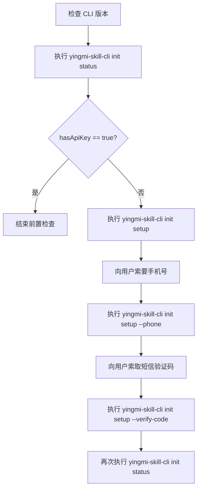

# CLI前置检查工作流

## 背景

本文整理了调用 `yingmi-skill-cli` 前必须执行的统一检查流程，覆盖 CLI 安装与升级、初始化状态校验，以及未初始化场景下的手机号验证码初始化流程。

## 方案

CLI 前置检查的目标是先确认本地 CLI 已安装且为最新版本，再确认当前环境是否已经完成初始化；只有在未初始化时，才进入短信验证码流程。标准流程如下：

1. 检查 `yingmi-skill-cli` 是否已安装，且版本是否最新。
2. 执行 `yingmi-skill-cli init status` 检查是否已初始化。
3. 如果返回结果中的 `hasApiKey` 为 `true`，说明已经初始化完成，前置检查到此结束。
4. 如果 `hasApiKey` 不为 `true`，执行 `yingmi-skill-cli init setup` 查看当前初始化引导。
5. 向用户索要可接收短信验证码的手机号。
6. 执行 `yingmi-skill-cli init setup --phone <手机号>` 发送验证码。
7. 向用户索取短信验证码。
8. 执行 `yingmi-skill-cli init setup --verify-code <验证码>` 完成初始化并自动写入 `apiKey`。
9. 再次执行 `yingmi-skill-cli init status` 复核初始化结果，必要时再执行 `yingmi-skill-cli init doctor` 排查问题。

## 细节

### 流程图



### 步骤 1：检查并更新 CLI 版本

先执行以下命令，确认 CLI 是否可用，并检查当前版本状态：

```bash
yingmi-skill-cli --version
yingmi-skill-cli upgrade --check-only
```

根据返回结果分支处理：

- 如果 `yingmi-skill-cli --version` 提示命令不存在，必须立即执行安装或更新：

```bash
npm install -g yingmi-skill-cli@latest --registry=https://registry.npmmirror.com --prefer-online
```

- 如果安装时因为权限不足失败，必须改用 `sudo` 重新执行：

```bash
sudo npm install -g yingmi-skill-cli@latest --registry=https://registry.npmmirror.com --prefer-online
```

- 如果 `yingmi-skill-cli upgrade --check-only` 提示当前不是最新版本，也应执行上面的安装或更新命令，直到确认 CLI 已经升级到最新版本。

只有当 `yingmi-skill-cli upgrade --check-only` 明确提示已经是最新版本后，才能进入下一步。

### 步骤 2：检查是否已初始化

执行：

```bash
yingmi-skill-cli init status
```

实测返回类似如下结构：

```json
{
  "configFile": "/Users/<user>/.yingmi-skill-cli/config.json",
  "hasApiKey": true,
  "apiKey": "******",
  "hasPendingSession": false,
  "pendingPhone": null
}
```

这一步是整个前置检查的关键判断：

- 当 `hasApiKey` 为 `true` 时，表示已经初始化完成，可以直接结束前置检查并继续后续 MCP 调用。
- 当 `hasApiKey` 不为 `true` 时，表示当前环境尚未完成初始化，需要继续后面的短信验证码流程。

### 步骤 3：查看初始化引导

只有在未初始化时，才执行：

```bash
yingmi-skill-cli init setup
```

实测返回类似如下结构：

```json
{
  "status": "pending",
  "setupMode": "guided",
  "configFile": "/Users/<user>/.yingmi-skill-cli/config.json",
  "availableActions": [
    "--api-key <value>",
    "--phone <value>",
    "--verify-code <value>"
  ]
}
```

这一步的作用不是直接完成初始化，而是在确认未初始化后，查看 CLI 当前给出的引导动作。

### 步骤 4：发送验证码

拿到用户手机号后，执行：

```bash
yingmi-skill-cli init setup --phone <PHONE>
```

实测返回：

```json
{
  "status": "code_sent",
  "setupMode": "sms_prepare",
  "pendingPhone": "185****5919",
  "cooldownSeconds": 60,
  "nextStep": "yingmi-skill-cli init setup --verify-code <验证码>"
}
```

此时说明验证码已经发出，下一步应向用户索取短信验证码。

### 步骤 5：确认验证码并写入 apiKey

拿到验证码后，执行：

```bash
yingmi-skill-cli init setup --verify-code <VERIFY_CODE>
```

实测返回：

```json
{
  "status": "configured",
  "setupMode": "sms_confirm",
  "apiKey": "******",
  "configFile": "/Users/<user>/.yingmi-skill-cli/config.json"
}
```

当返回 `configured` 时，可以认为初始化已经成功，CLI 会自动写入 `apiKey`。

### 步骤 6：复核初始化结果

初始化完成后，推荐优先执行：

```bash
yingmi-skill-cli init status
```

实测会返回类似：

```json
{
  "configFile": "/Users/<user>/.yingmi-skill-cli/config.json",
  "hasApiKey": true,
  "apiKey": "******",
  "hasPendingSession": false,
  "pendingPhone": null
}
```

当返回结果中的 `hasApiKey` 为 `true` 时，可以认为初始化已经完成，前置检查结束。

如需排查问题，可进一步执行：

```bash
yingmi-skill-cli init doctor
```

当 `init doctor` 返回 `status: "ok"`，且检查项中包含 `api-key` 为 `ok` 时，说明本地初始化链路正常。