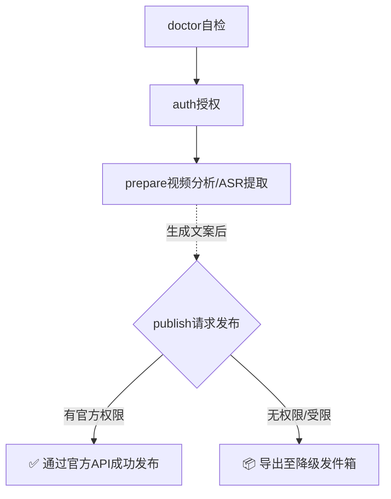

<p align="center">
  <h1 align="center">🎥 Douyin Upload Skill <br> (抖音全自动发布助手)</h1>
  <p align="center">
    一条本地优先、确定性的抖音视频发布流水线：<b>授权 → 提取字幕 → 生成文案 → 自动发布</b>。<br>
    自带<b>“降级发件箱”</b>机制，即使官方 API 权限受限，也能完美兜底！📦
  </p>
</p>

<p align="center">
  
  
  
  
  
</p>

> ⚠️ **注意：** 本项目针对的是 **抖音（中国大陆）** 官方 OpenAPI，不适用于海外版 TikTok。

---

## 💡 为什么开发这个工具？

发布视频**本该**是完全可以自动化的，但在真实的业务流中往往会遇到以下阻碍：

- ❌ 你的抖音开放平台应用没有获批“视频发布”权限。
- ❌ 手动发布步骤繁琐，难以在自动化流水线（Pipeline）中复用。
- ❌ 想要用 AI 生成优质的视频文案（Caption），前提是你得先知道视频里说了什么。

本项目提供了一套**可重复执行的 CLI 工作流**，并且所有标准输出（stdout）都是**机器可读的 JSON 格式**。你可以轻松将其接入自动化脚本，而且全程**不需要**将视频原声上传给任何云端 ASR 服务，绝对保护隐私！

---

## ✨ 核心特性

- 🔐 **OAuth 快捷登录**：支持手动粘贴授权码，并将 Token **加密安全存储**在本地。
- 🎙️ **本地语音转文字 (ASR)**：内置 `whisper.cpp` (`whisper-cli`)，使用本地模型提取字幕。
- 🧩 **ASR 三模式**：支持 `第三方服务 API`（默认）、`whisper+gpu`、`whisper+cpu`。
- ⚡ **智能缓存**：基于视频的 SHA-256 计算哈希，避免重复转录。
- 🚀 **官方 API 直发**：在权限允许的情况下，一键调用官方接口完成发布。
- 📦 **降级发件箱 (Fallback Outbox)**：遇到无权限等阻碍时，自动打包**“视频 + 文案 + 字幕 + 元数据”**到发件箱，方便手动无缝接管。
- 🤖 **面向开发者友好**：确定性的 JSON 输出，非常适合 CI/CD 和自动化脚本解析。

---

## 📚 目录

- [快速开始](#-快速开始)
- [核心工作流](#-核心工作流)
- [环境依赖安装](#-环境依赖安装)
- [配置指南](#-配置指南)
- [命令行速查](#-命令行速查)
- [JSON 响应格式](#-json-响应格式)
- [降级发件箱机制](#-降级发件箱机制)
- [安全与隐私](#-安全与隐私)
- [常见问题 Q&A](#-常见问题-qa)

---

## 🚀 快速开始

### 1. 克隆项目
```bash
git clone https://github.com/YJLi-new/douyin-skill.git
cd douyin-skill
```

### 2. 配置环境变量 (必填)
在进行授权或发布前，请先导出你的抖音应用凭证：
```bash
export DOUYIN_CLIENT_KEY="你的_CLIENT_KEY"
export DOUYIN_CLIENT_SECRET="你的_CLIENT_SECRET"
export DOUYIN_REDIRECT_URI="https://your.domain/callback"
```

<details>
<summary><b>📖 展开：如何获取 CLIENT_KEY / CLIENT_SECRET / REDIRECT_URI（详细教程）</b></summary>

### A. 创建抖音开放平台应用

在抖音开放平台调用 OpenAPI 之前，需要先开通开发者能力并创建应用，同时提前准备可访问的回调地址。普通抖音账号本身无法直接调用开放平台 API。

### B. 如何申请开发者账号（开通流程）

1. 打开抖音开放平台（中国大陆）：`https://developer.open-douyin.com/`
2. 使用你的抖音账号登录后，进入“开发者入驻/开通开发者”流程。
3. 根据页面提示选择主体类型（个人或企业）并提交资料：
   - 个人：通常需要实名信息
   - 企业：通常需要企业主体信息、管理员信息等
4. 等待平台审核通过后，你的账号才具备创建应用和申请能力的入口。

> 提示：控制台菜单名称可能会变动，但关键词通常是“开发者中心 / 应用管理 / 能力管理 / 开发设置”。

### C. 创建应用并获取 `Client Key / Client Secret`

1. 在控制台创建应用（网站应用/移动应用按你的场景选择）。
2. 填写应用基础信息（应用名、图标、简介、用途说明等）并提交审核。
3. 审核通过后，进入应用详情页，在“应用信息/凭证”区域找到：
   - `Client Key`（对应 `DOUYIN_CLIENT_KEY`）
   - `Client Secret`（对应 `DOUYIN_CLIENT_SECRET`）
4. 保存好这两项，不要提交到仓库。

### D. 可访问回调地址如何准备和获取（`DOUYIN_REDIRECT_URI`）

你需要一个**浏览器能访问**的回调地址，例如：
- `https://your.domain/callback`

常见准备方案（按推荐顺序）：

1. **已有公网域名（推荐）**
   - 在你的服务器上部署一个简单回调路由（如 `/callback`）
   - 配置 HTTPS 证书（Nginx/Caddy/Traefik 都可以）
   - 得到稳定地址：`https://your.domain/callback`

2. **临时公网隧道（开发联调）**
   - 用 `cloudflared`、`ngrok` 或类似工具把本地端口映射到公网
   - 得到临时 HTTPS 地址，例如：`https://xxx.trycloudflare.com/callback`
   - 适合测试，注意地址可能变化，变化后要同步改控制台配置

3. **纯手动 code 粘贴模式（你当前项目已支持）**
   - 依然需要在平台里配置一个合法 `redirect_uri`
   - 授权后从浏览器地址栏复制 `code`（或完整回调 URL）粘贴给 CLI
   - 这种方式不要求你本地必须启动回调服务，但地址本身仍需先配置

`Redirect URI` 常见要求：
- 必须与你控制台里配置的地址严格一致（协议、域名、路径都要一致）
- 通常要求使用 HTTPS（开发场景可按平台实际规则处理）
- 不要随意在回调地址后追加未登记参数

### E. 在控制台配置并验证 `DOUYIN_REDIRECT_URI`

1. 打开你的应用配置页，找到“回调地址/Redirect URI”设置项。
2. 填入你准备好的地址（如 `https://your.domain/callback`）并保存。
3. 本地环境变量设置为同一个值：
   - `DOUYIN_REDIRECT_URI`
4. 执行授权命令验证：
   - `node scripts/douyin.js auth`
   - 浏览器授权完成后，把返回 URL 或 `code` 粘贴回终端

### F. 申请发布相关权限（发布接口必需）

如果你要走官方直发（`publish` 的 official 模式），还需要在控制台申请对应能力/Scope（如视频发布相关权限）。未获批时，工具会自动进入 fallback outbox 模式。

### G. 本地配置示例（bash）

```bash
export DOUYIN_CLIENT_KEY="填写你的Client Key"
export DOUYIN_CLIENT_SECRET="填写你的Client Secret"
export DOUYIN_REDIRECT_URI="https://your.domain/callback"
```

快速自检：

```bash
node scripts/douyin.js doctor
```

当返回结果中这三项为 `true`，表示变量已就绪：
- `DOUYIN_CLIENT_KEY`
- `DOUYIN_CLIENT_SECRET`
- `DOUYIN_REDIRECT_URI`

</details>

### 3. 环境自检 (Doctor)
```bash
node scripts/douyin.js doctor
```
> 🩺 这会输出一份 JSON，检查你的环境是否准备就绪，并提供缺失依赖的安装建议。

### 4. 账号授权 (Auth)
```bash
node scripts/douyin.js auth
```
浏览器会自动打开授权页。登录完成后，将回调 URL（或 `code=` 后面的内容）粘贴回终端。Token 将被加密保存在本地磁盘。

### 5. 解析视频与提取字幕 (Prepare)
```bash
node scripts/douyin.js prepare --video "./demo.mp4"
```
你将获得一个包含视频元数据（时长、分辨率、SHA-256）和**文字稿 (transcript.text)** 的 JSON 数据。

### 6. 创作文案 (推荐格式)
拿到字幕后，你可以交给大语言模型 (LLM) 生成极具网感的文案。
> 💡 **Prompt 示例：** “基于以下视频文字稿，生成 3 种抖音文案。每种文案需包含：1 句吸引人的开头，1-2 句简短描述，以及 2-5 个热门标签（Hashtags）。要求自然流畅。”

### 7. 一键发布 (Publish)
```bash
node scripts/douyin.js publish \
  --video "./demo.mp4" \
  --text "这是我生成的最终文案...\n#标签1 #标签2" \
  --private-status 0 \
  --auto-confirm false
```
*注：`--private-status` 可选值为 0(公开), 1(私密), 2(好友可见)。如果要在非交互式环境 (如 CI) 中运行，请设置 `--auto-confirm true`。*

---

## 🗺️ 核心工作流


> **核心设计理念：** 所有步骤的标准输出都是 JSON。你的流水线脚本只需监听 `ok`、`command` 和 `mode` 字段即可实现自动分发与错误处理。

---

## 🛠️ 环境依赖安装

运行本工具需要满足以下最低条件：
- **Node.js** >= 20
- **ffmpeg** + **ffprobe**
- **whisper-cli** (来自 whisper.cpp) + 模型文件 (默认 `ggml-small.bin`)
- **xdg-open** (Linux，用于自动打开浏览器)

**Ubuntu/Debian 快速安装指令：**
```bash
sudo apt-get update && sudo apt-get install -y ffmpeg cmake build-essential curl jq xdg-utils

# 安装 whisper.cpp
git clone https://github.com/ggerganov/whisper.cpp.git
cd whisper.cpp
cmake -B build && cmake --build build -j
ln -sf "$(pwd)/build/bin/whisper-cli" ~/.local/bin/whisper-cli

# 下载模型文件
mkdir -p ~/.cache/whisper.cpp
curl -L https://huggingface.co/ggerganov/whisper.cpp/resolve/main/ggml-small.bin -o ~/.cache/whisper.cpp/ggml-small.bin
```

---

## ⚙️ 配置指南

工具有两种配置方式，优先级为：**环境变量 > 持久化配置**。

### 1. 持久化配置 (推荐个人开发者)
```bash
# 查看当前配置
node scripts/douyin.js config

# 设置配置项
node scripts/douyin.js config set defaultPrivateStatus 0
node scripts/douyin.js config set autoConfirm true
node scripts/douyin.js config set whisperModelPath "/path/to/ggml-small.bin"
node scripts/douyin.js config set asrMode whisper-gpu
```

ASR 模式说明：
- `api`：第三方服务 API（默认）
- `whisper-gpu`：本地 `whisper-cli` GPU 转写
- `whisper-cpu`：本地 `whisper-cli` CPU 转写（`--no-gpu`）

### 2. 环境变量覆盖 (推荐 CI/CD)
常用环境变量：
`DOUYIN_CLIENT_KEY`, `DOUYIN_CLIENT_SECRET`, `DOUYIN_REDIRECT_URI`, `DOUYIN_TOKEN_ENC_KEY`, `DOUYIN_WHISPER_BIN`, `DOUYIN_OUTBOX_DIR`, `DOUYIN_ASR_MODE`, `DOUYIN_ASR_API_URL`, `DOUYIN_ASR_API_MODEL`, `DOUYIN_ASR_API_KEY`...
> 💡 **CI 小贴士：** 可以在 CI 环境中设置一个稳定的加密密钥：
> `export DOUYIN_TOKEN_ENC_KEY="$(openssl rand -hex 32)"`

---

## 📄 JSON 响应格式 (Output Contract)

为了方便与其他程序交互，不同命令会有固定的返回格式（截取部分）：

<details>
<summary><b>点击查看 Prepare 输出格式</b></summary>

```json
{
  "ok": true,
  "command": "prepare",
  "video": {
    "inputPath": "./demo.mp4",
    "normalizedPath": "/abs/path/demo.mp4",
    "sha256": "…",
    "sizeBytes": 123,
    "durationSec": 45
  },
  "transcript": { "source": "whisper", "text": "提取的文本内容…", "segments": [] },
  "limits": { "maxDurationSec": 900, "maxTextLen": 1000 }
}
```

</details>

---

## 🧾 命令行速查

## 📦 降级发件箱机制

## 🔐 安全与隐私

## ❓ 常见问题 Q&A
