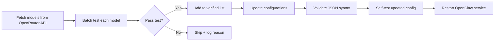

# Updating OpenRouter Free Models

## Overview
A systematic, test-driven process for updating OpenRouter free models that ensures only verified working models are added to configuration files. Combines automated fetching, batch testing, and multi-config synchronization.

## When to Use

**Use when:**
- Adding new OpenRouter free models to configurations
- Syncing model lists between Claude Code and OpenClaw
- need to verify model availability before adding
- Managing model fallbacks and availability allowlists

**Do NOT use for:**
- Single model additions (manual edit is faster)
- Paid model configurations (different testing criteria)
- Other provider types (Anthropic, OpenAI direct)

## Core Workflow



## Quick Reference

| Step | Command | Purpose |
|------|---------|---------|
| 1 | `python3 fetch_models.py` | Fetch all free models |
| 2 | `python3 test_models.py` | Batch test availability |
| 3 | `node apply_updates_openclaw.js` | Update OpenClaw config |
| 4 | `./restart_openclaw.sh` | Restart service |
| 5 | Validate JSON | Prevent syntax errors |

## Implementation

### Step 1: Fetch Free Models from OpenRouter API

```bash
# Use the provided fetcher script which implements comprehensive free model detection
python3 fetch_models.py
```

**Free Model Detection:** The script identifies free models by:
- ID containing `:free` suffix, **OR**
- All pricing fields (`prompt`, `completion`, `request`) equaling `0` or `"0"`

This captures models like `openrouter/hunter-alpha` that have zero pricing but lack the `:free` tag.

### Step 2: Batch Test Availability

```bash
# Test each fetched model via API
python3 test_models.py
```

The script will:
- Read models from `/tmp/free_models.txt`
- Test each with a short API call
- Save verified models to `/tmp/verified_models.txt`
- Save failed models to `/tmp/failed_models.txt` with error reasons

**Note:** The script supports multiple token sources:
- `ANTHROPIC_AUTH_TOKEN` (Claude Code compatibility)
- `OPENROUTER_API_KEY` (OpenRouter direct)
- OpenClaw config (`~/.openclaw/openclaw.json` → `models.providers.openrouter.apiKey`)

### Step 3: Update Claude Code Settings

```bash
# Generate JSON array for availableModels
cat > /tmp/availableModels.json << 'EOF'
$(python3 -c "
models = open('/tmp/verified_models.txt').read().strip().split('\n')
print('  \"availableModels\": [')
for i, m in enumerate(models):
    comma = ',' if i < len(models)-1 else ''
    print(f'    \"{m}\"{comma}')
print('  ],')
")
```

Then manually or programmatically insert into `~/.claude/settings.json`.

### Step 4: Update OpenClaw Configuration

```python
import json
from pathlib import Path

# Read existing config
with open(Path.home() / '.openclaw' / 'openclaw.json', 'r') as f:
    config = json.load(f)

# Update provider models
verified = open('/tmp/verified_models.txt').read().strip().split('\n')
provider_models = []
fallbacks = []

for i, model_id in enumerate(verified):
    provider_models.append({
        "id": model_id,
        "name": model_id.split('/')[-1],
        "api": "openai-completions"
    })
    if i > 0:  # Skip primary (stepfun) from fallbacks
        fallbacks.append(f"openrouter/{model_id}")

config['models']['providers']['openrouter']['models'] = provider_models
config['agents']['defaults']['model']['fallbacks'] = fallbacks

# Add to agents.defaults.models
for model_id in verified:
    key = f"openrouter/{model_id}"
    if key not in config['agents']['defaults']['models']:
        config['agents']['defaults']['models'][key] = {}

# Save
with open(Path.home() / '.openclaw' / 'openclaw.json', 'w') as f:
    json.dump(config, f, indent=2)

print(f"Updated OpenClaw config with {len(verified)} models")
```

### Step 5: Validate and Self-Test

```bash
# Validate JSON syntax
python3 -m json.tool ~/.claude/settings.json > /dev/null && echo "✓ Claude settings valid"
python3 -m json.tool ~/.openclaw/openclaw.json > /dev/null && echo "✓ OpenClaw config valid"

# Self-test: verify models field exists and is array
python3 -c "
import json
with open('~/.claude/settings.json') as f:
    cfg = json.load(f)
    assert 'availableModels' in cfg
    assert isinstance(cfg['availableModels'], list)
    print(f'✅ Claude: {len(cfg[\"availableModels\"])} models available')
"
```

## Common Pitfalls

| Pitfall | Symptom | Fix |
|---------|---------|-----|
| Missing rate limiting | API errors/timeouts | Add `time.sleep(0.5)` between tests |
| Not filtering duplicates | Same model twice | Use `set()` on results |
| Forgetting fallbacks array | Only primary works | Update both `models` and `fallbacks` |
| Invalid JSON after edit | Config won't load | Run `python3 -m json.tool` to validate |
| Skipping self-test | Broken config deployed | Always run validation commands |

## Real-World Example

**Before:** Manually copying models from website → errors, outdated models, missing configs

**After:** Automated fetch + test → only verified models, synchronized configs, repeatable process

## Anti-Patterns

### ❌ Add All Models Without Testing
```python
# BAD: Just grab list and add everything
models = fetch_all()
# Problem: Some models may be rate-limited, deprecated, or region-blocked
```

### ❌ One Configuration Only
```python
# BAD: Only update Claude settings, forget OpenClaw
update_claude_settings(verified_models)
# Problem: OpenClaw still has old list → inconsistent behavior
```

### ❌ No Self-Test
```python
# BAD: Write file and assume it's correct
with open('settings.json', 'w') as f:
    json.dump(config, f)
# Problem: Syntax error breaks entire application
```

## Testing Checklist

- [ ] Fetch produces non-empty model list
- [ ] All verified models pass API test in batch
- [ ] Claude settings JSON is valid
- [ ] OpenClaw JSON is valid
- [ ] `availableModels` exists and is array
- [ ] OpenClaw `models.providers.openrouter.models` updated
- [ ] OpenClaw `agents.defaults.model.fallbacks` includes all except primary
- [ ] OpenClaw `agents.defaults.models` has entries for all
- [ ] Actual API call works with at least one model from new list

## Maintenance

**When to rerun this skill:**
- Monthly (OpenRouter adds/removes free models regularly)
- After API error indicates specific model unavailable
- Adding new configuration targets (e.g., new tool that uses OpenRouter)

**What to update if API changes:**
- Model filter logic (free detection criteria may change - see `is_free_model()` in `fetch_models.py`)
- Test request format (API endpoint may version)
- Rate limits (adjust sleep duration)

## OpenClaw-Specific Notes

### OpenClaw Scripts

This skill includes OpenClaw-specific scripts in the workspace:

| Script | Purpose |
|--------|---------|
| `test_models.py` | Batch test models (same as Claude Code version) |
| `apply_updates_openclaw.js` | Node.js version for OpenClaw config updates |
| `restart_openclaw.sh` | Restart OpenClaw gateway service after update |

### Full OpenClaw Workflow

```bash
# 1. Fetch free models
python3 fetch_models.py

# 2. Test availability
python3 test_models.py

# 3. Apply to OpenClaw config
node apply_updates_openclaw.js

# 4. Restart OpenClaw service (required for config changes)
./restart_openclaw.sh

# 5. Verify
openclaw --version  # or test with a model
```

**Why restart?** OpenClaw loads configuration at startup. Changes to `openclaw.json` require restart to take effect.

### Restart Methods

`restart_openclaw.sh` tries multiple methods:
1. `launchctl` (if running as macOS service)
2. `pkill` + `nohup` (manual restart)
3. Reports errors if both fail

Logs: `/tmp/openclaw-gateway.log`

### Testing After Update

```bash
# Check gateway is running
pgrep -f "openclaw.*gateway"

# Test model fallback (send a test message via your OpenClaw channel)
# If primary fails, it should automatically fall back to next model
```

## See Also

- **OpenRouter API docs**: https://openrouter.ai/docs
- **Claude Code settings schema**: `~/.claude/settings.json` structure
- **OpenClaw configuration**: `~/.openclaw/openclaw.json` model sections
- **OpenClaw gateway docs**: `openclaw gateway --help`

