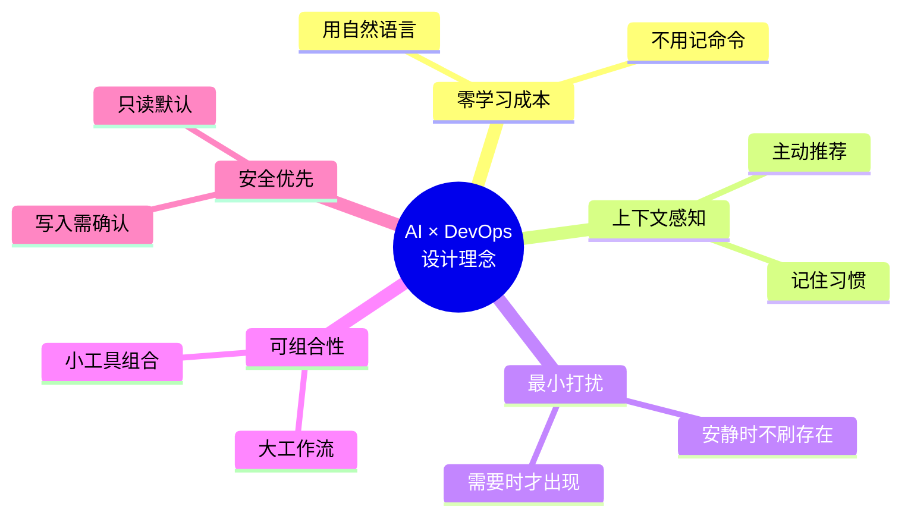
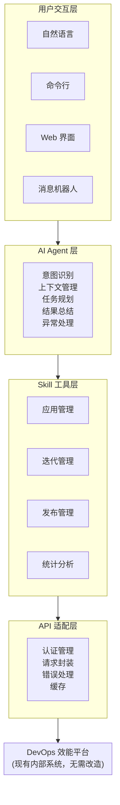
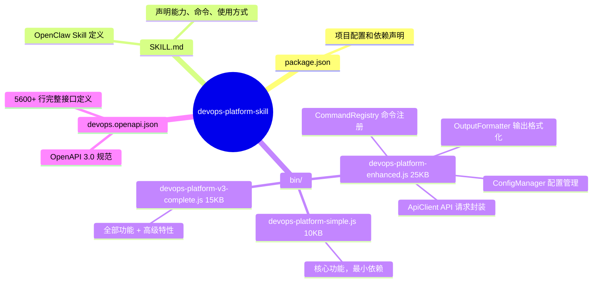
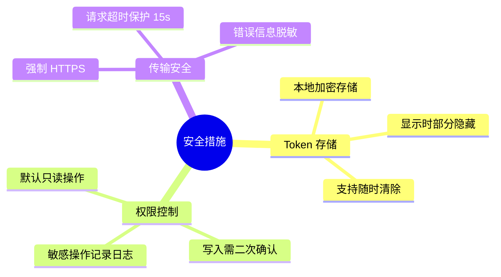
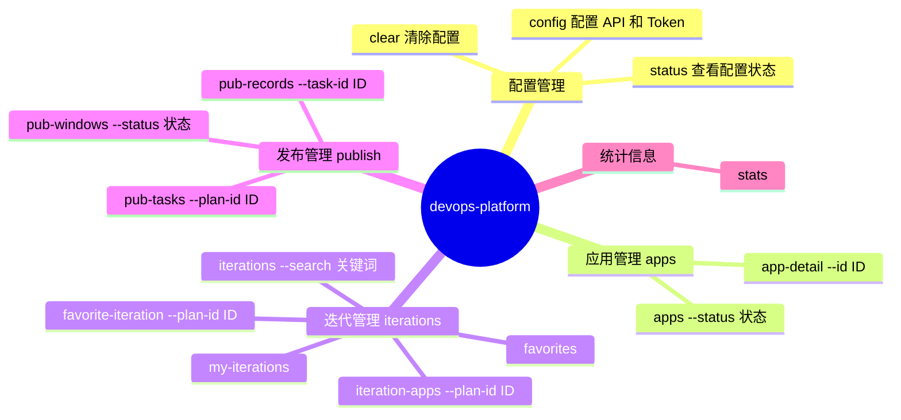
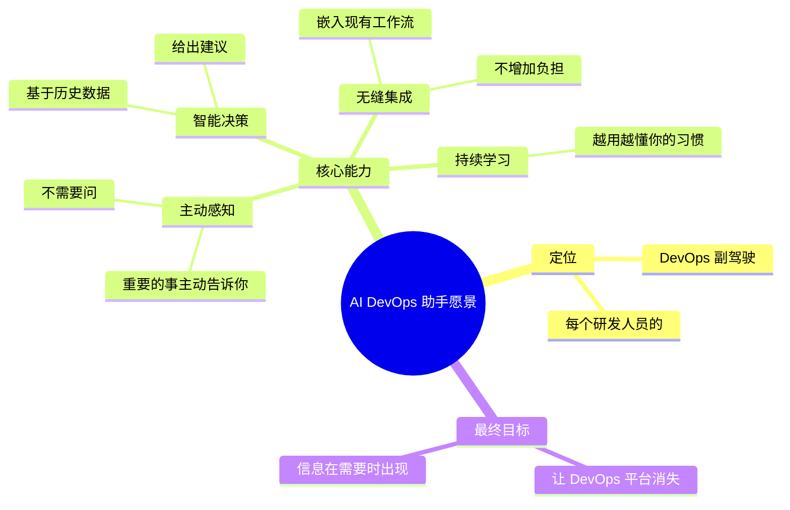
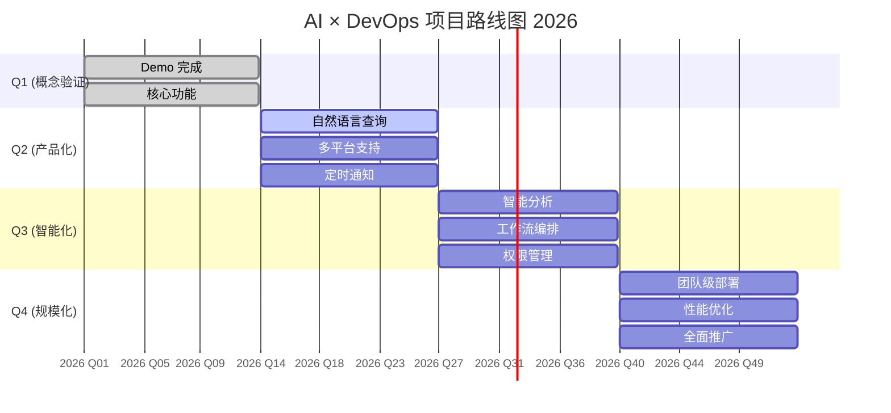
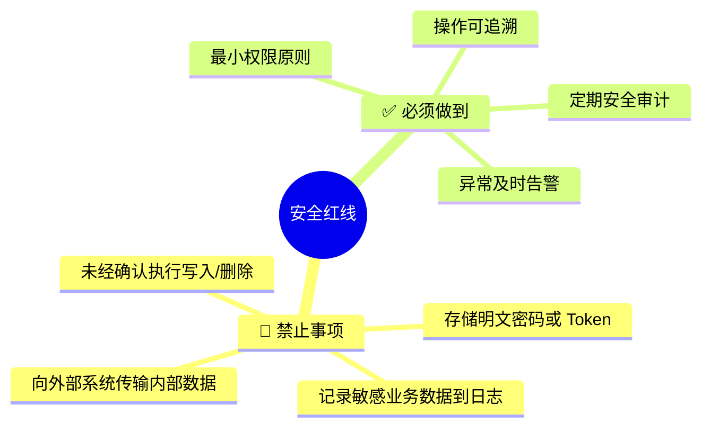

# AI × DevOps 效能平台集成方案
## AI 头脑风暴会议文档

**版本**: 1.0  
**日期**: 2026-03-11  
**作者**: OpenClaw Agent  
**状态**: Demo 阶段 → 生产就绪

---

## 📋 目录

1. [项目背景](#-项目背景)
2. [设计思想](#-设计思想)
3. [技术架构](#-技术架构)
4. [核心功能](#-核心功能)
5. [使用场景](#-使用场景)
6. [Demo 展示](#-demo展示)
7. [后续计划](#-后续计划)
8. [风险评估](#-风险评估)
9. [Q&A](#-qa)

---

## 🎯 项目背景

### 问题陈述

在现代软件开发团队中，DevOps 效能平台是日常工作的核心工具，但存在以下痛点：

| 痛点 | 描述 | 影响 |
|------|------|------|
| 🔍 **信息分散** | 应用、迭代、发布数据分布在多个页面 | 需要频繁切换页面，效率低 |
| 📊 **查询繁琐** | 每次查看数据需要手动筛选、分页 | 重复性操作占用大量时间 |
| 🤖 **缺乏自动化** | 无法通过自然语言快速获取信息 | 依赖人工操作，无法集成到工作流 |
| 📱 **移动端体验差** | 复杂操作在手机上难以完成 | 外出/会议中无法高效处理 |
| 🔔 **被动通知** | 重要变更需要主动查看 | 容易错过关键信息 |

### 机遇

AI Agent 技术的成熟为我们提供了新的解决方案：
- **自然语言交互** → 用对话代替点击
- **自动化工作流** → 定时检查、主动通知
- **多平台集成** → 微信/钉钉/Slack 一站式访问
- **智能分析** → 从数据中提取洞察

---

## 💡 设计思想

### 核心原则



### 架构分层



---

## 🛠️ 技术架构

### 技术栈选型

| 层级 | 技术 | 选择理由 |
|------|------|----------|
| **运行时** | Node.js 22+ | 跨平台、异步 IO、丰富的 npm 生态 |
| **CLI 框架** | Commander.js | 成熟稳定、文档完善、易于扩展 |
| **HTTP 客户端** | Axios | 拦截器、超时控制、错误处理完善 |
| **交互界面** | Inquirer.js | 交互式提示、表单输入 |
| **配置存储** | JSON 文件 | 简单、可读、易调试 |
| **AI 集成** | OpenClaw | 统一的 Agent 框架、多消息平台支持 |

### 核心模块



### API 设计规范

```yaml
# 请求头标准
headers:
  authorization: "Bearer {token}"     # OAuth2 Bearer Token
  from: "openapi"                      # 标识来源
  content-type: "application/json"     # 请求格式

# 响应格式标准
response:
  code: 200           # 业务状态码
  msg: "成功"         # 提示信息
  total: 100          # 总记录数
  rows: [...]         # 数据列表

# 错误处理
errors:
  - 401: Token 过期或无效
  - 403: 权限不足
  - 404: 资源不存在
  - 500: 服务器内部错误
  - timeout: 15 秒超时
```

### 安全设计



---

## 📦 核心功能

### 功能矩阵

| 模块 | 功能 | 命令示例 | 状态 |
|------|------|----------|------|
| **应用管理** | 查询应用列表 | `apps --status ONLINE_RUN` | ✅ |
| | 获取应用详情 | `app-detail --id 10907` | ✅ |
| | 染色环境应用 | `staging-apps` | ✅ |
| **迭代管理** | 查询迭代列表 | `iterations --search "v2.0"` | ✅ |
| | 我的迭代 | `my-iterations` | ✅ |
| | 迭代应用 | `iteration-apps --plan-id 12345` | ✅ |
| | 收藏管理 | `favorite-iteration --plan-id 12345` | ✅ |
| **发布管理** | 发布窗口 | `pub-windows --status OPEN` | ✅ |
| | 发布任务 | `pub-tasks --plan-id 12345` | ✅ |
| | 发布记录 | `pub-records --task-id 67890` | ✅ |
| **统计** | 平台概览 | `stats` | ✅ |
| **配置** | 配置管理 | `config / status / clear` | ✅ |

### 命令层次



---

## 🎬 使用场景

### 场景一：晨会快速同步

**传统方式** (5-10 分钟):
1. 打开 DevOps 平台网页
2. 登录
3. 导航到迭代页面
4. 筛选当前迭代
5. 查看应用列表
6. 记录关键信息

**AI 方式** (30 秒):
```
用户：今天晨会要用的迭代信息

Agent: 正在获取当前迭代数据...

📊 迭代 #12345 - v2.5.0 发布
├─ 应用总数：24
├─ 已完成：18
├─ 进行中：4
└─ 未开始：2

⚠️  需要关注:
   - payment-service: 发布失败 (昨 23:45)
   - user-api: 待审核 (超过 24h)

需要我详细列出未完成的应用吗？
```

### 场景二：发布窗口监控

**传统方式**:
- 定时刷新发布页面
- 手动记录状态变化
- 容易错过关键时间点

**AI 方式**:
```bash
# 设置定时检查 (cron)
每天 10:00,14:00,18:00 检查发布状态

# 自动通知
[14:00] 📢 发布窗口 #456 已开启
        涉及应用：8 个
        截止时间：今日 20:00
        负责人：@张三 @李四
```

### 场景三：移动端快速查询

**场景**: 会议中老板问"现在线上有多少个应用在运行？"

**AI 方式** (微信/钉钉消息):
```
你：线上运行应用数量

Agent: 📊 当前 ONLINE_RUN 状态应用：47 个

按服务分类:
• 核心服务：12
• 支撑服务：23
• 实验服务：12

需要详细列表吗？
```

### 场景四：新人上手引导

**传统方式**:
- 老员工一对一教学
- 反复询问相同问题
- 学习周期 1-2 周

**AI 方式**:
```
新人：我负责的应用有哪些？

Agent: 根据权限，你负责以下 5 个应用:

1. order-service (订单服务)
   └─ 当前迭代：v3.2.1 开发中
   
2. payment-gateway (支付网关)
   └─ 当前状态：线上运行
   
...

💡 提示：你可以问我:
   - "order-service 的详细信息"
   - "下个发布窗口是什么时候"
   - "如何申请新应用"
```

### 场景五：异常主动通知

```
[系统自动触发]
🚨 检测到异常

应用：user-auth-service
变化：ONLINE_RUN → OFFLINE_RUN
时间：2026-03-11 14:32
影响：登录服务可能不可用

建议操作:
1. 查看应用详情：`app-detail --id 10907`
2. 联系负责人：@王五
3. 检查发布记录：`pub-records --task-id 789`
```

---

## 🎯 Demo 展示

### 安装演示

```bash
# 1. 安装 Skill
$ clawhub install devops-platform-skill

# 2. 配置连接
$ devops-platform config
? API 地址：https://devops-api.company.com
? Open Token: ****************abcd

# 3. 验证配置
$ devops-platform status
✅ 配置正常
   API: https://devops-api.company.com
   Token: sk-***********abcd
```

### 日常使用演示

```bash
# 查看我的迭代
$ devops-platform my-iterations

📋 我的研发迭代:
┌──────┬─────────────┬──────────┬─────────┬────────────┐
│ ID   │ 名称        │ 状态     │ 应用数  │ 截止日期   │
├──────┼─────────────┼──────────┼─────────┼────────────┤
│ 12345│ v2.5.0 发布 │ 进行中   │ 24      │ 2026-03-15 │
│ 12340│ v2.4.3 热修 │ 已完成   │ 8       │ 2026-03-01 │
│ 12338│ v2.4.2 发布 │ 已完成   │ 15      │ 2026-02-15 │
└──────┴─────────────┴──────────┴─────────┴────────────┘

# 查看迭代详情
$ devops-platform iteration-apps --plan-id 12345

📦 迭代 #12345 - 应用列表 (24 个):
┌───────┬────────────────────┬──────────────┬─────────┐
│ ID    │ 应用名称           │ 状态         │ 负责人  │
├───────┼────────────────────┼──────────────┼─────────┤
│ 10907 │ payment-service    │ 发布失败 ⚠️  │ 张三    │
│ 10908 │ user-api           │ 待审核       │ 李四    │
│ 10909 │ order-core         │ 已完成 ✅    │ 王五    │
│ ...   │ ...                │ ...          │ ...     │
└───────┴────────────────────┴──────────────┴─────────┘

# 收藏重要迭代
$ devops-platform favorite-iteration --plan-id 12345
✅ 已收藏迭代 #12345
```

### 自然语言交互演示

```
💬 WebChat / 微信 / 钉钉

用户：帮我看看这周要发布的应用

Agent: 正在查询本周发布窗口...

📅 发布窗口 #456 (2026-03-11 ~ 2026-03-13)
   状态：🟢 开放中
   截止时间：今日 20:00

📦 涉及应用 (8 个):
   1. payment-service    ⚠️  发布失败
   2. user-api           🟡 待审核
   3. order-core         ✅ 已完成
   4. inventory-svc      ✅ 已完成
   5. notification-hub   ✅ 已完成
   6. report-engine      🟡 待审核
   7. search-indexer     ✅ 已完成
   8. config-center      ✅ 已完成

⚠️  需要关注：2 个应用存在风险

需要我通知相关负责人吗？
```

---

## 🚀 后续计划

### 短期目标 (1-3 个月)

| 优先级 | 功能 | 描述 | 价值 |
|:------:|------|------|------|
| 🔴 P0 | **自然语言查询** | 支持"查看我的应用"这类自然语言 | 降低使用门槛 |
| 🔴 P0 | **定时通知** | 发布窗口开启/关闭自动提醒 | 避免错过关键时间 |
| 🟡 P1 | **多平台支持** | 微信、钉钉、Slack、飞书 | 随时随地访问 |
| 🟡 P1 | **快捷操作** | 一键收藏、一键分享 | 提升效率 |
| 🟢 P2 | **数据可视化** | 简单的图表展示 | 更直观的数据呈现 |
| 🟢 P2 | **历史记录** | 查询历史缓存 | 减少重复请求 |

### 中期目标 (3-6 个月)

| 功能 | 描述 | 预期效果 |
|------|------|----------|
| **智能分析** | 分析迭代进度、发布成功率 | 提前识别风险 |
| **工作流编排** | 组合多个命令形成自动化流程 | 一键完成复杂任务 |
| **权限管理** | 支持多用户、多角色 | 团队级使用 |
| **API 扩展** | 支持更多 DevOps 平台接口 | 覆盖更多场景 |
| **性能优化** | 请求缓存、并发优化 | 响应速度提升 50% |

### 长期愿景 (6-12 个月)



### 路线图



---

## ⚠️ 风险评估

### 技术风险

| 风险 | 概率 | 影响 | 缓解措施 |
|------|------|------|----------|
| API 接口变更 | 中 | 高 | 建立接口监控，快速适配 |
| Token 泄露 | 低 | 高 | 加密存储、定期轮换 |
| 性能瓶颈 | 中 | 中 | 缓存机制、请求限流 |
| 依赖漏洞 | 低 | 中 | 定期更新、安全扫描 |

### 业务风险

| 风险 | 概率 | 影响 | 缓解措施 |
|------|------|------|----------|
| 用户接受度低 | 中 | 高 | 渐进式推广、培训支持 |
| 过度依赖 AI | 中 | 中 | 保留传统访问方式 |
| 数据准确性 | 低 | 高 | 数据校验、人工复核机制 |

### 安全风险



---

## ❓ Q&A

### Q1: 为什么选择 OpenClaw 作为 Agent 框架？

**A**: 
- 统一的技能扩展机制
- 多消息平台支持 (微信、钉钉、Slack 等)
- 内置记忆和上下文管理
- 活跃的社区和持续更新

### Q2: 现有 DevOps 平台需要改造吗？

**A**: 
不需要。本方案通过 API 适配层与现有系统对接，对原系统零侵入。

### Q3: 如何保证数据安全？

**A**: 
- Token 本地加密存储
- 所有通信使用 HTTPS
- 默认只读，写入需确认
- 敏感操作记录审计日志

### Q4: 学习成本高吗？

**A**: 
极低。支持自然语言交互，用户可以用日常语言提问，无需记忆命令。

### Q5: 可以自定义功能吗？

**A**: 
可以。基于开放的 Skill 架构，团队可以根据需求扩展新命令。

### Q6: 支持离线使用吗？

**A**: 
部分支持。查询历史数据可以离线，实时数据需要联网。

---

## 📞 联系方式

**项目负责人**: [待填写]  
**技术支持**: [待填写]  
**反馈渠道**: [待填写]

---

## 📎 附录

### A. 完整命令列表

```bash
# 配置管理
devops-platform config          # 配置 API 和 Token
devops-platform status          # 查看配置
devops-platform clear           # 清除配置

# 应用管理
devops-platform apps            # 查询应用列表
devops-platform app-detail      # 应用详情

# 迭代管理
devops-platform iterations      # 迭代列表
devops-platform my-iterations   # 我的迭代
devops-platform iteration-apps  # 迭代应用
devops-platform favorite-iteration  # 收藏迭代
devops-platform favorites       # 收藏列表

# 发布管理
devops-platform pub-windows     # 发布窗口
devops-platform pub-tasks       # 发布任务
devops-platform pub-records     # 发布记录

# 其他
devops-platform stats           # 统计信息
devops-platform help-all        # 完整帮助
```

### B. 依赖清单

```json
{
  "axios": "^1.13.6",      // HTTP 客户端
  "commander": "^11.1.0",  // CLI 框架
  "inquirer": "^9.3.8"     // 交互界面
}
```

### C. 相关文件

- `SKILL.md` - Skill 定义文档
- `README.md` - 用户使用文档
- `INSTALL.md` - 安装指南
- `SUMMARY.md` - 功能摘要
- `devops.openapi.json` - OpenAPI 3.0 规范

---

**文档结束**

_此文档用于 AI 头脑风暴会议，欢迎提出宝贵意见和建议。_
