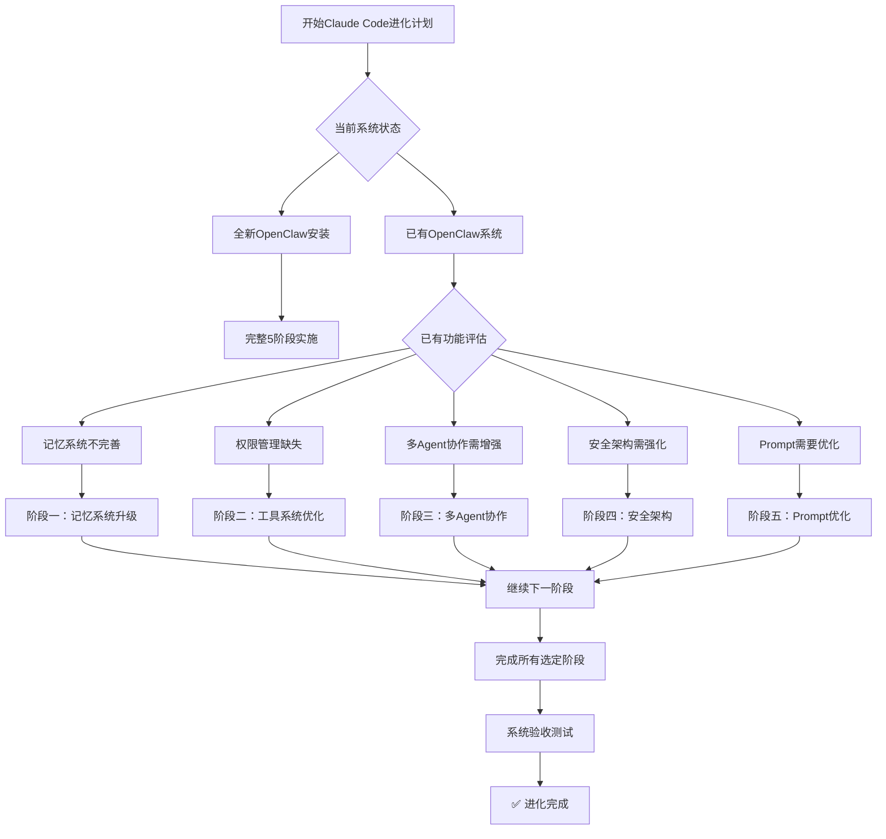

# Claude Code Evolution 技能

## ⚠️ 安全声明
此技能涉及系统配置修改、凭证管理和安全架构变更等高阶操作。在使用前请务必了解以下风险：

**重要安全准则**：
1. 🛡️ **备份优先**：在执行任何修改前，备份所有配置文件和工作区
2. 🧪 **测试验证**：先在测试环境中验证所有步骤，再部署到生产环境
3. 🔐 **最小权限**：理解每个操作的安全影响，遵循最小权限原则
4. 📝 **记录变更**：详细记录所有系统修改，便于回滚
5. 🤔 **责任自负**：仅在自己拥有完全访问权限的系统上使用

**适用对象**：
- 有经验的OpenClaw管理员
- 熟悉Linux系统操作的用户
- 了解AI Agent架构的开发者

## 概述

此技能指导您实施基于Claude Code架构的5阶段进化计划，将OpenClaw系统升级为生产级AI Agent架构。该计划基于对Claude Code公开架构文档的分析，提炼出5个核心设计模式：

1. **记忆系统升级** - 结构化记忆分类与容量控制
2. **工具系统优化** - 四层权限模型与按需加载
3. **多Agent协作增强** - Coordinator+Worker精确指令协议
4. **安全架构强化** - 默认禁止、权限沙箱、凭证保护
5. **Prompt优化管理** - 上下文压缩与工具描述优化

**预期效果**：Token节省35-45%，响应时间改善15-20%，上下文容量+40-60%，记忆检索准确率>85%

## 实施决策树

开始前，请根据您的需求选择实施路径：



**推荐顺序**：按阶段顺序实施（1→2→3→4→5），每阶段依赖前一阶段的基础。

## 阶段一：记忆系统升级

### 目标
实现Claude Code的结构化记忆分类，建立4类记忆系统：user（用户画像）、feedback（反馈记录）、project（项目状态）、reference（外部引用）。

### 核心组件

1. **记忆索引文件** (`MEMORY.md`)
   - 最大200行/25KB限制
   - 按类型分组，最新记忆在前
   - 包含容量状态和维护提示

2. **记忆文件结构**
   ```
   memory/
   ├── user-profile.md          # 用户画像
   ├── project-states.md        # 项目状态  
   ├── feedback-logs.md         # 反馈记录
   ├── reference-pointers.md    # 引用指针
   ├── 2026-04-22.md            # 每日详细记录
   └── ...
   ```

3. **记忆过滤规则**
   - 不记忆grep/git log可查的内容
   - 自动瘦身（超5KB）
   - 时间过滤（6个月后是否还有用）

### 实施步骤

1. **备份现有记忆**
   ```bash
   cp -r memory/ memory-backup-$(date +%Y%m%d)
   ```

2. **创建记忆分类文件**
   - 复制 `references/memory-templates/` 中的模板文件
   - 或运行 `scripts/setup_memory_system.py`（如果可用）

3. **更新MEMORY.md**
   - 使用 `references/memory-index-template.md` 作为模板
   - 添加现有记忆条目的索引

4. **验证记忆系统**
   ```bash
   python scripts/validate_memory.py
   ```

### 验收标准
- ✅ MEMORY.md格式符合Claude Code规范
- ✅ 所有核心记忆文件已添加Frontmatter元数据
- ✅ 符合闭合四类型系统（user/feedback/project/reference）
- ✅ 容量控制有效（当前远低于限制）

### 参考文件
- `references/memory-system-guide.md` - 详细实施指南
- `references/frontmatter-examples.md` - Frontmatter格式示例
- `scripts/validate_memory.py` - 记忆系统验证脚本

---

## 阶段二：工具系统优化

### 目标
建立四层权限模型（L0-L3）和工具按需加载机制。

### 四层权限定义

| 级别 | 名称 | 范围 | 授权方式 | 示例 |
|------|------|------|----------|------|
| L0 | 自由行动区 | 信息获取、只读操作 | 自动批准 | read, web_search, memory_search |
| L1 | 征询意见区 | 配置修改、开发环境操作 | 告知后执行 | write, edit, git commit |
| L2 | 严格审批区 | 数据修改、外部通信 | 必须明确/approve | message, sessions_spawn, 删除文件 |
| L3 | 默认禁止区 | 高度危险、违反安全策略 | 默认禁止，需特殊授权 | 凭证泄露、系统破坏 |

### 核心组件

1. **工具分类配置** (`tools-classification-config.yaml`)
   - 定义5类工具：核心、扩展、通信、管理、技能
   - 每类工具的权限级别和加载策略

2. **权限检查脚本** (`permission_checker.py`)
   - 自动识别操作权限级别
   - 集成沙箱风险评估

3. **快速参考文档** (`tools-quick-reference.md`)
   - 工具分类和审批流程速查

### 实施步骤

1. **配置工具分类**
   ```bash
   cp references/tools-classification-config.yaml memory/
   ```

2. **更新AGENTS.md权限定义**
   - 将四层权限模型集成到AGENTS.md
   - 更新安全边界章节

3. **部署权限检查脚本**
   ```bash
   cp scripts/permission_checker.py scripts/
   chmod +x scripts/permission_checker.py
   ```

4. **测试权限系统**
   ```bash
   python scripts/permission_checker.py --test
   ```

### 验收标准
- ✅ 所有工具按四层权限正确分类
- ✅ AGENTS.md包含完整的权限模型描述
- ✅ 权限检查脚本能正确识别L0-L3操作
- ✅ 工具快速参考文档可用

### 参考文件
- `references/tools-classification-config.yaml` - 完整工具分类配置
- `references/permission-model-details.md` - 权限模型详细说明
- `scripts/permission_checker.py` - 权限检查主脚本

---

## 阶段三：多Agent协作增强

### 目标
实现Coordinator+Worker模式，建立精确指令协议，禁止"懒委托"。

### 核心概念

1. **Coordinator角色**
   - CEO Agent作为主协调器
   - 负责需求分析、任务拆解、进度监控

2. **Worker Agent职责**
   - 产品部：PRD、原型、需求文档
   - 开发部：技术方案、代码实现
   - 设计部：UI/UX设计、视觉资源
   - 市场部：内容创作、推广策略

3. **精确指令规则**
   - 禁止"修复我们讨论的bug"这种模糊指令
   - 必须提供文件路径、行号、完成标准
   - 所有指令必须自包含

### 核心组件

1. **协作协议** (`coordinator-worker-protocol-v1.md`)
   - 任务流程定义
   - 精确指令格式
   - 验收标准

2. **测试场景** (`coordinator-worker-test-scenarios.md`)
   - 5个验证场景
   - 每个场景的输入/输出示例

### 实施步骤

1. **建立Agent团队结构**
   ```bash
   # 创建各Agent的SOUL/IDENTITY文件
   cp references/agent-templates/ceo-agent/ .
   cp references/agent-templates/product-agent/ .
   cp references/agent-templates/development-agent/ .
   ```

2. **部署协作协议**
   ```bash
   cp references/coordinator-worker-protocol-v1.md memory/
   ```

3. **运行测试验证**
   ```bash
   # 使用Coordinator+Worker协议进行手动测试
   # 参考 `references/coordinator-worker-test-scenarios.md` 中的测试场景
   # 或创建自己的测试脚本
   ```

### 验收标准
- ✅ Coordinator能正确拆解复杂任务
- ✅ Worker能理解并执行精确指令
- ✅ 禁止了模糊"懒委托"指令
- ✅ 并行执行策略有效（只读任务并行，写任务串行）

### 参考文件
- `references/coordinator-worker-protocol-v1.md` - 完整协作协议
- `references/agent-role-definitions.md` - 各Agent角色定义
- `scripts/test_coordinator_worker.py` - 协作测试脚本（需自行创建）
- `references/coordinator-worker-test-scenarios.md` - 测试场景参考（在参考资料中提供）

---

## 阶段四：安全架构强化

### 目标
实现默认禁止策略、权限沙箱、反滥用机制和凭证保护系统。

### 核心特性

1. **默认禁止策略**
   - 所有操作默认需要授权
   - 建立白名单机制

2. **权限沙箱系统**
   - 文件沙箱：危险文件操作隔离执行
   - 命令沙箱：危险命令在容器中运行
   - API沙箱：外部API调用限流和监控

3. **凭证保护系统**
   - 主密钥管理 + 分层加密 + 安全存储
   - 自动凭证轮换（默认90天）
   - 敏感信息自动识别和加密

### 核心组件

1. **安全架构设计** (`phase-4-security-architecture-design.md`)
2. **沙箱系统配置** (`sandbox-config.yaml`)
3. **凭证保护系统** (`credential_protection_system.py`)
4. **权限沙箱集成** (`permission_sandbox_integration.py`)

### 实施步骤

1. **部署安全配置文件**
   ```bash
   cp references/sandbox-config.yaml memory/
   cp references/tools-classification-config.yaml memory/
   ```

2. **安装凭证保护系统**
   ```bash
   # 查看凭证保护系统文档和实现
   python scripts/credential_protection_system.py
   
   # 重要：此脚本是演示实现，实际部署前请仔细审查代码
   # 建议先运行测试模式，了解系统工作原理
   ```

3. **迁移明文凭证**
   ```bash
   # 审查凭证迁移工具，理解迁移流程
   python scripts/credential_migration_tool.py --help 2>/dev/null || echo "请查看脚本源码了解使用方法"
   
   # ⚠️ 高风险操作：迁移前务必备份所有配置文件
   # 建议先在测试环境中验证迁移过程
   ```

4. **启用权限沙箱**
   ```bash
   # 了解权限沙箱集成机制
   python scripts/permission_sandbox_integration.py --help 2>/dev/null || cat scripts/permission_sandbox_integration.py | head -50
   
   # 安全建议：逐功能启用，避免一次性启用所有沙箱规则
   ```

### 验收标准
- ✅ 所有敏感凭证已加密存储
- ✅ 权限沙箱能拦截危险操作
- ✅ 默认禁止策略生效（L3操作被阻止）
- ✅ 审计日志系统正常运行

### 参考文件
- `references/security-architecture-guide.md` - 安全架构实施指南
- `references/credential-protection-details.md` - 凭证保护系统详解
- `scripts/credential_protection_system.py` - 凭证保护主系统

---

## 阶段五：Prompt优化与上下文管理

### 目标
优化系统提示词，减少冗余，提高效率，实现Token节省35-45%。

### 优化策略

1. **Prompt分段优化**
   - 静态段：身份、核心原则、安全规则
   - 动态段：当前任务、上下文、工具状态

2. **上下文压缩**
   - 长对话自动摘要
   - 重要信息保留，冗余信息清理

3. **工具描述优化**
   - 按使用频率排序
   - 常用工具详细描述，非常用工具简略

4. **记忆集成**
   - 相关记忆自动注入上下文
   - 避免重复记忆信息

### 核心组件

1. **Prompt优化设计** (`phase-5-prompt-optimization-design.md`)
2. **Prompt优化系统** (`prompt_optimizer.py`)
3. **性能基准测试** (`benchmark_original_vs_optimized.py`)

### 实施步骤

1. **分析当前Prompt结构**
   ```bash
   python scripts/prompt_optimizer.py --analyze
   ```

2. **生成优化版提示词**
   ```bash
   python scripts/prompt_optimizer.py --optimize --output optimized_prompt.md
   ```

3. **性能基准测试**
   ```bash
   python scripts/benchmark_original_vs_optimized.py
   ```

4. **部署优化系统**
   ```bash
   python scripts/deploy_prompt_optimizer.py --install
   ```

### 验收标准
- ✅ Token节省达到35-45%
- ✅ 响应时间改善15-20%
- ✅ 上下文容量增加40-60%
- ✅ 记忆检索准确率>85%

### 参考文件
- `references/prompt-optimization-guide.md` - Prompt优化详细指南
- `references/context-compression-examples.md` - 上下文压缩示例
- `scripts/prompt_optimizer.py` - Prompt优化主系统（970行完整代码）

## 资源文件

此技能包含完整的实施资源，包括配置文件、参考文档和执行脚本。

### 核心参考文件（references/）

1. **工具分类配置** (`tools-classification-config.yaml`)
   - 完整的四层权限模型定义
   - 工具分类和权限级别映射
   - 审批流程和异常处理配置

2. **协作协议** (`coordinator-worker-protocol-v1.md`)
   - Coordinator+Worker精确指令协议
   - 任务分类与并行规则
   - 示例场景和通信格式

3. **实施指南**（建议添加）
   - `memory-system-guide.md` - 记忆系统实施指南
   - `security-architecture-guide.md` - 安全架构实施指南
   - `prompt-optimization-guide.md` - Prompt优化指南

### 核心脚本（scripts/）

1. **权限检查器** (`permission_checker.py`)
   - 检查工具权限级别
   - 模拟审批流程
   - 记录审计日志

2. **其他关键脚本**（可从现有系统复制）
   - `credential_protection_system.py` - 凭证保护系统
   - `prompt_optimizer.py` - Prompt优化系统（970行）
   - `permission_sandbox_integration.py` - 权限沙箱集成

### 模板文件（assets/）

1. **记忆系统模板**
   - `memory-index-template.md` - MEMORY.md索引模板
   - `frontmatter-examples.md` - Frontmatter格式示例

2. **Agent角色模板**
   - `ceo-agent-template/` - CEO Agent配置文件模板
   - `worker-agent-template/` - Worker Agent配置文件模板

## 使用示例

### 示例1：检查工具权限
```bash
cd /path/to/workspace
python skills/claude-code-evolution/scripts/permission_checker.py check --tool exec --params '{"command": "ls -la"}'
```

### 示例2：模拟权限审批流程
```bash
python skills/claude-code-evolution/scripts/permission_checker.py simulate --tool message --params '{"action": "send", "message": "测试消息"}'
```

### 示例3：查看审计日志
```bash
python skills/claude-code-evolution/scripts/permission_checker.py audit --days 3
```

## 技能测试

完成技能创建后，运行验证脚本检查技能完整性：
```bash
python /usr/local/lib/node_modules/openclaw/skills/skill-creator/scripts/quick_validate.py skills/claude-code-evolution/
```

## 打包分发

使用skill-creator的打包工具创建.skill文件：
```bash
python /usr/local/lib/node_modules/openclaw/skills/skill-creator/scripts/package_skill.py skills/claude-code-evolution/
```

## 技能维护

1. **定期更新**：根据Claude Code架构的新发现更新技能
2. **用户反馈**：收集实施中的问题，更新指南和脚本
3. **版本管理**：为每个阶段实施创建独立版本标签

---

**技能状态**：初始版本v1.0  
**Claude Code进化计划版本**：5阶段完成  
**最后更新**：2026-04-22  
**适用系统**：OpenClaw 0.8.0+  
**技能大小**：约50KB（包含核心资源）
