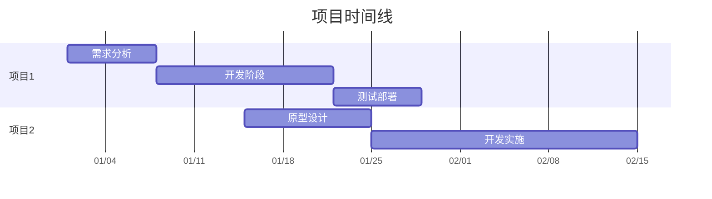

# 项目状态总览

## 项目清单

### [项目名称 1]
- **状态**： [进行中/暂停/已完成]
- **优先级**： [高/中/低]
- **开始时间**： YYYY-MM-DD
- **预期完成**： YYYY-MM-DD
- **当前进度**： X% (基于已完成任务)
- **负责人**： [负责人姓名或角色]
- **关键依赖**： [依赖的其他项目或资源]
- **下一步行动**： [下一步需要完成的任务]
- **风险/障碍**： [当前面临的风险或障碍]

### [项目名称 2]
- **状态**： [进行中/暂停/已完成]
- **优先级**： [高/中/低]
- **开始时间**： YYYY-MM-DD
- **预期完成**： YYYY-MM-DD
- **当前进度**： X% (基于已完成任务)
- **负责人**： [负责人姓名或角色]
- **关键依赖**： [依赖的其他项目或资源]
- **下一步行动**： [下一步需要完成的任务]
- **风险/障碍**： [当前面临的风险或障碍]

## 资源分配

### 人力资源
| 人员/角色 | 分配项目 | 时间投入 | 技能需求 |
|-----------|----------|----------|----------|
| [角色1] | [项目1] | [X小时/周] | [所需技能] |
| [角色2] | [项目2] | [Y小时/周] | [所需技能] |

### 技术资源
| 资源类型 | 项目 | 配置 | 成本/月 |
|----------|------|------|---------|
| [服务器] | [项目1] | [配置详情] | [$金额] |
| [API服务] | [项目2] | [配额详情] | [$金额] |

## 关键时间线

## 进度指标

### 完成度指标
- **总体完成度**： X%
- **按时完成率**： Y%
- **预算执行率**： Z%

### 质量指标
- **缺陷密度**： [每千行代码缺陷数]
- **用户满意度**： [评分或反馈]
- **代码覆盖率**： [测试覆盖率百分比]

## 变更记录

| 日期 | 变更类型 | 变更内容 | 变更原因 | 影响评估 |
|------|----------|----------|----------|----------|
| YYYY-MM-DD | [范围/时间/资源] | [变更详情] | [变更原因] | [高/中/低] |

---

**最后更新**： YYYY-MM-DD  
**数据来源**： 项目管理系统、团队报告  
**更新频率**： 每周/每月