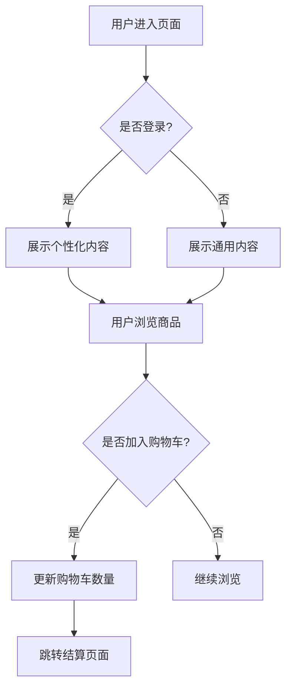
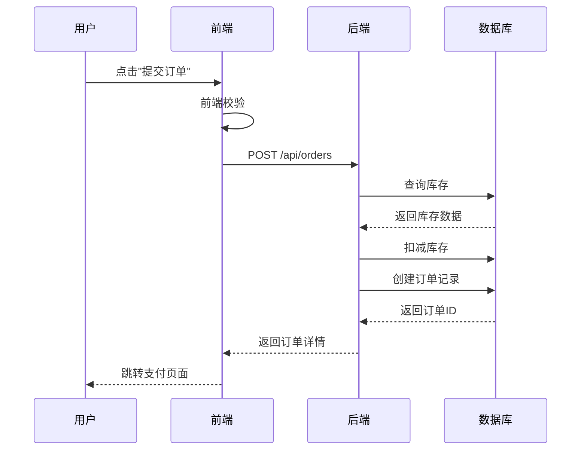

# 产品逆向分析

## 概述

本技能通过分析产品界面截图，系统性地逆向推导产品的业务闭环、技术架构及设计哲学。采用结构化的分析框架，从核心功能识别到模块拆解，再到业务逻辑推演，帮助深入理解产品设计背后的思考。

## 分析流程

### Step 1: 核心功能与场景识别

首先建立对产品的整体认知：

- **产品定位**：用一句话定义该产品/界面的核心价值
  - 示例："一款面向企业的项目协作管理工具"
  - 关注点：解决什么问题、为谁解决、如何解决

- **目标用户**：分析该界面服务于哪类特定人群
  - 考虑维度：职业角色、使用场景、技术水平、痛点需求
  - 示例："面向项目经理和开发团队的协作场景"

- **核心场景**：描述用户在什么样的情况下会打开这个界面，解决什么痛点
  - 使用 "当...时，用户需要...，以便..." 的句式
  - 示例："当项目进入开发阶段时，项目经理需要实时跟踪任务进度，以便及时调整资源分配"

### Step 2: 模块拆解

#### 2.1 模块概览表

使用 Markdown 表格列出界面中的主要功能模块：

| 模块名称 | 视觉位置 | 核心作用 | 优先级 (P0/P1/P2) |
| :--- | :--- | :--- | :--- |
| 导航栏 | 顶部固定 | 全局跳转与品牌展示 | P0 |
| 侧边栏 | 左侧固定 | 功能入口与层级导航 | P0 |
| 主内容区 | 中央可滚动 | 核心信息展示与交互 | P0 |
| 操作面板 | 右侧浮动 | 快捷操作与详情查看 | P1 |

**优先级定义：**
- P0：核心功能，缺失则产品不可用
- P1：重要功能，显著影响用户体验
- P2：辅助功能，锦上添花

#### 2.2 深度模块分析

针对上述每个模块，从以下三个维度进行详细拆解：

**视觉层 (Visual)**
- 色彩心理学应用：主色调传达的情感（如蓝色=专业、橙色=活力）
- 视觉重心分布：F型/Z型浏览模式的利用
- 栅格系统利用：8px/12列栅格等设计系统的应用
- 视觉层级：通过大小、颜色、间距建立的信息优先级

**交互层 (Interaction)**
- 预期的手势/点击反馈：悬停态、点击态、禁用态
- 状态转换逻辑：
  - Loading 状态：骨架屏/加载动画的设计
  - Empty 状态：空状态插画与引导文案
  - Error 状态：错误提示与补救措施
- 交互模式：拖拽、下拉刷新、无限滚动等

**信息架构 (IA)**
- 信息的层级权重：一级/二级/三级信息的划分
- 字段的组织逻辑：按时间/类别/重要性排序
- 导航结构：扁平化 vs 层级化
- 信息密度：信息量与留白的平衡

#### 2.3 业务逻辑推演

**底层规则**

根据 UI 元素推测背后的逻辑限制：

- **权限控制**：按钮的显示/隐藏暗示的角色权限体系
- **数据校验**：表单字段的必填/格式要求
- **业务规则**：如"库存不足时禁用购买按钮"
- **算法排序**：列表的默认排序规则（最新/最热/推荐）
- **状态机**：订单/任务的状态流转规则

**数据流向**

分析该界面可能涉及到的前端输入与后端数据交换过程：

1. **用户输入** → 前端校验 → API 请求
2. **后端处理** → 数据库操作 → 业务逻辑计算
3. **响应返回** → 前端渲染 → 状态更新

使用箭头标注关键数据流：
```
用户点击"提交订单"
→ 前端校验库存/地址
→ POST /api/orders
→ 后端扣减库存/创建订单
→ 返回订单号
→ 跳转支付页面
```

#### 2.4 业务流程图 (Mermaid)

根据截图推测用户完成核心任务的完整路径。

**输出要求**：使用 Mermaid 语法渲染 Sequence Diagram 或 Flowchart。

**Flowchart 示例（适用于决策流程）：**



**Sequence Diagram 示例（适用于系统交互）：**



#### 2.5 亮点与风险

**产品亮点**

挖掘设计中极具创新或极致体验的小细节：

- **微交互设计**：如按钮的涟漪效果、列表项的滑动删除
- **智能化功能**：如自动保存草稿、智能推荐
- **无障碍设计**：键盘导航、屏幕阅读器支持
- **性能优化**：虚拟滚动、图片懒加载
- **情感化设计**：空状态插画、加载动画的趣味性

**潜在风险**

从合规性、用户认知负担、极端情况处理等角度提出改进建议：

- **合规性风险**
  - 隐私政策是否明确？
  - 用户数据收集是否合规？
  - 是否符合无障碍标准（WCAG）？

- **认知负担**
  - 信息密度是否过高？
  - 操作路径是否过长？
  - 专业术语是否需要解释？

- **极端情况**
  - 网络异常时的降级方案？
  - 大数据量时的性能表现？
  - 边界值输入的处理（如超长文本）？

- **用户体验**
  - 是否存在误操作风险（如删除无二次确认）？
  - 关键操作是否有明确反馈？
  - 错误提示是否友好且可操作？

## 输出规范

- **语气**：专业、严谨、具有洞察力
- **语言**：中文
- **格式**：严格遵守上述 Markdown 结构
- **深度**：避免浅层描述，深入分析设计背后的思考
- **客观性**：基于截图进行合理推测，明确标注推测性内容

分析结果保存为MD文件

## 分析示例

当用户上传截图后，按以下结构输出：

```markdown
# [产品名称] 逆向分析报告

## Step 1: 核心功能与场景识别

### 产品定位
[一句话定义]

### 目标用户
[用户画像分析]

### 核心场景
[场景描述]

## Step 2: 模块拆解

### 2.1 模块概览表
[表格]

### 2.2 深度模块分析
#### [模块名称]
**视觉层**：...
**交互层**：...
**信息架构**：...

### 2.3 业务逻辑推演
**底层规则**：...
**数据流向**：...

### 2.4 业务流程图
[Mermaid 图表]

### 2.5 亮点与风险
**产品亮点**：...
**潜在风险**：...
```
