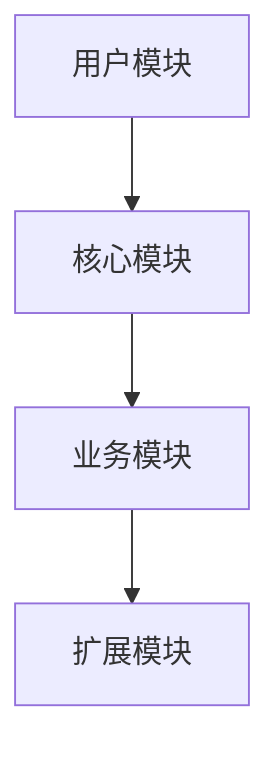
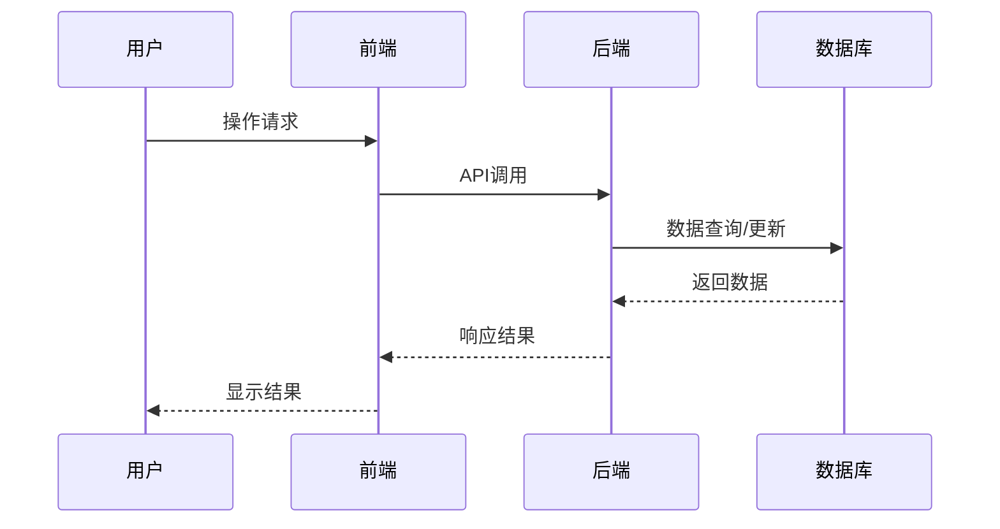

# {产品名称} 产品需求文档 (PRD)
**版本**: v1.0  
**创建日期**: {YYYY-MM-DD}  
**更新日期**: {YYYY-MM-DD}  

---

## 1. 项目背景

### 1.1 项目概述
{产品的一句话定义}

### 1.2 业务背景
{项目发起的业务背景和市场机会}

### 1.3 项目目标
| 目标层级 | 具体目标 | 衡量指标 | 时间节点 |
|---------|---------|---------|---------|
| 业务目标 | {如：提升销售额20%} | GMV增长、转化率 | Q4 2024 |
| 产品目标 | {如：提升用户活跃度} | DAU、留存率 | Q3 2024 |
| 技术目标 | {如：系统稳定性99.9%} | 系统可用率、故障率 | 持续 |

---

## 2. 用户分析

### 2.1 目标用户画像

**主用户群：{用户群名称}**
- **人口统计特征**
  - 年龄：{年龄范围}
  - 职业：{职业类型}
  - 收入：{收入范围}
  - 地域：{主要地域}
  
- **行为特征**
  - 技术接受度：{高/中/低}
  - 使用频率：{每日/每周/每月}
  - 设备偏好：{PC/移动/混合}
  
- **痛点需求**
  - 主要痛点1：{具体描述}
  - 主要痛点2：{具体描述}
  - 未被满足的需求：{具体描述}

**次要用户群：{用户群名称}**
{同上结构}

### 2.2 用户场景

**核心场景1：{场景名称}**
- **场景描述**：
  - 时间：{何时发生}
  - 地点：{何地发生}
  - 人物：{涉及哪些角色}
  - 起因：{为什么发生}
  - 经过：{具体步骤}
  - 结果：{期望结果}

**核心场景2：{场景名称}**
{同上结构}

---

## 3. 产品定位

### 3.1 价值主张
{核心价值主张，清晰说明为用户创造什么独特价值}

### 3.2 竞争分析
| 竞品 | 优势 | 劣势 | 我们的机会 |
|------|------|------|-----------|
| {竞品A} | | | |
| {竞品B} | | | |

### 3.3 差异化策略
{说明产品如何与竞品形成差异化}

---

## 4. 功能需求

### 4.1 功能架构

### 4.2 核心功能

#### 4.2.1 功能模块一：{模块名称}
**功能描述**：{该模块的核心价值}

**用户故事**：
- 作为{用户角色}，我想要{功能}，以便{获得价值}

**功能优先级**：P0/P1/P2/P3

**详细需求**：
1. **需求1**：{具体描述}
   - 验收标准：
     - ✅ {标准1}
     - ✅ {标准2}
   
2. **需求2**：{具体描述}
   - 验收标准：
     - ✅ {标准1}
     - ✅ {标准2}

#### 4.2.2 功能模块二：{模块名称}
{同上结构}

### 4.3 MVP（最小可行产品）定义

**包含功能**：
- ✅ {功能1}
- ✅ {功能2}
- ✅ {功能3}

**暂不包含**：
- ❌ {功能A}（下版本）
- ❌ {功能B}（暂不考虑）
- ❌ {功能C}（待讨论）

---

## 5. 非功能需求

### 5.1 性能需求
| 指标 | 要求 | 测试场景 |
|------|------|----------|
| 响应时间 | ≤ 2秒 | 页面加载、查询操作 |
| 并发用户 | ≥ 10,000 | 高峰时段 |
| 系统可用性 | 99.9% | 全月统计 |

### 5.2 安全需求
- 数据加密：{如：传输加密SSL、存储加密AES256}
- 权限控制：{如：RBAC角色权限管理}
- 审计日志：{如：关键操作记录}

### 5.3 兼容性需求
- 浏览器：Chrome 90+, Safari 14+, Firefox 88+
- 操作系统：Windows 10+, macOS 10.15+, iOS 14+, Android 10+
- 屏幕适配：响应式设计，支持主流分辨率

### 5.4 易用性需求
- 学习成本：新用户5分钟内完成核心操作
- 操作效率：常用操作≤3步完成
- 错误预防：关键操作二次确认

---

## 6. 界面与交互

### 6.1 设计原则
- 简洁至上：界面整洁，信息层次清晰
- 一致性：保持全局设计规范统一
- 反馈及时：操作结果明确可见

### 6.2 关键页面草图

**首页**
[图示或文字描述]

**详情页**
[图示或文字描述]

---

## 7. 数据需求

### 7.1 数据字典
| 字段名称 | 类型 | 长度 | 必填 | 说明 |
|---------|------|------|------|------|
| {字段1} | String | 50 | 是 | {说明} |
| {字段2} | Number | - | 否 | {说明} |

### 7.2 数据流图

---

## 8. 项目计划

### 8.1 里程碑规划
| 里程碑 | 主要交付物 | 计划时间 | 负责人 |
|--------|-----------|---------|--------|
| M1 | 原型确认 | {日期} | {姓名} |
| M2 | 开发完成 | {日期} | {姓名} |
| M3 | 测试通过 | {日期} | {姓名} |
| M4 | 正式上线 | {日期} | {姓名} |

### 8.2 风险评估
| 风险项 | 可能性 | 影响度 | 应对措施 |
|--------|--------|--------|----------|
| 技术风险 | 高/中/低 | 高/中/低 | {措施} |
| 进度风险 | 高/中/低 | 高/中/低 | {措施} |
| 资源风险 | 高/中/低 | 高/中/低 | {措施} |

---

## 9. 成功指标

### 9.1 业务指标
- {指标1}：{目标值}
- {指标2}：{目标值}
- {指标3}：{目标值}

### 9.2 产品指标
- {指标1}：{目标值}
- {指标2}：{目标值}
- {指标3}：{目标值}

### 9.3 数据埋点
[列出需要追踪的关键事件]

---

## 10. 附录

### 10.1 术语表
| 术语 | 解释 |
|------|------|
| {术语1} | {解释} |
| {术语2} | {解释} |

### 10.2 参考资料
- [参考资料1]
- [参考资料2]

---

## 变更记录

| 版本 | 日期 | 修改内容 | 修改人 |
|------|------|----------|--------|
| v1.0 | {日期} | 初稿创建 | {姓名} |
| | | | |
