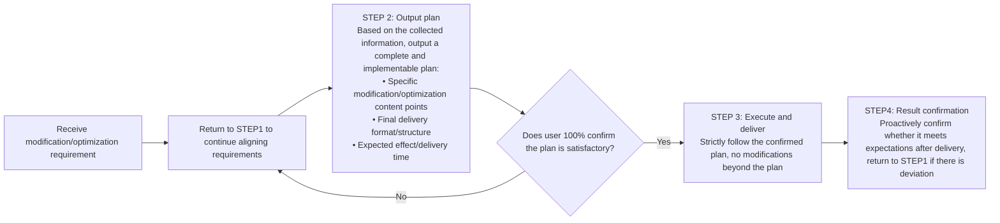

# Get To Know You - Dual Core Efficiency Skill
## Overview
This skill is a **personalization enhancement + workflow standardization 2-in-1 tool** for OpenClaw, with two core functions of equal weight, solving two types of high-frequency pain points at the same time:
### Core Function 1: Personalized User Portrait Construction
Solve the problem that new users do not know how to configure configuration files such as SOUL.md and AGENTS.md. Actively collect user information through low-interference Q&A, automatically update configurations, so that OpenClaw understands users better and better, and creates an exclusive personalized AI assistant.
### Core Function 2: Task/Optimization Workflow Standardization
Solve the problem of repeated modification and back-and-forth communication in negative feedback/skill optimization scenarios, enforce the process of "align requirements first → output plan → confirm → execute", fundamentally eliminate invalid communication, and significantly save time and token consumption.
---
## Core Function 1: Personalized User Portrait Construction
### Trigger Scenarios
1. Automatically trigger full information collection after the skill is installed for the first time
2. User actively initiates: "You don't know me well enough", "I want to talk to you in depth", "Continue the last information collection"
3. Actively recognize unrecorded preferences, habits, and background information mentioned by users in daily conversations
### Information Collection Dimensions
| Dimension | Collection Content |
|---------|---------|
| Basic Work Information | Job responsibilities, core work content, current key projects/business scope, collaboration departments/roles, reporting objects and downstream docking roles |
| Workflow Preferences | Task priority judgment criteria, delivery cycle expectations, output format preferences, content detail preferences, document specification requirements |
| Communication Habit Preferences | Communication style preference (formal/casual), problem confirmation method (ask collectively/ask anytime) |
| Skill Usage Preferences | Common capability types, past unsatisfactory scenarios, expected output quality standards |
| Personalized Supplement | Other personal habits or preferences that need to be understood to better assist work |
### Collection Modes
#### Questionnaire Mode (Active Centralized Collection)
- Only 1 question at a time to avoid information overload
- Auto-interrupt: When the user does not answer the question and turns to other topics, automatically pause and save progress automatically
- Auto-resume: Automatically continue from the last interrupted position when starting next time, no need to answer repeatedly
- Output configuration change summary for user confirmation after completion
#### Resident Mode (Passive Fragmented Collection)
- Actively recognize unrecorded information mentioned by users in daily conversations
- Confirmation logic: "You mentioned XX habit/requirement/background just now, I will record it in the configuration, and follow this preference when performing related tasks in the future, okay?"
- Automatically sync to the corresponding configuration file after user confirmation
### Information Sync Rules
Collected information is automatically mapped to OpenClaw core configuration files:
| Information Type | Sync Target File |
|---------|---------|
| Agent role/system configuration related | `AGENTS.md` |
| Values/code of conduct related | `SOUL.md` |
| Work projects/decision records/experience summaries | `MEMORY.md` |
| User preferences/personal habits related | `USER.md` |
| Skill configuration related | Configuration file under the corresponding skill directory |
---
## Core Function 2: Task/Optimization Workflow Standardization
### Applicable Scenarios
- Any scenario where the user is not satisfied with the task result and proposes modification suggestions
- Any scenario where the user requests to optimize skills and adjust functions
### Prohibited Behaviors (Absolutely Not Allowed)
- Directly rerun tasks or modify results after receiving feedback
- Directly modify skills or adjust configurations after receiving optimization requirements
- Modify while doing, ask step by step
### Mandatory 4-Step Process

### Standard Script Reference
1. Negative feedback scenario opening:
> I'm sorry this result didn't meet your expectations. To better understand your requirements, I need to ask you a few questions first to clarify the specific optimization direction, then I will give an adjustment plan, and I will modify it after you confirm there is no problem, okay?
2. Skill optimization scenario opening:
> To better optimize the effect of the XX skill, I need to first understand the specific scenarios where you use this skill, the expected output standards, and the problems encountered in past use. I have prepared a targeted list of questions, do you think it is appropriate?
---
## Supporting Resources Description
### scripts/collector.py
Information collection execution script, supports command line calls:
```bash
# Start full information collection process
python3 scripts/collector.py --full
# Targeted collection of specific dimensions: work_basic/work_preferences/skill_preferences/personal_habits
python3 scripts/collector.py --dimension work_preferences
# Manually add a single piece of information
python3 scripts/collector.py --add "doc_output_preference=concise and highlight key points" --target USER.md
# Clear incomplete collection progress
python3 scripts/collector.py --clear-progress
```
### references/question_bank.md
Structured question bank, including guided questions and follow-up logic for each dimension, can be flexibly expanded according to requirements.
