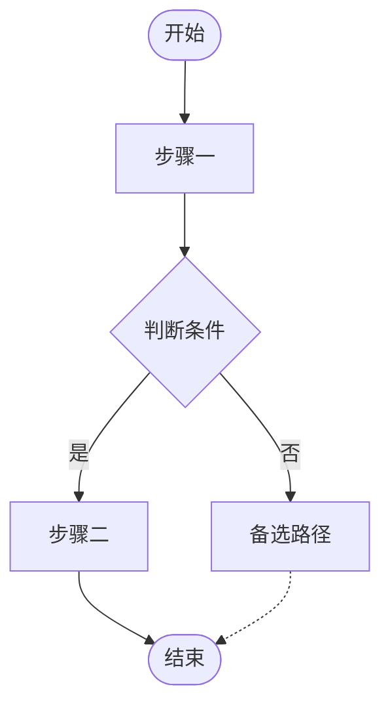
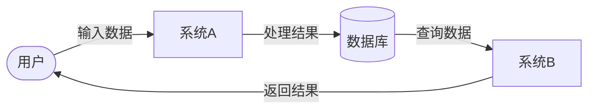

# [产品/功能名称] - 业务流程分析报告

**版本**：v1.0 | **日期**：[日期] | **模式**：[快速/标准]

---

## 1. 需求概述

### 1.1 业务背景

[描述业务背景、当前痛点及本次需求的来源]

### 1.2 业务目标

| 目标编号 | 业务目标 | 衡量指标 |
| :--- | :--- | :--- |
| G-01 | | |
| G-02 | | |

### 1.3 用户角色

| 角色 | 核心职责 | 关键权限 |
| :--- | :--- | :--- |
| | | |

---

## 2. 核心业务流程

### 2.1 高层级流程图（战略视图）

> 适合向管理层/业务方展示，节点数量 5–10 个，隐藏技术细节

### 2.2 详细流程图（实施视图）

> 适合开发/测试团队，包含所有决策点、异常路径、系统交互

### 2.3 流程步骤说明

| 步骤ID | 步骤名称 | 执行角色 | 详细描述 | 输入 | 输出 |
| :--- | :--- | :--- | :--- | :--- | :--- |
| S-01 | | | | | |
| S-02 | | | | | |

---

## 3. RACI 角色职责矩阵

> R=负责执行 A=最终审批 C=需咨询 I=需知会
> （快速模式可省略此章节）

| 关键活动 | [角色1] | [角色2] | [角色3] |
| :--- | :---: | :---: | :---: |
| 活动一 | R | A | I |
| 活动二 | C | R | A |

---

## 4. 数据流图 (DFD)

> 描述数据在各角色/系统间的流转路径
> （快速模式可省略此章节）

---

## 5. 异常场景分析

| 异常ID | 异常场景 | 分类 | 优先级 | 触发条件 | 处理策略 |
| :--- | :--- | :--- | :--- | :--- | :--- |
| E-01 | | 业务/场景/用户/技术 | P0 | | |
| E-02 | | | P1 | | |
| E-03 | | | P2 | | |

**异常分类说明**：
- **业务异常**：数据缺失/格式错误/权限不足/业务规则冲突
- **场景异常**：多渠道差异/网络环境/特殊时段/边界场景
- **用户异常**：误操作/重复操作/恶意行为
- **技术异常**：服务不可用/超时/数据一致性/接口问题

---

## 6. 附录

### 6.1 名词解释

| 术语 | 解释 |
| :--- | :--- |
| | |

### 6.2 相关文档

| 文档名称 | 说明 | 链接 |
| :--- | :--- | :--- |
| | | |
