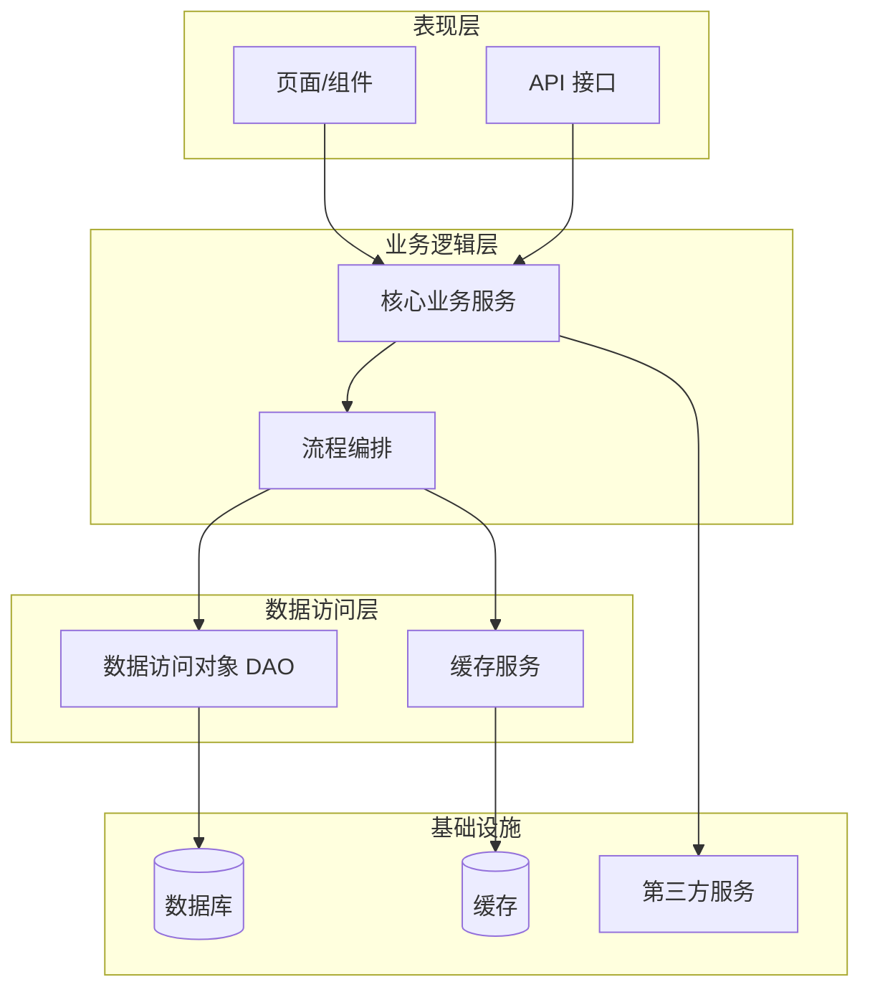
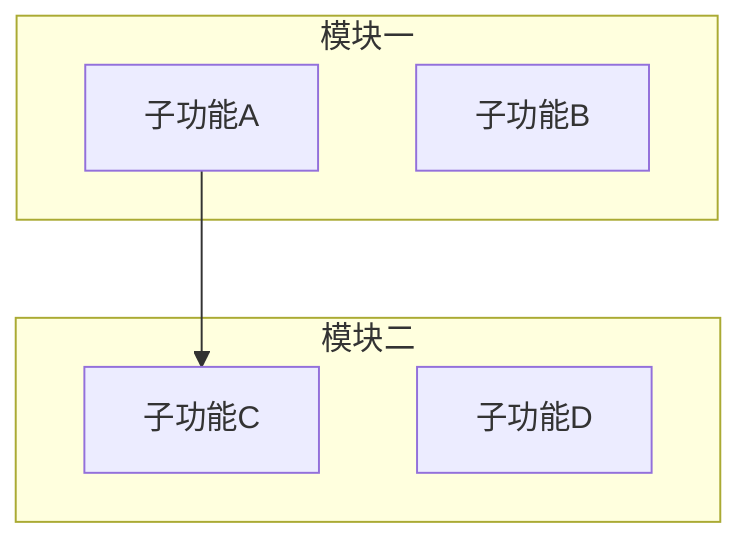
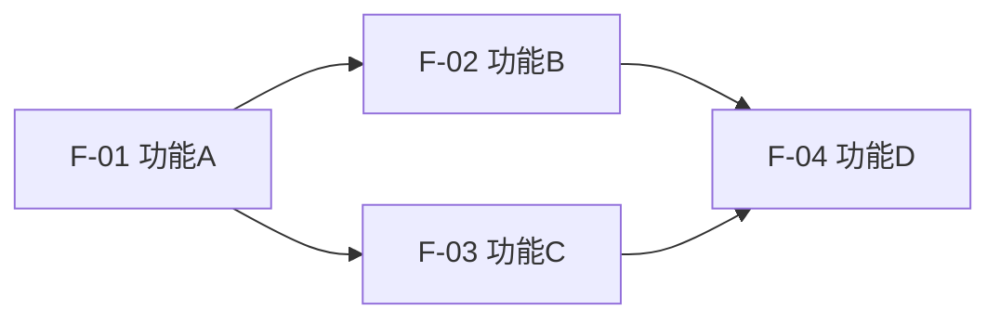
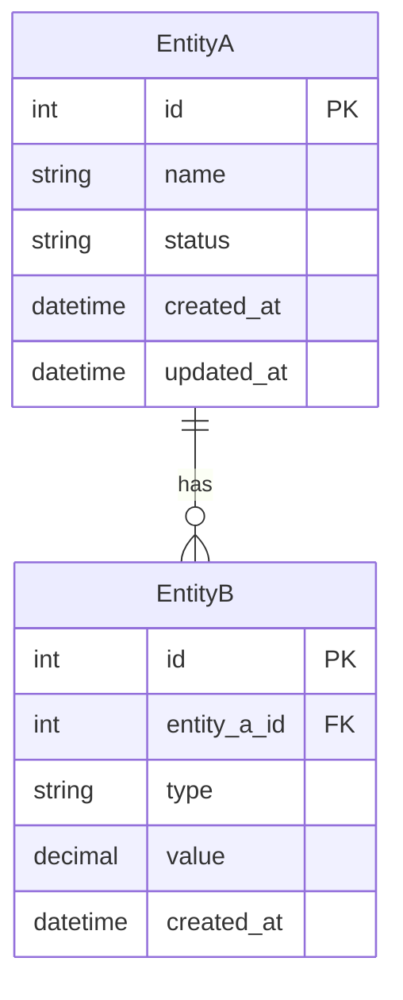

# [产品/功能名称] - 功能架构设计

**版本**：v1.0 | **日期**：[日期] | **模式**：[快速/标准]

---

## 1. 系统概述

### 1.1 架构目标

[说明本功能/系统的设计目标，如：高可用、可扩展、低延迟等]

### 1.2 设计原则

| 原则 | 说明 |
| :--- | :--- |
| 单一职责 | 每个模块只负责一个明确的职责 |
| MECE | 模块间无重叠，功能无遗漏 |
| 可扩展性 | 预留扩展接口，支持迭代演进 |

---

## 2. 功能分层架构

### 2.1 架构分层图



### 2.2 功能架构图（模块视图）



### 2.3 功能模块划分

| 模块名称 | 所属层次 | 核心职责 | 包含功能 |
| :--- | :--- | :--- | :--- |
| | 表现层 | | |
| | 业务层 | | |
| | 数据层 | | |

---

## 3. 详细功能规格

### 3.1 [模块一名称]

| 功能ID | 功能名称 | JTBD（当…时，我想…，以便…） | RICE 分 | 优先级 |
| :--- | :--- | :--- | :---: | :---: |
| F-01 | | | | P0 |
| F-02 | | | | P1 |

**F-01 验收标准（BDD）**：
```
场景一：[正常路径]
  Given [前置状态]
  When  [用户操作]
  Then  [系统响应]

场景二：[异常路径]
  Given [前置状态]
  When  [触发条件]
  Then  [系统响应]
```

### 3.2 [模块二名称]

| 功能ID | 功能名称 | JTBD（当…时，我想…，以便…） | RICE 分 | 优先级 |
| :--- | :--- | :--- | :---: | :---: |
| F-03 | | | | P0 |

**F-03 验收标准（BDD）**：
```
场景一：[正常路径]
  Given [前置状态]
  When  [用户操作]
  Then  [系统响应]
```

---

## 4. 功能依赖关系

### 4.1 依赖关系图



### 4.2 功能流转矩阵

| 来源功能 | 触发条件 | 目标功能 | 传递数据 |
| :--- | :--- | :--- | :--- |
| F-01 | 操作完成 | F-02 | |
| F-02 | 审批通过 | F-03 | |

---

## 5. 核心数据实体

### 5.1 实体关系图（ERD）



### 5.2 核心实体定义

> 列出 3–5 个最关键的实体，每个实体明确：字段、类型、约束、业务含义。

**Entity: [实体名称]**（对应表：`table_name`）

| 字段名 | 数据类型 | 约束 | 业务含义 |
| :--- | :--- | :--- | :--- |
| id | INT | PK, AUTO_INCREMENT | 主键 |
| [field] | VARCHAR(N) | NOT NULL | |
| status | TINYINT | NOT NULL, DEFAULT 1 | 枚举值见下方 |
| created_at | DATETIME | NOT NULL | 创建时间 |
| updated_at | DATETIME | NOT NULL | 最后更新时间 |

**状态枚举**：

| 字段 | 值 | 含义 |
| :--- | :--- | :--- |
| status | 0 | 禁用 |
| status | 1 | 正常 |

**Entity: [实体名称2]**（对应表：`table_name2`）

| 字段名 | 数据类型 | 约束 | 业务含义 |
| :--- | :--- | :--- | :--- |
| id | INT | PK, AUTO_INCREMENT | 主键 |
| [entity_a]_id | INT | FK → [entity_a].id | 外键 |
| | | | |

### 5.3 实体间关系说明

| 关系 | 类型 | 业务含义 |
| :--- | :--- | :--- |
| EntityA → EntityB | 1:N | 一个 A 可以有多个 B |
| EntityB → EntityC | N:1 | 多个 B 属于一个 C |

---

## 6. 迭代规划

### 6.1 迭代总览

| 迭代 | 目标 | 功能范围 | 预计周期 |
| :--- | :--- | :--- | :--- |
| MVP | 核心流程可用 | F-01, F-02 | 2 周 |
| Phase 2 | 完善用户体验 | F-03, F-04 | 1 周 |
| Phase 3 | 扩展增值功能 | F-05+ | 后续 |

### 6.2 MVP（最小可行产品）

- **目标**：[MVP 核心目标]
- **功能范围**：[列出 P0 功能]
- **排除范围**：[明确不包含的内容]

### 6.3 Phase 2

- **目标**：[第二期目标]
- **功能范围**：[列出 P1 功能]

---

## 7. 附录

### 7.1 名词解释

| 术语 | 解释 |
| :--- | :--- |
| | |
