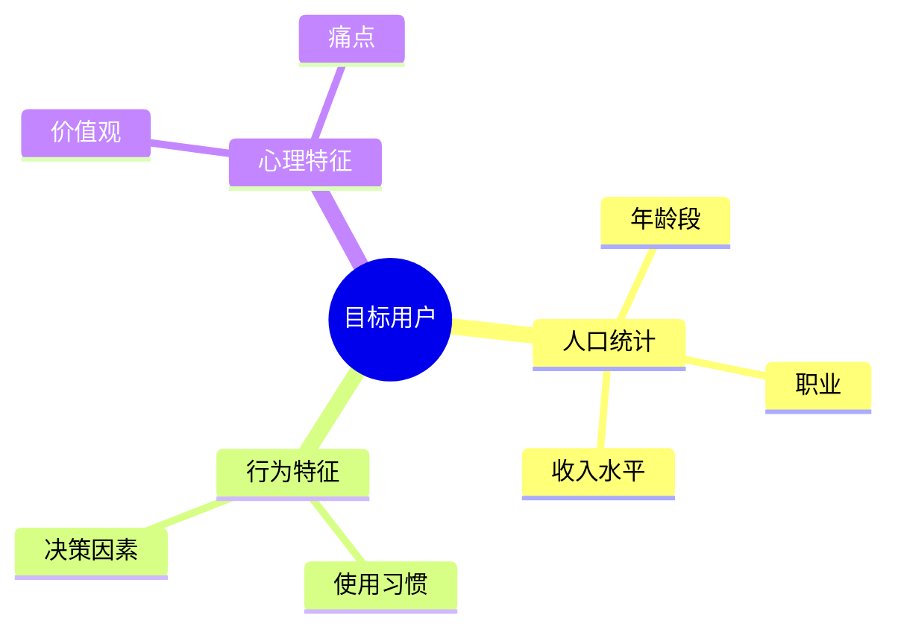
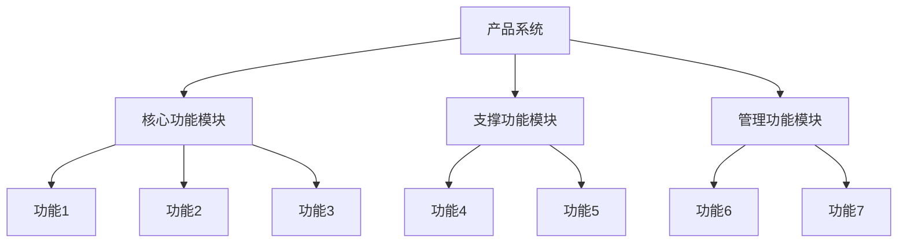
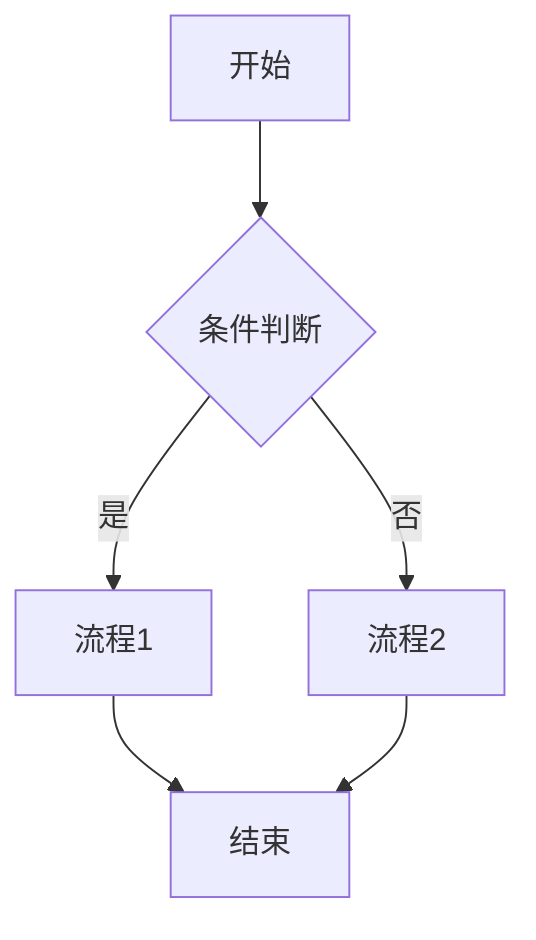
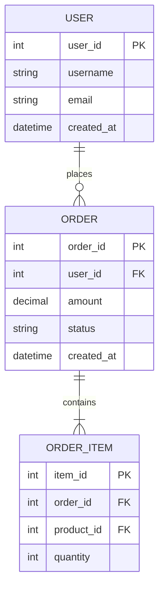
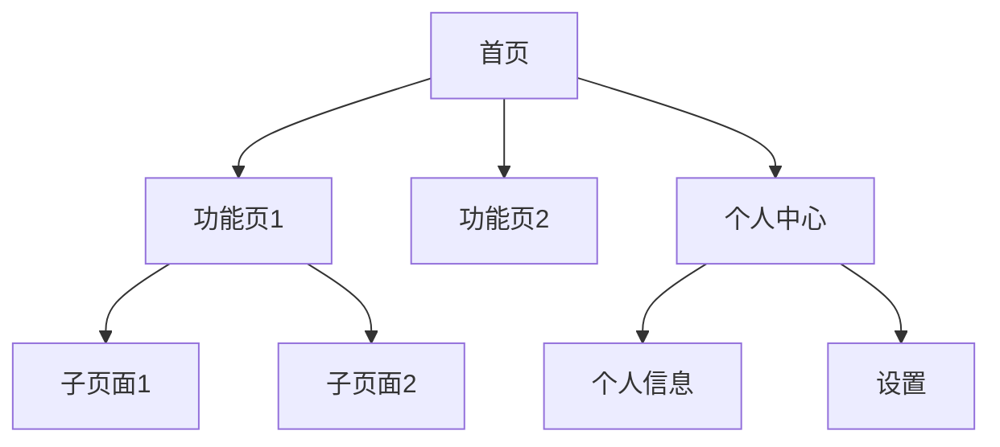
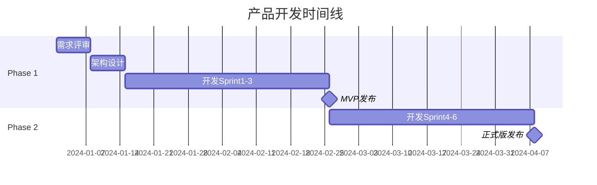
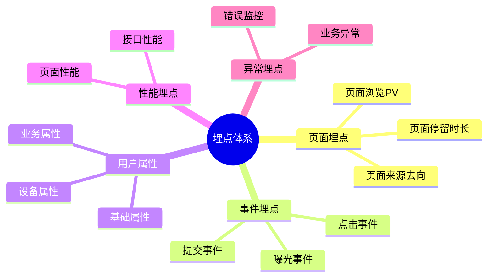
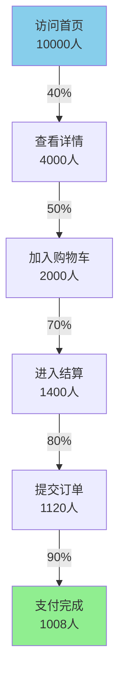
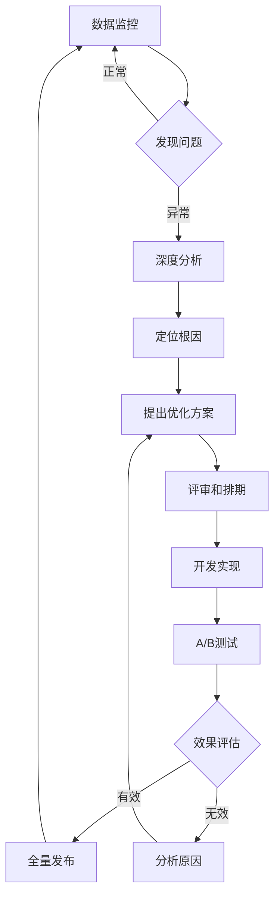

# [产品/功能名称] - 产品需求文档 (PRD)

**文档版本**: v1.0  
**创建日期**: YYYY-MM-DD  
**负责人**: [产品经理姓名]  
**状态**: 草稿 / 评审中 / 已批准 / 开发中 / 已发布

---

## 📋 文档修订记录

| 版本 | 日期 | 修订人 | 修订内容 |
| :--- | :--- | :--- | :--- |
| v1.0 | YYYY-MM-DD | | 初始版本 |
| | | | |

---

## 1. 产品概述

### 1.1 产品背景

**行业背景**:


**业务痛点**:
- 痛点1: 
- 痛点2: 
- 痛点3: 

**解决方案**:


### 1.2 产品定位

**目标用户**:
- 主要用户: 
- 次要用户: 

**产品价值主张**:
> 为 [目标用户]，提供 [核心功能]，帮助他们 [解决的问题]，从而实现 [价值收益]。

**竞品对比**:

| 维度 | 本产品 | 竞品A | 竞品B |
| :--- | :--- | :--- | :--- |
| 核心功能 | | | |
| 用户体验 | | | |
| 价格策略 | | | |
| 差异化优势 | | | |

### 1.3 产品目标

**业务目标**:
- 目标1: [可量化的指标，如：3个月内获取10万用户]
- 目标2: 
- 目标3: 

**成功指标 (KPI)**:

| 指标类型 | 具体指标 | 目标值 | 衡量周期 |
| :--- | :--- | :--- | :--- |
| 用户指标 | DAU/MAU | | 月度 |
| 业务指标 | GMV | | 季度 |
| 质量指标 | Bug率 | | 迭代 |

---

## 2. 用户分析

### 2.1 用户角色定义

**角色1: [角色名称]**
- **描述**: 
- **特征**: 
- **需求**: 
- **使用场景**: 
- **痛点**: 

**角色2: [角色名称]**
- **描述**: 
- **特征**: 
- **需求**: 
- **使用场景**: 
- **痛点**: 

### 2.2 用户画像



### 2.3 用户旅程地图

| 阶段 | 用户行为 | 触点 | 痛点 | 机会点 |
| :--- | :--- | :--- | :--- | :--- |
| 认知 | | | | |
| 考虑 | | | | |
| 购买/使用 | | | | |
| 体验 | | | | |
| 忠诚 | | | | |

---

## 3. 功能需求

### 3.1 功能概览



### 3.2 功能优先级分级（RICE 评分）

| 功能ID | 功能名称 | Reach | Impact | Confidence | Effort | RICE 分 | 优先级 |
| :--- | :--- | :---: | :---: | :---: | :---: | :---: | :---: |
| F-01 | | | | | | | P0 |
| F-02 | | | | | | | P1 |
| F-03 | | | | | | | P2 |

> RICE 分 = (Reach × Impact × Confidence) ÷ Effort。同优先级内按 RICE 分降序排列。
> 优先级定义：P0=MVP必须 / P1=竞品标配 / P2=锦上添花 / P3=后续探索

### 3.3 详细功能说明

#### 功能模块一: [模块名称]

**F-01: [功能名称]**

**功能描述**:


**用户故事**:
```
作为 [用户角色]
我想要 [完成的目标]
以便 [获得的价值]
```

**优先级**: P0 / P1 / P2 / P3 　　**RICE 分**: Reach___ × Impact___ × Confidence___% ÷ Effort___ = ___

**功能规格**:
- 输入: 
- 处理逻辑: 
- 输出: 
- 约束条件: 

**原型/示意图**:
```
[插入原型图或描述界面布局]
```

**验收标准（BDD 格式）**:

```
场景一：[正常路径]
  Given [前置状态/用户所处情境]
  When  [用户执行的操作]
  Then  [系统的预期响应]

场景二：[异常/边界路径]
  Given [前置状态]
  When  [触发条件]
  Then  [系统响应]
```

**异常处理**:

| 异常场景 | 处理方式 |
| :--- | :--- |
| 异常1 | |
| 异常2 | |

---

**F-02: [功能名称]**

[使用与F-01相同的结构]

---

#### 功能模块二: [模块名称]

**F-03: [功能名称]**

[使用相同的结构]

---

## 4. 业务流程

### 4.1 核心业务流程图



### 4.2 流程详细说明

**流程1: [流程名称]**

| 步骤 | 操作 | 角色 | 系统响应 | 异常处理 |
| :--- | :--- | :--- | :--- | :--- |
| 1 | | | | |
| 2 | | | | |
| 3 | | | | |

### 4.3 角色职责矩阵 (RACI)

| 活动/任务 | 产品经理 | 用户 | 系统管理员 | 开发团队 |
| :--- | :---: | :---: | :---: | :---: |
| 需求收集 | R | C | I | I |
| 功能设计 | A | C | I | R |
| 开发实现 | I | - | I | R/A |
| 测试验收 | A | I | I | R |

**图例**: R=执行者, A=负责人, C=咨询者, I=知情者

---

## 5. 非功能需求

### 5.1 性能需求

| 指标 | 要求 | 说明 |
| :--- | :--- | :--- |
| 响应时间 | < 2秒 | 90%的请求应在2秒内响应 |
| 并发用户数 | 10,000 | 支持同时在线用户数 |
| 可用性 | 99.9% | 年度可用时间 |
| 数据准确性 | 100% | 核心业务数据零容错 |

### 5.2 安全需求

- **数据安全**: 
- **隐私保护**: 
- **访问控制**: 
- **审计日志**: 

### 5.3 兼容性需求

**设备支持**:
- PC端: Windows 7+, macOS 10.12+
- 移动端: iOS 12+, Android 8+

**浏览器支持**:
- Chrome 90+
- Safari 14+
- Firefox 88+
- Edge 90+

### 5.4 可用性需求

- **易学性**: 新用户应在5分钟内完成首次任务
- **易用性**: 核心功能操作不超过3次点击
- **无障碍**: 遵循WCAG 2.1 AA标准
- **国际化**: 支持中文、英文（可扩展其他语言）

---

## 6. 数据需求

### 6.1 数据模型



### 6.2 核心数据表

**表名: users**

| 字段名 | 数据类型 | 约束 | 说明 |
| :--- | :--- | :--- | :--- |
| user_id | INT | PK, AUTO_INCREMENT | 用户ID |
| username | VARCHAR(50) | NOT NULL, UNIQUE | 用户名 |
| email | VARCHAR(100) | NOT NULL, UNIQUE | 邮箱 |
| password_hash | VARCHAR(255) | NOT NULL | 密码哈希 |
| status | TINYINT | NOT NULL, DEFAULT 1 | 状态: 0-禁用, 1-正常 |
| created_at | DATETIME | NOT NULL, DEFAULT NOW() | 创建时间 |
| updated_at | DATETIME | NOT NULL, DEFAULT NOW() | 更新时间 |

**索引**:
- PRIMARY KEY (`user_id`)
- UNIQUE KEY `idx_username` (`username`)
- UNIQUE KEY `idx_email` (`email`)

### 6.3 数据字典

| 字段/枚举 | 值 | 含义 |
| :--- | :--- | :--- |
| user.status | 0 | 禁用 |
| user.status | 1 | 正常 |
| order.status | pending | 待支付 |
| order.status | paid | 已支付 |
| order.status | cancelled | 已取消 |

---

## 7. 界面原型

### 7.1 信息架构



### 7.2 核心页面原型

**页面1: [页面名称]**

**页面目标**: 

**布局结构**:
```
+----------------------------------+
|           Header                 |
+----------------------------------+
|  侧边栏   |   主内容区域        |
|          |                      |
|          |                      |
+----------------------------------+
|           Footer                 |
+----------------------------------+
```

**交互说明**:
1. 
2. 
3. 

---

## 8. 技术实现建议

### 8.1 技术架构建议

**前端技术栈**:
- 框架: React / Vue.js
- UI库: Ant Design / Element UI
- 状态管理: Redux / Vuex

**后端技术栈**:
- 语言: Java / Python / Node.js
- 框架: Spring Boot / Django / Express
- 数据库: MySQL / PostgreSQL / MongoDB

**基础设施**:
- 部署: Docker + Kubernetes
- 缓存: Redis
- 消息队列: RabbitMQ / Kafka

### 8.2 系统集成

| 集成系统 | 集成方式 | 目的 |
| :--- | :--- | :--- |
| 第三方支付 | REST API | 支付功能 |
| 短信服务 | SDK | 验证码发送 |
| 对象存储 | S3 API | 文件存储 |

### 8.3 关键技术点

**技术难点1**: [描述]
- 解决方案: 
- 备选方案: 

**技术难点2**: [描述]
- 解决方案: 
- 备选方案: 

---

## 9. 实施计划

### 9.1 迭代规划

**Phase 1 - MVP (Sprint 1-3, 6周)**

| Sprint | 目标 | 功能范围 | 交付标准 |
| :--- | :--- | :--- | :--- |
| Sprint 1 | 基础架构搭建 | 用户系统、基础框架 | 可运行的框架 |
| Sprint 2 | 核心功能开发 | F-01, F-02 | 核心功能可用 |
| Sprint 3 | 测试与优化 | Bug修复、性能优化 | Beta版本发布 |

**Phase 2 - 完善版 (Sprint 4-6, 6周)**

| Sprint | 目标 | 功能范围 | 交付标准 |
| :--- | :--- | :--- | :--- |
| Sprint 4 | 功能扩展 | F-03, F-04 | 功能完整性 |
| Sprint 5 | 用户体验提升 | UI优化、交互改进 | 用户体验良好 |
| Sprint 6 | 正式发布准备 | 全面测试、文档完善 | 正式版发布 |

### 9.2 里程碑



### 9.3 资源需求

| 角色 | 人数 | 投入时间 |
| :--- | :---: | :--- |
| 产品经理 | 1 | 全程 |
| UI/UX设计师 | 1 | Phase 1-2 |
| 前端开发 | 2 | 全程 |
| 后端开发 | 2 | 全程 |
| 测试工程师 | 1 | Phase 1后期-全程 |

---

## 10. 风险与假设

### 10.1 关键假设

| 假设 | 验证方式 | 风险等级 |
| :--- | :--- | :---: |
| 用户愿意为此功能付费 | 用户调研、MVP测试 | 高 |
| 技术方案可行 | 技术POC | 中 |
| 3个月内可完成开发 | 详细工作量评估 | 中 |

### 10.2 风险识别与应对

**风险1: 用户接受度低**
- **可能性**: 中
- **影响**: 高
- **应对策略**: 提前进行用户调研，设计MVP快速验证
- **降低措施**: 建立用户反馈机制，快速迭代

**风险2: 技术实现困难**
- **可能性**: 低
- **影响**: 高
- **应对策略**: 技术预研，准备备选方案
- **降低措施**: 引入技术专家咨询

**风险3: 开发延期**
- **可能性**: 中
- **影响**: 中
- **应对策略**: 采用敏捷开发，定期同步进度
- **降低措施**: 预留缓冲时间，关键路径管理

### 10.3 依赖项

| 依赖项 | 负责方 | 截止日期 | 状态 |
| :--- | :--- | :--- | :--- |
| 第三方API对接 | 外部供应商 | YYYY-MM-DD | 待确认 |
| 服务器资源申请 | 运维团队 | YYYY-MM-DD | 进行中 |

---

## 11. 运营与增长策略

### 11.1 推广策略

**冷启动阶段** (第1-3个月):
- 策略1: 
- 策略2: 
- 目标: 获得首批1000个种子用户

**增长阶段** (第4-6个月):
- 策略1: 
- 策略2: 
- 目标: 用户增长到10,000

### 11.2 用户留存策略

- **新手引导**: 
- **核心功能Hook**: 
- **用户激励**: 
- **社区建设**: 

### 11.3 商业化策略

**收入模式**:
- 主要: 
- 次要: 

**定价策略**:

| 版本 | 价格 | 功能范围 | 目标用户 |
| :--- | :--- | :--- | :--- |
| 免费版 | ¥0 | 基础功能 | 个人用户 |
| 专业版 | ¥99/月 | 完整功能 | 专业用户 |
| 企业版 | 面议 | 定制服务 | 企业客户 |

---

## 12. 监控与优化

### 12.1 埋点方案设计

#### 12.1.1 埋点目标

**业务目标**:
- 监控核心功能使用情况，评估功能价值
- 分析用户行为路径，优化用户体验
- 支持数据驱动的产品决策

**埋点分类**:



#### 12.1.2 核心埋点清单

**页面埋点**:

| 页面ID | 页面名称 | 触发时机 | 优先级 | 关键参数 |
| :--- | :--- | :--- | :---: | :--- |
| P-001 | 首页 | 页面加载完成 | P0 | page_id, user_id, timestamp |
| P-002 | 商品详情页 | 页面加载完成 | P0 | page_id, product_id, user_id |
| P-003 | 购物车页 | 页面加载完成 | P0 | page_id, cart_item_count |
| P-004 | 结算页 | 页面加载完成 | P0 | page_id, order_amount |

**核心事件埋点**:

| 事件ID | 事件名称 | 事件代码 | 触发时机 | 优先级 | 关键参数 |
| :--- | :--- | :--- | :--- | :---: | :--- |
| E-001 | 用户注册 | user_register_submit | 注册成功 | P0 | user_id, register_method |
| E-002 | 用户登录 | user_login_submit | 登录成功 | P0 | user_id, login_method |
| E-101 | 商品搜索 | product_search_submit | 搜索提交 | P0 | keyword, result_count |
| E-102 | 查看商品详情 | product_detail_view | 进入详情页 | P0 | product_id, category_id |
| E-201 | 加入购物车 | cart_add_click | 点击加购 | P0 | product_id, quantity, price |
| E-202 | 提交订单 | order_submit_click | 提交订单 | P0 | order_id, amount, product_count |
| E-203 | 订单支付 | order_pay_submit | 支付完成 | P0 | order_id, pay_method, amount |

**曝光埋点**:

| 曝光ID | 曝光对象 | 事件代码 | 曝光定义 | 优先级 |
| :--- | :--- | :--- | :--- | :---: |
| X-001 | Banner曝光 | banner_expose | 可视区停留>1s | P0 |
| X-002 | 商品卡片曝光 | product_card_expose | 可视区停留>1s | P0 |
| X-003 | 推荐商品曝光 | recommend_expose | 可视区停留>1s | P1 |

#### 12.1.3 转化漏斗设计

**核心转化漏斗**:



**漏斗埋点配置**:

| 步骤 | 事件代码 | 目标转化率 | 流失预警阈值 |
| :--- | :--- | :--- | :--- |
| 步骤1: 访问首页 | page_home_view | 100% | - |
| 步骤2: 查看详情 | product_detail_view | > 40% | < 30% |
| 步骤3: 加入购物车 | cart_add_click | > 20% | < 15% |
| 步骤4: 进入结算 | checkout_enter | > 14% | < 10% |
| 步骤5: 提交订单 | order_submit_click | > 11% | < 8% |
| 步骤6: 支付完成 | order_pay_submit | > 10% | < 7% |

#### 12.1.4 性能监控埋点

**页面性能指标**:

| 指标名称 | 指标代码 | 目标值 | 说明 |
| :--- | :--- | :--- | :--- |
| 首屏加载时间 | first_screen_time | < 1.5s | 首屏内容完全显示 |
| 白屏时间 | white_screen_time | < 1s | 开始到首次渲染 |
| 可交互时间 | time_to_interactive | < 2s | 页面可交互 |
| 页面完全加载 | page_load_time | < 3s | 完全加载完成 |

**接口性能监控**:

| 参数名 | 说明 | 告警阈值 |
| :--- | :--- | :--- |
| api_url | 接口地址 | - |
| response_time | 响应时间(ms) | > 3000ms |
| status_code | HTTP状态码 | 5xx |
| error_rate | 错误率 | > 1% |

#### 12.1.5 异常监控

**前端异常**:
- JavaScript错误
- 资源加载失败
- 接口调用失败
- Promise未捕获异常

**业务异常**:
- 库存不足
- 支付失败
- 优惠券无效
- 订单创建失败

**告警规则**:
- 错误数 > 100次/小时: 黄色告警
- 错误数 > 500次/小时: 红色告警
- 关键业务错误: 实时告警

**详细埋点方案**: 参见《埋点方案设计文档》

---

### 12.2 数据监控指标

**用户行为指标**:

| 指标名称 | 计算方式 | 目标值 | 监控频率 |
| :--- | :--- | :--- | :--- |
| DAU | 日活跃用户数 | > 50,000 | 每日 |
| MAU | 月活跃用户数 | > 500,000 | 每月 |
| 次日留存率 | 次日活跃/前日新增 × 100% | > 40% | 每日 |
| 7日留存率 | 7日后活跃/7日前新增 × 100% | > 20% | 每周 |
| 平均使用时长 | 总使用时长/活跃用户数 | > 15分钟 | 每日 |
| 人均启动次数 | 总启动次数/活跃用户数 | > 3次 | 每日 |

**业务指标**:

| 指标名称 | 计算方式 | 目标值 | 监控频率 |
| :--- | :--- | :--- | :--- |
| GMV | 订单金额总和 | > ¥1,000,000/日 | 实时 |
| 订单量 | 订单总数 | > 5,000/日 | 实时 |
| 客单价 | GMV / 订单数 | > ¥200 | 每日 |
| 付费率 | 付费用户数/DAU × 100% | > 5% | 每日 |
| 整体转化率 | 支付订单数/访问用户数 × 100% | > 10% | 每日 |
| 复购率 | 重复购买用户数/总用户数 × 100% | > 30% | 每月 |

**技术指标**:

| 指标名称 | 目标值 | 监控频率 | 告警阈值 |
| :--- | :--- | :--- | :--- |
| API平均响应时间 | < 500ms | 实时 | > 1000ms |
| API错误率 | < 0.1% | 实时 | > 1% |
| 页面崩溃率 | < 0.5% | 每小时 | > 2% |
| 页面加载成功率 | > 99% | 实时 | < 95% |
| 服务可用性 | > 99.9% | 实时 | < 99% |

**监控看板**:
- 实时监控大屏: 核心业务指标实时展示
- 日报: 每日关键指标汇总
- 周报: 周度趋势分析
- 月报: 月度数据对比和洞察

### 12.3 A/B测试计划

**测试方法**:
- 使用灰度发布系统
- 流量分配: A版本50% vs B版本50%
- 样本量: 每组至少10,000用户
- 测试周期: 7-14天

**测试清单**:

| 测试项 | 假设 | 变量 | 衡量指标 | 决策标准 |
| :--- | :--- | :--- | :--- | :--- |
| 测试1: 按钮颜色 | 红色按钮转化率更高 | 按钮颜色(红/蓝) | 点击率、转化率 | 提升>5%且P<0.05 |
| 测试2: 推荐算法 | 协同过滤效果更好 | 推荐算法类型 | 点击率、加购率 | 提升>10%且P<0.05 |
| 测试3: 定价策略 | 9.9元比10元转化好 | 价格尾数 | 购买转化率、GMV | GMV提升>3% |

**A/B测试流程**:
1. 提出假设和测试方案
2. 配置实验参数
3. 灰度发布并监控数据
4. 数据分析和结论
5. 决策: 全量发布/回滚/继续优化

### 12.4 持续优化机制

**日常优化**:
- **每日**: 
  - 查看实时监控大屏
  - 检查关键指标异常
  - 处理告警事件
  
- **每周**: 
  - 数据Review会议
  - 分析异常指标原因
  - 制定优化行动计划
  - 评估A/B测试结果

- **每月**: 
  - 用户反馈分析
  - 功能使用情况评估
  - 优化需求排期
  - 月度数据报告

- **每季度**: 
  - 产品战略复盘
  - 调整产品路线图
  - 评估OKR完成情况
  - 制定下季度计划

**优化决策流程**:



**优化优先级**:
- P0 (紧急): 影响核心功能或造成资损
- P1 (重要): 显著影响用户体验或转化率
- P2 (期望): 优化点击率、流畅度等
- P3 (观望): 长期规划、探索性优化

---

## 13. 附录

### 13.1 术语表

| 术语 | 全称 | 解释 |
| :--- | :--- | :--- |
| MVP | Minimum Viable Product | 最小可行产品 |
| DAU | Daily Active Users | 日活跃用户 |
| MAU | Monthly Active Users | 月活跃用户 |
| KPI | Key Performance Indicator | 关键绩效指标 |
| RACI | Responsible, Accountable, Consulted, Informed | 职责分配矩阵 |

### 13.2 参考文档

- [相关需求文档链接]
- [竞品分析报告链接]
- [用户调研报告链接]
- [技术方案文档链接]

### 13.3 相关联系人

| 角色 | 姓名 | 邮箱 | 电话 |
| :--- | :--- | :--- | :--- |
| 产品负责人 | | | |
| 技术负责人 | | | |
| 设计负责人 | | | |
| 项目经理 | | | |

---

## 📝 审批记录

| 审批角色 | 姓名 | 审批意见 | 签字 | 日期 |
| :--- | :--- | :--- | :--- | :--- |
| 产品总监 | | 同意 / 需修改 | | |
| 技术总监 | | 同意 / 需修改 | | |
| 业务负责人 | | 同意 / 需修改 | | |

---

**文档结束**
