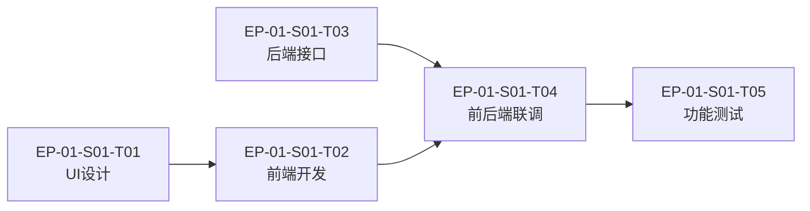

# [产品/功能名称] - 开发任务拆解清单

**文档版本**：v1.0 | **创建日期**：YYYY-MM-DD | **来源 PRD**：[PRD 文件名]  
**Sprint 目标**：[本期交付目标一句话描述]

> **结构说明**：Epic → Story → Task 三层拆解。
> - **Epic**：一个完整的业务目标，通常跨多个 Sprint
> - **Story**：用户可感知的功能单元，可在一个 Sprint 内完成
> - **Task**：具体开发/设计/测试任务，1–3 天可完成

---

## Epic 总览

| Epic ID | Epic 名称 | 对应功能模块 | 估算 Sprint 数 | 优先级 |
| :--- | :--- | :--- | :---: | :---: |
| EP-01 | [Epic名称] | [功能模块] | 2 | P0 |
| EP-02 | [Epic名称] | [功能模块] | 1 | P1 |
| EP-03 | [Epic名称] | [功能模块] | 1 | P2 |

---

## EP-01：[Epic 名称]

**业务目标**：[一句话说明这个 Epic 要解决什么业务问题]  
**完成定义（DoD）**：[整个 Epic 完成的标准]  
**依赖**：[依赖其他 Epic 或外部因素，无则填"无"]

---

### Story EP-01-S01：[Story 名称]

**用户故事**：
```
作为 [用户角色]
我想要 [完成的目标]
以便 [获得的价值]
```

**JTBD**：当 [情境] 时，我想 [动机]，这样我就能 [预期结果]

**估算工作量**：[N] Story Points / [N] 天  
**优先级**：P0 / P1 / P2  
**负责团队**：前端 / 后端 / 全栈 / 设计 / 测试

**验收标准（BDD）**：
```
场景一：[正常路径]
  Given [前置状态]
  When  [用户操作]
  Then  [系统响应]

场景二：[异常路径]
  Given [前置状态]
  When  [触发条件]
  Then  [系统的降级/错误响应]
```

**Task 拆解**：

| Task ID | Task 名称 | 类型 | 负责人 | 估算（天） | 依赖 Task |
| :--- | :--- | :--- | :--- | :---: | :--- |
| EP-01-S01-T01 | [UI设计：XXX页面] | 设计 | | 1 | 无 |
| EP-01-S01-T02 | [前端：XXX组件开发] | 前端 | | 2 | T01 |
| EP-01-S01-T03 | [后端：XXX接口开发] | 后端 | | 1.5 | 无 |
| EP-01-S01-T04 | [联调：前后端联调] | 联调 | | 0.5 | T02, T03 |
| EP-01-S01-T05 | [测试：XXX功能测试] | 测试 | | 1 | T04 |

---

### Story EP-01-S02：[Story 名称]

**用户故事**：
```
作为 [用户角色]
我想要 [完成的目标]
以便 [获得的价值]
```

**估算工作量**：[N] Story Points / [N] 天  
**优先级**：P0 / P1 / P2

**验收标准（BDD）**：
```
场景一：[正常路径]
  Given [前置状态]
  When  [用户操作]
  Then  [系统响应]
```

**Task 拆解**：

| Task ID | Task 名称 | 类型 | 负责人 | 估算（天） | 依赖 Task |
| :--- | :--- | :--- | :--- | :---: | :--- |
| EP-01-S02-T01 | | | | | |
| EP-01-S02-T02 | | | | | |

---

## EP-02：[Epic 名称]

**业务目标**：  
**完成定义（DoD）**：  
**依赖**：

---

### Story EP-02-S01：[Story 名称]

**用户故事**：
```
作为 [用户角色]
我想要 [完成的目标]
以便 [获得的价值]
```

**估算工作量**：[N] Story Points / [N] 天  
**优先级**：P0 / P1 / P2

**验收标准（BDD）**：
```
场景一：[正常路径]
  Given [前置状态]
  When  [用户操作]
  Then  [系统响应]
```

**Task 拆解**：

| Task ID | Task 名称 | 类型 | 负责人 | 估算（天） | 依赖 Task |
| :--- | :--- | :--- | :--- | :---: | :--- |
| EP-02-S01-T01 | | | | | |

---

## 迭代规划建议

### Sprint 安排

| Sprint | 包含 Story | 团队估算（SP） | 目标 |
| :--- | :--- | :---: | :--- |
| Sprint 1 | EP-01-S01, EP-01-S02 | [N] SP | [Sprint 目标] |
| Sprint 2 | EP-02-S01 | [N] SP | [Sprint 目标] |

### 关键依赖链



### 工作量汇总

| 类型 | 估算总天数 | 备注 |
| :--- | :---: | :--- |
| 设计 | | |
| 前端 | | |
| 后端 | | |
| 测试 | | |
| **合计** | | |

---

## 导入说明

本清单可直接导入主流项目管理工具：

| 工具 | 导入方式 |
| :--- | :--- |
| **Jira** | 创建 Epic → Story → Sub-task，字段映射：Story Points = 估算天数 × 系数 |
| **Linear** | 创建 Project → Cycle → Issue，优先级直接映射 P0/P1/P2 |
| **Notion** | 直接粘贴 Markdown，或使用数据库视图按 Epic 分组 |
| **飞书多维表** | 按表格结构导入，Task ID 作为唯一标识 |
