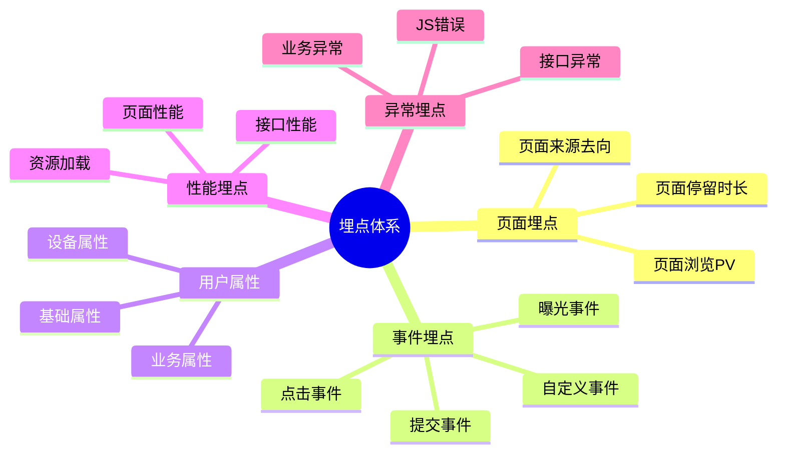
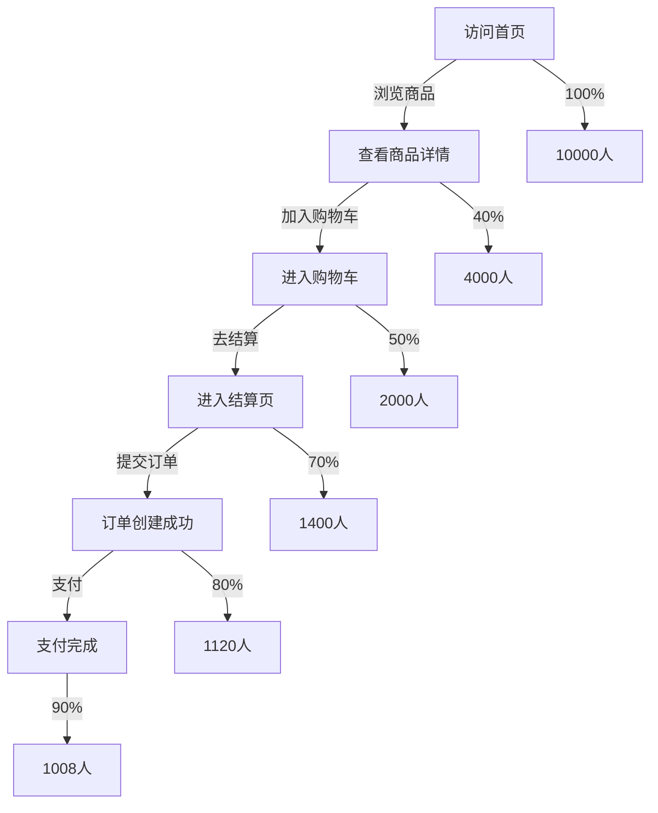

# [产品/功能名称] - 埋点方案设计文档

**文档版本**: v1.0  
**创建日期**: YYYY-MM-DD  
**负责人**: [数据产品经理/产品经理]  
**状态**: 草稿 / 评审中 / 已批准 / 开发中 / 已上线

---

## 📋 文档修订记录

| 版本 | 日期 | 修订人 | 修订内容 |
| :--- | :--- | :--- | :--- |
| v1.0 | YYYY-MM-DD | | 初始版本 |
| | | | |

---

## 1. 埋点概述

### 1.1 埋点目标

**业务目标**:
- 目标1: 监控核心功能使用情况，评估功能价值
- 目标2: 分析用户行为路径，优化用户体验
- 目标3: 支持数据驱动的产品决策

**数据需求**:
- 用户行为数据
- 业务转化数据
- 性能监控数据
- 异常/错误数据

### 1.2 埋点原则

**SMART原则**:
- **S (Specific)**: 每个埋点有明确的业务目的
- **M (Measurable)**: 数据可量化、可对比
- **A (Achievable)**: 技术上可实现
- **R (Relevant)**: 与业务目标相关
- **T (Time-bound)**: 明确数据采集周期

**技术原则**:
- 最小化性能影响
- 保护用户隐私
- 数据准确性优先
- 易于维护和扩展

### 1.3 埋点工具选型

| 工具类型 | 工具名称 | 用途 | 备注 |
| :--- | :--- | :--- | :--- |
| 前端SDK | 神策/友盟/Google Analytics | 页面和事件埋点 | |
| 后端SDK | 自研/第三方 | 服务端埋点 | |
| 可视化埋点 | GrowingIO | 无埋点方案 | 补充方案 |
| 日志收集 | ELK/Splunk | 技术日志分析 | |

---

## 2. 埋点分类体系

### 2.1 埋点分类



### 2.2 埋点命名规范

**事件命名规范**: `[模块]_[页面]_[动作]_[对象]`

**示例**:
- `home_banner_click_item` - 首页banner点击
- `product_detail_view_page` - 商品详情页浏览
- `order_checkout_submit_form` - 订单提交
- `user_profile_edit_avatar` - 编辑头像

**参数命名规范**: 使用下划线分隔，全小写
- `user_id` - 用户ID
- `product_id` - 商品ID
- `button_name` - 按钮名称
- `page_url` - 页面URL

---

## 3. 页面埋点设计

### 3.1 页面埋点清单

| 页面ID | 页面名称 | 页面路径 | 触发时机 | 优先级 |
| :--- | :--- | :--- | :--- | :---: |
| P-001 | 首页 | /home | 页面加载完成 | P0 |
| P-002 | 商品列表页 | /products | 页面加载完成 | P0 |
| P-003 | 商品详情页 | /product/:id | 页面加载完成 | P0 |
| P-004 | 购物车 | /cart | 页面加载完成 | P0 |
| P-005 | 结算页 | /checkout | 页面加载完成 | P1 |
| P-006 | 个人中心 | /profile | 页面加载完成 | P1 |

### 3.2 页面埋点参数

**通用参数** (所有页面都需要采集):

| 参数名 | 参数类型 | 说明 | 示例值 |
| :--- | :--- | :--- | :--- |
| page_id | String | 页面唯一标识 | "P-001" |
| page_name | String | 页面名称 | "首页" |
| page_url | String | 页面URL | "/home" |
| page_title | String | 页面标题 | "首页-XX商城" |
| referrer | String | 来源页面 | "/products" |
| timestamp | Long | 时间戳(毫秒) | 1234567890000 |
| user_id | String | 用户ID | "U123456" |
| session_id | String | 会话ID | "S789012" |
| platform | String | 平台类型 | "web"/"ios"/"android" |
| device_id | String | 设备唯一标识 | "D345678" |

**页面专属参数** (特定页面需要):

| 页面 | 参数名 | 参数类型 | 说明 | 示例值 |
| :--- | :--- | :--- | :--- | :--- |
| 商品详情页 | product_id | String | 商品ID | "SKU001" |
| 商品详情页 | category_id | String | 类目ID | "C001" |
| 商品详情页 | price | Float | 商品价格 | 99.00 |
| 搜索结果页 | keyword | String | 搜索关键词 | "手机" |
| 搜索结果页 | result_count | Integer | 结果数量 | 120 |

### 3.3 页面停留时长

**采集方式**:
- 进入页面时记录 `page_enter` 事件
- 离开页面时记录 `page_leave` 事件
- 计算停留时长 = leave_time - enter_time

**过滤规则**:
- 停留时长 < 1秒: 认为是误触，不计入统计
- 停留时长 > 30分钟: 认为是异常，不计入统计或单独标记

---

## 4. 事件埋点设计

### 4.1 核心事件埋点清单

#### 模块一: 用户行为

| 事件ID | 事件名称 | 事件代码 | 触发时机 | 优先级 |
| :--- | :--- | :--- | :--- | :---: |
| E-001 | 用户注册 | user_register_submit | 注册提交成功 | P0 |
| E-002 | 用户登录 | user_login_submit | 登录成功 | P0 |
| E-003 | 用户登出 | user_logout_click | 点击登出按钮 | P1 |
| E-004 | 个人资料编辑 | user_profile_edit_submit | 编辑提交成功 | P1 |

#### 模块二: 商品浏览

| 事件ID | 事件名称 | 事件代码 | 触发时机 | 优先级 |
| :--- | :--- | :--- | :--- | :---: |
| E-101 | 商品搜索 | product_search_submit | 搜索提交 | P0 |
| E-102 | 商品列表点击 | product_list_click_item | 点击商品卡片 | P0 |
| E-103 | 商品详情查看 | product_detail_view | 进入详情页 | P0 |
| E-104 | 商品图片放大 | product_image_zoom | 点击放大图片 | P2 |
| E-105 | 商品收藏 | product_favorite_click | 点击收藏按钮 | P1 |

#### 模块三: 购物流程

| 事件ID | 事件名称 | 事件代码 | 触发时机 | 优先级 |
| :--- | :--- | :--- | :--- | :---: |
| E-201 | 加入购物车 | cart_add_click | 点击加购按钮 | P0 |
| E-202 | 购物车商品删除 | cart_remove_click | 删除商品 | P1 |
| E-203 | 购物车商品数量修改 | cart_quantity_change | 修改数量 | P1 |
| E-204 | 进入结算页 | checkout_enter | 点击去结算 | P0 |
| E-205 | 提交订单 | order_submit_click | 点击提交订单 | P0 |
| E-206 | 订单支付 | order_pay_submit | 支付完成 | P0 |
| E-207 | 订单取消 | order_cancel_click | 取消订单 | P1 |

#### 模块四: 营销活动

| 事件ID | 事件名称 | 事件代码 | 触发时机 | 优先级 |
| :--- | :--- | :--- | :--- | :---: |
| E-301 | Banner点击 | banner_click | 点击banner | P0 |
| E-302 | 优惠券领取 | coupon_receive_click | 领取优惠券 | P1 |
| E-303 | 优惠券使用 | coupon_use_apply | 结算时使用 | P1 |
| E-304 | 分享 | share_click | 点击分享按钮 | P1 |

### 4.2 事件埋点详细设计

#### E-001: 用户注册

**事件代码**: `user_register_submit`

**触发时机**: 用户点击注册按钮，后端返回注册成功

**埋点位置**: 前端 + 后端双埋点

**采集参数**:

| 参数名 | 参数类型 | 必填 | 说明 | 示例值 |
| :--- | :--- | :---: | :--- | :--- |
| event_time | Long | ✓ | 事件时间戳 | 1234567890000 |
| user_id | String | ✓ | 新用户ID | "U123456" |
| register_method | String | ✓ | 注册方式 | "phone"/"email"/"wechat" |
| register_channel | String | ✓ | 注册渠道 | "app"/"web"/"h5" |
| referrer_code | String | ✗ | 推荐人代码 | "REF001" |
| utm_source | String | ✗ | 来源渠道 | "baidu"/"google" |
| utm_medium | String | ✗ | 媒介类型 | "cpc"/"organic" |
| utm_campaign | String | ✗ | 活动名称 | "spring_sale" |
| device_type | String | ✓ | 设备类型 | "ios"/"android"/"web" |
| is_success | Boolean | ✓ | 是否成功 | true/false |
| fail_reason | String | ✗ | 失败原因 | "phone_exists" |

**埋点代码示例** (前端):
```javascript
// 注册成功后触发
analytics.track('user_register_submit', {
  event_time: Date.now(),
  user_id: response.userId,
  register_method: 'phone',
  register_channel: 'app',
  referrer_code: getReferrerCode(),
  utm_source: getUtmSource(),
  utm_medium: getUtmMedium(),
  utm_campaign: getUtmCampaign(),
  device_type: getDeviceType(),
  is_success: true
});
```

---

#### E-205: 提交订单

**事件代码**: `order_submit_click`

**触发时机**: 用户点击"提交订单"按钮，后端返回创建订单成功

**埋点位置**: 前端 + 后端双埋点

**采集参数**:

| 参数名 | 参数类型 | 必填 | 说明 | 示例值 |
| :--- | :--- | :---: | :--- | :--- |
| event_time | Long | ✓ | 事件时间戳 | 1234567890000 |
| user_id | String | ✓ | 用户ID | "U123456" |
| order_id | String | ✓ | 订单ID | "O789012" |
| order_amount | Float | ✓ | 订单总金额 | 299.00 |
| product_count | Integer | ✓ | 商品数量 | 3 |
| product_ids | Array | ✓ | 商品ID列表 | ["SKU001","SKU002"] |
| coupon_ids | Array | ✗ | 使用的优惠券ID | ["C001"] |
| discount_amount | Float | ✗ | 优惠金额 | 30.00 |
| payment_method | String | ✓ | 支付方式 | "alipay"/"wechat"/"card" |
| delivery_method | String | ✓ | 配送方式 | "express"/"self_pickup" |
| is_success | Boolean | ✓ | 是否成功 | true/false |
| fail_reason | String | ✗ | 失败原因 | "inventory_insufficient" |

**业务指标计算**:
- 下单转化率 = 提交订单次数 / 进入结算页次数
- 客单价 = 订单总金额总和 / 订单数量
- 平均购买商品数 = 商品总数 / 订单数量

---

### 4.3 曝光埋点设计

**曝光定义**: 元素在用户可视区域内停留超过1秒，且可见面积 > 50%

**曝光埋点清单**:

| 曝光ID | 曝光对象 | 事件代码 | 采集位置 | 优先级 |
| :--- | :--- | :--- | :--- | :---: |
| X-001 | Banner曝光 | banner_expose | 首页 | P0 |
| X-002 | 商品卡片曝光 | product_card_expose | 列表页 | P0 |
| X-003 | 推荐商品曝光 | recommend_product_expose | 详情页 | P1 |
| X-004 | 广告位曝光 | ad_expose | 多页面 | P1 |

**曝光参数**:

| 参数名 | 参数类型 | 说明 | 示例值 |
| :--- | :--- | :--- | :--- |
| expose_id | String | 曝光对象ID | "banner_001" |
| expose_type | String | 曝光类型 | "banner"/"product"/"ad" |
| expose_position | Integer | 曝光位置(列表中的序号) | 1 |
| expose_duration | Integer | 曝光时长(毫秒) | 2500 |
| expose_area_ratio | Float | 可见面积比例 | 0.75 |
| page_id | String | 所在页面ID | "P-001" |

**曝光去重策略**:
- 同一用户、同一会话内，相同对象只记录首次曝光
- 跨会话的曝光独立计数

---

## 5. 用户属性埋点

### 5.1 用户基础属性

**采集时机**: 用户注册时采集，后续更新时同步

| 属性名 | 属性类型 | 说明 | 示例值 |
| :--- | :--- | :--- | :--- |
| user_id | String | 用户唯一标识 | "U123456" |
| username | String | 用户名 | "张三" |
| phone | String | 手机号(脱敏) | "138****5678" |
| email | String | 邮箱(脱敏) | "abc***@email.com" |
| gender | String | 性别 | "male"/"female"/"unknown" |
| age | Integer | 年龄 | 28 |
| birthday | String | 生日 | "1995-01-01" |
| register_date | String | 注册日期 | "2024-01-15" |
| register_channel | String | 注册渠道 | "app"/"web"/"h5" |
| city | String | 所在城市 | "北京" |
| province | String | 所在省份 | "北京市" |

### 5.2 用户业务属性

**采集时机**: 用户产生业务行为时更新

| 属性名 | 属性类型 | 说明 | 示例值 |
| :--- | :--- | :--- | :--- |
| user_level | String | 用户等级 | "bronze"/"silver"/"gold"/"platinum" |
| total_order_count | Integer | 累计订单数 | 15 |
| total_order_amount | Float | 累计消费金额 | 4500.00 |
| last_order_date | String | 最后购买日期 | "2024-02-10" |
| avg_order_amount | Float | 平均客单价 | 300.00 |
| favorite_category | String | 偏好类目 | "电子产品" |
| is_vip | Boolean | 是否VIP | true/false |
| vip_expire_date | String | VIP到期日期 | "2024-12-31" |
| credit_score | Integer | 信用分 | 850 |
| coupon_count | Integer | 持有优惠券数量 | 5 |

### 5.3 设备属性

**采集时机**: 每次会话开始时采集

| 属性名 | 属性类型 | 说明 | 示例值 |
| :--- | :--- | :--- | :--- |
| device_id | String | 设备唯一标识 | "D345678" |
| device_type | String | 设备类型 | "ios"/"android"/"web" |
| os_version | String | 操作系统版本 | "iOS 16.0" |
| app_version | String | 应用版本 | "2.5.0" |
| device_model | String | 设备型号 | "iPhone 14 Pro" |
| screen_width | Integer | 屏幕宽度 | 1170 |
| screen_height | Integer | 屏幕高度 | 2532 |
| network_type | String | 网络类型 | "wifi"/"4g"/"5g" |
| carrier | String | 运营商 | "中国移动" |
| language | String | 系统语言 | "zh-CN" |
| timezone | String | 时区 | "Asia/Shanghai" |

---

## 6. 性能埋点设计

### 6.1 页面性能指标

| 指标名称 | 指标代码 | 说明 | 目标值 |
| :--- | :--- | :--- | :--- |
| 首屏加载时间 | first_screen_time | 首屏内容完全显示的时间 | < 1.5s |
| 白屏时间 | white_screen_time | 开始到首次渲染的时间 | < 1s |
| 可交互时间 | time_to_interactive | 页面可交互的时间 | < 2s |
| 完全加载时间 | page_load_time | 页面完全加载的时间 | < 3s |
| DNS解析时间 | dns_time | DNS查询时间 | < 100ms |
| TCP连接时间 | tcp_time | TCP连接建立时间 | < 100ms |
| 请求响应时间 | request_time | 请求到响应的时间 | < 500ms |
| 资源下载时间 | download_time | 资源下载时间 | < 1s |

**采集方式**: 使用 `Navigation Timing API` 或 `Performance API`

```javascript
// 页面性能采集
const perfData = performance.timing;
analytics.track('page_performance', {
  page_id: 'P-001',
  first_screen_time: calculateFirstScreen(),
  white_screen_time: perfData.responseStart - perfData.navigationStart,
  time_to_interactive: perfData.domInteractive - perfData.navigationStart,
  page_load_time: perfData.loadEventEnd - perfData.navigationStart,
  dns_time: perfData.domainLookupEnd - perfData.domainLookupStart,
  tcp_time: perfData.connectEnd - perfData.connectStart,
  request_time: perfData.responseEnd - perfData.requestStart
});
```

### 6.2 接口性能埋点

| 参数名 | 参数类型 | 说明 | 示例值 |
| :--- | :--- | :--- | :--- |
| api_url | String | 接口地址 | "/api/v1/products" |
| api_method | String | 请求方法 | "GET"/"POST"/"PUT"/"DELETE" |
| status_code | Integer | HTTP状态码 | 200 |
| response_time | Integer | 响应时间(毫秒) | 250 |
| request_size | Integer | 请求体大小(字节) | 1024 |
| response_size | Integer | 响应体大小(字节) | 5120 |
| is_success | Boolean | 是否成功 | true/false |
| error_message | String | 错误信息 | "timeout" |

**采集规则**:
- 所有API请求都需要埋点
- 响应时间超过3秒的请求单独标记
- 5xx错误必须上报

---

## 7. 异常埋点设计

### 7.1 前端异常埋点

**异常类型**:

| 异常类型 | 事件代码 | 说明 |
| :--- | :--- | :--- |
| JavaScript错误 | js_error | JS运行时错误 |
| 资源加载失败 | resource_error | 图片、CSS、JS加载失败 |
| 接口调用失败 | api_error | API返回错误 |
| Promise未捕获异常 | promise_error | Promise rejection |

**异常参数**:

| 参数名 | 参数类型 | 说明 | 示例值 |
| :--- | :--- | :--- | :--- |
| error_type | String | 错误类型 | "js_error" |
| error_message | String | 错误信息 | "Uncaught TypeError" |
| error_stack | String | 错误堆栈 | "at line 100..." |
| error_file | String | 错误文件 | "app.js" |
| error_line | Integer | 错误行号 | 100 |
| error_column | Integer | 错误列号 | 25 |
| page_url | String | 发生错误的页面 | "/home" |
| user_id | String | 用户ID | "U123456" |

### 7.2 业务异常埋点

**业务异常示例**:

| 异常场景 | 事件代码 | 说明 |
| :--- | :--- | :--- |
| 库存不足 | inventory_insufficient | 下单时库存不足 |
| 支付失败 | payment_failed | 支付过程失败 |
| 优惠券无效 | coupon_invalid | 优惠券不可用 |
| 地址校验失败 | address_validation_failed | 收货地址格式错误 |

---

## 8. 转化漏斗设计

### 8.1 核心转化漏斗

**购买转化漏斗**:



**漏斗埋点配置**:

| 漏斗步骤 | 事件代码 | 说明 | 目标转化率 |
| :--- | :--- | :--- | :--- |
| 步骤1: 访问首页 | page_home_view | 基准 | 100% |
| 步骤2: 查看详情 | product_detail_view | 浏览深度 | > 40% |
| 步骤3: 加购 | cart_add_click | 购买意向 | > 20% |
| 步骤4: 去结算 | checkout_enter | 进入支付流程 | > 14% |
| 步骤5: 提交订单 | order_submit_click | 下单 | > 11% |
| 步骤6: 支付完成 | order_pay_submit | 最终转化 | > 10% |

### 8.2 漏斗流失分析

**分析维度**:
- 按时间段分析(小时、天、周)
- 按用户属性分析(新老用户、用户等级)
- 按设备类型分析(iOS、Android、Web)
- 按来源渠道分析

**预警规则**:
- 某一步骤转化率下降 > 10%: 黄色预警
- 某一步骤转化率下降 > 20%: 红色预警
- 整体转化率下降 > 15%: 紧急预警

---

## 9. 数据看板与报表

### 9.1 实时监控看板

**核心指标**:
- 实时在线用户数
- 实时PV/UV
- 实时订单数/GMV
- 实时转化率
- 实时错误率

**刷新频率**: 1分钟

### 9.2 日常运营报表

**每日报表**:

| 指标 | 计算公式 | 目标值 |
| :--- | :--- | :--- |
| DAU | 当日活跃用户数 | > 50,000 |
| 新增用户数 | 当日注册用户数 | > 1,000 |
| 次日留存率 | (次日活跃用户数 / 前日新增用户数) × 100% | > 40% |
| 7日留存率 | (7日后活跃用户数 / 7日前新增用户数) × 100% | > 20% |
| 订单数 | 当日订单总数 | > 5,000 |
| GMV | 当日交易总额 | > ¥1,000,000 |
| 客单价 | GMV / 订单数 | > ¥200 |
| 付费率 | (付费用户数 / DAU) × 100% | > 5% |

### 9.3 用户行为分析报表

**路径分析**:
- 用户从进入到离开的完整路径
- 热门路径Top 10
- 异常路径识别

**用户分群**:
- 按活跃度分群(高活、中活、低活、流失)
- 按价值分群(高价值、中价值、低价值)
- 按生命周期分群(新手、成长、成熟、衰退)

---

## 10. 隐私与合规

### 10.1 隐私保护原则

**数据脱敏规则**:

| 数据类型 | 脱敏方式 | 示例 |
| :--- | :--- | :--- |
| 手机号 | 中间4位替换为* | 138****5678 |
| 邮箱 | 用户名部分脱敏 | abc***@email.com |
| 身份证号 | 中间10位替换为* | 110***********1234 |
| 银行卡号 | 只保留后4位 | ************1234 |
| 姓名 | 只显示姓氏 | 张** |

**敏感信息处理**:
- ❌ 不采集: 密码、完整身份证号、完整银行卡号
- ⚠️ 加密传输: 手机号、邮箱、地址
- 🔒 服务端采集: 支付信息、订单详情

### 10.2 用户授权

**用户同意协议**:
- 注册时明确告知数据采集范围
- 提供隐私政策链接
- 允许用户选择是否允许数据采集
- 提供数据导出和删除功能

**最小化原则**:
- 只采集业务必需的数据
- 不采集与业务无关的数据
- 定期清理过期数据

---

## 11. 埋点测试与验证

### 11.1 测试清单

**功能测试**:
- [ ] 所有页面埋点是否正确触发
- [ ] 所有事件埋点是否正确触发
- [ ] 参数是否完整、格式是否正确
- [ ] 数据上报是否成功

**边界测试**:
- [ ] 无网络环境下的数据缓存
- [ ] 快速操作时的防抖处理
- [ ] 极端数据值的处理

**兼容性测试**:
- [ ] iOS各版本兼容性
- [ ] Android各版本兼容性
- [ ] 各浏览器兼容性

### 11.2 验证工具

| 工具类型 | 工具名称 | 用途 |
| :--- | :--- | :--- |
| 抓包工具 | Charles/Fiddler | 查看埋点请求 |
| 调试工具 | Chrome DevTools | 查看埋点触发 |
| 测试平台 | 神策调试助手 | 实时查看埋点数据 |
| 日志系统 | ELK | 查看服务端日志 |

### 11.3 数据质量监控

**数据质量指标**:
- 数据完整性: 必填字段不能为空
- 数据准确性: 数值类型、枚举值正确
- 数据及时性: 上报延迟 < 1分钟
- 数据一致性: 前后端数据对齐

**异常告警**:
- 埋点触发量异常(增长/下降 > 50%)
- 埋点上报失败率 > 5%
- 关键埋点缺失

---

## 12. 埋点实施计划

### 12.1 开发排期

| 阶段 | 任务 | 负责人 | 时间 | 状态 |
| :--- | :--- | :--- | :--- | :--- |
| 需求评审 | 确认埋点方案 | 产品+数据 | 2天 | 待开始 |
| 技术方案 | 设计技术实现 | 前端+后端 | 2天 | 待开始 |
| 开发实现 | 埋点代码开发 | 开发团队 | 5天 | 待开始 |
| 联调测试 | 埋点功能测试 | 测试+数据 | 3天 | 待开始 |
| 灰度发布 | 小范围验证 | 全员 | 2天 | 待开始 |
| 全量发布 | 正式上线 | 全员 | 1天 | 待开始 |

### 12.2 上线checklist

**上线前**:
- [ ] 埋点文档已完成并评审通过
- [ ] 代码开发完成并通过CodeReview
- [ ] 测试用例覆盖所有埋点场景
- [ ] 数据看板已配置完成
- [ ] 告警规则已设置

**上线后**:
- [ ] 实时监控埋点触发情况
- [ ] 验证数据准确性(抽样对比)
- [ ] 检查报表数据是否正常
- [ ] 收集反馈并优化

---

## 13. 附录

### 13.1 埋点工具SDK使用示例

**初始化**:
```javascript
// 初始化SDK
Analytics.init({
  appKey: 'YOUR_APP_KEY',
  serverUrl: 'https://your-analytics-server.com',
  autoTrack: true, // 自动采集页面浏览
  enableLog: true  // 开启调试日志
});
```

**页面浏览埋点**:
```javascript
// 自动采集(开启autoTrack后无需手动调用)
// 手动调用
Analytics.trackPageView({
  page_id: 'P-001',
  page_name: '首页',
  page_url: window.location.href
});
```

**事件埋点**:
```javascript
// 点击事件
document.getElementById('btn-submit').addEventListener('click', function() {
  Analytics.track('order_submit_click', {
    user_id: getUserId(),
    order_id: getOrderId(),
    order_amount: 299.00,
    product_count: 3
  });
});
```

**设置用户属性**:
```javascript
// 设置用户属性
Analytics.setUserProperties({
  user_id: 'U123456',
  user_level: 'gold',
  is_vip: true
});
```

### 13.2 常见问题FAQ

**Q1: 埋点会影响性能吗?**
A: 采用异步上报和批量上报机制,对性能影响 < 5%。

**Q2: 如何保证数据准确性?**
A: 前后端双埋点,关键业务以后端数据为准。

**Q3: 埋点数据保存多久?**
A: 原始数据保存90天,聚合数据永久保存。

**Q4: 如何处理埋点遗漏?**
A: 可以通过补充埋点的方式修复,历史数据无法回溯。

### 13.3 相关文档

- [数据埋点开发规范](link)
- [数据看板配置指南](link)
- [埋点SDK技术文档](link)
- [数据分析平台使用手册](link)

---

**文档结束**
