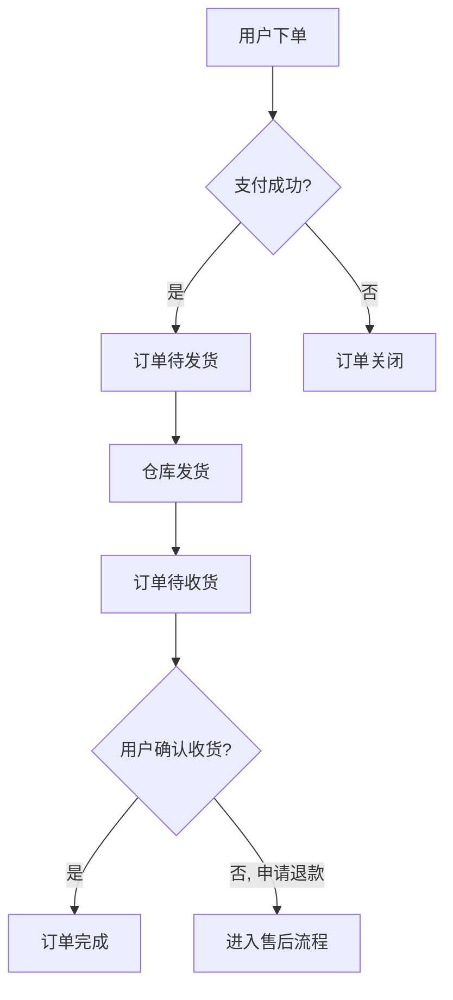
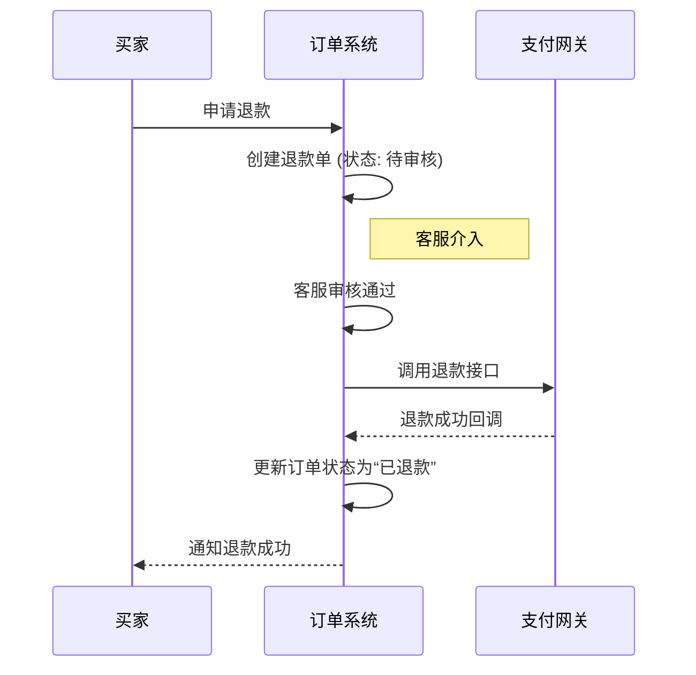

# 示例：复杂系统分析 - 电商订单管理系统

本示例展示如何使用**标准模式**分析一个典型的中等复杂度系统。

---

## 📊 需求复杂度评估

| 评估维度 | 评分 | 说明 |
| :--- | :--- | :--- |
| 功能点数量 | 10分 | 涉及订单、商品、库存、支付、用户等多个模块，功能点超过10个。 |
| 用户角色数 | 5分 | 涉及买家、客服、运营人员3个角色。 |
| 系统集成 | 7分 | 需要与支付网关、库存中心、物流系统集成（3个以上系统，取高档）。 |
| 业务规则复杂度 | 7分 | 包含优惠券、促销活动、拆单、退款等复杂规则。 |
| 数据复杂度 | 7分 | 涉及多表关联、状态流转、数据一致性要求高。 |
| **总分** | **36分** | **高复杂度（触发完整标准模式，步骤5外部调研必选）** |

**推荐模式**：完整标准模式（5步，评分 36+，外部调研必选）

---

## 步骤1：需求概述与深入理解

### 需求背景

为了提升订单处理效率和客户满意度，需要构建一个集中的订单管理系统，供内部客服和运营人员使用，同时优化买家的订单查询体验。

### 用户角色与权限矩阵

| 角色 | 核心职责 | 关键权限 |
| :--- | :--- | :--- |
| **买家** | 查看订单、申请退款、跟踪物流 | 查看个人订单列表/详情、创建退款申请 |
| **客服** | 处理用户咨询、退款申请 | 查看任意订单、操作退款（审核/拒绝）、修改订单备注 |
| **运营人员** | 管理商品、配置促销、处理异常订单 | 手动创建/取消订单、触发发货、调整订单金额 |

### 完整功能清单 (MECE原则)

1.  **订单管理**
    *   订单列表查询（多条件筛选、排序）
    *   订单详情查看
    *   手动创建订单
    *   取消订单（支付前/后）
    *   订单备注添加/修改
2.  **支付管理**
    *   接收支付成功/失败回调
    *   记录支付流水
    *   触发退款
3.  **发货管理**
    *   同步库存信息
    *   创建发货单
    *   同步物流信息
4.  **退款/售后管理**
    *   创建退款申请
    *   审核退款申请
    *   执行退款操作
5.  **用户交互**
    *   订单状态变更通知（短信/App Push）

---

## 步骤2：设计完整业务流程

### 高层级流程图 (买家视角)



### 详细流程图 (客服处理退款)



---

## 步骤3：进行全面异常识别

| 异常ID | 异常场景 | 分类 | 优先级 | 处理策略 |
| :--- | :--- | :--- | :--- | :--- |
| E-01 | 用户重复提交订单 | 用户异常 | P0 | 后端接口做幂等性校验，返回同一订单号。 |
| E-02 | 支付成功但订单状态未更新 | 技术异常 | P0 | 建立支付状态对账任务，定时轮询补偿。 |
| E-03 | 库存扣减失败 | 业务异常 | P0 | 订单状态标记为“异常”，通知运营人员手动处理，并回滚优惠券。 |
| E-04 | 优惠券与促销活动叠加使用规则错误 | 业务异常 | P1 | 价格计算服务中增加规则引擎，对优惠组合进行合法性校验。 |
| E-05 | 用户在发货后申请整单退款 | 业务异常 | P1 | 引导用户走“退货退款”流程，需在收到退货后才能退款。 |
| E-06 | 第三方物流系统接口超时 | 技术异常 | P2 | 增加重试机制，若持续失败则告警，转为手动查询物流。 |

---

## 步骤4：设计详细功能架构

### 功能架构图

```mermaid
graph TD
    subgraph 表现层
        A[后台管理界面 (React)]
    end
    subgraph 应用层 (BFF)
        B[后台API (GraphQL)]
    end
    subgraph 服务层 (Microservices)
        C[订单服务]
        D[商品服务]
        E[库存服务]
        F[支付服务]
    end
    subgraph 基础设施
        G[数据库 (MySQL)]
        H[消息队列 (Kafka)]
        I[支付网关]
    end
    A --> B;
    B --> C & D & E & F;
    C -- 使用 --> D & E & F;
    C -- 读写 --> G;
    F -- 调用 --> I;
    C -- 发布事件 --> H;
    E -- 订阅事件 --> H;
```

### 功能模块划分

| 模块名称 | 核心职责 |
| :--- | :--- |
| **订单服务** | 订单生命周期管理、状态流转、业务逻辑编排 |
| **商品服务** | 商品信息管理、价格查询 |
| **库存服务** | 库存同步、库存扣减、库存回补 |
| **支付服务** | 支付流水管理、支付回调处理、退款管理 |

### 迭代规划

1.  **MVP (4周)**
    *   **目标**: 实现订单全流程基本功能。
    *   **范围**: 订单的创建、支付、查看、取消；客服后台查看订单列表/详情。
2.  **Phase 2 (3周)**
    *   **目标**: 完善售后与支撑流程。
    *   **范围**: 退款申请与审核流程；集成物流查询接口；添加订单备注功能。
3.  **Phase 3 (后续)**
    *   **目标**: 提升运营效率和智能化水平。
    *   **范围**: 引入促销与优惠券引擎；建立自动化对账与告警系统。

---

## 步骤5：外部调研

### 调研主题：行业内主流电商平台的退款流程设计

**调研发现**:
-   **淘宝/天猫**: 区分“仅退款”（未发货）和“退货退款”（已发货），流程自动化程度高，引入“小二”作为仲裁角色。
-   **京东**: 自营商品退款流程极快，依赖强大的自建物流和仓储系统。支持“闪电退款”高级服务。
-   **Amazon**: 退款政策宽松，A-to-z Guarantee 为买家提供强力保障，但对卖家审核严格。

**改进建议**:
1.  **引入退款类型**: 在我们的系统中明确区分“仅退款”和“退货退款”，简化未发货场景的退款操作。
2.  **设置自动化规则**: 对于信用良好且客单价低的用户的“仅退款”申请，可设置规则自动审核通过，降低客服压力。
3.  **明确权责**: 定义清晰的客服操作SOP，明确何种情况下需要升级给运营人员处理。
